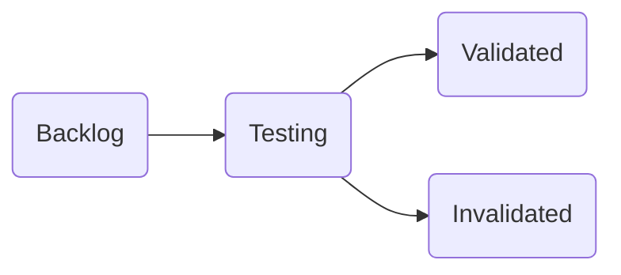
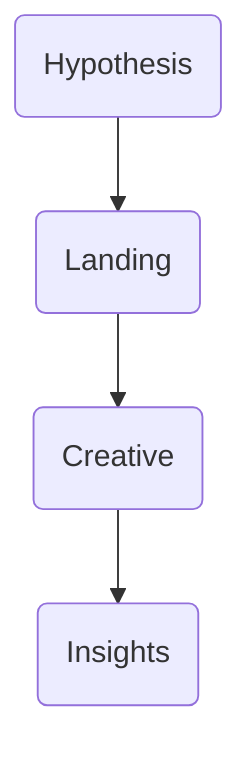

# Marketing Hub
This project manages ads, media assets, course plans and now products built with marketing principles. A new **Teste de Nichos** module allows running advertising experiments with creatives and audiences.
Recursos de IA podem ser cadastrados informando em qual fase do marketing atuam.

```bash
docker compose up -d      # start MySQL
cd backend/ads-service && mvn spring-boot:run
cd ../../frontend && npm run dev
# run the background worker (optional)
cd ../success-product-worker && mvn spring-boot:run
# the worker fetches the ads-service dependency from
# https://maven.pkg.github.com/paulofor/ads-service
# The backend builds two JAR files when packaging:
# - `app.jar` is the thin artifact published to GitHub Packages and
#   consumed by the Success Product Worker using Maven.
# - `app-exec.jar` is the fat executable. The CI workflow renames it to
#   `app.jar` for deployment and keeps a copy of the thin JAR as
#   `app-lib.jar`.
# The thin JAR can be published manually with:
#   cd backend/ads-service && mvn -s ../settings.xml \
#     org.apache.maven.plugins:maven-deploy-plugin:deploy-file \
#     -DrepositoryId=github -Durl=https://maven.pkg.github.com/paulofor/marketing-hub \
#     -Dfile=target/app-lib.jar -DgroupId=com.marketinghub \
#     -DartifactId=ads-service -Dversion=0.0.1-SNAPSHOT -Dpackaging=jar
# The CI workflow performs the same deploy-file command and then verifies the
# upload with `mvn dependency:get`.
# The worker only needs this JAR from GitHub Packages – Maven downloads it
# automatically when compiling.
# create a .env file to point the React app to your backend
echo "VITE_API_URL=http://localhost:8000" > frontend/.env
# deploy to VPS (Java 21 already installed)
scp target/app-exec.jar <vps>:/opt/marketinghub/app/app.jar
ssh <vps> "java -jar /opt/marketinghub/app/app.jar"
```

To run the Media Hub locally:

```bash
docker compose up     # start MySQL
cd backend/ads-service && mvn package && mvn spring-boot:run
cd ../../frontend && npm run dev
```

### systemd

Conteúdo do arquivo `/etc/systemd/system/marketinghub-frontend.service`:

```ini
[Unit]
Description=Marketing Hub – Frontend static server
After=network.target

[Service]
Type=simple
User=marketinghub
WorkingDirectory=/opt/marketinghub/frontend
ExecStart=/usr/bin/serve -s /opt/marketinghub/frontend -l 3000
Restart=on-failure

[Install]
WantedBy=multi-user.target
```

## Debug em produção

Para depurar problemas que surgem apenas no build otimizado execute:

```bash
cd frontend
npm run build:debug
npx vite preview --port 5000 --host
```

O overlay de erros fica acessível em `/__vite__` e os sourcemaps são gerados em
`dist`. O `ErrorBoundary` envia logs ao console ou Sentry quando a variável
`VITE_SENTRY_DSN` estiver presente.

\nSwagger UI disponível em /swagger-ui.html quando o backend estiver rodando.

\n## Niches e Experiments\nCada Experiment pertence a um Market Niche. Use as rotas /api/niches/{nicheId}/experiments para criar e listar por nicho.

## Criativos
Os criativos representam variações de anúncios vinculados a um experimento. Utilize a rota `/api/experiments/{id}/creatives` para cadastrar e listar. A visualização de um criativo usa `/api/creatives/{id}/preview` que consulta a Marketing API do Facebook.

### Taxonomias reutilizáveis
Angles, Visual Proofs e Emotional Triggers podem ser gerenciados via `/api/angles`, `/api/visual-proofs` e `/api/emotional-triggers`. Use `PATCH /api/creatives/{id}/labels` para vincular um angle, visual proof e emotional trigger a um criativo.

## Erros comuns Hibernate

Para evitar `PersistentObjectException: detached entity passed to persist`, anexe
entidades existentes usando `entityManager.getReference()` em vez de criar
instâncias soltas. O método `attachNiche()` no serviço de experiments demonstra
essa abordagem.

## Niche Smoke Test Workflow

1. Crie um nicho e um experimento via `/api/niches` e `/api/niches/{id}/experiments`.
2. Gere landing pages com `POST /api/experiments/{expId}/landing`.
3. Utilize o Ad Generator para criar criativos combinando angle, prova visual e gatilho emocional.
4. O worker publica os anúncios em modo `PAUSED` e coleta métricas horárias.
5. A regra de stop-loss pausa conjuntos com CPA acima do dobro da meta.
6. Dashboards em `/analytics` mostram CTR, CPL e CPA por combinação.

## Fluxo de Hipóteses & Ofertas




\nNovo fluxo: Nicho -> Hipótese -> Experimento para garantir coesão nos testes.
