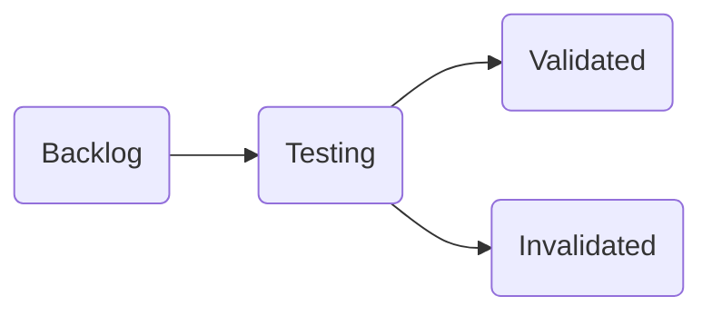
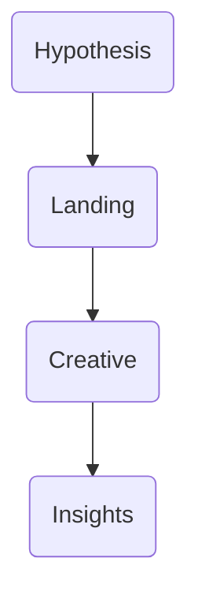

# Marketing Hub
This project manages ads, media assets, course plans and now products built with marketing principles. A new **Teste de Nichos** module allows running advertising experiments with creatives and audiences.
Recursos de IA podem ser cadastrados informando em qual fase do marketing atuam.

## Pull Request de teste

Este PR ajusta apenas a documentação para confirmar que o fluxo de acesso ao
GitHub (autenticação, push e abertura de PR) está operando corretamente no
ambiente atual. Nenhuma funcionalidade é alterada; o objetivo é gerar um
histórico simples que possa ser referenciado ao validar permissões ou tokens.

```bash
docker compose up -d      # start MySQL
cd backend/ads-service && mvn spring-boot:run
cd ../../frontend && npm run dev
# run the background worker (optional)
cd ../ai-worker && mvn spring-boot:run
# the worker fetches the ads-service dependency from
# https://maven.pkg.github.com/paulofor/ads-service
# The backend builds two JAR files when packaging:
# - `app.jar` is the thin artifact published to GitHub Packages and
#   consumed by the AI Worker using Maven.
# - `app-exec.jar` is the fat executable. The CI workflow renames it to
#   `app.jar` for deployment and keeps a copy of the thin JAR as
#   `app-lib.jar`.
# The thin JAR can be published manually with:
#   cd backend/ads-service && mvn -s ../settings.xml \
#     org.apache.maven.plugins:maven-deploy-plugin:deploy-file \
#     -DrepositoryId=github -Durl=https://maven.pkg.github.com/paulofor/marketing-hub \
#     -Dfile=target/app-lib.jar -DgroupId=com.marketinghub \
#     -DartifactId=ads-service -Dversion=0.0.1-SNAPSHOT -Dpackaging=jar
# The CI workflow performs the same deploy-file command and then verifies the
# upload with `mvn dependency:get`.
# The worker only needs this JAR from GitHub Packages – Maven downloads it
# automatically when compiling.
#
# O workflow `.github/workflows/ci-cd.yml` publica o pacote `ads-service` com o
# Maven Deploy Plugin e, na sequência, remove automaticamente todas as versões
# antigas do GitHub Packages, preservando apenas a build recém-gerada. Para
# execuções locais, utilize o mesmo comando Maven acima e remova manualmente as
# versões indesejadas, caso necessário.
# create a .env file to point the React app to your backend
echo "VITE_API_URL=http://localhost:8000" > frontend/.env
# deploy para o VPS agora é feito automaticamente pelo workflow
# `.github/workflows/deploy-containers.yml`, que constrói as imagens
# Docker do backend e do frontend e aplica o `deploy/docker-compose.yml`
# em 191.252.181.168 usando o script `deploy/bin/apply.sh` via SSH.
# Para uma reexecução manual (por exemplo, em casos de rollback),
# gere as imagens localmente com `docker build`, copie os arquivos
# `.tar` e este diretório `deploy/` para o servidor e execute:
#   ssh marketinghub@191.252.181.168 \
#     "IMAGE_TAG=$(git rev-parse HEAD) BACKEND_TAR=/tmp/backend-image.tar \
#        FRONTEND_TAR=/tmp/frontend-image.tar \
#        /bin/bash /opt/marketinghub/containers/bin/apply.sh"
```

## Deploy automatizado em containers

- O diretório `deploy/` contém o `docker-compose.yml`, variáveis padrão e o script `bin/apply.sh` responsável por subir os containers `marketinghub-backend` (porta 8000) e `marketinghub-frontend` (porta 5173).
- O workflow `.github/workflows/deploy-containers.yml` monta as imagens Docker, copia `deploy/` para `/opt/marketinghub/containers` no VPS 191.252.181.168 e chama o script automaticamente após cada push no branch `main`.
- As pastas `deploy/volumes/backend/uploads` e `deploy/volumes/backend/logs` são montadas no container para preservar arquivos enviados e logs mesmo após reinícios.
- Em emergências é possível reaproveitar o mesmo script manualmente, desde que os arquivos `backend-image.tar` e `frontend-image.tar` sejam carregados em `/tmp` no servidor e a variável `IMAGE_TAG` aponte para a tag desejada.

Para publicar e executar o AI Worker via Docker Compose:

```bash
cp .env.example .env  # ajuste as variáveis sensíveis
docker compose build ai-worker
docker compose --env-file .env up -d ai-worker
```

No VPS, o container do AI Worker já lê o conteúdo de `/etc/openai/chave` na
inicialização (montado como `/run/secrets/openai_api_key`), dispensando o
`export` manual da variável. Caso queira sobrescrever o segredo, defina
`OPENAI_API_KEY` antes do `docker compose up`.

### Pool de conexões MySQL 5.7

Servidores MySQL 5.7 compartilhados (como o da KingHost) derrubam conexões ociosas
em poucos segundos e impõem limites baixos de sessões simultâneas. Para evitar
oscilação no pool e o erro `Communications link failure`, o backend expõe os
parâmetros do HikariCP através de variáveis de ambiente (todas opcionais, com
defaults seguros):

- `DB_MAX_POOL_SIZE` / `DB_MIN_IDLE` controlam o número máximo de conexões e o mínimo mantido como quente.
- `DB_CONNECTION_TIMEOUT` e `DB_VALIDATION_TIMEOUT` definem quanto tempo aguardamos ao abrir ou validar uma conexão antes de falhar rapidamente.
- `DB_IDLE_TIMEOUT`, `DB_MAX_LIFETIME` e `DB_KEEPALIVE_TIME` evitam que o MySQL derrube sessões por ociosidade desalinhada.

Os valores de timeout são expressos em milissegundos (ex.: 20000 = 20s).

## Email Service

O novo microserviço responsável por renderizar templates do Marketing Hub e
disparar e-mails utilizando SMTP pode ser construído e executado via Docker
Compose:

```bash
docker compose build email-service
docker compose --env-file .env up -d email-service
```

O serviço será exposto em `http://localhost:8085` (configurável) e disponibiliza
Swagger UI em `/swagger-ui.html`. Ajuste as variáveis de ambiente relacionadas a
SMTP, Marketing Hub e Cloudflare no `.env` antes de subir o container.

## Site institucional (Marketing Hub)

O módulo `institutional-site` publica o site estático utilizado em verificações como
o onboarding do Amazon SES e serve como vitrine corporativa. Ele roda no mesmo
servidor do serviço de pagamentos (IP 191.252.102.54) e expõe uma página principal,
política de privacidade e endpoint de saúde.

```bash
docker compose build institutional-site
INSTITUTIONAL_SITE_PORT=8091 docker compose up -d institutional-site
curl -I http://localhost:8091/healthz
```

Aponte o DNS do domínio corporativo para o IP público e, caso utilize um proxy
reverso, encaminhe o tráfego para a porta configurada (padrão 8091).

To run the Media Hub locally:

```bash
docker compose up     # start MySQL
cd backend/ads-service && mvn package && mvn spring-boot:run
cd ../../frontend && npm run dev
```

### systemd

Conteúdo do arquivo `/etc/systemd/system/marketinghub-frontend.service`:

```ini
[Unit]
Description=Marketing Hub – Frontend static server
After=network.target

[Service]
Type=simple
User=marketinghub
WorkingDirectory=/opt/marketinghub/frontend
ExecStart=/usr/bin/serve -s /opt/marketinghub/frontend -l 3000
Restart=on-failure

[Install]
WantedBy=multi-user.target
```

## Debug em produção

Para depurar problemas que surgem apenas no build otimizado execute:

```bash
cd frontend
npm run build:debug
npx vite preview --port 5000 --host
```

O overlay de erros fica acessível em `/__vite__` e os sourcemaps são gerados em
`dist`. O `ErrorBoundary` envia logs ao console ou Sentry quando a variável
`VITE_SENTRY_DSN` estiver presente.

\nSwagger UI disponível em /swagger-ui.html quando o backend estiver rodando.

\n## Niches e Experiments\nCada Experiment pertence a um Market Niche. Use as rotas /api/niches/{nicheId}/experiments para criar e listar por nicho.
Cada Niche pode opcionalmente referenciar um ChatGPT Dialog que originou a ideia.

## Criativos
Os criativos representam variações de anúncios vinculados a um experimento. Utilize a rota `/api/experiments/{id}/creatives` para cadastrar e listar. A visualização de um criativo usa `/api/creatives/{id}/preview` que consulta a Marketing API do Facebook.

### Taxonomias reutilizáveis
Angles, Visual Proofs e Emotional Triggers podem ser gerenciados via `/api/angles`, `/api/visual-proofs` e `/api/emotional-triggers`. Use `PATCH /api/creatives/{id}/labels` para vincular um angle, visual proof e emotional trigger a um criativo.

## Erros comuns Hibernate

Para evitar `PersistentObjectException: detached entity passed to persist`, anexe
entidades existentes usando `entityManager.getReference()` em vez de criar
instâncias soltas. O método `attachNiche()` no serviço de experiments demonstra
essa abordagem.

## Niche Smoke Test Workflow

1. Crie um nicho e um experimento via `/api/niches` e `/api/niches/{id}/experiments`.
2. Gere landing pages com `POST /api/experiments/{expId}/landing`.
3. Utilize o Ad Generator para criar criativos combinando angle, prova visual e gatilho emocional.
4. O worker publica os anúncios em modo `PAUSED` e coleta métricas horárias.
5. A regra de stop-loss pausa conjuntos com CPA acima do dobro da meta.
6. Dashboards em `/analytics` mostram CTR, CPL e CPA por combinação.

## Fluxo de Hipóteses & Ofertas


```mermaid
flowchart LR
    B(Backlog) --> T(Testing)
    T --> V(Validated)
    T --> I(Invalidated)
```


```mermaid
flowchart TD
    H(Hypothesis) --> L(Landing)
    L --> C(Creative)
    C --> S(Insights)
```
\nNovo fluxo: Nicho -> Hipótese -> Experimento para garantir coesão nos testes.

## Monitoramento de microserviços em background

Microserviços (ex.: workers Spring Boot) podem enviar exceções diretamente para o
backend do Marketing Hub. Use a rota autenticada do próprio backend:

```
POST /api/microservices/{id}/exceptions
{
  "exceptionType": "java.lang.IllegalStateException",
  "message": "Falha ao processar fila",
  "stackTrace": "...",
  "severity": "ERROR",
  "serviceVersion": "1.2.3",
  "hostname": "worker-01",
  "context": { "jobId": "123" },
  "occurredAt": "2024-03-20T10:15:30Z"
}
```

Exemplo de envio a partir de um worker Spring Boot usando o `RestClient`:

```java
@RestControllerAdvice
@RequiredArgsConstructor
class ExceptionReporter {
    private final RestClient restClient;

    @ExceptionHandler(Exception.class)
    public void handle(Exception ex) {
        restClient.post()
            .uri("/api/microservices/{id}/exceptions", 1) // substitua o ID
            .body(Map.of(
                "exceptionType", ex.getClass().getName(),
                "message", ex.getMessage(),
                "stackTrace", org.apache.commons.lang3.exception.ExceptionUtils.getStackTrace(ex),
                "severity", "ERROR",
                "hostname", InetAddress.getLocalHost().getHostName()
            ))
            .retrieve();
    }
}
```

Os registros podem ser consultados no menu **Microserviços > Erros de
microserviço**, onde cada item traz a mensagem, stack trace, host e versão do
serviço.
