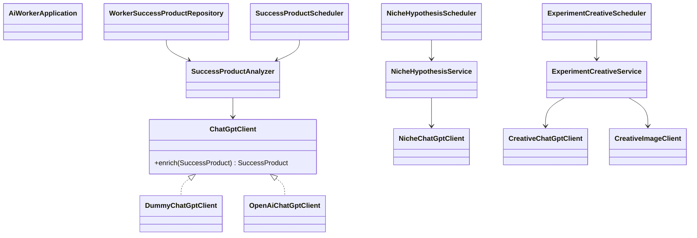

# AI Worker Class Diagram

```mermaid
classDiagram
    class AiWorkerApplication
    class SuccessProductAnalyzer
    class SuccessProductScheduler
    class ChatGptClient {
        +enrich(SuccessProduct) SuccessProduct
    }
    ChatGptClient <|.. DummyChatGptClient
    ChatGptClient <|.. OpenAiChatGptClient
    SuccessProductAnalyzer --> ChatGptClient
    WorkerSuccessProductRepository --> SuccessProductAnalyzer
    SuccessProductScheduler --> SuccessProductAnalyzer

    class NicheHypothesisService
    class NicheHypothesisScheduler
    class ExperimentCreativeService
    class ExperimentCreativeScheduler

    NicheHypothesisScheduler --> NicheHypothesisService
    ExperimentCreativeScheduler --> ExperimentCreativeService
    NicheHypothesisService --> NicheChatGptClient
    ExperimentCreativeService --> CreativeChatGptClient
    ExperimentCreativeService --> CreativeImageClient
```
