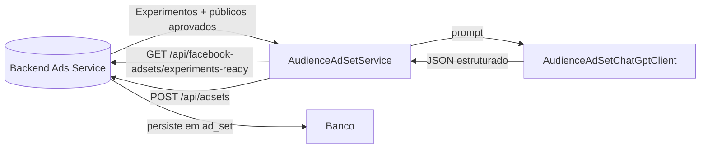

# AI Worker - Serviço EXPERIMENTO para CONJUNTO DE ANÚNCIOS

Este documento descreve o serviço do AI Worker responsável por transformar
públicos aprovados em **conjuntos de anúncios** no nível de planejamento do
experimento.

## Visão Geral

O `AudienceAdSetService` executa o fluxo abaixo:

1. Solicita ao backend, via `BackendExperimentClient`, os experimentos da
   plataforma Facebook preparados para gerar conjuntos de anúncios através do
   endpoint `GET /api/facebook-adsets/experiments-ready`.
2. O cliente filtra os públicos aprovados retornados, preservando aqueles sem
   hipótese vinculada ou associados à mesma hipótese do experimento e confirma,
   com `GET /api/adsets?experimentId=...`, se já existem registros prévios.
3. Para cada público relevante, o serviço aciona o `AudienceAdSetChatGptClient`,
   que estrutura localização, interesses, lookalikes, orçamento sugerido,
   duração e um objeto `targetingJson` compatível com o Meta Ads.
4. O serviço envia `POST /api/adsets` ao backend, preenchendo também os campos
   `prompt` e `model` exigidos pela governança de IA.

## Diagrama de fluxo



## Execução do Serviço

### Pré-requisitos
- Java 21
- Maven configurado com `GITHUB_ACTOR` e `GITHUB_TOKEN` para baixar o artefato
  `ads-service`
- MySQL compatível com o schema do backend
- Variável `OPENAI_API_KEY` com o token da API da OpenAI (opcionalmente
  `OPENAI_BASE_URL` e `OPENAI_MODEL` para personalização)
- Variáveis `BACKEND_BASE_URL` e `BACKEND_API_PREFIX` quando for necessário
  apontar o worker para outra instância do serviço principal

### Contratos HTTP consumidos

- `GET /api/facebook-adsets/experiments-ready`: retorna, para cada experimento,
  o contexto completo (experimento, nicho, hipótese e públicos aprovados).
- `GET /api/adsets?experimentId=...`: confirma se o experimento já possui
  conjuntos de anúncios cadastrados.
- `POST /api/adsets`: cria o conjunto de anúncios com `location`, `interests`,
  `lookalikes`, `targetingJson`, `budget`, `durationDays`, `prompt` e `model`.

### Passos para executar

1. Instale as dependências e compile o projeto:

   ```bash
   cd ai-worker
   mvn -s settings.xml package
   ```

2. (Opcional) Execute os testes:

   ```bash
   mvn -s settings.xml test
   ```

3. Execute o worker:

   ```bash
   mvn spring-boot:run
   ```

   Utilize `-Dspring.profiles.active=dummy` para executar sem chamadas externas
   à OpenAI.

O agendamento `AudienceAdSetScheduler` roda a cada cinco minutos (`0 */5 * * * *`).
Quando encontra experimentos elegíveis, gera os conjuntos de anúncios e registra
os campos `location`, `interests`, `lookalikes`, `targetingJson`, `budget`,
`durationDays`, `prompt` e `model` em `ad_set`.
