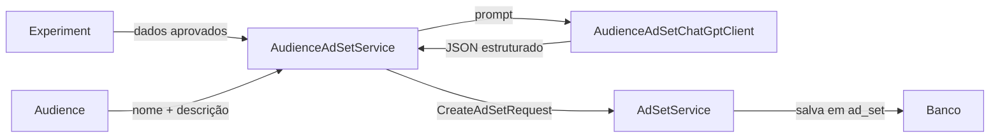

# AI Worker - Serviço EXPERIMENTO para CONJUNTO DE ANÚNCIOS

Este documento descreve o serviço do AI Worker responsável por transformar
públicos aprovados em **conjuntos de anúncios** no nível de planejamento do
experimento.

## Visão Geral

O `AudienceAdSetService` executa o fluxo abaixo:

1. Busca experimentos na plataforma Facebook que possuam ao menos um público com
   `audience.approved = true` e sem registros prévios na tabela `ad_set`.
2. Carrega os públicos do nicho relacionados ao experimento, priorizando os que
   pertencem à hipótese associada.
3. Envia cada público para o `AudienceAdSetChatGptClient`, que estrutura
   localização, interesses, lookalikes, orçamento sugerido, duração e um objeto
   `targetingJson` compatível com o Meta Ads.
4. Persiste o resultado via `AdSetService.create`, preenchendo também os campos
   `prompt` e `model` exigidos pela governança de IA.

## Diagrama de fluxo



## Execução do Serviço

### Pré-requisitos
- Java 21
- Maven configurado com `GITHUB_ACTOR` e `GITHUB_TOKEN` para baixar o artefato
  `ads-service`
- MySQL compatível com o schema do backend
- Variável `OPENAI_API_KEY` com o token da API da OpenAI (opcionalmente
  `OPENAI_BASE_URL` e `OPENAI_MODEL` para personalização)

### Passos para executar

1. Instale as dependências e compile o projeto:

   ```bash
   cd ai-worker
   mvn -s settings.xml package
   ```

2. (Opcional) Execute os testes:

   ```bash
   mvn -s settings.xml test
   ```

3. Execute o worker:

   ```bash
   mvn spring-boot:run
   ```

   Utilize `-Dspring.profiles.active=dummy` para executar sem chamadas externas
   à OpenAI.

O agendamento `AudienceAdSetScheduler` roda a cada cinco minutos (`0 */5 * * * *`).
Quando encontra experimentos elegíveis, gera os conjuntos de anúncios e registra
os campos `location`, `interests`, `lookalikes`, `targetingJson`, `budget`,
`durationDays`, `prompt` e `model` em `ad_set`.
