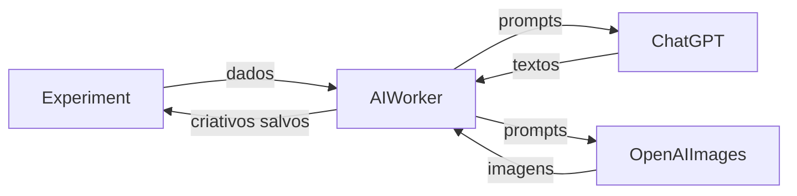

# AI Worker - Serviço EXPERIMENTO para CRIATIVO

Este documento descreve o serviço do AI Worker que gera criativos para **EXPERIMENTO** usando o ChatGPT e a API de imagens do OpenAI.

## Visão Geral

O serviço realiza as seguintes etapas:
1. Busca experimentos com `creativesToGenerate > 0`.
2. Consulta o ChatGPT para gerar textos dos criativos.
3. Gera imagens com a API de imagens do OpenAI e envia o arquivo resultante para o backend por meio do `POST /api/assets`,
   armazenando a URL pública retornada.
4. Salva os criativos e zera o contador `creativesToGenerate`.

## Diagrama de fluxo



## Execução do Serviço

### Pré-requisitos
- Java 21
- Maven configurado com as variáveis `GITHUB_ACTOR` e `GITHUB_TOKEN` para acessar os artefatos do GitHub Packages
- MySQL em execução conforme `application.properties`
- Variável de ambiente `OPENAI_API_KEY` (e opcionalmente `GOOGLE_API_KEY` e `GOOGLE_SEARCH_ID` para permitir buscas externas)

### Passos para executar

1. Instale as dependências e compile o projeto:

   ```bash
   cd ai-worker
   mvn -s settings.xml package
   ```

2. (Opcional) Execute os testes:

   ```bash
   mvn -s settings.xml test
   ```

3. Execute o worker:

   ```bash
   mvn spring-boot:run
   ```

   Para executar sem chamadas externas ao ChatGPT, utilize o perfil `dummy`:

   ```bash
   mvn spring-boot:run -Dspring.profiles.active=dummy
   ```

O worker agenda a tarefa `ExperimentCreativeScheduler` a cada cinco minutos (`0 */5 * * * *`) para gerar criativos para os experimentos configurados. Os logs do processo são exibidos no console.

