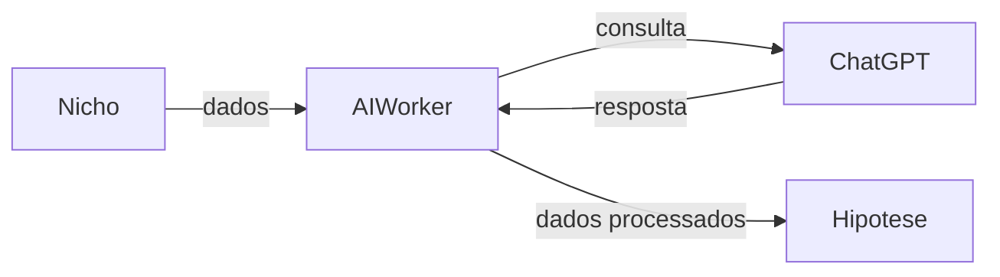

# AI Worker - Serviço NICHO para HIPOTESE

Este documento descreve o novo serviço do AI Worker responsável por coletar dados de **NICHO**, consultar o ChatGPT e retornar informações para **HIPOTESE**.

## Visão Geral

O serviço realiza as seguintes etapas:
1. Coleta dados de **NICHO**.
2. Consulta o ChatGPT com as informações coletadas.
3. Retorna os dados processados para **HIPOTESE**.

## Diagrama de fluxo



## Execução do Serviço

### Pré-requisitos
- Java 21
- Maven configurado com as variáveis `GITHUB_ACTOR` e `GITHUB_TOKEN` para acessar os artefatos do GitHub Packages
- MySQL em execução conforme `application.properties`
- Variáveis de ambiente `OPENAI_API_KEY` (e opcionalmente `GOOGLE_API_KEY` e `GOOGLE_SEARCH_ID` para permitir buscas externas)

### Passos para executar

1. Instale as dependências e compile o projeto:

   ```bash
   cd ai-worker
   mvn -s settings.xml package
   ```

2. (Opcional) Execute os testes:

   ```bash
   mvn -s settings.xml test
   ```

3. Execute o worker:

   ```bash
   mvn spring-boot:run
   ```

   Para executar sem chamadas externas ao ChatGPT, utilize o perfil `dummy`:

   ```bash
   mvn spring-boot:run -Dspring.profiles.active=dummy
   ```

O worker agenda a tarefa `NicheHypothesisScheduler` a cada cinco minutos (`0 */5 * * * *`) para analisar nichos configurados, consultar o ChatGPT e gerar as hipóteses. Os logs do processo são exibidos no console.
