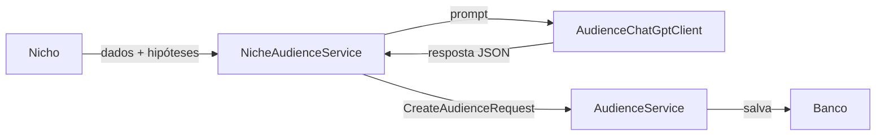

# AI Worker - Serviço NICHO para PÚBLICO

Este documento descreve o serviço do AI Worker responsável por gerar **públicos**
a partir de dados de **nicho** (e, quando disponíveis, de suas **hipóteses**).

## Visão Geral

O fluxo executado pelo `NicheAudienceService` segue os passos abaixo:

1. Busca nichos com `audiencesToGenerate > 0` usando o `MarketNicheRepository`.
2. Carrega as hipóteses do nicho para enriquecer o contexto enviado ao ChatGPT.
3. Monta o prompt no `AudienceChatGptClient`, instruindo o modelo a informar `name`,
   `description` e `hypothesisId` (quando o público estiver ligado a uma hipótese específica).
4. Persiste cada público retornado através do `AudienceService`, preenchendo os
   campos `prompt` e `model` exigidos para rastreabilidade.
5. Zera o contador `audiencesToGenerate` do nicho para evitar duplicidades.

## Diagrama de fluxo



## Execução do Serviço

### Pré-requisitos
- Java 21
- Maven configurado com as variáveis `GITHUB_ACTOR` e `GITHUB_TOKEN`
  para acessar os artefatos publicados no GitHub Packages
- MySQL em execução conforme `application.properties`
- Variável de ambiente `OPENAI_API_KEY` apontando para o token da API do OpenAI

### Passos para executar

1. Instale as dependências e compile o projeto:

   ```bash
   cd ai-worker
   mvn -s settings.xml package
   ```

2. (Opcional) Execute os testes:

   ```bash
   mvn -s settings.xml test
   ```

3. Execute o worker:

   ```bash
   mvn spring-boot:run
   ```

   Para executar sem chamadas externas ao ChatGPT, utilize o perfil `dummy`:

   ```bash
   mvn spring-boot:run -Dspring.profiles.active=dummy
   ```

O worker agenda a tarefa `NicheAudienceScheduler` a cada cinco minutos (`0 */5 * * * *`).
Quando encontrar nichos com `audiencesToGenerate > 0`, ele solicitará a criação de
novos públicos, salvará os resultados (incluindo `prompt` e `model`) e registrará os
logs no console.
