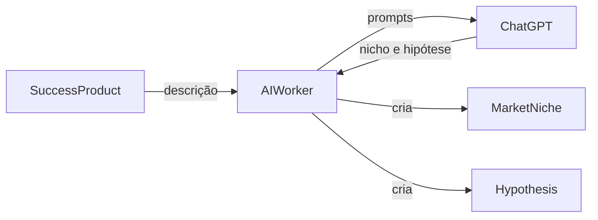

# AI Worker - Serviço PRODUTO DE SUCESSO para NICHO e HIPOTESE

Este documento descreve o serviço do AI Worker que gera **NICHO** e **HIPOTESE** a partir de registros de **PRODUTO DE SUCESSO** usando o ChatGPT.

## Visão Geral

O serviço realiza as seguintes etapas:
1. Busca produtos de sucesso com `generate_niche_hypothesis=true` e descrição preenchida.
2. Consulta o ChatGPT para extrair dados de nicho e hipótese.
3. Cria os registros de `MarketNiche` e `Hypothesis` correspondentes.

## Diagrama de fluxo



## Execução do Serviço

### Pré-requisitos
- Java 21
- Maven configurado com as variáveis `GITHUB_ACTOR` e `GITHUB_TOKEN` para acessar os artefatos do GitHub Packages
- MySQL em execução conforme `application.properties`
- Variável de ambiente `OPENAI_API_KEY` (e opcionalmente `GOOGLE_API_KEY` e `GOOGLE_SEARCH_ID` para permitir buscas externas)

### Passos para executar

1. Instale as dependências e compile o projeto:

   ```bash
   cd ai-worker
   mvn -s settings.xml package
   ```

2. (Opcional) Execute os testes:

   ```bash
   mvn -s settings.xml test
   ```

3. Execute o worker:

   ```bash
   mvn spring-boot:run
   ```

   Para executar sem chamadas externas ao ChatGPT, utilize o perfil `dummy`:

   ```bash
   mvn spring-boot:run -Dspring.profiles.active=dummy
   ```

O worker agenda a tarefa `SuccessProductNicheHypothesisScheduler` a cada cinco minutos (`0 */5 * * * *`) para processar os produtos de sucesso e gerar os nichos e hipóteses. Os logs do processo são exibidos no console.
