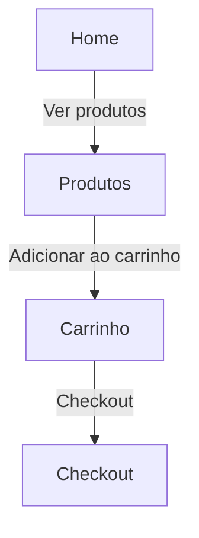

# Arquitetura — Relação Front × Back

Este documento apresenta, em alto nível, como o usuário navega entre páginas
no front-end e quais chamadas cada página faz ao back-end.

## Fluxo de navegação

