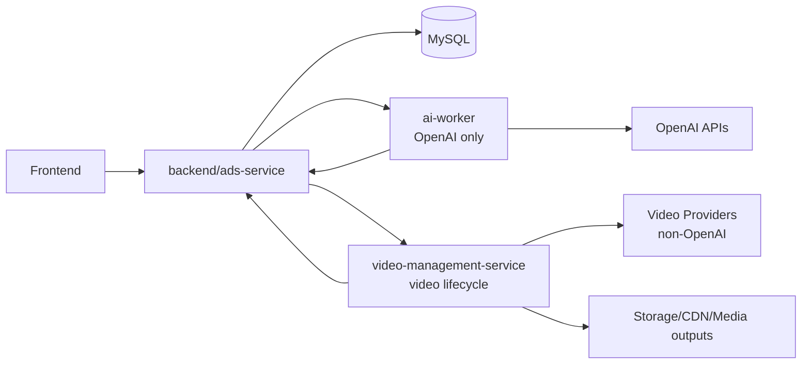

# Avatar Sales Video — Plano de Implementação Atualizado

## 1. Objetivo

Implementar um módulo de **Avatar Sales Video** para gerar, gerenciar e publicar vídeos curtos de venda em landing pages, com a seguinte arquitetura obrigatória:

- **`backend/ads-service`** como **único centralizador** de dados e integrações com o banco relacional.
- **`ai-worker`** responsável **somente por integrações com OpenAI**.
- **novo módulo de vídeo** responsável por **todo o gerenciamento de vídeo** fora do escopo específico de OpenAI.
- **frontend** consumindo apenas APIs do backend.

Este plano substitui qualquer versão anterior que permita acesso direto ao banco por parte do `ai-worker` ou do novo módulo de vídeo.

---

## 2. Decisão arquitetural definitiva

### 2.1 Responsabilidades por módulo

#### `backend/ads-service`
Responsável por:
- ser a **fonte de verdade** do domínio;
- ler e gravar dados no banco relacional;
- expor APIs administrativas e públicas;
- manter o estado canônico de produtos, vídeos, jobs, assets e publicação;
- orquestrar o fluxo entre frontend, `ai-worker` e módulo de vídeo;
- registrar auditoria, falhas, retries e histórico;
- mapear dados de negócio para o modelo técnico de geração/publicação.

#### `ai-worker`
Responsável apenas por:
- integrar com **OpenAI**;
- gerar **script**, **resumo da oferta**, **storyboard**, **CTA copy**, **caption draft** e outros artefatos textuais baseados em OpenAI;
- opcionalmente executar fluxos de vídeo **somente quando o provider for OpenAI**;
- operar em modo assíncrono, consumindo trabalho publicado pelo backend;
- devolver resultados ao backend via API.

**Não deve:**
- acessar banco relacional diretamente;
- integrar com outros vendors de vídeo;
- virar central de estado do fluxo de vídeo.

#### novo módulo de vídeo
Sugestão de nome: **`video-management-service`**.

Responsável por:
- gerenciar o ciclo de vida de vídeo de ponta a ponta;
- integrar com providers de vídeo **não OpenAI**;
- cuidar de polling, webhook, retry técnico, normalização de erro e download de artefatos;
- processar publicação técnica do vídeo (quando aplicável), thumbnails, manifests e metadados;
- reportar tudo ao backend via API.

**Não deve:**
- acessar banco relacional diretamente;
- armazenar o estado canônico de negócio;
- assumir regras de produto, landing ou publicação comercial.

#### `frontend`
Responsável por:
- operar o painel administrativo;
- disparar geração, publicação, retry e revisão;
- exibir preview do vídeo e métricas;
- nunca integrar diretamente com providers de vídeo ou com OpenAI.

---

## 3. Princípios obrigatórios

1. **Somente o backend acessa o banco relacional.**
2. **Todo estado canônico vive no backend.**
3. **OpenAI fica isolada no `ai-worker`.**
4. **Gestão de vídeo multivendor fica no novo módulo de vídeo.**
5. **Frontend fala apenas com o backend.**
6. **Todos os fluxos assíncronos precisam ser reprocessáveis.**
7. **Toda resposta de provider deve ser traduzida para status internos do backend.**
8. **Todo arquivo final deve virar `Asset` no backend antes de ser publicado na landing.**

---

## 4. Motivação técnica

O repositório já posiciona o backend como centro do sistema e o `ai-worker` como aplicação separada que executa rotinas assíncronas e hoje usa clientes OpenAI específicos. A documentação atual do worker informa que ele roda em Spring Boot separado, com cron a cada cinco minutos, e hoje pode consultar o banco **ou** endpoints REST do backend; este plano altera isso para **REST only**, preservando o backend como dono exclusivo da persistência. Também há base existente para assets, produtos, criativos, landing pages e integrações assíncronas no projeto atual. citeturn646508view0turn646508view1

A separação também combina com a API de vídeos da OpenAI, que já trabalha com jobs assíncronos com `status`, `progress` e `expires_at`, o que é suficiente para manter OpenAI concentrada no `ai-worker`, enquanto o novo módulo de vídeo absorve a complexidade de outros providers sem contaminar o worker. citeturn967029view0turn967029view1

---

## 5. Arquitetura-alvo

### 5.1 Regra de comunicação

- `frontend -> backend`
- `backend -> banco`
- `backend <-> ai-worker`
- `backend <-> video-management-service`
- `ai-worker -> OpenAI`
- `video-management-service -> video providers`

**Proibido:**
- `frontend -> OpenAI`
- `frontend -> video providers`
- `ai-worker -> banco`
- `video-management-service -> banco`
- `ai-worker -> providers não OpenAI`

---

## 6. Escopo do produto

### 6.1 O que o módulo entrega

O módulo deve gerar e publicar pelo menos três tipos de vídeo por oferta:

1. **Vídeo principal da landing**
   - explica problema, benefício, mecanismo e CTA;
   - duração curta;
   - foco em clareza comercial.

2. **Vídeo de objeção**
   - responde dúvidas comuns;
   - remove fricção de compra;
   - formato curto.

3. **Vídeo de prova/credibilidade**
   - reforça confiança;
   - pode usar demonstração, argumento de autoridade ou resumo de resultados.

### 6.2 O que fica fora do MVP

- geração em tempo real por visitante;
- conversa síncrona com avatar na landing;
- múltiplos personagens por página em paralelo;
- edição avançada no navegador;
- orquestração multi-etapa de vídeo com dependências complexas entre providers.

---

## 7. Modelo canônico no backend

O backend deve concentrar o domínio. As tabelas abaixo devem existir no `ads-service`.

### 7.1 Tabelas principais

#### `sales_video_profile`
Representa a configuração padrão de um tipo de vídeo para uma oferta.

Campos sugeridos:
- `id`
- `product_id`
- `landing_page_id` nullable
- `video_kind` (`HERO`, `OBJECTION`, `PROOF`)
- `title`
- `persona_name`
- `persona_style`
- `voice_style`
- `language`
- `target_duration_seconds`
- `status`
- `created_at`
- `updated_at`

#### `sales_video_script`
Guarda a versão editorial do texto base.

Campos sugeridos:
- `id`
- `profile_id`
- `version`
- `script_text`
- `hook_text`
- `cta_text`
- `caption_text`
- `source` (`MANUAL`, `OPENAI`)
- `model`
- `prompt`
- `status`
- `approved_by`
- `approved_at`
- `created_at`

#### `sales_video_job`
Representa a unidade principal de geração/render/publicação.

Campos sugeridos:
- `id`
- `profile_id`
- `script_id`
- `provider_family` (`OPENAI`, `EXTERNAL_VIDEO_MODULE`)
- `provider_name`
- `provider_job_id` nullable
- `job_type` (`SCRIPT`, `STORYBOARD`, `RENDER`, `PUBLISH`, `RETRY`)
- `status`
- `progress_percent`
- `failure_code` nullable
- `failure_detail` nullable
- `requested_by`
- `requested_at`
- `started_at` nullable
- `finished_at` nullable
- `expires_at` nullable
- `asset_id` nullable
- `poster_asset_id` nullable
- `vtt_asset_id` nullable
- `metadata_json`

#### `landing_video_slot`
Relaciona vídeos publicados com a landing.

Campos sugeridos:
- `id`
- `landing_page_id`
- `profile_id`
- `slot_name` (`hero-video`, `objection-video-1`, `proof-video-1`)
- `asset_id`
- `poster_asset_id` nullable
- `vtt_asset_id` nullable
- `autoplay`
- `muted`
- `loop`
- `controls_enabled`
- `lazy_load`
- `published_at`
- `published_by`

#### `sales_video_job_event`
Auditoria de transição de estado.

Campos sugeridos:
- `id`
- `job_id`
- `event_type`
- `old_status`
- `new_status`
- `message`
- `details_json`
- `created_at`

### 7.2 Status canônicos do backend

Os providers podem ter status próprios, mas o backend deve traduzir tudo para um conjunto fixo:

- `DRAFT`
- `SCRIPT_PENDING`
- `SCRIPT_READY`
- `STORYBOARD_PENDING`
- `STORYBOARD_READY`
- `VIDEO_REQUESTED`
- `VIDEO_PROCESSING`
- `VIDEO_READY`
- `VIDEO_FAILED`
- `PUBLISHED`
- `ARCHIVED`

---

## 8. Contratos entre módulos

### 8.1 Backend ↔ AI Worker

O `ai-worker` não consulta o banco. Ele consome trabalho via backend.

#### Fluxos do `ai-worker`
- buscar trabalhos OpenAI pendentes;
- executar geração com OpenAI;
- devolver resultado normalizado ao backend.

#### Endpoints sugeridos

**Backend expõe para o worker:**
- `GET /internal/ai/openai-jobs?status=PENDING&type=SCRIPT&limit=...`
- `GET /internal/ai/openai-jobs/{jobId}`
- `POST /internal/ai/openai-jobs/{jobId}/claim`
- `POST /internal/ai/openai-jobs/{jobId}/heartbeat`

**Worker reporta ao backend:**
- `POST /internal/ai/openai-jobs/{jobId}/complete`
- `POST /internal/ai/openai-jobs/{jobId}/fail`
- `POST /internal/ai/openai-jobs/{jobId}/progress`

#### Responsabilidades do worker
- OpenAI textual para script/storyboard/captions;
- OpenAI vídeo apenas se houver decisão explícita de usar OpenAI como provider final;
- upload do artefato final para endpoint do backend quando necessário;
- nunca gravar status final fora da API do backend.

### 8.2 Backend ↔ Video Management Service

O módulo de vídeo também não consulta o banco.

#### Fluxos do módulo de vídeo
- buscar jobs de vídeo pendentes no backend;
- integrar com provider de vídeo não OpenAI;
- reportar progresso;
- baixar artefato final e entregar ao backend;
- informar falhas técnicas e expirations.

#### Endpoints sugeridos

**Backend expõe para o módulo de vídeo:**
- `GET /internal/video/jobs?status=VIDEO_REQUESTED&providerFamily=EXTERNAL_VIDEO_MODULE&limit=...`
- `GET /internal/video/jobs/{jobId}`
- `POST /internal/video/jobs/{jobId}/claim`
- `POST /internal/video/jobs/{jobId}/heartbeat`

**Módulo de vídeo reporta ao backend:**
- `POST /internal/video/jobs/{jobId}/progress`
- `POST /internal/video/jobs/{jobId}/complete`
- `POST /internal/video/jobs/{jobId}/fail`
- `POST /internal/video/jobs/{jobId}/expired`

#### Endpoint opcional para callback/webhook
- `POST /internal/video/provider-callbacks/{provider}`

Esse endpoint entra no módulo de vídeo, não no backend. Depois o módulo de vídeo traduz e envia para o backend.

### 8.3 Frontend ↔ Backend

#### APIs administrativas sugeridas
- `POST /api/products/{productId}/sales-videos/profiles`
- `GET /api/products/{productId}/sales-videos/profiles`
- `GET /api/sales-videos/profiles/{profileId}`
- `POST /api/sales-videos/profiles/{profileId}/generate-script`
- `POST /api/sales-videos/profiles/{profileId}/approve-script`
- `POST /api/sales-videos/profiles/{profileId}/request-render`
- `POST /api/sales-videos/jobs/{jobId}/retry`
- `POST /api/landing-pages/{landingId}/video-slots`
- `PATCH /api/landing-pages/{landingId}/video-slots/{slotId}`
- `GET /api/sales-videos/jobs/{jobId}`
- `GET /api/sales-videos/jobs/{jobId}/events`

#### APIs públicas sugeridas
- `GET /api/public/landing-pages/{landingId}/videos`

---

## 9. Fluxos principais

### 9.1 Fluxo A — geração de script

1. Usuário cria/edita um `sales_video_profile` no frontend.
2. Frontend chama backend para solicitar `generate-script`.
3. Backend cria `sales_video_job` com `job_type=SCRIPT` e `status=SCRIPT_PENDING`.
4. `ai-worker` busca jobs OpenAI pendentes.
5. `ai-worker` chama OpenAI e gera script.
6. `ai-worker` envia resultado ao backend.
7. Backend cria nova versão em `sales_video_script` e marca `SCRIPT_READY`.

### 9.2 Fluxo B — render de vídeo com provider não OpenAI

1. Usuário aprova o script.
2. Frontend solicita render ao backend.
3. Backend cria `sales_video_job` com `job_type=RENDER`, `provider_family=EXTERNAL_VIDEO_MODULE` e `status=VIDEO_REQUESTED`.
4. `video-management-service` busca o job.
5. O módulo chama o provider externo, recebe `provider_job_id` e inicia acompanhamento.
6. O módulo reporta progresso ao backend.
7. Ao concluir, o módulo baixa os artefatos e envia ao backend.
8. Backend cria/atualiza `Asset`, relaciona ao job e marca `VIDEO_READY`.

### 9.3 Fluxo C — render de vídeo com OpenAI

1. Usuário aprova o script.
2. Backend cria `sales_video_job` com `provider_family=OPENAI`.
3. `ai-worker` busca o job.
4. `ai-worker` usa a API da OpenAI para criar o vídeo.
5. O worker acompanha `status` e `progress` até `completed` ou `failed`.
6. Antes do `expires_at`, o worker transfere o resultado para o backend.
7. Backend registra `Asset` e marca `VIDEO_READY` ou `VIDEO_FAILED`. citeturn967029view0turn967029view1

### 9.4 Fluxo D — publicação na landing

1. Usuário escolhe o vídeo pronto.
2. Frontend chama backend para criar/atualizar `landing_video_slot`.
3. Backend salva a configuração.
4. Landing pública passa a expor o vídeo via endpoint público.
5. Frontend da landing renderiza com poster, captions e lazy loading.

---

## 10. Requisitos não funcionais

### 10.1 Performance da landing

Vídeos precisam ser tratados como recursos pesados. O plano deve prever compressão adequada, formatos otimizados, poster image e lazy loading para conteúdos abaixo da dobra, porque isso reduz impacto de carregamento e pode melhorar LCP. citeturn293769search0turn293769search2

### 10.2 Acessibilidade

Toda mídia com fala relevante deve prever legenda. Legendas automáticas podem servir como rascunho, mas precisam de revisão humana antes da publicação, porque legendas geradas automaticamente normalmente não atendem aos requisitos de acessibilidade sem edição significativa. citeturn293769search1turn293769search9

### 10.3 Observabilidade

Cada job precisa de:
- rastreio por `job_id`;
- `provider_name` e `provider_job_id`;
- linha do tempo de eventos;
- erro normalizado;
- identificação de artefatos publicados;
- rastreio de expiração.

### 10.4 Segurança

- autenticação mútua ou token interno entre módulos;
- webhooks de provider validados pelo módulo de vídeo;
- nenhum segredo hardcoded em documentação pública;
- downloads de assets assinados ou temporários quando aplicável.

---

## 11. Backlog em sprints

> Não há duração fixa por sprint. O objetivo é fornecer uma ordem de implementação para execução pelo Codex.

### Sprint 1 — Fundacional do backend

Entregas:
- criar migrations das tabelas do domínio no backend;
- implementar entidades, repositórios, serviços e status canônicos;
- expor APIs administrativas mínimas;
- criar endpoints internos para `ai-worker` e `video-management-service`;
- criar auditoria de job events;
- proibir acesso direto ao banco por módulos externos por contrato e documentação.

Critério de pronto:
- backend consegue cadastrar perfil, criar job, armazenar status, script e slot sem depender de provider real.

### Sprint 2 — OpenAI isolada no `ai-worker`

Entregas:
- adaptar `ai-worker` para operar via APIs do backend, sem banco;
- criar consumers/pollers de jobs OpenAI;
- implementar fluxo de script/storyboard/caption draft;
- implementar fluxo opcional de vídeo OpenAI;
- reportar progresso, conclusão e falha para o backend.

Critério de pronto:
- um job OpenAI completo passa de `SCRIPT_PENDING` para `SCRIPT_READY`, e um job de vídeo OpenAI passa de `VIDEO_REQUESTED` para `VIDEO_READY` ou `VIDEO_FAILED`.

### Sprint 3 — Novo `video-management-service`

Entregas:
- criar módulo novo dedicado ao gerenciamento de vídeo;
- implementar polling interno de jobs do backend;
- criar contrato de provider genérico para vendors não OpenAI;
- implementar pelo menos um provider `stub` para fluxo de desenvolvimento;
- preparar suporte a callback/webhook;
- fazer upload do resultado final de volta ao backend.

Critério de pronto:
- job externo percorre o fluxo completo até `VIDEO_READY`, com asset registrado no backend.

### Sprint 4 — Frontend administrativo e publicação

Entregas:
- tela de perfil de vídeo por produto;
- tela de revisão/aprovação de script;
- ação de request render;
- tela de status de jobs;
- configuração de `landing_video_slot`;
- preview na landing administrativa.

Critério de pronto:
- usuário consegue criar vídeo, pedir geração, revisar e publicar sem ação manual no banco.

### Sprint 5 — Landing pública, qualidade e observabilidade

Entregas:
- endpoint público para vídeos da landing;
- player com poster, captions e lazy loading;
- eventos de analytics de visualização e clique;
- retry manual no backend;
- dashboards operacionais mínimos;
- alertas para falhas, backlog e assets expirando.

Critério de pronto:
- landing pública consome vídeo publicado com experiência aceitável de performance, acessibilidade e rastreabilidade.

### Sprint 6 — Hardening

Entregas:
- política de reprocessamento;
- limpeza de assets expirados/orfãos;
- controles de permissão por usuário/tenant;
- histórico/versionamento de script e publicação;
- padronização final de erros;
- documentação operacional completa.

Critério de pronto:
- módulo pronto para uso contínuo com operação previsível.

---

## 12. Ordem de implementação recomendada para o Codex

1. Backend: tabelas, entidades e status.
2. Backend: APIs admin + APIs internas.
3. Backend: auditoria + assets + slots.
4. `ai-worker`: consumo REST-only de jobs OpenAI.
5. `ai-worker`: script/storyboard.
6. `ai-worker`: vídeo OpenAI opcional.
7. `video-management-service`: estrutura base + provider stub.
8. `video-management-service`: callbacks, polling e upload para backend.
9. Frontend admin.
10. Landing pública.
11. Observabilidade e retry.
12. Hardening final.

---

## 13. Riscos e mitigação

### Risco 1 — backend virar gargalo
Mitigação:
- endpoints internos enxutos;
- paginação de jobs pendentes;
- claim/heartbeat para evitar concorrência duplicada;
- índices por `status`, `provider_family` e `requested_at`.

### Risco 2 — expiração de assets do provider
Mitigação:
- `expires_at` obrigatório no modelo do job quando aplicável;
- transferência imediata do artefato final ao backend;
- alarme para jobs próximos da expiração. citeturn967029view0

### Risco 3 — drift entre status externo e interno
Mitigação:
- estado canônico apenas no backend;
- todos os módulos reportam por eventos explícitos;
- sem leitura direta do banco por serviços externos.

### Risco 4 — acoplamento excessivo entre `ai-worker` e vídeo
Mitigação:
- `ai-worker` restrito a OpenAI;
- `video-management-service` restrito a ciclo de vídeo;
- backend como camada de tradução entre domínios.

---

## 14. Critérios finais de aceite do plano

O plano estará corretamente implementado quando:

- o backend for o único serviço com acesso ao banco relacional;
- `ai-worker` operar somente via backend e somente para OpenAI;
- o novo módulo de vídeo operar somente via backend e sem banco próprio relacional de negócio;
- todo vídeo final publicado estiver registrado como `Asset` do backend;
- a landing pública depender apenas do backend para descobrir qual vídeo exibir;
- status, falhas, retries e histórico puderem ser auditados sem consultar providers diretamente.

---

## 15. Decisão final

A arquitetura oficial do módulo passa a ser:

- **Backend (`ads-service`) = centralizador do domínio e do banco relacional**
- **AI Worker = integrações OpenAI somente**
- **Video Management Service = gerenciamento completo de vídeo**
- **Frontend = cliente do backend**

Esse é o conceito que deve guiar a atualização de documentos, backlog, tarefas do Codex e implementação futura.
