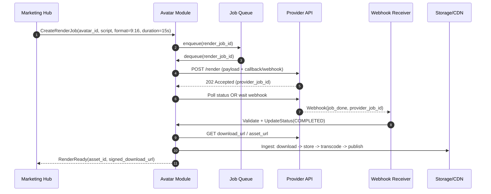
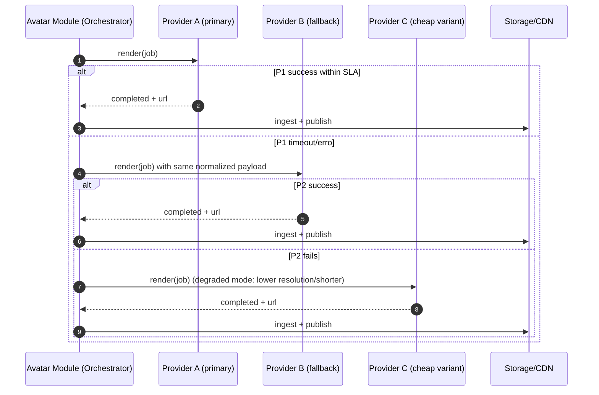
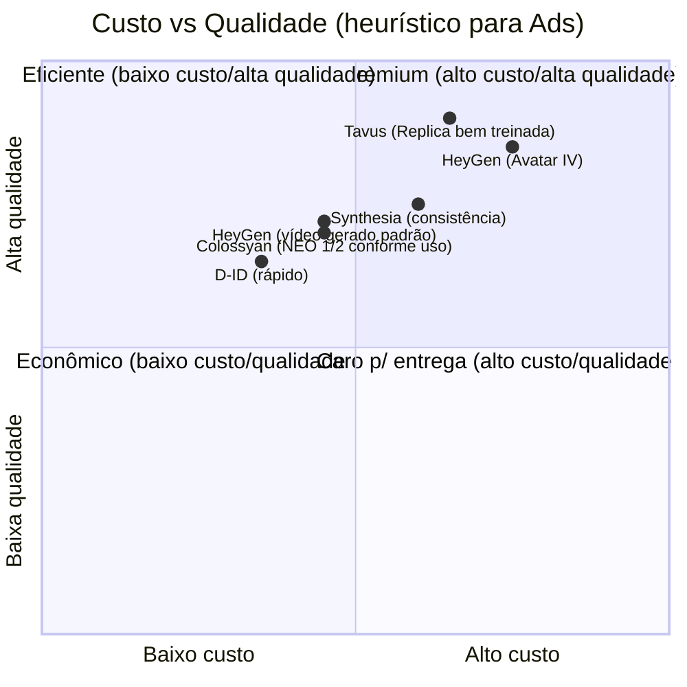

# Módulo Plugável de Gestão de Avatares de IA para o Marketing Hub

## Resumo executivo

A oportunidade de adicionar “Avatar IA management” ao Marketing Hub é, na prática, a oportunidade de **industrializar criativos com “pessoa em cena” (efeito UGC/creator-led)** e acelerar o ciclo de hipótese → criativo → publicação → mensuração. Isso importa porque **qualidade de criativo é um dos maiores determinantes de performance**: em materiais que citam estudos da entity["company","Nielsen","measurement company"] e outras referências, a criatividade aparece como parcela dominante do lift/ROI em anúncios digitais. citeturn10search5turn10search9

Do lado de formato, a própria Meta destaca que criativos “construídos para Reels” (vertical 9:16, áudio, elementos na safe zone) podem reduzir custo por resultado e que Reels com estética creator-led podem reduzir custo por conversão em estudos de caso. citeturn14search8turn14search4

Para construir isso de forma sustentável, a recomendação é tratar “Avatar” como **um domínio independente**, com:
- **camada de adapters por provedor** (provider-agnostic),
- **orquestração assíncrona e idempotente** (jobs, webhooks e fallback),
- **armazenamento próprio** dos assets renderizados (evitando dependência de links temporários dos provedores),
- **governança e consentimento** de “replicas” (imagem/voz como dado sensível/biométrico na LGPD) com auditoria e controles. citeturn21view0turn15search0

Em “qualidade vs custo vs automação por API”, o caminho mais pragmático para MVP costuma ser:
- **1 provedor “generalista” de export e automação por API** para volume e variações (ex.: créditos por minuto e API bem servida),
- **1 provedor “rápido/barato”** para variações e fallback (links curtos, render rápido),
- opcionalmente **1 provedor “replica-first”** quando o diferencial for “digital twin” (com termo e prova de consentimento no fluxo). citeturn6view0turn1search2turn0search1

## Mercado e proposta de valor

O valor de “avatar-driven creatives” para venda direta de produtos digitais vem menos do “avatar por si só” e mais da soma de quatro efeitos: **(i)** aumentar frequência de testes, **(ii)** aproximar-se de formatos nativos (UGC/persona), **(iii)** personalizar/localizar em escala, **(iv)** reduzir custo/tempo de produção.

**Criativo é alavanca central de ROI.** A literatura de efetividade publicitária citada pela Meta e por publicações da entity["company","Nielsen","measurement company"] aponta criatividade como componente dominante de lift/ROI em digital quando é “forte”; quando é “fraca”, o lift tende a ser fraco mesmo com boa mídia/segmentação. citeturn10search5turn10search9turn10search1

**Reels/IG: formato certo e concisão importam.** O guia da Meta para vídeo no Instagram recomenda manter vídeos curtos (faixa 6–15s) e “fisgar” rápido, e as especificações do Ads Guide indicam que anúncios em Reels podem ser longos tecnicamente, mas a recomendação operacional é curta. citeturn39search3turn39search0turn39search10  
Além disso, a Meta reporta que anúncios em Reels construídos como 9:16 com áudio e elementos na safe zone tiveram **34,5% menor custo por resultado** do que anúncios de imagem em testes, o que reforça a proposição de um módulo que automatize exports “Reels-ready”. citeturn14search8turn39search16

**Casos e evidências “adjacentes” (produção e engajamento).**
- Em um case de marketing da entity["company","Synthesia","ai video platform"], a entity["company","Avantor","life sciences company"] reporta **50% de economia de tempo** e **70% de economia de custo** ao integrar vídeo gerado por IA em estratégia de go-to-market. citeturn30view0  
- Ainda na entity["company","Synthesia","ai video platform"], há cases de economia por vídeo (ex.: “até 5 dias e US$ 5.000 por vídeo” em contexto de treinamento), que ajudam a balizar o ganho operacional (mesmo que o uso final seja diferente de anúncios). citeturn29view0  
- Em um case da entity["company","D-ID","ai video company"], uma agência (Envy) relata melhora forte em métricas de e-mail/outreach usando “digital twin”: open rate de 50% (quase o dobro do usual do cliente), e newsletter com open rate subindo de 28% para 49% e CTR de 2,6% para 5,9%. Isso não é Ads Manager, mas é uma referência concreta de “avatar + personalização” elevando atenção e resposta. citeturn12view0

**Faixas realistas de impacto (como hipótese mensurável, não promessa).**  
Para venda direta em Instagram, os impactos mais defensáveis para um roadmap são:
- **Produtividade/escala criativa:** reduzir tempo e custo marginal por variação (especialmente quando o avatar permite “trocar apenas script/offer/CTA” sem refilmar). Casos reportam 50–70% de economia em produção em contextos B2B/marketing. citeturn30view0turn29view0  
- **Performance (CPA/CAC/ROAS):** a Meta mostra variações grandes quando o criativo e o formato estão corretos para Reels (ex.: -34,5% custo por resultado em testes; -55% custo por conversão com creator-led em case), então é razoável tratar 10–35% de redução de custo por resultado como *faixa-alvo de teste* para criativos que de fato atinjam “pessoa + hook + 9:16 + safe zone + áudio + pacing”. citeturn14search8turn14search4turn39search3  
- **LTV/retention:** tende a vir mais de uso do avatar em onboarding/aulas/upsell (pós-compra) do que do anúncio em si; ou seja, se você usar o mesmo “Avatar Persona” também em vídeos de onboarding, você cria consistência e pode afetar retenção — mas isso deve ser medido por coortes.

**Como medir sem autoengano (incrementalidade).**  
Além de A/B tests de criativo, inclua testes de incrementalidade (holdout). A Meta descreve Conversion Lift como experimento que divide público em grupo teste vs controle para mensurar lift incremental; há documentação em pt-BR na API de Marketing. citeturn26search1turn26search6turn26search0  
A própria central da Meta indica requisitos/porte mínimo para rodar Conversion Lift (por exemplo, histórico de gasto), então para muitos anunciantes o módulo deve suportar também A/B “in-platform” e leitura por modelos de atribuição do seu stack. citeturn26search9

## Arquitetura técnica plugável

O objetivo arquitetural é simples: **um job interno → um provedor (ou fallback) → um asset final “normalizado” e armazenado no seu ambiente**. A complexidade real está em garantir confiabilidade (retries), custo (batching/cache), isolamento multi-tenant (segredos e quotas), e governança (consentimento e logs).

**Padrão de adapter por provedor (pluggable provider adapter pattern).**  
Defina um contrato interno mínimo (ex.: `ProviderAdapter`) e faça cada integração implementar:
- `capabilities()` (ex.: suporta avatar treinado? suporta webhook? suporta voz clone?)
- `createAvatar(...)` / `trainReplica(...)` (quando aplicável)
- `renderVideo(job)` → retorna `provider_job_id` e *estado inicial*
- `getStatus(provider_job_id)` e/ou `verifyWebhook(event)`
- `download(provider_job_id)` (ou obter URL temporária) e “pull” para seu storage

A lógica do Marketing Hub só fala com o **seu contrato**, nunca com SDKs diretamente.

**Orquestração assíncrona: filas + webhooks + polling controlado.**
- Alguns provedores são essencialmente “render farm assíncrona” e estimulam callback/webhook (ex.: docs de geração indicam callback com `public url` quando job termina). citeturn32search6turn32search20
- Para provedores com webhook, implemente endpoint com verificação de assinatura quando disponível (por exemplo, a entity["company","Synthesia","ai video platform"] documenta verificação de assinaturas). citeturn32search2turn32search5turn32search8
- Para provedores sem webhook consistente, use polling com backoff e jitter (evita thundering herd e respeita rate limits). Há recomendações formais de backoff com jitter em materiais da entity["company","Amazon Web Services","cloud provider"] e do entity["company","Google Cloud","cloud provider"]. citeturn25search0turn25search1

**Tratamento de links temporários e download para seu ambiente.**  
Quase sempre, a URL final do provedor tem alguma limitação:
- Em HeyGen, a documentação indica que a URL do arquivo do vídeo expira em 7 dias. citeturn0search0  
- Em entity["company","D-ID","ai video company"], a documentação indica que o `result_url` é válido por 24 horas. citeturn1search2  

Portanto, o job “COMPLETED” deve disparar um **step de ingestão**: baixar o MP4/WebM, validar checksum/duração, extrair metadados, e armazenar no seu object storage + CDN. Para distribuição controlada, use links assinados/expiráveis no seu storage:
- Em S3, URLs pré-assinadas têm expiração configurável; via SDK/CLI pode chegar a 7 dias. citeturn25search2  
- Em GCS, signed URLs dão acesso por tempo limitado definido no momento da criação. citeturn25search3

**Segurança e isolamento multi-tenant.**
- Segredos: chaves por workspace/tenant em cofre (KMS/Secret Manager), nunca em DB em texto puro.
- Storage: path partitionado por tenant (`tenant_id/avatar_id/version/...`).
- Logs: evitar vazar tokens e URLs assinadas; armazenar hashes/IDs.
- Quotas: limites por tenant (minutos/mês, renders/dia, treinos/mês), com hard-stop e alertas.

**Consentimento e “personal replicas”.**
O módulo deve tratar “replica/digital twin” como operação de alto risco:
- A LGPD define dado pessoal sensível incluindo dado biométrico quando vinculado a pessoa natural. citeturn21view0turn15search0  
- Provedores também exigem mecanismos de consentimento explícito:
  - Tavus exige que o usuário diga uma declaração específica na gravação de treino (consent statement) para criação de replica. citeturn0search1  
  - entity["company","Synthesia","ai video platform"] exige consentimento e descreve que o vídeo de consentimento deve ser gravado “ao vivo” e pela mesma pessoa do avatar. citeturn38search1turn38search3turn38search2  
  - HeyGen também exige consentimento para Digital Twin (ex.: consent video para cada Digital Twin) e documenta isso em help center e API. citeturn38search4turn38search12turn38search10turn38search16  

Logo, a arquitetura precisa de um **subdomínio de consent**: armazenar artefatos (hash do vídeo, timestamp, IP, user agent, termos aceitos), trilha de auditoria e capacidade de “revogar e deletar” (no seu storage e no provedor, quando o provedor suportar).

**Observabilidade e auditoria.**
- Tracing por `render_job_id` ponta a ponta.
- Métricas: fila (idade do job), taxa de sucesso, tempo de render por provedor, custo estimado, reprocessamentos.
- Auditoria: quem criou/associou avatar ao criativo/campanha; quem baixou o asset.

### Diagramas de fluxo

## Provedores e comparação

A comparação abaixo foca nos provedores citados no pedido (e alguns adicionais) e nos pontos críticos para um “Avatar Management” via API: **capacidade de múltiplos avatares/replicas**, **webhooks**, **modelo de custo**, **expiração de links**, **latência típica** (quando documentada) e **encaixe de uso**.

### Tabela comparativa

| Provedor | Força principal (para Ads) | API / Webhook | Avatares/replicas (múltiplos) | Modelo de custo (sinais públicos) | Link/asset e expiração | Observações de segurança/consent |
|---|---|---|---|---|---|---|
| HeyGen | Escalar variações de vídeo com apresentador; bom para “UGC-style” e exports 9:16 | Tem API e endpoints de webhook (cadastro e eventos). citeturn32search1turn32search0turn32search7 | Suporta criação de avatar por fotos e criação de “Digital Twin” (treino). citeturn6view0turn38search12turn38search16 | Plano API com créditos: Pro US$99/100 créditos; 1 crédito = 1 min de vídeo gerado ou 10s de Avatar IV; Scale US$330/660 créditos; créditos não acumulam. citeturn6view0 | URL do arquivo expira em 7 dias (doc). citeturn0search0 | Requer consentimento para Digital Twin (consent video), e FAQ reforça “mesma pessoa” e proíbe usar vídeos de terceiros sem permissão. citeturn38search4turn38search10 |
| Tavus | “Replica-first” + personalização; diferencial em “digital twin” e experiências interativas | Docs mostram download_url e quickstart orienta integração com URLs públicas; ecossistema enfatiza APIs. citeturn0search13turn0search5turn33view0 | Planos citam treinos mensais de replicas (ex.: 3 no Starter, 7 no Growth) e biblioteca de stock replicas. citeturn8search0turn33view0 | Planos com mensalidade + pay-as-you-go; blog do próprio provedor lista overage (ex.: Video Generation US$1/min no Starter; CVI US$0,37/min). citeturn8search0turn33view0 | Expiração de download_url não padronizada em doc pública: trate como efêmera e faça ingestão imediata | Consent: exige declaração de consentimento no vídeo de treino. citeturn0search1 |
| Synthesia | Qualidade estável corporativa e gestão de assets; bom para explainer e variações com consistência | API com webhooks e verificação de assinatura. citeturn32search2turn32search5turn32search8 | Plano Creator inclui 5 “Personal Avatars” e múltiplos avatares por cena. citeturn4view0turn4view1 | Creator ~US$89/mês e “até 30 min/mês” (conforme pricing page); API access incluído. citeturn4view1 | Não depender de links do provedor: normalizar para storage próprio | Consent é princípio explícito (não cria avatar sem consentimento); docs exigem consent video gravado ao vivo. citeturn38search3turn38search1turn38search7 |
| Colossyan | Bom para volume com foco “workplace learning”; útil para anúncios educacionais/demonstração | API exige plano Business/Enterprise e suporta callback com URL pública do vídeo. citeturn32search3turn32search6 | Pricing menciona “Custom Avatars” (add-on) e “Instant Avatars”; conversas com até 4 avatares por cena. citeturn7view0 | Business a partir de ~US$70/mês (anual). API é add-on com 360 min/ano (preço pode variar; não totalmente explícito em grid público). citeturn7view0turn31search2 | Callback devolve `public url` e `shareUrl`. citeturn32search6 | Se usar “custom avatar”, implemente mesma governança de consentimento (mesmo se o provedor não for tão explícito quanto outros) |
| D-ID | Simplicidade e velocidade; bom como fallback/variação rápida | API e docs com janela curta de URL de resultado (24h). citeturn1search2turn34search6 | Avatares baseados em imagem + áudio; adequado para variações (não necessariamente “full-body creator”) | Créditos: 1 crédito vale até 15s; ex.: 40s consome 3 créditos. citeturn34search3 | `result_url` válido por 24h. citeturn1search2 | Segurança declarada em FAQ: comunicação com TLS 1.3, criptografia em repouso e eliminação de info transitória após 24h (modelo de retenção curto). citeturn1search19 |

**Outros provedores “relevantes” para plugar depois:** ferramentas de “presenter video” como Elai/Soul Machines/DeepBrain etc podem entrar como adapters futuros, mas a recomendação é começar com poucos para não explodir superfície de QA e custo de suporte.

### Gráfico de trade-off custo vs qualidade

O gráfico abaixo é um **mapa qualitativo** (heurístico) para orientar decisão de roteamento: custo marginal tende a ser melhor quando o provedor é “crédito/minuto barato”, e qualidade percebida tende a subir quando há modelos mais avançados/replica bem treinada.

## Orquestração e lógica de decisão

O grande ganho do módulo não é “ter 5 integrações”; é ter um **cérebro de roteamento** que decide *qual provedor usar para qual job*, e que aprende com experimentos.

**Regra de seleção por job (quality vs cost vs latency).**  
Um mecanismo prático é um score ponderado:

- `score = wq*QualityFit + wc*CostFit + wl*LatencyFit + wr*ReliabilityFit + wf*FeatureFit`
- `FeatureFit` cobre requisitos “hard”: precisa de replica? precisa de webhook? precisa de 9:16? precisa de voice clone?

A entrada do score é o “job spec” (duração, resolução, tipo de avatar, idioma) e o “contexto do experimento” (ex.: etapa de funil e orçamento do teste).

**Integração com A/B testing e experimentos do Marketing Hub.**  
Modelagem recomendada:
- cada “Creative” tem `creative_variant_id` e aponta para um `render_asset_id`;
- o módulo grava `render_config_hash` para reuso (cache);
- o “Experiment” registra o provider usado e parâmetros (para análises posteriores).

Na parte de causalidade, sempre que possível, combine:
- split tests de criativo **dentro da plataforma** (A/B simples), e
- Conversion Lift quando elegível (experimento com controle/holdout para lift incremental). citeturn26search1turn26search6turn26search9

**Auto-fallback e “degraded mode”.**
- Erros/timeout: fallback automático para outro provedor que suporte o mínimo (ex.: mesma duração/9:16, mas menor realismo).
- Degraded mode: reduzir resolução, remover features caras (alpha, multi-scene), ou encurtar versão (8s) quando o objetivo é apenas testar hook/ângulo.

**Hybrid rendering (avatar + b-roll).**  
Para Ads de venda direta, o padrão que tende a performar melhor é: **avatar como hook e CTA + B-roll/prints (prova) no miolo**. O módulo pode suportar isso com “composição”:
1) renderizar um trecho curto do avatar (ex.: 2–4s),
2) renderizar/selecionar b-roll (pode ser do seu acervo),
3) fazer stitching/transcode e publicar um MP4 final.

Isso também reduz risco de “uncanny valley”, porque o avatar não fica 15–30s sozinho em tela.

**Cache e versionamento de avatares.**
- `Avatar` (conceito) → `AvatarVersion` (modelo/treino/data/idioma/voz) → `RenderAsset`.
- Ao atualizar treino, crie nova versão, não sobrescreva: isso permite reproduzibilidade (vital para experimentos).

## Produto, governança e operação

O módulo deve ser utilizável por quem opera criativos e também por quem administra risco.

**UX (mínimo viável) dentro do Marketing Hub.**
- Lista de avatares: nome, tags (nicho, persona), provedor, status (ativo/pausado), última renderização.
- Criação:
  - “Avatar stock” (sem treino): rápido para testar.
  - “Avatar custom/replica”: wizard com upload de mídia + consentimento + termos.
- Atribuição: selecionar avatar por criativo/campanha e “lock” da versão usada no experimento.
- Biblioteca: assets já renderizados (8s/15s/30s) com metadados e preview.

**Governança de consentimento (obrigatório se houver replicas).**
- A LGPD classifica dado biométrico vinculado a pessoa natural como sensível. citeturn21view0turn15search0  
- Provedores exigem consentimento explícito e, em vários casos, gravado “ao vivo” (Synthesia/HeyGen) ou declaração específica (Tavus). citeturn38search1turn38search4turn0search1  
Estruture “consent artifacts” como registros auditáveis e revogáveis.

**Transparência e rotulagem em Meta.**
- A Meta anunciou rotulagem de imagens geradas por IA (“Criadas com IA”) e expansão de rotulagem baseada em sinais do setor. citeturn15search10turn26search2  
- Também há documentação indicando que a Meta adiciona “AI info” em imagens de anúncios criadas ou editadas de forma significativa com recursos generativos dela. citeturn14search0  

Mesmo quando não for legalmente obrigatório para seu caso, é prudente manter uma flag interna **“usar disclosure”** por criativo e uma camada de compliance para “social issue/política” (onde as exigências são mais sensíveis).

**Moderação e brand safety.**
- Política: bloquear automaticamente categorias de risco (deepfake de terceiros, uso de celebridade, claims médicos, etc.).
- Revisão humana: fila para “avatar novo” e “script novo” antes de permitir escala.
- Mitigação de uso indevido: proibir upload de vídeos de terceiros; exigir match de identidade nos fluxos de treino (muitos provedores já exigem isso, e o seu produto deve reforçar). citeturn38search10turn38search1turn0search1  
Casos jornalísticos mostram que uso indevido de likeness para propaganda/disinfo é um risco real, então “governança” não é cosmético. citeturn38news37

**Controles de custo, quotas e chargeback interno.**
- Orçamentos por campanha/experimento: `max_minutes_rendered`, `max_renders`, `max_training_jobs`.
- Alertas: 70/90/100% do budget.
- Billing attribution: cada render gera uma linha de custo estimado vinculada a `campaign_id`, `creative_id`, `experiment_id`.

## Economia unitária e go-to-market

Aqui o objetivo é ligar **COGS de geração de vídeo** (minutos/credits/treinos) à **economia do funil** (CPA → margem → escala).

### Cenários de volume (30 / 120 / 400 vídeos por mês)

Assumindo vídeos de 15s (padrão eficiente para Reels), temos:
- 30 vídeos/mês ≈ 7,5 minutos renderizados
- 120 vídeos/mês ≈ 30 minutos
- 400 vídeos/mês ≈ 100 minutos

Isso conversa com a recomendação de “vídeos curtos (6–15s)” para Instagram. citeturn39search3

### Estimativas de custo (com dados públicos dos providers)

**HeyGen (API pricing por créditos).**  
O próprio site descreve: Pro US$99/100 créditos, Scale US$330/660 créditos; 1 crédito = 1 min de vídeo gerado ou 10s de Avatar IV; créditos resetam mensalmente. citeturn6view0  
Implica dois regimes:
- **custo marginal** (quando você usa grande parte dos créditos),
- **“piso de assinatura”** (quando seu volume é baixo).

Em volume de 100 min/mês, o Pro chega perto do marginal (US$0,99/min no teto do plano). citeturn6view0  
Para Avatar IV (6 créditos/min), o plano Scale fica mais apropriado quando há volume elevado.

**Synthesia (Creator).**  
O Creator é listado a ~US$89/mês com API access e “até 30 min/mês” (conforme a página de pricing). citeturn4view1  
Acima disso, a própria página indica add-ons/Enterprise (preços podem ser negociados), então para 100 min/mês a estimativa deve ser tratada como “enterprise/negociada”.

**Tavus (mensalidade + pay-as-you-go).**  
A página de pricing lista Starter (US$59/mês) e Growth (US$397/mês), com quotas e “pay as you go”; e um artigo do próprio provedor detalha overage (ex.: Video Generation US$1/min no Starter; CVI US$0,37/min). citeturn8search0turn33view0  
Observação: há divergências públicas sobre minutos incluídos para “Video Generation” entre materiais; isso reforça a necessidade de o módulo **consultar quotas via API** e não hardcodar. citeturn33view0turn8search0

### Como transformar isso em modelo de preço do Marketing Hub

Levers típicos (combináveis):
- **Plano “Creator Ads”**: inclui N renders/mês (8s/15s), com 1–2 provedores.
- **Add-on “Replica/Studio Avatar”**: custo fixo por treinamento + governança/armazenamento.
- **Add-on “Scale”**: mais provedores, fallback premium, e SLA interno (prioridade na fila).

A recomendação é **não repassar preço só como “minuto de vídeo”**. Para venda direta, o cliente compra “velocidade de testes” e “variações vencedoras”, então faz sentido cobrar por pacotes de “experimentos + criativos”, com minutos como custo interno.

### Sensibilidade (quando o módulo paga a si mesmo)

Um critério simples de break-even:

- Se o módulo custa **R$ X/mês** em geração, e você gasta **R$ Y/mês** em mídia,  
- então uma redução de **p%** em CPA (ou aumento equivalente em ROAS) precisa gerar pelo menos **R$ X** de margem incremental.  

Como a Meta reporta variações grandes quando o criativo é “feito para Reels” (ex.: -34,5% custo por resultado em testes; -55% custo por conversão em case com creator-led), é plausível que uma pequena fração desse ganho já cubra dezenas/centenas de dólares por mês de geração, desde que você tenha volume de mídia e margem por venda. citeturn14search8turn14search4

## Roadmap, entregáveis e riscos

### MVP recomendado (escopo enxuto, mas completo de ponta a ponta)

**Entregáveis técnicos:**
1) **Modelo de dados**: `Avatar`, `AvatarVersion`, `ConsentArtifact`, `ProviderAccount`, `RenderJob`, `RenderAsset`, `CostLedger`.
2) **Adapters (2 provedores no MVP)**:
   - 1 “generalista de escala” (créditos/minuto e boa automação),
   - 1 “rápido/fallback” (janela curta de URL, ingestão robusta). citeturn0search0turn1search2turn6view0  
3) **Job orchestration**: fila + worker + retries com backoff/jitter. citeturn25search0turn25search1  
4) **Webhook receiver** (quando aplicável): validação de assinatura (se o provedor suportar) e idempotência. citeturn32search2turn32search1  
5) **Ingestão e storage próprio** (com signed links).
6) **UI mínima**: CRUD + tagging + associação a criativos/campanhas.

**Plano de testes:**
- Contract tests por adapter (mock de respostas + replay).
- E2E em sandbox com 1 job real por dia (para detectar breaking changes).
- Testes de carga: rajadas (batch) e backoff.

**KPIs operacionais do módulo:**
- `p50/p95 render latency` por provedor
- taxa de sucesso e taxa de fallback
- custo por asset renderizado (por experimento/campanha)
- “cache hit rate” (reuso de assets)
- tempo do operador (minutos para lançar 10 variações)

### Riscos e mitigações

**Risco legal e de consentimento (imagem/voz).**  
Como dado biométrico é sensível na LGPD, e provedores exigem consentimento explícito para criação de avatares pessoais, o risco maior é “replica sem base legal/sem prova”. citeturn21view0turn15search0turn38search1turn38search4turn0search1  
Mitigue com: consent artifact obrigatório, trilha de auditoria, revogação/deleção, e bloqueio de upload de terceiros.

**Risco de policy/brand safety (conteúdo enganoso, deepfake).**  
A Meta está ampliando rotulagem e políticas para conteúdo IA/manipulado; e há casos públicos de misuse de likeness em propaganda/disinfo. citeturn26search2turn15search10turn38news37  
Mitigue com: políticas internas, moderação, e “disclosure flag” em criativos.

**Risco de “uncanny valley” e queda de CTR.**  
Mitigue com: avatar em trechos curtos (hook/CTA), entrar rápido na prova (prints, depoimentos, bullets), e testar variações (A/B + lift quando possível). citeturn26search1turn39search3

**Risco operacional (URLs expiram e assets somem).**  
Mitigue com ingestão imediata e storage próprio; isso é crítico porque alguns providers expiram URL em horas/dias. citeturn1search2turn0search0

### Scripts exemplo para anúncios de 8s / 15s / 30s (venda direta)

Os roteiros abaixo são desenhados para a recomendação de vídeos curtos (6–15s) e para o padrão “hook → prova → CTA”. citeturn39search3

**Formato 8s (Reels “hook test”)**
- **0–2s (hook):** “Se você [dor nº1], isso aqui pode te economizar semanas.”
- **2–6s (prova rápida):** “O método é [1 frase do mecanismo]. Em 7 dias você faz [microresultado mensurável].”
- **6–8s (CTA):** “Clica em ‘Saiba mais’ e pega a aula gratuita.”

**Formato 15s (oferta direta)**
- **0–3s:** “Você já tentou [solução comum] e não funcionou?”
- **3–8s:** “Eu montei um plano de [X passos] pra [resultado], sem [objeção].”
- **8–12s:** “Funciona porque [mecanismo] — e você aplica em 20 minutos por dia.”
- **12–15s:** “To liberando [bônus/urgência]. Toca em ‘Comprar agora’.”

**Formato 30s (prova + objeção)**
- **0–3s:** “Parece impossível [resultado], mas não é.”
- **3–10s:** “O erro é [erro comum]. O certo é [mecanismo], por isso você travou.”
- **10–18s:** “Em vez de [coisa], você faz [passo 1], [passo 2], [passo 3].”
- **18–24s (objeção):** “Se você acha que ‘não tem tempo’, eu fiz pra caber em 15–20 min/dia.”
- **24–30s (CTA):** “Clique em ‘Saiba mais’. Se fizer sentido, você entra hoje e já começa.”

Esses scripts são intencionalmente “modulares” para o módulo: o Marketing Hub consegue gerar dezenas de variações trocando **dor**, **mecanismo**, **prova** e **CTA**, mantendo o mesmo avatar e a mesma estética 9:16 “Reels-ready”, que é o que a Meta enfatiza como melhor prática de formato. citeturn14search8turn39search3turn39search16