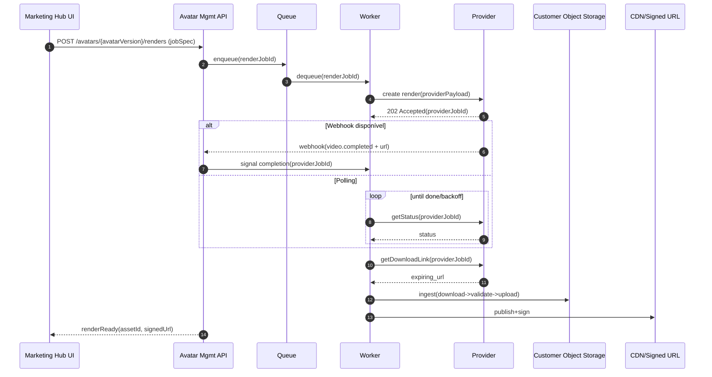
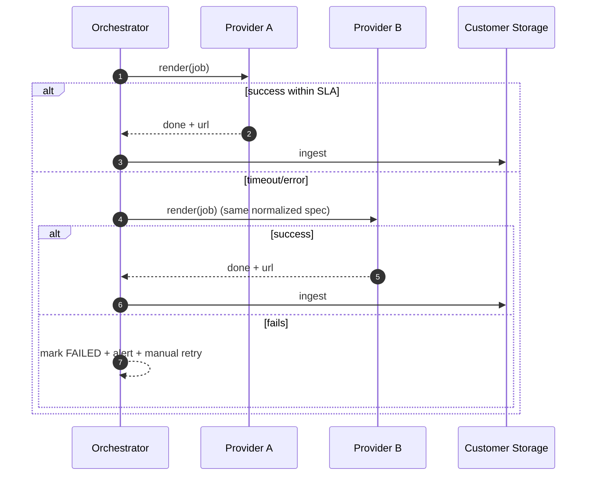
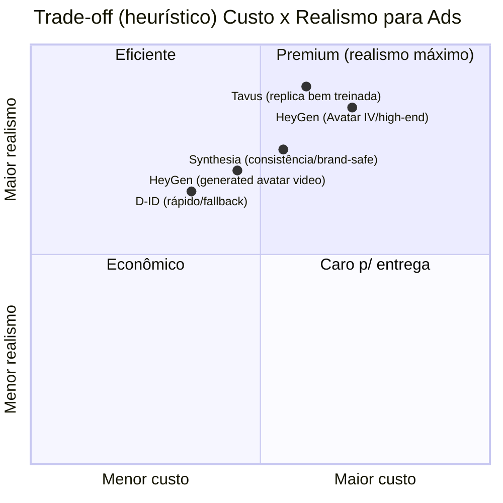

# Módulo Plugável de Gestão de Avatares de IA no Marketing Hub

## Resumo executivo

Adicionar um módulo plugável de **“Avatar Management”** ao Marketing Hub é, essencialmente, criar uma esteira industrial de criativos “creator-led/UGC-like” que acelera **testes de hipóteses** e melhora a **eficiência de mídia** por (i) aumentar a cadência de experimentos (mais variações por semana), (ii) produzir peças nativas para Reels/Stories (9:16, safe zone, ritmo), e (iii) permitir **personalização/localização** sem regravação humana.

A evidência mais robusta para a tese não é “avatar IA = +X% conversão” (isso depende do nicho e execução), e sim que **criatividade** é um determinante dominante da efetividade/ROI e que seguir boas práticas de criativo em Reels reduz custo por resultado. A própria Meta cita pesquisa (Nielsen/Google) apontando que criatividade explica grande parte do ROI de vendas e do sucesso de campanha. citeturn9search0turn9search3 Além disso, em testes, anúncios de Reels construídos como **vídeo 9:16 com áudio e elementos críticos na safe zone** tiveram **34,5% menor custo por resultado** do que anúncios de imagem. citeturn9search1

Do ponto de vista de produto e risco, o módulo só é “vendável” em escala se incluir: **armazenamento final em object storage controlado pelo cliente**, ingestão imediata (links de provedores expiram), rastreio de custos por campanha, e governança de **consentimento** para “personal replicas” (biometria/semelhante), sob LGPD. citeturn1search3turn3search0turn4search2turn14search0turn0search3

---

## Mercado e proposta de valor

### Por que avatar IA é plausível para venda direta de produtos digitais

O “avatar” entra como forma de **entregar o que já performa bem em Instagram**: presença humana, prova/autoridade e narrativa curta. A Meta recomenda que anúncios de vídeo no Instagram sejam **conciso (6–15s)** e “fisgue” rápido. citeturn9search14 Isso se encaixa com uma estratégia de funil típico para infoproduto/digital:

- **Topo (prospecting):** variações curtas (6–15s) com hook forte e promessa clara.
- **Meio (retargeting):** 15–30s com prova (B-roll, depoimento, print, demonstração) + oferta.
- **Fundo (conversão):** reforço de objeções + call-to-action direto (compra).

O valor do módulo, portanto, não é “gerar um vídeo”, mas **conectar avatar → criativo → experimento → publicação → coleta de métricas** com rastreio de custos e versões.

### Métricas de impacto esperadas e como interpretar

**Métricas diretamente afetadas no Ads Manager (curto prazo):**
- **CVR (conversion rate) / CPA (custo por aquisição)**: principal alvo.
- **CTR/Thumbstop (retenção inicial)**: indicador de qualidade do hook e naturalidade.

**Métricas “economia” (capacidade produtiva):**
- Tempo de produção por variação (minutos/hora).
- Custo marginal por variação (USD/BRL por minuto ou por crédito).

**Métricas de negócio (médio prazo):**
- **CAC payback** (dias até recuperar custo de aquisição).
- **LTV** (principalmente se o avatar também for usado em onboarding/pós-compra).
- **Retenção** (para assinatura/comunidade), pelo efeito indireto de melhor qualificação e consistência.

A evidência setorial mais sólida é que criatividade é um grande driver de ROI: a Meta cita Nielsen (criatividade explica 56% do ROI de vendas) e Google (70% do sucesso seria determinado pelo criativo). citeturn9search0turn9search3 Isso sugere que o módulo pode gerar ROI principalmente por **aumentar o número de iterações criativas vencedoras**, e não por “avatar em si”.

### Faixas realistas de ROI e cenários conservador/agressivo

**Base factual para calibragem (formato/execução):**
- Em testes, Reels 9:16 com áudio + safe zone reduziu custo por resultado em 34,5% vs imagem. citeturn9search1
- Melhor prática de duração para Instagram: 6–15s. citeturn9search14

A partir disso, uma forma realista de trabalhar é como hipóteses “com faixas”:

**Cenário conservador (execução ok, nicho competitivo):**
- **Lift de conversão efetiva** (ou redução de CPA): **+3% a +10%**.
- ROI do módulo vem mais de **redução de custo/tempo de produção** e de “mais testes” do que de ganho por peça.

**Cenário agressivo (execução forte, oferta clara, criativos nativos):**
- Redução de custo por resultado na faixa **~15% a 35%**, alinhado a testes/referências específicas de Reels quando o formato está correto. citeturn9search1turn9search14

Importante: essas faixas não são garantias — são **metas de experimentação** com mensuração disciplinada.

### Mensuração recomendada: A/B test + Conversion Lift (quando possível)

1) **Teste A/B (rápido, operacional):** compare duas (ou mais) versões alterando apenas um fator (ex.: “mesma oferta, avatar vs sem avatar”, ou “mesmo script, avatar + B-roll vs avatar full-screen”). A Meta descreve testes A/B como comparação controlada de versões alterando variáveis como criativo, texto e posicionamento. citeturn1search0

2) **Conversion Lift (incrementalidade, mais robusto):** mede impacto incremental comparando grupo de teste vs controle (holdout). A Meta descreve Conversion Lift como metodologia para mensurar efeito incremental. citeturn21search14turn0search5  
Para equipes com maturidade técnica, há guia de Lift Studies na Marketing API (útil se você quiser “puxar resultados/metadata e amarrar ao Experimento do Marketing Hub”). citeturn21search1

---

## Arquitetura técnica plugável

### Objetivo arquitetural

Padronizar tudo como **jobs assíncronos**: “um job interno” → “um provedor (ou fallback)” → “um asset final normalizado” armazenado no **object storage do cliente** (S3/GCS) e servido via CDN/signed URL.

Isso é crítico porque:
- alguns provedores entregam URLs temporárias (ex.: HeyGen expira em 7 dias; D‑ID expira em 24h). citeturn3search0turn4search2
- mesmo quando a URL é “pública”, você quer controle de expiração, revogação e custo de egress.

### Padrão “Provider Adapter” (interface e métodos)

Defina um contrato interno **provider-agnostic**. Exemplo de interface (conceitual):

**Avatar (treino/gestão)**
- `listAvatars(tenantId, filters) -> Avatar[]`
- `createAvatar(tenantId, spec) -> Avatar`
- `trainReplica(tenantId, trainingSpec, consentArtifact) -> TrainingJob`
- `getTrainingStatus(trainingJobId) -> Status`

**Renderização**
- `renderVideo(renderJobSpec) -> ProviderRenderRef` (retorna `providerJobId`)
- `getRenderStatus(providerJobId) -> RenderStatus`
- `getDownloadLink(providerJobId) -> ExpiringUrl`
- `cancel(providerJobId)`

**Webhooks**
- `validateWebhook(headers, body) -> bool`
- `parseWebhook(body) -> {providerJobId, status, downloadLink?}`

**Capabilities**
- `capabilities() -> {supportsWebhook, supportsReplica, supportsTemplates, maxDuration, ...}`

Cada adapter encapsula: auth, payload mapping, idempotência e parsing de erros.

### Orquestração assíncrona e confiabilidade

**Fila e workers**
- “RenderJob” entra em fila (ex.: Redis/DB queue).
- Worker executa steps idempotentes (cada step com `idempotency_key`).

**Webhooks vs polling**
- Preferir webhook quando o provedor oferece callback (reduz latência e custo de polling).  
  - Colossyan permite enviar um `callback` e recebe POST com `url` pública do vídeo quando o job conclui. citeturn3search3  
  - HeyGen suporta webhooks e valida endpoint com request `OPTIONS` (timeout 1s) — isso impõe requisitos na sua infra (responder rápido e aceitar OPTIONS). citeturn21search3  
  - Tavus documenta “Webhooks and Callbacks” (ainda em evolução), e vários endpoints aceitam `callback_url` (por exemplo no create replica). citeturn4search16turn0search15  
  - Synthesia tem recursos de webhooks e verificação de assinaturas. citeturn22search0turn22search3  

Quando não há webhook confiável, use **polling com backoff**. Para backoff e jitter, há recomendações formais da AWS (timeout/retry/backoff com jitter). citeturn2search3turn2search11

### Ingest pipeline para links expiráveis e normalização do asset

**Problema:** links do provedor expiram e, às vezes, mudam a cada consulta (HeyGen regenera parâmetros de expiração ao chamar status). citeturn3search0

**Pipeline recomendado (obrigatório no MVP):**
1. **Detectar job concluído** (webhook ou polling).
2. **Obter download link**.
3. **Baixar imediatamente** para staging (streaming download).
4. **Validar**: duração, codec, fps, resolução, tamanho.
5. **Transcodar** (opcional): gerar variantes (ex.: 1080p, 720p; H.264 baseline para compatibilidade).
6. **Subir para object storage controlado pelo cliente** (S3/GCS) com paths por tenant/campanha.
7. **Publicar via CDN** e fornecer **URL assinada** (expiração curta) para consumo.

**URLs assinadas no storage do cliente**
- S3: presigned URL pode expirar até 7 dias via SDK/CLI. citeturn2search0turn2search4  
- GCS: signed URL também tem máximo de 7 dias (604800s) e expiração configurável. citeturn2search1

**CDN e proteção de conteúdo pago**
- CloudFront permite servir conteúdo privado com **signed URLs/cookies** para restringir acesso. citeturn2search2turn2search6  
(Em alternativa, o mesmo conceito existe em outros CDNs; o importante é que o asset final esteja sob controle do cliente.)

### Rate limits, batching e otimização de custo

Como rate limits variam por provedor e podem ser “tiered”, a arquitetura deve suportar:
- **Rate limiter por provider + tenant** (token bucket).
- **Batching** onde o provedor suporta “templates” e variáveis (reduz custo de payload e chamadas).
- **Cache por hash de renderConfig**: se o mesmo roteiro/voz/avatar/formato já foi renderizado, reutilize o asset.
- **Preferir cenas curtas** e “hybrid rendering” (avatar 2–4s + B-roll) para reduzir tempo total renderizado do avatar (que costuma ser a parte mais cara).

### Multi-tenant isolation e segurança

**Isolamento**
- `tenant_id` como partição: DB (row-level), bucket prefix, chaves e quotas.
- Provider keys: armazenar em vault/secret manager, nunca em texto puro.

**Segurança de dados**
- Minimizar PII nos payloads.
- Logs sem URLs assinadas/tokens.

**Consent e “personal replicas”**
- Tavus exige **declaração verbal de consentimento** no vídeo de treino (personal replica). citeturn0search3turn0search15  
- Synthesia exige consentimento gravado “ao vivo” e pela mesma pessoa do footage do avatar. citeturn14search0turn14search9  
- HeyGen exige consentimento (vídeo ao vivo) para cada Digital Twin e a API de criação inclui URLs de footage e consent statement. citeturn14search2turn14search1turn14search7turn14search4  
- LGPD: o texto legal define regime de proteção de dados pessoais no Brasil; biometria ligada a pessoa natural entra no escopo de maior cuidado (dado sensível). citeturn1search3  

Portanto, implemente **ConsentArtifact** obrigatório para qualquer avatar “pessoal”: hash do vídeo, timestamp, termos aceitos, responsável, e capacidade de revogação/eliminação.

### Diagramas de fluxo (mermaid)





---

## Mapa de provedores e comparação

### Visão geral do ecossistema e “fit” para Realismo + Ads

Para criativos bem realistas no Instagram, há três “famílias” de provedores:
1) **Avatar + vídeo com foco em marketing/ads** (rápida variação, templates, export).
2) **Replica-first** (digital twin, consistência de rosto/voz).
3) **Talking head rápido/barato** (ótimo fallback e variações).

O módulo deve mapear capabilities e custos, e não “casar” com um único fornecedor.

### Comparação resumida (capabilities + custos públicos)

> Observação: “latência típica” raramente é SLA público; recomenda-se medir internamente com telemetria por provedor.

| Provedor | Melhor uso no Marketing Hub | API (criar/status/download) | Webhook/Callback | Múltiplos avatares/replicas | Expiração de link | Modelo de preço (sinais oficiais) | Observações |
|---|---|---|---|---|---|---|---|
| HeyGen | Escala de variações; templates e “prompt-to-video” (Video Agent) | Docs de geração e status; URL expira 7 dias. citeturn3search0 | Webhooks com validação por OPTIONS/1s. citeturn21search3 | API inclui “Avatar Management” e “Digital Twin”. citeturn12view0turn14search1 | 7 dias. citeturn3search0 | Pro: $99/100 créditos; Scale: $330/660 créditos; $/crédito cai no Scale. citeturn10view2turn15view0 | Video Agent caiu para 2 créditos/min (Fev/2026). citeturn16view0 |
| Tavus | Replica hiper-realista; personalização e consistência | `POST create-video` usa `replica_id`; `GET video` retorna `download_url`. citeturn4search0turn4search1 | Página de webhooks/callbacks (em evolução). citeturn4search16turn0search15 | Starter inclui 3 treinos/mês; Growth 7 treinos/mês (indicador de múltiplas replicas). citeturn10view1 | Não explicitado como “7 dias/24h” — trate como efêmero e ingira. citeturn4search1 | Starter $59: 10 min de video gen + overage $1/min (6s rounding); Growth $397: 100 min + $0.90/min. citeturn10view1turn19view3 | Consent statement obrigatório para personal replica. citeturn0search3turn0search15 |
| Synthesia | Produção estável/escala; governança; bom para explainer e variações “brand-safe” | APIs de vídeo + download via link time-limited. citeturn5search0turn4search3 | Webhooks + verificação de assinatura. citeturn22search0turn22search3 | Página de pricing indica personal avatars e múltiplos avatares por cena. citeturn11view3turn11view1 | “time-limited download link” (duração não padronizada publicamente). citeturn5search0turn4search3 | Starter $29/mês; Creator $89/mês; inclui API access (conforme pricing). citeturn11view0turn11view3 | Consent ao vivo e “biometric consent” no fluxo. citeturn14search0turn14search9 |
| Colossyan | Templates e escala; útil para ads educacionais/demonstração | Job descriptor + retrieve video com `publicUrl`. citeturn3search23turn3search19 | Callback recebe `url` pública quando sucesso. citeturn3search3 | “Custom avatars” como add-on e múltiplos avatares por cena (varia por plano). citeturn5search2turn10view3 | URL pública (ainda assim, ingira para storage do cliente). citeturn3search3turn3search19 | API é add-on com 360 min/ano. citeturn10view3 | Se o módulo exigir API, trate como provável “sales-led”. |
| D‑ID | Talking head rápido; ótimo fallback e testes baratos | `POST /talks` e output `result_url`. citeturn4search5turn4search2 | Predominantemente polling (varia por produto). | Docs mostram endpoints para listar/criar avatares (v3/v4). citeturn6search11turn6search2 | `result_url` válido 24h. citeturn4search2 | Crédito: 1 crédito cobre até 15s (regras variam por produto). citeturn6search6turn6search4 | Marketing afirma “100 FPS, 4x real-time” (bom para latência). citeturn4search13 |
| Elai (extra) | Template-driven + geração em bulk para marketing/L&D | Documentação de API e uso em bulk. citeturn8search0turn8search12 | Não priorizar no MVP sem demanda | Não avaliado | Não avaliado | Pricing varia | Bom candidato para adapter futuro |
| Hour One (extra) | Geração por blueprint/dynamic via REST | API docs em GitBook (blueprint/dynamic). citeturn8search1 | Não avaliado | Não avaliado | Não avaliado | Pricing varia | Bom candidato para adapter futuro |
| OpenAI (extra, B-roll) | Gerar vídeo de B-roll para híbrido avatar+prova | API de vídeo: create/status/download/list/delete. citeturn8search7 | n/a | n/a | n/a | Pricing varia | Útil para “B-roll sintético” (não substitui apresentador) |

---

## Orquestração e lógica de decisão

### Regras para escolher provedor por job (score de roteamento)

Defina um **score por provedor** com pesos por objetivo do job:

**Exemplo de score (normalizado 0–1):**

- `QualityFit`: quão próximo do realismo desejado + suporte a “replica”.
- `CostFit`: custo estimado por segundo/minuto considerando plano e overage.
- `LatencyFit`: p50/p95 internos do provedor para duração/formato.
- `ReliabilityFit`: taxa de sucesso, erros 429/5xx, necessidade de retries.
- `FeatureFit`: hard constraints (webhook, 1080p, captions, voice, max duration).

`score = 0.35*QualityFit + 0.25*CostFit + 0.20*LatencyFit + 0.10*ReliabilityFit + 0.10*FeatureFit`

E aplique **regras duras** antes do score, por exemplo:
- Se `requiresPersonalReplica=true` → somente provedores com fluxo de consent e replica.
- Se `needsWebhook=true` → penalizar polling-only.
- Se `deadline < X` → excluir provedores com p95 acima do SLA interno.

### Pseudocódigo de roteamento (com fallback e degradação)

```pseudo
function routeAndRender(job):
  candidates = providers.filter(p => p.supports(job.requiredFeatures))

  # Hard compliance gate
  if job.avatar.type == PERSONAL_REPLICA:
    assert job.consentArtifact.present
    candidates = candidates.filter(p => p.supportsPersonalReplica)

  # Estimate cost+latency using internal telemetry + provider pricing rules
  scored = []
  for p in candidates:
    cost = estimateCost(p, job)      # plan + overage + credits
    latency = estimateLatency(p, job) # p50/p95 internally measured
    reliability = recentSuccessRate(p, last30d)
    quality = estimateQualityFit(p, job)  # heuristic + QA score
    score = weightedScore(quality, cost, latency, reliability, job.weights)
    scored.append({p, score, cost, latency})

  sorted = sortDescending(scored, by=score)

  for attempt in [0..job.maxAttempts]:
    p = choose(sorted, attempt) # attempt 0: best score; attempt 1+: fallback
    try:
      ref = p.renderVideo(job)
      waitCompletion(ref, p) # webhook preferred, else polling with backoff+jitter
      url = p.getDownloadLink(ref)
      asset = ingestToCustomerStorage(url, job)
      return asset
    catch transientError:
      backoff(attempt)
      continue
    catch permanentError:
      markProviderBad(p, error)
      continue

  raise RenderFailed(job)
```

Backoff/jitter deve seguir padrões robustos (exponencial com limite e jitter) para evitar sobrecarga e “retry storms”. citeturn2search3turn2search11

### Integração com A/B testing do Marketing Hub

O módulo deve escrever “metadados de renderização” de forma que Experimentos do Marketing Hub consigam comparar:
- `creative_variant_id` → `render_asset_id`
- `render_provider`, `render_config_hash`, `avatar_version_id`
- `cost_estimated_usd`, `render_latency_ms`, `fallback_used`

A/B test em Meta compara versões alterando criativo/posicionamento e outras variáveis, então o módulo deve garantir que “uma variável por vez” seja alterada em experimentos específicos. citeturn1search0

### Hybrid rendering e “padrão vencedor” para vendas diretas

Uma diretriz prática para reduzir uncanny valley e aumentar retenção:
- **Avatar só no hook (2–4s)** + **B-roll/prova** (prints, tela, produto, depoimento) + avatar volta para CTA.  
Isso também **reduz custo de renderização** quando o provedor cobra por minuto/segundo de avatar.

### Cache e versionamento de avatares

Modelo recomendado:
- `Avatar` (conceito: Persona/Marca)
- `AvatarVersion` (mudou voz/treino/idioma/estilo)
- `RenderAsset` (resultado final, com hash do spec)

**Regra:** nunca sobrescrever uma versão usada em experimento; criar nova versão para preservar reprodutibilidade.

---

## Produto, governança e operação

### UX: funcionalidades mínimas e “operáveis” (sem virar um editor de vídeo)

**Gestão de avatares**
- Criar avatar stock (quando o provedor fornecer)
- Criar avatar custom/replica (wizard)
- Listar e filtrar (tags: nicho, oferta, persona, idioma, tom)
- Versionar (ex.: “V1 – PT‑BR – oferta A”, “V2 – PT‑BR – voz diferente”)

**Treino e consent (quando personal replica)**
- Upload/URL de training footage
- Captura/armazenamento de ConsentArtifact (obrigatório)
- Status de treino (queued/running/failed/ready)

**Render e assets**
- Criar render job (8s/15s/30s)
- Biblioteca com preview (thumbnail/GIF) e metadados
- Re-render com alterações (script, CTA, preço)
- Export/download via signed URL do storage do cliente

### Checklist de governança (pronto para virar “Definition of Done”)

**Consentimento e LGPD**
- [ ] Personal replica exige ConsentArtifact e trilha de auditoria (quem, quando, termos). citeturn1search3turn14search0turn0search3turn14search2  
- [ ] Bloquear upload de footage de terceiros; exigir que consentimento corresponda à mesma pessoa (prática explicitada por provedores). citeturn14search4turn14search0  
- [ ] Capacidade de revogar e deletar (no seu storage + request de deleção no provedor quando houver).

**Transparência na Meta**
- [ ] Conhecer quando a Meta adiciona “AI info” automaticamente em ads criados/editados com recursos de IA generativa da própria Meta. citeturn9search2turn14search6  
- [ ] Usar a opção de disclosure ao publicar ads com mídia criada/editada com **ferramentas de IA generativa de terceiros** (quando aplicável ao seu fluxo). citeturn9search15turn14search3  
- [ ] Criar campo interno `requires_ai_disclosure` por criativo/campanha.

**Brand safety e moderação**
- [ ] Bloquear categorias de risco (deepfake de pessoa pública; claims médicos; “antes/depois” proibido etc.).
- [ ] Fila de revisão humana para novos avatares (primeira publicação).
- [ ] Registrar decisões (aprovado/reprovado/motivo).

Há também risco real e documentado de uso indevido de likeness em campanhas/propaganda; isso reforça a necessidade de governança. citeturn17news40turn1search1

### Controles de custo, quotas e billing por campanha

Implementar três níveis:
1) **Quota por tenant (mensal):** minutos/credits, treinos, renders.
2) **Budget por campanha/experimento:** teto de custo de geração.
3) **Chargeback interno:** `RenderCostLineItem` atrelado a campanha, criativo e experimento.

---

## Modelo de negócio, unit economics e ROI

### Estrutura de precificação do módulo (alavancas)

Em vez de vender “minuto de vídeo”, venda **capacidade de teste e automação**:
- Plano “Avatar Ads Starter”: N renders/mês (8s/15s), 1 provedor primário + 1 fallback, ingest + storage BYO.
- Add-on “Replica”: inclui governança/consent + X trainings/mês (quando aplicável) e taxa por replica extra.
- Add-on “Scale”: mais provedores, SLA interno, e roteamento inteligente.

### Cenários de escala (30/120/400 vídeos por mês)

Assumindo 15s por vídeo:
- 30 vídeos = **7,5 min**
- 120 vídeos = **30 min**
- 400 vídeos = **100 min** (ou 600 créditos a 10s/crédito em alguns modelos)

### Tabela de custo estimado (USD/mês) por provedor (com dados públicos)

> Nota: custos abaixo consideram apenas “custo de geração” (não inclui storage/CDN/egress). Storage do cliente e CDN variam por tráfego.

**HeyGen (créditos)**
- Pro: $99/100 créditos; 1 crédito = 1 min de “generated avatar video” ou 10s de Avatar IV. citeturn10view2  
- Scale: $330/660 créditos; custo por crédito menor. citeturn15view0

**Tavus (mins incluídos + overage)**
- Starter $59 inclui 10 min de AI Video Generation; overage $1/min (arredondado a 6s). citeturn10view1turn19view3  
- Growth $397 inclui 100 min; overage $0.90/min. citeturn10view1turn19view3

**Synthesia (assinatura)**
- Starter $29/mês; Creator $89/mês; pricing menciona API access e personal avatars (variando por plano). citeturn11view0turn11view3turn11view1

| Provedor | 30 vídeos (7,5 min) | 120 vídeos (30 min) | 400 vídeos (100 min) | Observação |
|---|---:|---:|---:|---|
| HeyGen (generated avatar video 1 crédito/min) | $99 (Pro) citeturn10view2 | $99 (Pro) citeturn10view2 | $99 (Pro) citeturn10view2 | Dentro de 100 créditos/mês |
| HeyGen (Avatar IV 10s/crédito) | $99 (45 créditos) citeturn10view2 | $99 (180 créditos → exigiria Scale ou multi-Pro) citeturn10view2turn15view0 | $330 (600 créditos → Scale) citeturn15view0turn10view2 | Para Avatar IV em volume, Scale tende a ser necessário |
| Tavus (Starter + overage $1/min) | $59 (cobre 10 min) citeturn10view1turn19view3 | $79 (=59 + 20) citeturn10view1turn19view3 | $149 (=59 + 90) citeturn10view1turn19view3 | Muito competitivo em custo/min para offline |
| Tavus (Growth 100 min incluídos) | $397 citeturn10view1 | $397 citeturn10view1 | $397 citeturn10view1 | Faz sentido se você precisa de mais treinos/concurrency |
| Synthesia (Creator) | $89 citeturn11view1 | $89 citeturn11view1 | $89 citeturn11view1 | Pricing indica Creator; validar limites/credits na prática |

### Gráfico de trade-off custo vs qualidade (heurístico)



### Break-even de ROI (exemplos práticos)

Seja:
- `C_gen` = custo mensal de geração (USD ou BRL)
- `Spend` = gasto mensal em mídia
- `CPA_base` = CPA atual
- `Lift` = redução percentual de CPA (ex.: 0,10 = -10%)
- `Conversions` = `Spend / CPA_base`

**Economia mensal com lift de CPA:** `Savings = Spend * Lift` (aproximação)  
**Break-even:** `Spend * Lift >= C_gen` → `Lift >= C_gen / Spend`

Exemplo:
- Spend = R$ 50.000/mês; C_gen = R$ 1.000/mês → Lift mínimo ≈ 2%
- Spend = R$ 10.000/mês; C_gen = R$ 1.000/mês → Lift mínimo ≈ 10%

Para calibrar “Lift plausível”, use como referência que execução correta em Reels pode reduzir custo por resultado em ~34,5% em testes; mas trate como teto agressivo, não como expectativa. citeturn9search1turn9search14

---

## Roadmap, entregáveis e riscos

### MVP e critérios de sucesso

**MVP (foco em resultado, não em “provar que integra 10 provedores”):**
- 2 adapters (1 primário + 1 fallback) com render 8/15/30s
- ingest pipeline completo para storage do cliente (S3/GCS) com signed URLs
- UI mínima de avatar/version/render
- custo por render e rastreio por campanha/experimento
- consent artifacts para personal replicas (mesmo se você não lançar personal replica no MVP, a estrutura deve existir)

**Métricas de sucesso do MVP**
- p95 “create→assetReady” aceitável para operação diária
- taxa de sucesso > 95% em jobs
- custo estimado por variação abaixo do seu teto (definido por campanha)
- capacidade de rodar experimentos A/B sem fricção (criar 30 variações em horas, não dias)

### Plano sprint-by-sprint (sprints de 2–4 semanas)

> Papéis sugeridos: **BE (Backend)**, **FE (Frontend)**, **DevOps/Platform**, **QA**, **PM/Marketing Ops**.

| Sprint | Duração | Objetivo | Entregáveis | Dono (role) | Definition of Done |
|---|---:|---|---|---|---|
| Fundação de domínio | 2 semanas | Modelar entidades e contratos | Esquema DB: Avatar/Version/RenderJob/Asset/ConsentArtifact; contrato ProviderAdapter; endpoints básicos CRUD | BE + PM | API CRUD funcionando; migrations; auditoria mínima; testes unitários |
| Render assíncrono + ingest | 3 semanas | Esteira create→status→download→store | Queue/worker idempotente; backoff+jitter; ingest para S3/GCS; signed URLs | BE + DevOps | E2E de render simulado; assets no bucket do cliente; logs + métricas |
| Integração Provider A | 3 semanas | Primeiro provedor em produção | Adapter completo; webhook/polling conforme suporte; parsing de erros; dashboard de latência/sucesso | BE + QA | 50 renders consecutivos sem falha crítica; retries controlados; custos registrados |
| Integração Provider B (fallback) | 2 semanas | Resiliência e roteamento | Adapter fallback; regras básicas de roteamento; multi-provider fallback | BE | Falha simulada do Provider A redireciona para B; nenhuma perda de asset |
| UI operacional | 2 semanas | Operação do dia a dia | Lista/filtragem; tags; criação de render; preview; histórico e custos | FE + PM | Operador consegue gerar 30 variações e associar a experimento/campanha |
| Governança e compliance | 2 semanas | Pronto para escalar com segurança | Fluxo de consent; checklist e bloqueios; campo de disclosure; logs de auditoria | PM + BE + Legal | Não é possível publicar personal replica sem consent; trilha de auditoria completa |
| Medição e experimento | 2 semanas | Conectar a experimentos | Integração com A/B test; export de metadados; guias internos | PM/Marketing Ops + BE | Experimento “avatar vs controle” rodável com rastreio de custo e resultado |
| Otimização e hardening | 2–4 semanas | Reduzir custo e melhorar SLA | Cache por hash; batching/templates; alertas; SLOs; runbooks | DevOps + BE | p95 melhora; alertas cobrindo falhas; custos por render estabilizados |

**Esforço estimado (person-weeks, faixa realista)**
- Backend: **10–18 person-weeks**
- Frontend: **4–8 person-weeks**
- DevOps/Platform: **3–6 person-weeks**
- QA/Automação: **2–5 person-weeks**
Total: **19–37 person-weeks** (varia com número de provedores e rigor de compliance).

### Riscos e mitigações

**Legal/LGPD (biometria/consent)**
- Risco: treinar/usar replica sem base legal ou sem prova de consent.
- Mitigação: ConsentArtifact obrigatório; revogação; minimização de dados; contrato/termos; logs. citeturn1search3turn14search0turn0search3turn14search2

**Brand safety e deepfakes**
- Risco: parecer “deepfake” ou induzir engano (principalmente com pessoas reais).
- Mitigação: uso de personas da marca; proibir likeness de terceiros; moderação; transparência. A Meta vem ampliando rotulagem e abordagem de conteúdo IA/manipulado. citeturn1search1turn1search9turn9search11

**Uncanny valley (queda de CTR)**
- Risco: avatar “quase humano” derruba credibilidade.
- Mitigação: hybrid rendering; testes com hooks curtos; QA de lip-sync; biblioteca de “poses” aprovadas. A Meta enfatiza hooks rápidos e vídeos curtos em Instagram. citeturn9search14

**Dependência de links temporários**
- Risco: asset some e o criativo fica irrecuperável.
- Mitigação: ingest imediato + storage do cliente (HeyGen 7 dias; D‑ID 24h). citeturn3search0turn4search2

**Custos imprevisíveis**
- Risco: “explosão” de créditos/minutos durante testes.
- Mitigação: quotas por tenant/campanha; cache; roteamento por custo; overage controlado (Tavus explicita overage por minuto e arredondamento). citeturn19view3turn10view1

### Scripts exemplo (8s / 15s / 30s) para venda direta

Os scripts abaixo seguem a recomendação de concisão (6–15s) e hook rápido para Instagram. citeturn9search14

**8s (prospecting, “hook-only”)**
- “Se você quer **[resultado]** sem **[objeção]**, olha isso.”
- “Eu montei um método de **3 passos**: **[passo 1]**, **[passo 2]**, **[passo 3]**.”
- “Clica em **Comprar agora** e começa hoje.”

**15s (prospecting/retarget leve)**
- “Você já tentou **[solução comum]** e ainda trava em **[dor]**?”
- “O problema é **[erro]**. A solução é **[mecanismo]**.”
- “Em **[tempo]**, você aplica e vê **[microresultado]**.”
- “Hoje tem **[oferta/bônus]**. Toca em **Saiba mais**.”

**30s (retarget forte/BOFU)**
- “Eu vou te mostrar por que **[dor]** continua, mesmo você tentando **[coisa]**.”
- “Aqui está o que funciona: **[mecanismo]** (e por quê).”
- “Prova rápida: **[demonstração/print/depoimento]**.”
- “Se sua objeção é **[tempo/dinheiro]**, eu desenhei pra **[resolver]**.”
- “Clique em **Comprar agora** e entra no treino completo.”

Esses roteiros são “parametrizáveis” para o Marketing Hub: você gera variações trocando **mecanismo**, **prova**, **oferta** e **CTA**, e mede por A/B e, quando fizer sentido, Conversion Lift. citeturn1search0turn21search14