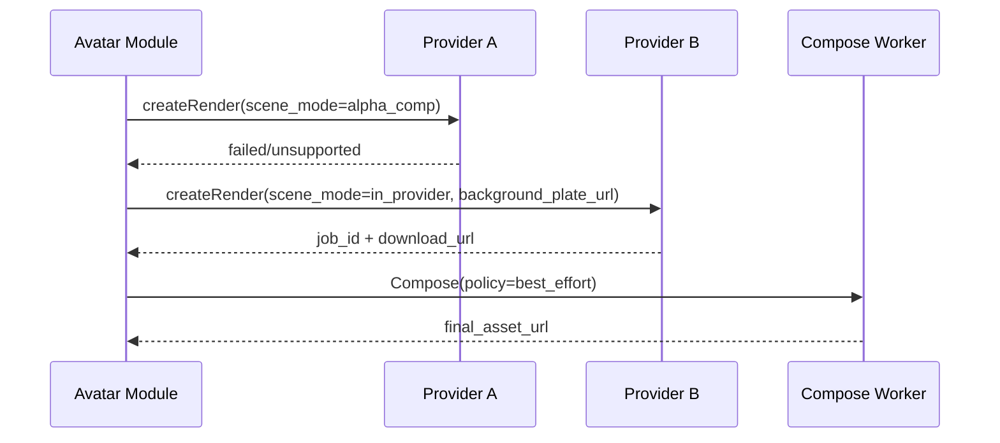
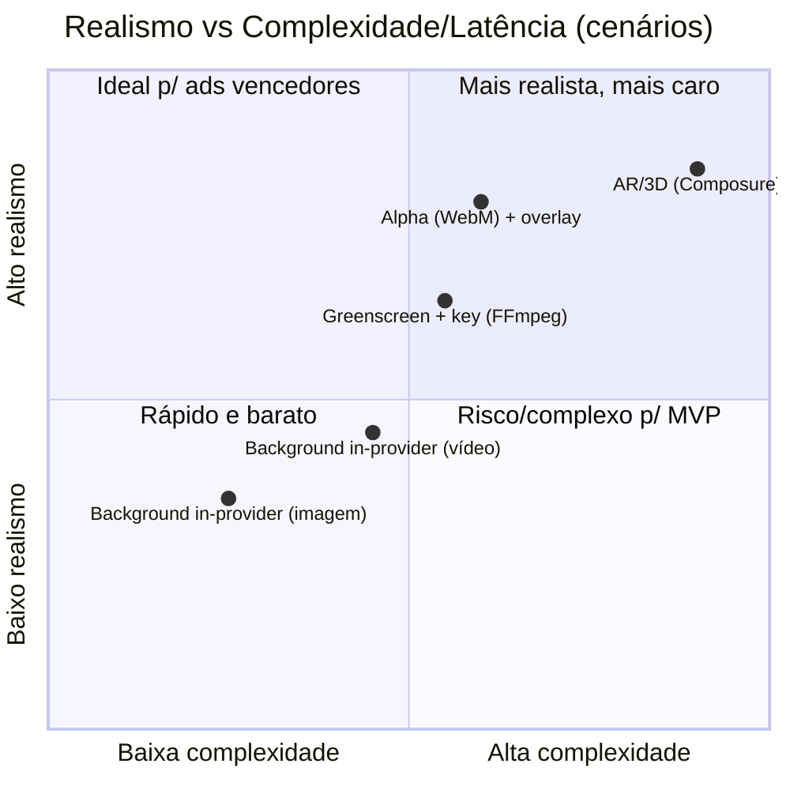

# Avatares de IA em cenários específicos para criativos de marketing

## Resumo executivo

É viável colocar um avatar gerado por IA em um cenário/local específico para criativos, mas o “como” determina o realismo: usar **background dentro do próprio provedor** é rápido e escalável; **composição (com alpha/greenscreen) em pós-produção** é o caminho mais consistente para alto realismo (sombras, recortes de cabelo, integração com filmagem). citeturn11view0turn10view0turn16search0turn2search1  
Na prática, o melhor custo/benefício para anúncios costuma ser um **MVP híbrido**: (a) “cenário dentro do provedor” para volume e testes, e (b) “avatar com transparência/greenscreen + compositor” para criativos vencedores onde vale pagar mais por qualidade. citeturn10view0turn16search0turn0search2turn7search12  

## Abordagens técnicas para colocar o avatar em um local específico

Há quatro abordagens dominantes, com graus diferentes de realismo e esforço:

| Abordagem | Como funciona | Quando usar | Limitação típica |
|---|---|---|---|
| Background “in-provider” (imagem/vídeo) | Você manda um **URL de imagem/vídeo** e o provedor renderiza o avatar “na frente” | Velocidade, volume, criatividade rápida | Integração física fraca (sombra/oclusão/paralaxe) |
| Greenscreen (fundo verde) + chroma key | Renderiza com fundo verde e você **recorta (key)** no seu pipeline | Bom equilíbrio custo/qualidade | Bordas/cabelo sofrem com compressão, requer tuning |
| Transparência (alpha) + composição | O provedor entrega **vídeo com alpha** (p. ex., WebM) e você apenas compõe | Melhor para realismo e automação | Menos comum; formatos/limitações por provedor |
| Set/AR/Compositing em tempo real (3D) | Composição em engine (p.ex. Unreal) ou no app (WebGL) | Experiências interativas, pré-visualização | Complexidade alta, requer dados de câmera/ambiente |

### In-camera vs pós-produção (o que isso significa com avatar IA)

“**In-camera**” aqui normalmente significa: você captura **o cenário real** (foto/vídeo) como *plate* (background) **com a câmera estática** e usa isso como fundo (no provedor ou na composição). Para anúncios, filmagem estática reduz o problema mais difícil: **paralaxe** e **tracking 3D**. citeturn11view0turn10view0  

A **pós-produção** vira necessária quando você quer:  
- recorte melhor (cabelo/contorno),  
- oclusão (objeto passando na frente),  
- sombras coerentes,  
- ou inserir o avatar em *B-roll* com movimento de câmera (aí entra tracking/3D). citeturn7search12turn7search3  

### Entradas necessárias para boa composição

**Alpha (transparência)** é a entrada mais valiosa: você recebe RGBA/alpha e compõe sem “key” agressivo. Em pipelines tradicionais, o alpha é comum em intermediários como **Apple ProRes 4444/4444 XQ** (inclui canal alpha). citeturn2search1turn2search3  
Para web/automação, alguns provedores entregam **WebM com fundo transparente** (útil para compor). citeturn10view0turn16search0  

**Greenscreen** é o “plano B” universal: quando o provedor não entrega alpha, você força um fundo verde e remove depois (chroma key). Alguns provedores explicitamente recomendam isso (ex.: cor verde no background) ou oferecem modo greenscreen. citeturn11view0turn29search0  

**Máscaras/segmentação** (matte): caso você precise isolar pessoas/objetos automaticamente (ex.: occlusão simples, blur, recortes), bibliotecas como **MediaPipe** oferecem segmentação de pessoa e podem rodar em tempo real. citeturn8search1turn8search5  

**Depth (profundidade)**: para oclusão mais “correta”, depth ajuda a decidir o que fica na frente/atrás. No mundo AR, **ARKit** expõe semânticas como *person segmentation with depth* e “people occlusion”. citeturn7search0turn7search1  

### Ferramentas de composição e formatos

Para automação no backend, o caminho mais direto é **entity["organization","FFmpeg","open source multimedia project"]** com filtros de chroma key e overlay (composição). citeturn0search2  

Para pós-produção “pro”, as stacks clássicas são:  
- **Adobe After Effects** (Keylight/Key Cleaner/Spill Suppressor etc.). citeturn7search12  
- **DaVinci Resolve / Fusion** (Delta Keyer). citeturn7search13turn7search6  
- **entity["company","Epic Games","unreal engine publisher"] Unreal Engine com **Composure** para composição em tempo real/virtual production. citeturn7search3turn7search10  

Em codecs:  
- **ProRes 4444** é referência para alpha em intermediário (alta taxa de dados). citeturn2search1turn2search3  
- Existem opções modernas como **HEVC com alpha** em ecossistemas Apple, mas compatibilidade varia por player/pipeline. citeturn2search11turn2search5  
- Para entrega em Ads (Meta), você quase sempre termina em **MP4 sem alpha**; então alpha/greenscreen é intermediário, não produto final. citeturn8search0  

## Capacidades dos provedores para “avatar no cenário”

A seguir, o que é **documentado oficialmente** sobre colocar avatar em cenários, com foco em: background custom, greenscreen/alpha, e composição por cenas.

### Tabela comparativa de suporte a cenários

| Provedor | Background imagem/vídeo “in-provider” | Saída transparente/alpha | Greenscreen | Multi-cena / templates |
|---|---|---|---|---|
| entity["company","HeyGen (API)","ai avatar video generator"] | Sim (cor/imagem/vídeo) | Sim (WebM transparente; restrições) | Sim (cor verde) | Sim (templates) |
| entity["company","Tavus (API)","ai replica video platform"] | Sim (site/ vídeo custom) | Sim (WebM transparente; fast=true) | Sim (CVI / greenscreen) | Sim (vídeo e conversação) |
| entity["company","Synthesia (API)","ai presenter video platform"] | Sim (backgrounds/mídia no editor/API) | Não para exportar avatar isolado | Indireto (composição no editor) | Sim (template variables) |
| entity["company","D-ID (API)","generative ai video platform"] | Indireto (depende do source image / studio) | Não evidenciado nos quickstarts públicos | Indireto | Cenas/avatars (API), mas layout pode variar |
| entity["company","Colossyan (API)","ai video platform"] | “Scenario avatars” já vêm com cenário | Indício de “baseTransparent” por view | — | Sim (trilhas/variantes) |
| entity["company","Elai.io (API)","ai video generator"] | Sim (canvas/background por slide) | “avatarType: transparent” em canvas | — | Sim (slides/canvas) |
| entity["company","Hour One (API)","ai avatar video platform"] | Sim (layouts com media_elements) | — | — | Sim (templates/layouts; blueprint/dynamic) |
| entity["company","OpenAI (Sora API)","ai video generation api"] | Gera o vídeo inteiro por prompt | — | — | Multi-clip por orquestração externa |

### Notas por provedor, com implicações práticas

**HeyGen**  
- Permite escolher background por **cor**, **imagem** ou **vídeo** no request; e menciona explicitamente usar `#008000` para criar vídeo “greenscreen”. citeturn11view0  
- Também possui um fluxo “WebM Format” para **gerar WebM com background transparente**, mas com a ressalva de que **não suporta avatares customizados** (somente studio avatars). citeturn16search0  
- Para ativos baixados via URL, a documentação do fluxo de geração indica expiração e renovação do link em chamadas de status (útil para seu pipeline de ingest). citeturn12search2turn12search1  

**Tavus**  
- Na geração de vídeo, suporta **background transparente** via `transparent_background: true`, mas **somente** quando `fast: true`, e o output é **exclusivamente .webm**. citeturn10view0  
- Para “avatar em cenário”, tem duas rotas fortes:  
  - `background_source_url` (vídeo custom como fundo) e `background_url` (website como fundo com scroll). citeturn10view0  
  - No produto de conversação (CVI), é possível aplicar **greenscreen** (`apply_greenscreen`) e depois trocar o fundo no front-end via WebGL. citeturn29search0  
- A própria lista de “Stock Replicas” inclui categoria “Customizable Background” e descreve uso de “green screen replicas” para colocar o apresentador “em qualquer lugar”. citeturn29search4  

**Synthesia**  
- O editor suporta inserir **mídia** (imagens/vídeos) na cena e criar assets (inclusive via integrações de geração de vídeo como Sora/Veo dentro da ferramenta). citeturn5search1  
- “Spaces” são ambientes animados para colocar o avatar como se estivesse em um “camera shot” (com depth-of-field), mas é um recurso interno do editor. citeturn5search3  
- A doc é explícita: **avatares não podem ser exportados com background transparente**. Ou seja, você não deve contar com “avatar RGBA isolado” para compor fora; o caminho tende a ser compor **dentro do template** e exportar final. citeturn5search3  
- Em integrações, a documentação menciona criação via API com campos como **avatar, background e aspect ratio** (útil para “cena preset” dentro da plataforma). citeturn14search7  

**D-ID**  
- No V2 Photo Avatar, o endpoint usa `source_url` (imagem) + script; para “cenário específico”, você normalmente coloca o “local” **no próprio source image** (ex.: foto do apresentador recortada já no cenário desejado, ou um presenter sobre fundo escolhido). O processamento típico é 10–30s e o `result_url` vale 24h. citeturn31view0  
- No V3 Pro (clips), o processamento típico é 15–45s e o `result_url` também vale 24h. citeturn32view0  
- Para “replica pessoal” (V3 Instant Avatars), há fluxo formal de **consentimento** (challenge script + vídeo de consent), com expiração do consent em 30 minutos, e treino tipicamente 5–10 minutos — isso impacta seu módulo de governança e armazenamento de evidências. citeturn30view0  

**Colossyan**  
- A API lista tipos de avatar incluindo “Scenario: … shown with a specific scenario background”, sugerindo que parte do catálogo já vem “ambientado”. citeturn5search0  
- No payload de `views`, aparece a presença de URLs como `videos.baseTransparent` (indicando disponibilidade de um vídeo “base” transparente em certas views/variantes). Trate como capacidade promissora para composição, mas valide em conta/plano. citeturn5search0  

**Elai.io**  
- A API explicita uma estrutura de slides com `canvas.background` e objetos no canvas; o exemplo inclui objeto `type: "avatar"` com `avatarType: "transparent"`, sugerindo que o “ator” já é tratado como camada sobre fundo no compositor deles (útil para cenários/modelos). citeturn18view0  

**Hour One**  
- O “Dynamic - Quick Start” descreve que templates/layouts definem elementos gráficos (áudio/vídeo/imagens/texto e a **localização do avatar**) e que `media_elements` são **imagens ou vídeos** por URL público dentro do layout. Isso é, na prática, um suporte explícito a “colocar o avatar numa cena”, via composição baseada em templates/layouts. citeturn24view0turn23view1  
- A API de status expõe `download_url` e descreve cenas com arrays de mídia/texto/transcript (o que facilita mapear cenas do seu módulo). citeturn22view1  

**OpenAI (Sora API)**  
- A API gera vídeos por prompt; você pode controlar duração (4/8/12s) e alguns tamanhos, além de consultar status e baixar o MP4 quando concluído. citeturn8search10turn8search0  
- Isso **não é** “colocar avatar X em cenário Y mantendo a mesma identidade com garantias”, mas é excelente para:  
  - gerar *background plates* (B-roll) coerentes,  
  - gerar variações criativas rápidas,  
  - ou criar cenas totalmente sintéticas quando você não precisa de “identidade estável”. citeturn8search0turn5search1  
- O objeto de job inclui `expires_at` (quando setado), reforçando a necessidade de ingest para storage controlado pelo cliente. citeturn8search10  

## Pipeline e arquitetura para render → compor → ingerir em storage do cliente

A arquitetura mais robusta é tratar “cenário” como uma etapa **pluggable**: algumas renderizações saem prontas do provedor (background in-provider), outras exigem **compositor**.

### Campos recomendados no seu Job Spec

Mesmo sem amarrar stack/cloud, um spec funcional precisa separar:

- **Render (avatar)**: `provider`, `avatar_id/replica_id`, `script`, `voice`, `format_preference` (mp4/webm), `quality_tier`  
- **Cenário**: `scene_mode` = `in_provider | chroma_key | alpha_comp | template_layout`  
- **Inputs de cenário**:  
  - `background_plate_url` (imagem/vídeo),  
  - `background_kind` (`image | video | website`),  
  - `layout_id/template_id` (quando aplicável)  
- **Composição**:  
  - `keying` (cor, tolerância),  
  - `transform` (posição/escala),  
  - `color_match` (on/off),  
  - `shadow_pass` (MVP: off)  
- **Ingest**: `customer_storage_target` (bucket/prefix), `deliverables` (mp4 final, thumb, preview low-res)

### Sequência recomendada (webhook/poll + ingest + compose)

```mermaid
sequenceDiagram
  participant App as Marketing Hub
  participant AM as Avatar Module
  participant P as Provider API
  participant Q as Queue/Workers
  participant C as Compose Worker (FFmpeg/VFX)
  participant S as Customer Object Storage
  participant CDN as CDN (optional)

  App->>AM: createCreative(jobSpec)
  AM->>P: createRender(jobSpec.render + sceneMode)
  P-->>AM: job_id + status_url/webhook
  AM->>Q: enqueue TrackJob(job_id)

  alt Webhook
    P-->>AM: render.completed(job_id, download_url)
  else Polling
    Q->>P: getStatus(job_id)
    P-->>Q: status + download_url (when ready)
  end

  Q->>S: ingest(download_url -> object storage)
  Q-->>C: enqueue Compose(jobSpec, ingested_asset_url)

  alt scene_mode = alpha_comp or chroma_key
    C->>C: key/overlay/transcode
    C->>S: write final MP4 + thumbs
  else scene_mode = in_provider/template_layout
    C->>C: transcode/normalize only (optional)
    C->>S: write final MP4 + thumbs
  end

  opt publish
    S-->>CDN: origin
    AM-->>App: creativeAssetReady(storage_url)
```

A ingest antecipada é crítica quando o provedor usa links temporários (ex.: 24h em D-ID; 7 dias em HeyGen). citeturn31view0turn12search2turn30view0  

### Composição automatizada: chroma key e overlay

No MVP, o compositor pode ser puramente **FFmpeg**:  
- `chromakey/colorkey` para remover fundo verde,  
- `overlay` para compor sobre o background plate,  
- e normalização final para MP4. citeturn0search2  

Quando o “realismo” é prioridade (bordas de cabelo, spill, compressão), sua UI/ops pode permitir um fluxo opcional “Pro” com presets equivalentes ao que o After Effects recomenda (Keying + limpeza + supressão de spill). citeturn7search12  

### Fallback multi-provedor (quando “colocar no cenário” falha)

Você quer fallback não só por indisponibilidade, mas por **capacidade**: se o provedor não entrega alpha, volte para greenscreen; se não aceita background vídeo, faça composição local.



A regra prática: fallback deve degradar primeiro **realismo** (alpha → greenscreen → in-provider), preservando **prazo** e **entrega**. citeturn10view0turn11view0turn0search2  

## UX/produto: como o marketer escolhe “o lugar”

Um UX eficiente para cenário/local costuma ter três modos:

**Templates de cena**  
Biblioteca de presets (“escritório”, “fundo gradiente da marca”, “landing page em scroll”, “b-roll de produto”, “lousa/aula”). Isso casa bem com provedores orientados a layout (Hour One, Elai) e com templates (Synthesia, HeyGen). citeturn24view0turn18view0turn16search4turn5search2  

**Upload de background plate**  
Permitir upload (ou URL) de:  
- foto do local,  
- vídeo curto do local (*B-roll*),  
- ou até website (quando suportado) — ex.: Tavus `background_url`. citeturn10view0  

**Presets por “lugar” (geo/place)**  
Em ads, “lugar” muitas vezes é mais “contexto” do que geolocalização literal: “praia”, “coworking”, “centro urbano”, “interior”. Você pode mapear isso para um catálogo licenciado de plates e apenas trocar o plate (sem re-renderizar o avatar se você tiver alpha/greenscreen cache). citeturn10view0turn16search0turn31view0  

### Preview e aprovação

- **Preview low-res/fast**: alguns provedores têm modos mais rápidos (ex.: Tavus exige `fast: true` para transparência). Use isso para aprovar enquadramento/posição antes do render “final”. citeturn10view0  
- **Safe zones**: para placements verticais (Reels), sua UI deveria sobrepor guias de safe zone e exigir que CTA/texto não esteja em área de UI do app. A documentação do Marketing API recomenda construir em 9:16 e respeitar safe zones. citeturn3search1  

## Qualidade, limitações e trade-offs

### Limitações visuais difíceis de “enganar”

- **Oclusão**: sem depth/mattes, o avatar fica sempre “por cima” de tudo. Uma forma avançada é usar depth/segmentation (ARKit em tempo real; ou modelos em batch) para compor corretamente. citeturn7search0turn8search5  
- **Sombras/reflexos**: provedores “in-provider” quase nunca simulam sombra coerente com plate real. Para anúncios, uma sombra simples (fake blur/opacity no compositor) ajuda, mas realismo máximo exige 3D/light matching (fora do MVP). citeturn7search3  
- **Paralaxe / câmera em movimento**: se o background é um vídeo com movimento de câmera e você só faz overlay 2D, o avatar “escorrega” no espaço. Evite isso no MVP: prefira câmera estática, ou use cenas 100% sintéticas. citeturn7search10turn8search0  

### Trade-offs de performance e custo

- **Alpha em intermediário** costuma ser pesado (ex.: ProRes 4444 é alta taxa de dados; ótimo para composição, ruim para armazenamento se usado como final). citeturn2search1  
- **Chroma key** pode degradar bordas em material muito comprimido; ferramentas como After Effects orientam cadeias de efeitos para recuperar alpha e reduzir spill (mais custo humano/CPU). citeturn7search12  
- **B-roll gerado (GenAI)** pode ser rápido para variação criativa, mas introduz risco de inconsistência visual; em ferramentas como Synthesia, a geração “Create with AI” para vídeo pode levar minutos por clip (e.g., 3–5 min). citeturn5search1  

### Mini-gráfico: realismo vs complexidade/latência (regra de bolso)



Os quadrantes “bons” para marketing de performance normalmente são: **in-provider** (para volume e teste) e **alpha/greenscreen + composição** (para escalar o que ganhou). citeturn11view0turn10view0turn0search2turn7search3  

## Recomendações e MVP: o que implementar primeiro

### Melhores abordagens por caso de uso

**Anúncios rápidos (produção em volume, 8–30s)**  
- Priorize **background in-provider** com imagem/vídeo (HeyGen, Tavus, Hour One, Elai, Synthesia via templates). citeturn11view0turn10view0turn24view0turn18view0turn14search7  
- Use o compositor apenas para: normalizar codec, inserir legendas/CTA e gerar variações de aspect ratio.

**Criativos “vencedores” que precisam de realismo alto (ex.: VSL curta com prova social em cenário real)**  
- Prefira **alpha** quando disponível:  
  - Tavus (`transparent_background` + `fast=true` + WebM). citeturn10view0  
  - HeyGen WebM transparente (limitado a studio avatars). citeturn16search0  
  - Avaliar “baseTransparent” do Colossyan (validar em conta). citeturn5search0  
- Caso não haja alpha, force **greenscreen** (background verde) e faça chroma key no seu pipeline. citeturn11view0turn29search0turn0search2  

**Personalização por local/segmento (trocar “lugar” em escala)**  
- Separe o problema em 2 camadas:  
  1) gerar/obter um catálogo de plates por “lugar” (licenciados),  
  2) compor um avatar padronizado por persona com plates diferentes.  
- Quanto mais você conseguir **cachear o avatar “recortado”** (alpha/greenscreen), mais barato fica gerar variações de place. citeturn10view0turn16search0turn0search2  

### Mudanças mínimas no seu módulo “Avatar Management” para suportar cenários

Checklist de MVP (implementação prática):

1) **Novos campos no Render Job**  
- `scene_mode`, `background_plate_url`, `background_kind`, `layout_id/template_id`, `keying_settings`, `transform`.

2) **Compose Worker**  
- Primeiro release: **FFmpeg** (key + overlay + transcode). citeturn0search2  
- Segundo release: presets “Pro” alinhados a práticas de keying (After Effects/Fusion), opcional. citeturn7search12turn7search13  

3) **Ingest obrigatório para links temporários**  
- D-ID: `result_url` 24h. citeturn31view0turn30view0  
- HeyGen: URL expira em 7 dias e é “regenerada” ao consultar status. citeturn12search2  

4) **Preview low-res**  
- Use modos rápidos/curtos quando existirem (ex.: Tavus fast). citeturn10view0  

5) **Governança básica**  
- Para “replica pessoal”, exija armazenamento de artefatos de consentimento (ex.: D-ID tem challenge/consent) e trilha de auditoria. citeturn30view0  

### Exemplo de JSON de Job Spec (render + cenário + composição)

```json
{
  "job_type": "avatar_video_creative",
  "tenant_id": "tenant_123",
  "creative_id": "cr_987",
  "provider": "tavus",
  "render": {
    "replica_id": "r90105daccb4",
    "script": "Você sabia que dá para aprender X em 7 dias? Vou te mostrar como.",
    "voice": { "type": "tts", "locale": "pt-BR" },
    "format_preference": "webm_alpha",
    "quality_tier": "fast_preview"
  },
  "scene": {
    "scene_mode": "alpha_comp",
    "background_kind": "video",
    "background_plate_url": "https://cdn.example.com/plates/coworking_sp_9x16.mp4",
    "transform": { "x": 0.62, "y": 0.15, "scale": 0.78, "anchor": "bottom_center" }
  },
  "compose": {
    "pipeline": "ffmpeg",
    "keying": null,
    "color_match": "basic",
    "output": {
      "container": "mp4",
      "video_codec": "h264",
      "resolution": "1080x1920",
      "fps": 30,
      "audio": "aac"
    }
  },
  "ingest": {
    "customer_storage": {
      "provider": "s3",
      "bucket": "customer-bucket",
      "prefix": "marketing-hub/creatives/cr_987/"
    },
    "deliverables": ["final_mp4", "thumb_jpg", "preview_mp4"]
  }
}
```

### Observações legais e direitos de imagem (cenário/local)

- Se você usa foto/vídeo de “um lugar real”, trate o plate como **ativo com direitos** (licença de stock, autorização do proprietário, ou captura própria), especialmente se houver marcas/pessoas identificáveis.  
- Para conteúdo sintético, plataformas têm aumentado esforços de **rotulagem/transparência** sobre mídia gerada/alterada por IA; ao menos, seu sistema deve registrar “proveniência” (qual provedor, quando, quais assets). citeturn33search6turn33search11  

