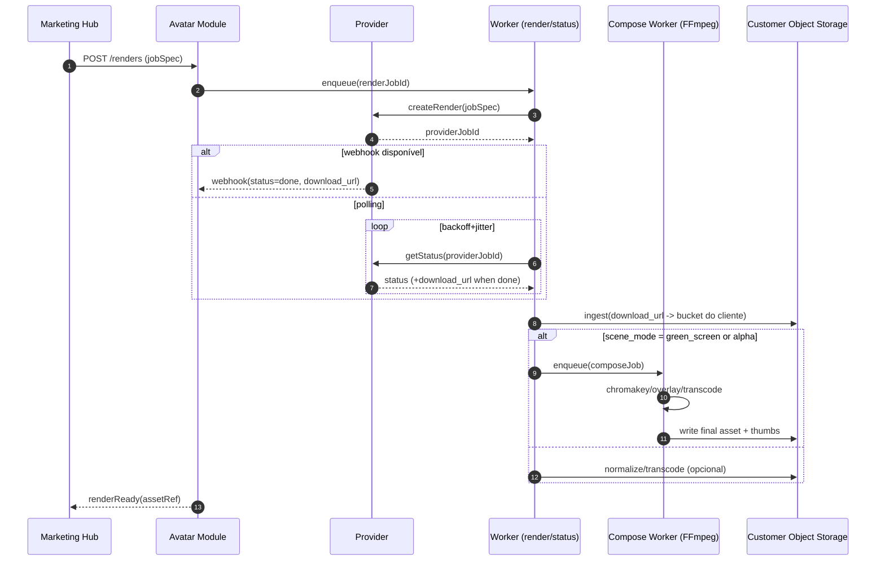
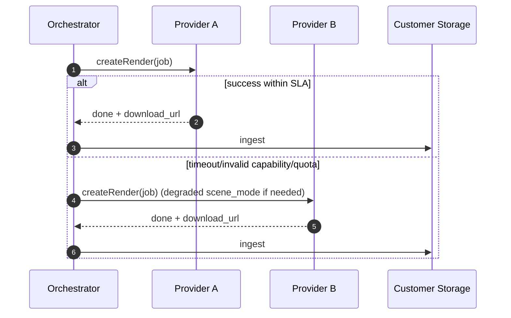

# Roadmap de implementação por sprints para Avatares com cenários, provedores plug‑and‑play e evolução do módulo de vídeo

Adicionar suporte a **cenários/backgrounds**, um **framework de provedores plugável** e uma **esteira de vídeo evolutiva** é mais eficiente quando tratado como um pipeline assíncrono de “render → compor → ingerir”, com **armazenamento final sempre em object storage controlado pelo cliente**. O plano abaixo prioriza um MVP que já entrega valor (ads em escala com backgrounds e fallback), enquanto cria fundamentos (contratos, observabilidade, governança e testes) para suportar novos provedores e produtos de vídeo.

## Backlog priorizado

### MVP

O MVP deve entregar: (1) cenários por background plate (imagem/vídeo) + greenscreen/composição básica, (2) troca de provedor em runtime com interface estável, (3) ingestão robusta para links expiráveis.

| Épico | Por que entra no MVP | Entregáveis |
|---|---|---|
| Job spec com campos de cena e output | Sem contrato claro, cenários viram “gambiarras” por provedor | Novo schema + validações + migração |
| Provider adapter plugável (2 provedores) | Provar “plug‑and‑play” requer pelo menos dois adapters reais | Registry + adapter A/B + fallback |
| Compose worker (FFmpeg) | Permite cenários mesmo quando provedor não “compõe” bem | Chroma key + overlay + transcode |
| Ingest obrigatório + storage do cliente | Links expiram (e variam por provedor) | Downloader, checksum, re-host no bucket do cliente |
| Observabilidade + custos por job | Sem isso, custo/latência explodem | métricas, logs, billing attribution |
| Rollout com feature flags | Evita quebrar tenants existentes | canary + opt-in por tenant |

### V1

V1 deve melhorar qualidade e operação: transparência (alpha), templates/cenas por provedor, preview low‑res e controles de quota.

| Épico | Entregáveis |
|---|---|
| “Alpha path” (quando provedor suporta) | Output WebM transparente + composição sem chroma |
| Templates/scene presets | `template_id/scene_template` + biblioteca de cenas |
| Preview pipeline (low‑res/fast) | render rápido + validação humana |
| Visual regression + QA de bordas | testes automatizados em frames e máscaras |
| Rate limiting + backoff padronizado | limiter por tenant/provedor + jitter |

### V2

V2 foca em “produtos futuros”: multi‑cenas complexas, dublagem, geração de B‑roll, e integrações de vídeo mais ricas.

| Épico | Entregáveis |
|---|---|
| DAG de pipeline (“steps”) | render/compor/transcodar/legendar como grafo |
| Multi‑scene compositor | stitching com transições, trilha, overlays |
| VFX opcional (alta qualidade) | presets avançados e integração com stack pro |
| Novos provedores (template‑driven) | adapters para provedores baseados em layouts |
| Produtos futuros (interativo/tempo real) | base para conversação/streaming (opcional) |

## Comportamentos de provedores que impactam o plano

A tabela abaixo destaca o que afeta diretamente sprints de cenários, ingest e webhooks (apenas comportamentos documentados em fontes oficiais).

| Provedor | Cenários/backgrounds | Transparência/greenscreen | Webhooks/assinaturas | Link expira? |
|---|---|---|---|---|
| **entity["company","HeyGen","ai avatar video platform"]** | Background `color/image/video` e `play_style`; permite `#008000` para greenscreen. citeturn3view0turn3view2 | WebM transparente existe, mas **não suporta avatares custom**, só studio avatars. citeturn4search3 | Validação do webhook faz **OPTIONS** com timeout **1s**. citeturn2search0 | URL do vídeo expira em **7 dias** e é regenerada ao consultar status. citeturn0search4 |
| **entity["company","Tavus","ai replica video api"]** | Customizações de background e parâmetros de fundo. citeturn0search1turn0search5 | `transparent_background=true` só funciona com `fast=true` e gera **.webm**. citeturn0search1turn0search5 | Documenta callbacks/webhooks e uso de `callback_url` em endpoints. citeturn2search1turn2search5 | Tratar URLs como efêmeras (ingest recomendado) |
| **entity["company","D-ID","ai talking avatar platform"]** | Cenário normalmente via “plate” no source / pipelines externos | `result_url` vale **24h** (baixar e salvar). citeturn0search2turn0search6 | — | **24h**. citeturn0search2 |
| **entity["company","Synthesia","ai video creation platform"]** | Templates e composição no ecossistema do provedor (mais “in‑provider”) | (Sem foco em export de avatar isolado nos docs citados aqui) | Verificação de assinaturas para eventos/webhooks. citeturn0search3 | Tratar URLs como temporárias; ingestion recomendado |
| **entity["company","Elai","ai video api platform"]** | Estrutura em “slides/canvas” e background no canvas. citeturn3view6 | Exemplo com `avatarType: "transparent"` em objeto de avatar. citeturn3view4turn3view6 | — | — |
| **entity["company","Hour One","ai video api platform"]** | “Dynamic” baseado em template/layout; layout define elementos e posição do avatar; `media_elements` exigem URLs públicas. citeturn6view0 | — | Webhooks com secret e assinatura `x-hourone-signature` (HMAC‑SHA256). citeturn7view2 | Status inclui `download_url`. citeturn7view1 |
| **entity["company","Colossyan","ai video generator"]** | Catálogo inclui avatars “Scenario” (acesso pode exigir contato). citeturn4search2 | Indícios de variantes/formatos dependem de conta/plano | — | — |
| **entity["company","OpenAI","ai research company"]** | Útil para B‑roll sintético futuro via API de vídeo | — | — | — |

## Contratos de API e arquitetura plug‑and‑play

### Mudanças no contrato do módulo de Avatar/Vídeo

A evolução recomendada é formalizar um **Render Job Spec** “provider‑agnostic”, com campos extras para cenários e preferencias de saída.

Campos novos (mínimo necessário):

- `scene_mode`: `in_provider | green_screen | alpha | template | none`
- `background_plate_url`: URL pública (ou asset id interno) de imagem/vídeo usado como fundo
- `template_id`: identificador de template/cena (quando o provedor for template‑driven)
- `keying_settings`: `{ key_color, similarity, blend, spill_suppress? }` (para greenscreen)
- `output_preferences`: `{ container, video_codec, audio_codec, width, height, fps, bitrate, alpha_preferred }`
- `ingest_target`: `{ provider: s3|gcs, bucket, prefix, kms_key?, retention_policy }`
- `fallback_policy`: `{ max_attempts, provider_priority, degrade_order }`

Motivação (comportamentos reais do mercado):
- HeyGen aceita background por `color/image/video` e define requisitos de “url ou asset id” e opções como `play_style`. citeturn3view0  
- HeyGen também permite greenscreen usando `#008000`. citeturn3view2  
- Tavus suporta background transparente com condições específicas (`fast=true` e output `.webm`). citeturn0search1turn0search5  

### Interface do Provider Adapter

Defina uma interface estável e extensa o suficiente para suportar diferentes famílias de provedores (prompt‑to‑video, template‑driven, replica‑driven). Exemplo conceitual:

- `capabilities()`
- `createRender(jobSpec) -> providerJobRef`
- `getStatus(providerJobRef) -> status`
- `getDownloadUrl(providerJobRef) -> {url, expiresAt?}`
- `registerWebhook?(endpoint, events)`
- `verifyWebhook?(headers, body) -> bool`
- `extractWebhookEvent?(headers, body) -> {providerJobRef, status, downloadUrl?}`
- `estimateCost?(jobSpec) -> costEstimate`
- `normalizeError(err) -> {type: transient|permanent|quota|invalid_input, retryAfter?}`

Requisitos “pull‑through” para webhooks e segurança:
- HeyGen faz validação via request **OPTIONS com timeout 1s**, então o seu “Webhook Gateway” precisa responder rápido e aceitar OPTIONS. citeturn2search0  
- Synthesia documenta verificação de assinaturas de webhooks. citeturn0search3  
- Hour One descreve assinatura via header `x-hourone-signature` e HMAC‑SHA256. citeturn7view2  

### Pseudocódigo de swap plug‑and‑play

```pseudo
registry = ProviderRegistry()
registry.register("heygen", new HeygenAdapter(...))
registry.register("tavus", new TavusAdapter(...))
registry.register("did",   new DIDAdapter(...))

function renderWithFallback(job):
  candidates = selectProviders(job, registry)   # score + hard constraints
  for providerId in candidates:
    adapter = registry.get(providerId)
    if !adapter.capabilities().supports(job): continue
    try:
      ref = adapter.createRender(job)
      status = waitUntilDone(ref, adapter)      # webhook preferred, polling otherwise
      dl = adapter.getDownloadUrl(ref)
      asset = ingestToCustomerStorage(dl, job.ingest_target)
      if needsComposition(job):
        asset = compose(job, asset)             # FFmpeg/VFX path
      return asset
    catch err:
      handle(err, providerId)
      continue
  throw RenderFailed(job)
```

## Compose worker, ingest e regras de storage

### Design do Compose Worker (FFmpeg‑based)

O Compose Worker deve ser um componente separado (fila própria), capaz de:

1) **Chroma key / colorkey** quando `scene_mode = green_screen`  
   O FFmpeg documenta filtros `chromakey` e `colorkey` e exemplos de overlay com greenscreen. citeturn8view1turn8view2  

2) **Overlay** do avatar recortado sobre o background plate  
   O filtro `overlay` do FFmpeg permite posicionar camadas e possui exemplos de composição. citeturn8view3  

3) **Normalização/transcode** para `mp4/h264/aac` (padrão de distribuição)  
   (A normalização é necessária porque alguns provedores retornam `.webm` para transparência, como Tavus. citeturn0search1turn0search5)

Recomendação prática:
- MVP: `green_screen` usando `#008000` via HeyGen + `chromakey/overlay` no backend. citeturn3view2turn8view1  
- V1: `alpha` (WebM transparente) quando disponível (Tavus ou HeyGen WebM studio) para melhorar bordas sem chroma. citeturn0search1turn4search3  

### Caminho VFX opcional (qualidade alta)

O “VFX path” deve existir como opção futura (por exemplo, presets avançados de keying, edge refinement, spill suppression e color matching). No plano, isso entra em V2 como “premium pipeline”, enquanto FFmpeg cobre 80% das necessidades de ads.

### Ingest obrigatório: links expiráveis e storage do cliente

**Regra de ouro:** sempre baixar e re‑hospedar no bucket do cliente assim que o job estiver “done/ready”.

Justificativas documentadas:
- HeyGen: URL do arquivo expira em 7 dias e os parâmetros de expiração são regenerados a cada consulta de status. citeturn0search4  
- D‑ID: `result_url` é válido por 24 horas; recomendação explícita é armazenar ou re‑fetch para URL fresca. citeturn0search2turn0search6  
- Hour One: status expõe `download_url` (sinal de que a plataforma fornece link direto de download). citeturn7view1  

**Storage + entrega segura (bucket do cliente):**
- Para S3, presigned URLs podem ter expiração configurada até 7 dias via CLI/SDK. citeturn1search0  
- Para GCS, o maior `X-Goog-Expires` é 604800s (7 dias). citeturn1search1  

### Retry/backoff, rate limits e resiliência

Padronize retries para chamadas a provedores e downloads, com **exponential backoff + jitter** e “cap” máximo.
- A AWS recomenda backoff em vez de retries agressivos e descreve o padrão de exponencial com limite e jitter. citeturn1search2turn1search19  

## Diagramas de fluxo





## Plano detalhado por sprints

Assumindo sprints de **2 semanas** (ajuste para 3–4 semanas se sua equipe tiver menos paralelismo). Abaixo, 10 sprints (dentro da faixa 8–12 solicitada), com tarefas por função, entregáveis, critérios de aceite, esforço e riscos.

> **Papéis:** Backend (BE), Frontend (FE), DevOps/Platform, QA/Automation, PM (produto/ops), Security/Legal (part‑time).

### Tabela de sprints

| Sprint | Objetivo | Principais tarefas (por área) | Entregáveis | Critérios de aceite | Esforço (pw) | Riscos e mitigação |
|---|---|---|---|---|---:|---|
| Fundação de contratos | Definir job spec e contratos estáveis | **BE:** schemas + validação; **PM:** requisitos/DoD; **QA:** plano de testes base | `RenderJobSpec v1` com campos de cena e output | Spec versionado; validações; migração sem quebrar requests antigos | 6–8 | **Risco:** “scope creep” no spec → **Mitigação:** versionamento e campos opcionais |
| Registry plugável | Provider plug‑and‑play (sem depender de 1 vendor) | **BE:** `ProviderAdapter` + registry; **DevOps:** secrets/tenancy; **QA:** contract tests harness | Interface + registry + adapter stub | Troca de provider via config por tenant; contract test roda local | 7–10 | **Risco:** interface insuficiente → **Mitigação:** capabilities + normalizeError |
| Webhook gateway | Infra de webhooks confiável | **BE:** endpoint+idempotência; **DevOps:** TLS/ingress; **QA:** simulação eventos | Webhook receiver + assinatura (quando disponível) | Recebe e valida eventos (Synthesia/Hour One); responde rápido | 6–9 | **Risco:** HeyGen exige OPTIONS 1s → **Mitigação:** endpoint leve + cache + 200 rápido citeturn2search0 |
| Adapter A + backgrounds in‑provider | Primeiro provedor com cenário simples | **BE:** adapter A (background color/image/video); **QA:** E2E sandbox | Render com `scene_mode=in_provider` | Render completo com background imagem/vídeo; logs e custos por job | 8–12 | **Risco:** diferenças de payload por provider → **Mitigação:** mapeamento isolado no adapter citeturn3view0 |
| Ingest robusto | “Nunca dependa de link do provedor” | **BE:** downloader + checksum + retry; **DevOps:** BYO bucket (S3/GCS); **QA:** testes de expiração | Ingest para bucket do cliente + URLs assinadas | Ao concluir render, asset é re‑hospedado antes de expirar (D‑ID 24h; HeyGen 7d) citeturn0search2turn0search4 | 8–11 | **Risco:** credenciais e expiração de signed URLs → **Mitigação:** limites documentados e rotação segura citeturn1search0turn1search1 |
| Compose Worker MVP (greenscreen) | Cenário via plate + chroma | **BE:** compose worker; **DevOps:** fila separada; **QA:** testes visuais básicos | `scene_mode=green_screen` com FFmpeg | Avatar em #008000 + chromakey/overlay gera MP4 final | 10–14 | **Risco:** bordas ruins/cabelo → **Mitigação:** presets + opção alpha no v1; videos curtos de ads citeturn3view2turn8view1 |
| Adapter B + fallback | Provar “swap” real em produção | **BE:** adapter B; **QA:** simular falhas/429; **PM:** política fallback | Fallback automático + degrade | Falha do provedor A redireciona para B com `degrade_order` | 8–12 | **Risco:** custos duplicados em fallback → **Mitigação:** limites por job e “circuit breaker” |
| UI/UX de cenários | Operação por marketers | **FE:** seleção de scene_mode, upload plate, presets; **BE:** endpoints de assets; **QA:** smoke | UI para escolher background/template e preview | Preview low‑res; aprovação; validação de aspect ratio e safe zones | 8–12 | **Risco:** UX complexa → **Mitigação:** 3 modos (template / upload plate / cor) |
| Observabilidade + custos | Controle de latência e gasto | **BE:** cost ledger por job/campanha; **DevOps:** dashboards/alerts; **PM:** quotas | Quotas, alertas, billing attribution | Alertas de quota; custo por tenant e por campanha; p95 latência por provider | 7–10 | **Risco:** falta de dados de custo → **Mitigação:** estimateCost + “actual from plan” com auditoria |
| Hardening + rollout | Tornar seguro para escala | **QA:** load + visual regression; **DevOps:** feature flags/canary; **BE:** rate limiter + backoff | Plano de rollout + SLOs + testes | Canary por tenant; rollback rápido; retries com backoff/jitter citeturn1search2turn1search19 | 8–12 | **Risco:** rate limits/instabilidade vendor → **Mitigação:** limiter + jitter + circuit breaker |

**Nota de esforço:** “pw” = person‑weeks. Ajuste se sua equipe tiver menos/more pessoas ou sprints de 3–4 semanas.

## Monitoramento, KPIs, controles de custo, testes e rollout

### KPIs e SLOs (mínimo prático)

- **p50/p95** tempo total `create→ready` por provedor e por scene_mode  
- **Taxa de sucesso por etapa** (render, ingest, compose)  
- **Taxa de fallback** e motivo (timeout, capability, 429/quota)  
- **Custo por asset** e custo por campanha/experimento  
- **Fila** (idade do job e backlog)  
- **Qualidade objetiva** (heurística): detecção de “fundo vazando”, bordas verdes, áudio/clipping

### Controles de custo e quotas

- Quota por tenant: minutos renderizados, jobs/dia, composição/dia  
- Orçamento por campanha/experimento: “custo máximo de geração”  
- Circuit breaker por provedor: se taxa de erro subir, reduzir tráfego e cair para fallback  
- “Degrade order”: `alpha → green_screen → in_provider` (ou inverso por urgência)

### Plano de testes

- **Contract tests** do `ProviderAdapter` (mock de respostas + replay)  
- **E2E com sandbox** (um job real por provedor/dia para detectar breaking changes)  
- **Load tests** (rajadas de jobs + verificação de backoff/jitter) — backoff/jitter recomendado para resiliência. citeturn1search2turn1search19  
- **Visual regression**: comparar frames; thresholds por cena; validação do compositor (greenscreen) via imagens estáticas  
- **Security tests**: webhook signature verification (Synthesia/Hour One) e validação de payloads. citeturn0search3turn7view2  

### Rollout (canary + feature flags)

Estratégia recomendada:
- Feature flags por tenant: `scenes_enabled`, `compose_worker_enabled`, `provider_fallback_enabled`
- Canary: habilitar em 1–3 tenants internos → 5% → 25% → 100%
- Kill switch: fallback para “in_provider only” se compose estiver degradando
- Versionamento do spec: aceitar `RenderJobSpec v0` e `v1` em paralelo até migração completa

## Trade-offs práticos (velocidade vs qualidade vs custo)

| Estratégia de cena | Velocidade | Qualidade | Custo | Observação |
|---|---|---|---|---|
| In‑provider background (imagem/vídeo) | Alta | Média | Baixo–médio | HeyGen suporta `color/image/video` e `play_style`. citeturn3view0 |
| Greenscreen + FFmpeg chromakey | Média | Média–alta | Médio | HeyGen permite `#008000`; FFmpeg `chromakey/overlay` é padrão. citeturn3view2turn8view1 |
| Alpha WebM + overlay | Média | Alta (bordas melhores) | Médio | Tavus exige `fast=true` e output `.webm`. citeturn0search1turn0search5 |
| Template‑driven (layout/scene) | Alta (depois de pronto) | Alta (consistência) | Médio–alto | Hour One “Dynamic” depende de template/layout e `media_elements` obrigatórios. citeturn6view0 |

## Estimativa total de esforço e custos

### Esforço total (person‑weeks)

- **Baixo (escopo estrito, 2 provedores, composição básica):** 55–70 pw  
- **Médio (UI robusta, visual regression, 3–4 provedores):** 75–100 pw  
- **Alto (VFX premium, DAG de pipeline, multi‑scene avançado, mais provedores):** 110–150 pw  

### Faixa de custo (low/medium/high)

Sem restrição de stack/região, a maior variação é o custo fully‑loaded por person‑week. Como referência operacional (ajuste ao seu contexto):
- **Low:** R$ 6k–10k / pw  
- **Medium:** R$ 10k–18k / pw  
- **High:** R$ 18k–30k / pw  

Multiplique pelas faixas de pw acima para obter o total (ex.: 75 pw × R$ 10k–18k ≈ R$ 750k–1,35M).

### Riscos transversais (para todo o roadmap)

- **Expiração de URLs do provedor:** mitigado por ingest imediato (HeyGen 7 dias; D‑ID 24h). citeturn0search4turn0search2  
- **Diferenças de webhook/assinatura/validação:** mitigado por gateway padronizado e verify por provedor (HeyGen OPTIONS 1s; Synthesia signatures; Hour One HMAC). citeturn2search0turn0search3turn7view2  
- **Qualidade de keying (cabelo/bordas):** mitigado por alpha path (Tavus WebM transparente) e presets; FFmpeg fornece filtros chromakey/colorkey/overlay. citeturn0search1turn8view1turn8view2  
- **Instabilidade/rate limits:** mitigado por backoff com jitter e circuit breaker. citeturn1search2turn1search19  

