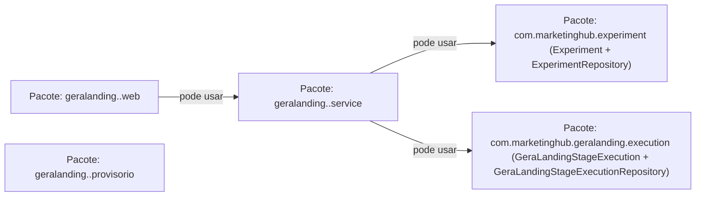
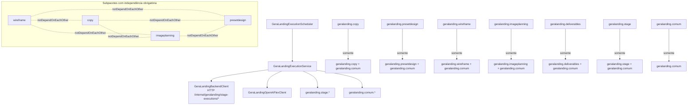

# Cânone de Arquitetura — GeraLanding (v1)

## Objetivo

Consolidar a arquitetura do GeraLanding com base nas regras automatizadas de ArchUnit, separando explicitamente os limites do **backend** e do **worker ai**.

## 1) Backend (ads-service / `com.marketinghub.geralanding`)

> Leitura do diagrama: cada caixa é um pacote. Só existe seta quando há dependência permitida. Sem seta = não pode usar diretamente.

Regras arquiteturais refletidas (ArchUnit):
- `GeraLandingStageExecutionService` não pode chamar assinaturas legadas dos assemblers de wireframe/copy/design preset.
- `GeraLandingStageExecutionService` deve chamar explicitamente as assinaturas canônicas dos assemblers.
- `WireframeProvisionalHtmlAssembler` deve residir em `geralanding.wireframe` e `DesignPresetProvisionalHtmlAssembler` em `geralanding.designpreset`.
- Serviços em `com.marketinghub.geralanding..service..` podem depender de classes do próprio pacote de serviço (mesma etapa) e de `Experiment`, `ExperimentRepository`, `GeraLandingStageExecution` e `GeraLandingStageExecutionRepository` no domínio `com.marketinghub`.
- `geralanding.*.web` só pode acessar `geralanding.*.web` e `geralanding.*.service` da mesma etapa.
- `geralanding.*.provisorio` só pode acessar `geralanding.*.provisorio` da mesma etapa.
- `geralanding.*.service` só pode acessar classes `com.marketinghub` permitidas: classes do próprio pacote `service` da etapa, `Experiment`, `ExperimentRepository`, `GeraLandingStageExecution` e `GeraLandingStageExecutionRepository`.

## 2) Worker AI (ai-worker / `com.marketinghub.worker.geralanding`)

Regras arquiteturais refletidas (ArchUnit):
- `geralanding..` não pode depender de `experimentpipeline..` (isolamento do pipeline legado).
- `wireframe`, `copy`, `imageplanning` e `presetdesign` devem ser independentes entre si.
- Cada subpacote funcional (`copy`, `presetdesign`, `stage`, `wireframe`, `deliverables`, `imageplanning`) só pode acessar o próprio pacote e `geralanding.comum` dentro de `com.marketinghub`.
- `geralanding.comum` só pode acessar o próprio pacote.

## 3) Regras de integração

- O **Worker AI não acessa banco**; toda leitura/gravação de estado da execução passa pelo backend GeraLanding.
- O backend concentra regras de contrato, montagem de HTML provisório/final e publicação.
- O worker ai concentra orquestração por etapa e integração com OpenAI, devolvendo resultados ao backend pelos endpoints do domínio GeraLanding.
