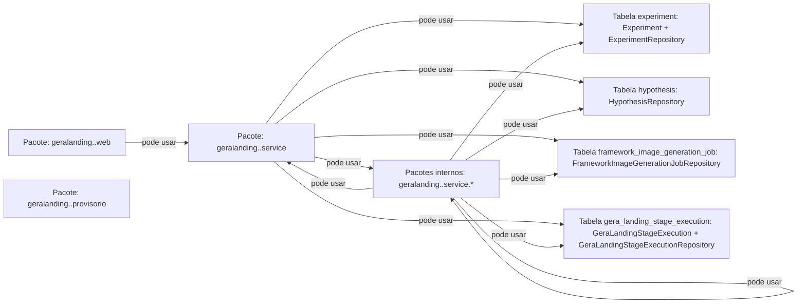
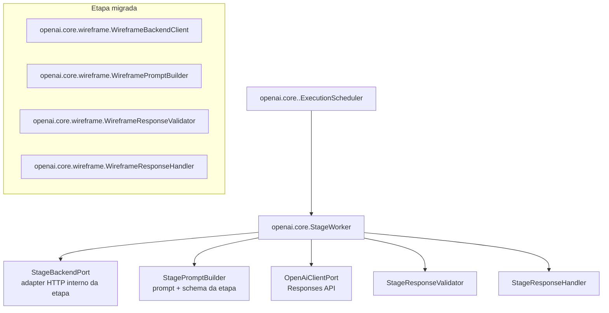

# Cânone de Arquitetura — GeraLanding (v1)

## Objetivo

Consolidar a arquitetura do GeraLanding com base nas regras automatizadas de ArchUnit, separando explicitamente os limites do **backend** e do **worker ai**.

## 1) Backend (ads-service / `com.marketinghub.geralanding`)

> Leitura do diagrama: cada caixa é um pacote. Só existe seta quando há dependência permitida. Sem seta = não pode usar diretamente.

Regras arquiteturais refletidas (ArchUnit):
- `GeraLandingStageExecutionService` não pode chamar assinaturas legadas dos assemblers de wireframe/copy/design preset.
- `GeraLandingStageExecutionService` deve chamar explicitamente as assinaturas canônicas dos assemblers.
- `WireframeProvisionalHtmlAssembler` deve residir em `geralanding.wireframe`, `DesignPresetProvisionalHtmlAssembler` deve residir em `geralanding.presetdesign.provisorio` para manter o montador provisório dentro da etapa preset design, e os endpoints/serviços backend da etapa devem residir em `geralanding.presetdesign` seguindo a estrutura canônica de `wireframe`.
- Serviços em `com.marketinghub.geralanding..service..` podem depender de classes da árvore interna de serviço da mesma etapa (`geralanding.<etapa>.service` e `geralanding.<etapa>.service.*`), de classes provisórias da mesma etapa (`geralanding.<etapa>.provisorio` e `geralanding.<etapa>.provisorio.*`), de `Experiment`, de `GeraLandingStageExecution`, do builder de `GeraLandingStageExecution` e somente dos repositories das quatro tabelas canônicas do GeraLanding: `ExperimentRepository` (`experiment`), `HypothesisRepository` (`hypothesis`), `FrameworkImageGenerationJobRepository` (`framework_image_generation_job`) e `GeraLandingStageExecutionRepository` (`gera_landing_stage_execution`).
- `geralanding.*.web` só pode acessar `geralanding.*.web` e `geralanding.*.service` da mesma etapa.
- Cada pacote direto `geralanding.<etapa>.web` de backend deve conter uma única classe canônica `Backend<Etapa>Controller`, anotada com `@RestController` e `@RequestMapping("/api")`.
- `geralanding.*.provisorio` só pode acessar `geralanding.*.provisorio` da mesma etapa.
- `geralanding.*.service` só pode acessar classes `com.marketinghub` permitidas: classes da árvore interna `service` da mesma etapa (`service` e `service.*`), classes da árvore `provisorio` da mesma etapa (`provisorio` e `provisorio.*`), `Experiment`, `GeraLandingStageExecution`, o builder de `GeraLandingStageExecution` e somente os repositories das tabelas `experiment`, `hypothesis`, `framework_image_generation_job` e `gera_landing_stage_execution`.
- Cada pacote direto `geralanding.<etapa>.service` de backend deve conter a classe canônica `Backend<Etapa>Service`, anotada com `@Service`.
- Cada pacote direto `geralanding.<etapa>.service` de backend deve possuir os subpacotes obrigatórios `detailStageExecution`, `listStageExecutions`, `pending`, `recebePrompt` e `recebeResposta`.
- Os subpacotes obrigatórios `detailStageExecution`, `listStageExecutions`, `pending`, `recebePrompt` e `recebeResposta` devem conter somente tipos Java declarados como `record`, preservando DTOs contratuais imutáveis para as bordas de cada etapa.

## Catálogo operacional de pipeline e modelo por etapa

- O catálogo administrativo de pipelines e etapas é persistido em `pipeline` e `pipeline_stage` e deve ser usado como fonte operacional para configurar a escolha padrão de modelo por etapa.
- Cada registro de `pipeline_stage` pode apontar para um modelo da tabela `openai_model` por meio de `openai_model_id`; quando o campo estiver nulo, a etapa deve manter o fallback técnico já definido no executor/worker correspondente.
- Para o GeraLanding, a configuração de modelo por etapa deve priorizar a finalidade comercial da etapa e o foco em vendas, evitando parâmetros técnicos avançados na tela principal.
- A tela administrativa de pipelines deve exibir uma seleção simples de modelo OpenAI por etapa, usando os modelos cadastrados em `openai_model`.

## Quality Review visual

- A etapa `landing-page-quality-review` é o Quality Gate comercial final do GeraLanding e deve usar modelo com capacidade de visão da OpenAI como avaliador principal da experiência renderizada.
- O modelo da etapa deve ser configurado de forma dedicada em `qualityreview.worker.vision-model`, sem depender do `openai.model` global usado por etapas textuais; o padrão deve apontar para um modelo OpenAI multimodal com entrada de imagem.
- O backend deve disponibilizar o `htmlGeraLanding` final na fila da etapa; a renderização visual deve produzir screenshots desktop e mobile em browser/headless antes da chamada ao modelo, mantendo validações determinísticas apenas como pré-check técnico de HTML, renderização e ausência de metadados proibidos.
- O Worker AI deve processar a etapa pelo contrato canônico `pending` → `recebePrompt` → `recebeResposta`, renderizar o HTML final em browser/headless quando o backend ainda não trouxer screenshots prontos, publicar os screenshots e enviá-los como `input_image` da Responses API ao modelo de visão. O prompt textual deve incluir também o JSON da etapa `landing-page-wireframe`, o JSON da etapa `landing-page-design-preset` e o HTML final `htmlGeraLanding`, solicitando ao modelo uma avaliação objetiva do que ficou ruim nos arquivos enviados e a separação entre causa-raiz upstream e sintoma renderizado.
- A resposta da etapa deve permanecer estruturada com `score`, `targetAudienceSpecificity`, `blockingIssues`, `recommendedRegeneration` e `approvalRecommendation`, indicando explicitamente as etapas que precisam ser reexecutadas.
- O prompt da etapa deve calibrar o `score` por faixas comerciais, registrar `blockingIssues` específicos e acionáveis com causa-raiz/impacto/correção, e recomendar somente as etapas de regeneração que atacam a causa-raiz. Problemas de CTA/link quebrado, layout renderizado errado, metadado técnico visível, título provisório ou classes não aplicadas devem apontar `LANDING_PAGE_HTML`; quando a causa envolver tokens, classes, contraste, espaçamento, hierarquia visual ou aparência premium, também deve apontar `LANDING_PAGE_DESIGN_PRESET`. `LANDING_PAGE_COPY` deve ser recomendado apenas quando o texto em si estiver fraco, contraditório ou pouco específico.
- Feedbacks recorrentes do Quality Review devem retroalimentar os prompts upstream: wireframe deve estruturar hero, CTAs, prova visual e formulário para permitir execução premium; copy deve manter coerência entre promessa, CTA e dados realmente coletados; design preset deve materializar botões, formulário, navegação, responsividade e título publicável sem aparência de wireframe ou marcador técnico. O assembler de HTML final deve bloquear título/metadado técnico provisório mesmo que um artefato anterior tente carregá-lo.
- Cada execução do Quality Review deve persistir auditoria técnica da evidência avaliada em `gera_landing_stage_execution.quality_review_audit`, incluindo hash SHA-256 do HTML renderizado, tamanho do HTML, hashes/bytes/URLs dos screenshots mobile/desktop, hash do prompt/request, versão operacional do prompt/schema, modelo de visão e `imageDetail`. Quando uma execução reutilizar a mesma evidência visual de execução anterior, a auditoria deve sinalizar `evidenceReuseDetected`; se a recomendação de publicação divergir para a mesma evidência, deve sinalizar `contradictoryDecisionDetected` e expor aviso para revisão humana antes de usar o score como critério de publicação.

## 2) Worker AI — núcleo OpenAI (`ai-worker / com.marketinghub.worker.openai.core`)

Regras arquiteturais refletidas (ArchUnit):
- Todas as etapas do Worker AI associadas à geração de landing devem usar exclusivamente pacotes de etapa em `com.marketinghub.worker.openai.core.<etapa>`; não há arquitetura canônica ativa no antigo namespace Java de landing do Worker AI, e esse namespace não deve ser recriado para novas etapas.
- O core genérico (`openai.core`, `openai.core.model`, `openai.core.port`, `openai.core.prompt` e `openai.core.exception`) não pode depender de etapas concretas.
- Cada etapa concreta dentro de `openai.core.<etapa>` deve ser configurada por `*WorkerConfiguration`, `*WorkerProperties`, adapters de port e beans declarados explicitamente; não deve usar `@Component`/`@Service` soltos fora da configuração da etapa.
- Chamadas OpenAI devem passar pelo `OpenAiClientPort` e pelo client do core para preservar logs de request cru, resposta crua e correlação com `jobId` do Marketing Hub.
- Etapas novas, migradas ou remanescentes devem entrar diretamente no padrão `openai.core.<etapa>`, mantendo contratos HTTP do backend por etapa.
- O antigo namespace Java de landing do Worker AI é legado e não faz parte da arquitetura canônica do Worker AI; referências a esse namespace devem ser tratadas como débito de migração, não como modelo para implementação.

## 3) Contrato HTTP canônico

- O Swagger/OpenAPI canônico dos endpoints HTTP do backend GeraLanding por etapa fica em `docs/swagger/geralanding-backend-swagger.v1.yaml`.
- Qualquer criação, remoção ou mudança de endpoint em `com.marketinghub.geralanding.*.web` deve manter esse Swagger sincronizado no mesmo PR.

## 4) Regras de integração

- A progressão automática do backend deve preservar o encadeamento operacional do GeraLanding: ao concluir com sucesso `landing-page-wireframe`, o backend enfileira automaticamente `landing-page-copy`; ao concluir com sucesso `landing-page-copy`, o backend enfileira automaticamente `landing-page-image-planning`; ao concluir com sucesso `landing-page-image-planning`, o backend enfileira automaticamente `landing-page-image-generation`. Falhas ou callbacks com erro não devem iniciar a próxima etapa.
- O **Worker AI não acessa banco**; toda leitura/gravação de estado da execução passa pelo backend GeraLanding.
- O polling e os callbacks internos consumidos pelo Worker AI devem usar adapters específicos por etapa dentro de `openai.core.<etapa>`; cada adapter chama somente os endpoints HTTP do backend correspondentes à sua etapa.
- Ajustes no Worker AI não devem criar controller interno genérico no backend para atender todas as etapas do GeraLanding.
- O backend concentra regras de contrato, montagem de HTML provisório/final e publicação.
- O worker ai concentra orquestração por etapa e integração com OpenAI, devolvendo resultados ao backend pelos endpoints do domínio GeraLanding.
