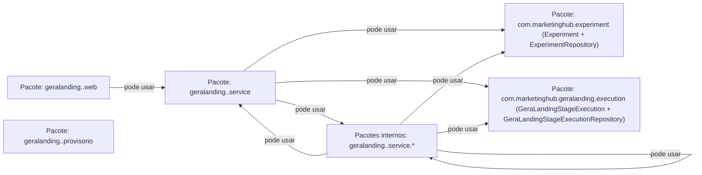
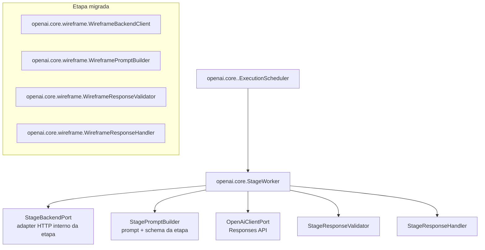

# Cânone de Arquitetura — GeraLanding (v1)

## Objetivo

Consolidar a arquitetura do GeraLanding com base nas regras automatizadas de ArchUnit, separando explicitamente os limites do **backend** e do **worker ai**.

## 1) Backend (ads-service / `com.marketinghub.geralanding`)

> Leitura do diagrama: cada caixa é um pacote. Só existe seta quando há dependência permitida. Sem seta = não pode usar diretamente.

Regras arquiteturais refletidas (ArchUnit):
- `GeraLandingStageExecutionService` não pode chamar assinaturas legadas dos assemblers de wireframe/copy/design preset.
- `GeraLandingStageExecutionService` deve chamar explicitamente as assinaturas canônicas dos assemblers.
- `WireframeProvisionalHtmlAssembler` deve residir em `geralanding.wireframe`, `DesignPresetProvisionalHtmlAssembler` deve residir em `geralanding.presetdesign.provisorio` para manter o montador provisório dentro da etapa preset design, e os endpoints/serviços backend da etapa devem residir em `geralanding.presetdesign` seguindo a estrutura canônica de `wireframe`.
- Serviços em `com.marketinghub.geralanding..service..` podem depender de classes da árvore interna de serviço da mesma etapa (`geralanding.<etapa>.service` e `geralanding.<etapa>.service.*`), de classes provisórias da mesma etapa (`geralanding.<etapa>.provisorio` e `geralanding.<etapa>.provisorio.*`) e de `Experiment`, `ExperimentRepository`, `GeraLandingStageExecution`, `GeraLandingStageExecutionRepository` e do builder de `GeraLandingStageExecution` no domínio `com.marketinghub`.
- `geralanding.*.web` só pode acessar `geralanding.*.web` e `geralanding.*.service` da mesma etapa.
- Cada pacote direto `geralanding.<etapa>.web` de backend deve conter uma única classe canônica `Backend<Etapa>Controller`, anotada com `@RestController` e `@RequestMapping("/api")`.
- `geralanding.*.provisorio` só pode acessar `geralanding.*.provisorio` da mesma etapa.
- `geralanding.*.service` só pode acessar classes `com.marketinghub` permitidas: classes da árvore interna `service` da mesma etapa (`service` e `service.*`), classes da árvore `provisorio` da mesma etapa (`provisorio` e `provisorio.*`), `Experiment`, `ExperimentRepository`, `GeraLandingStageExecution`, `GeraLandingStageExecutionRepository` e o builder de `GeraLandingStageExecution`.
- Cada pacote direto `geralanding.<etapa>.service` de backend deve conter a classe canônica `Backend<Etapa>Service`, anotada com `@Service`.
- Cada pacote direto `geralanding.<etapa>.service` de backend deve possuir os subpacotes obrigatórios `detailStageExecution`, `listStageExecutions`, `pending`, `recebePrompt` e `recebeResposta`.
- Os subpacotes obrigatórios `detailStageExecution`, `listStageExecutions`, `pending`, `recebePrompt` e `recebeResposta` devem conter somente tipos Java declarados como `record`, preservando DTOs contratuais imutáveis para as bordas de cada etapa.

## Quality Review visual

- A etapa `landing-page-quality-review` é o Quality Gate comercial final do GeraLanding e deve usar modelo de visão da OpenAI como avaliador principal da experiência renderizada.
- O backend deve produzir ou disponibilizar screenshots desktop e mobile da landing após a montagem do `htmlGeraLanding`, mantendo validações determinísticas apenas como pré-check técnico de HTML, renderização e ausência de metadados proibidos.
- O Worker AI deve processar a etapa pelo contrato canônico `pending` → `recebePrompt` → `recebeResposta`, enviando ao modelo de visão os screenshots e contexto textual mínimo dos artefatos canônicos para avaliar Dor → Resultado → Mecanismo → Prova → Oferta.
- A resposta da etapa deve permanecer estruturada com `score`, `targetAudienceSpecificity`, `blockingIssues`, `recommendedRegeneration` e `approvalRecommendation`, indicando explicitamente as etapas que precisam ser reexecutadas.

## 2) Worker AI — núcleo OpenAI (`ai-worker / com.marketinghub.worker.openai.core`)

Regras arquiteturais refletidas (ArchUnit):
- Todas as etapas do Worker AI associadas à geração de landing devem usar exclusivamente pacotes de etapa em `com.marketinghub.worker.openai.core.<etapa>`; não há arquitetura canônica ativa no antigo namespace Java de landing do Worker AI, e esse namespace não deve ser recriado para novas etapas.
- O core genérico (`openai.core`, `openai.core.model`, `openai.core.port`, `openai.core.prompt` e `openai.core.exception`) não pode depender de etapas concretas.
- Cada etapa concreta dentro de `openai.core.<etapa>` deve ser configurada por `*WorkerConfiguration`, `*WorkerProperties`, adapters de port e beans declarados explicitamente; não deve usar `@Component`/`@Service` soltos fora da configuração da etapa.
- Chamadas OpenAI devem passar pelo `OpenAiClientPort` e pelo client do core para preservar logs de request cru, resposta crua e correlação com `jobId` do Marketing Hub.
- Etapas novas, migradas ou remanescentes devem entrar diretamente no padrão `openai.core.<etapa>`, mantendo contratos HTTP do backend por etapa.
- O antigo namespace Java de landing do Worker AI é legado e não faz parte da arquitetura canônica do Worker AI; referências a esse namespace devem ser tratadas como débito de migração, não como modelo para implementação.

## 3) Contrato HTTP canônico

- O Swagger/OpenAPI canônico dos endpoints HTTP do backend GeraLanding por etapa fica em `docs/swagger/geralanding-backend-swagger.v1.yaml`.
- Qualquer criação, remoção ou mudança de endpoint em `com.marketinghub.geralanding.*.web` deve manter esse Swagger sincronizado no mesmo PR.

## 4) Regras de integração

- O **Worker AI não acessa banco**; toda leitura/gravação de estado da execução passa pelo backend GeraLanding.
- O polling e os callbacks internos consumidos pelo Worker AI devem usar adapters específicos por etapa dentro de `openai.core.<etapa>`; cada adapter chama somente os endpoints HTTP do backend correspondentes à sua etapa.
- Ajustes no Worker AI não devem criar controller interno genérico no backend para atender todas as etapas do GeraLanding.
- O backend concentra regras de contrato, montagem de HTML provisório/final e publicação.
- O worker ai concentra orquestração por etapa e integração com OpenAI, devolvendo resultados ao backend pelos endpoints do domínio GeraLanding.
