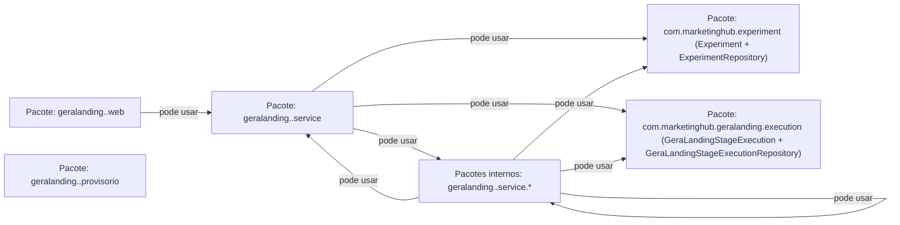
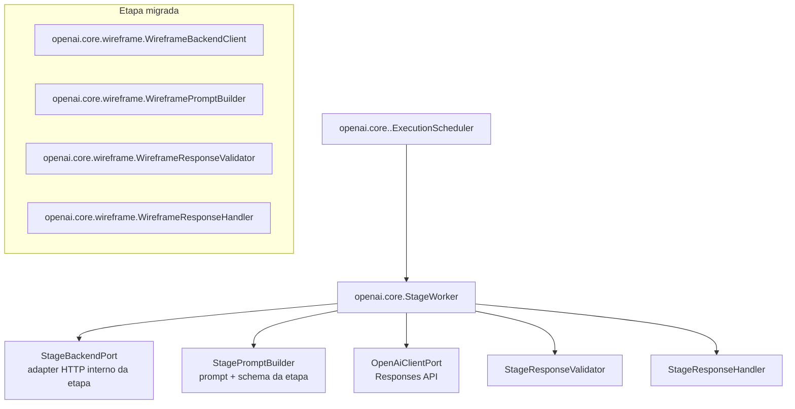
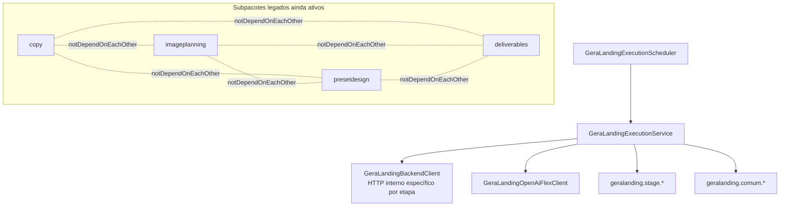

# Cânone de Arquitetura — GeraLanding (v1)

## Objetivo

Consolidar a arquitetura do GeraLanding com base nas regras automatizadas de ArchUnit, separando explicitamente os limites do **backend** e do **worker ai**.

## 1) Backend (ads-service / `com.marketinghub.geralanding`)

> Leitura do diagrama: cada caixa é um pacote. Só existe seta quando há dependência permitida. Sem seta = não pode usar diretamente.

Regras arquiteturais refletidas (ArchUnit):
- `GeraLandingStageExecutionService` não pode chamar assinaturas legadas dos assemblers de wireframe/copy/design preset.
- `GeraLandingStageExecutionService` deve chamar explicitamente as assinaturas canônicas dos assemblers.
- `WireframeProvisionalHtmlAssembler` deve residir em `geralanding.wireframe`, `DesignPresetProvisionalHtmlAssembler` permanece em `geralanding.designpreset` para compatibilidade do montador visual, e os endpoints/serviços backend da etapa devem residir em `geralanding.presetdesign` seguindo a estrutura canônica de `wireframe`.
- Serviços em `com.marketinghub.geralanding..service..` podem depender de classes da árvore interna de serviço da mesma etapa (`geralanding.<etapa>.service` e `geralanding.<etapa>.service.*`) e de `Experiment`, `ExperimentRepository`, `GeraLandingStageExecution`, `GeraLandingStageExecutionRepository` e do builder de `GeraLandingStageExecution` no domínio `com.marketinghub`.
- `geralanding.*.web` só pode acessar `geralanding.*.web` e `geralanding.*.service` da mesma etapa.
- Cada pacote direto `geralanding.<etapa>.web` de backend deve conter uma única classe canônica `Backend<Etapa>Controller`, anotada com `@RestController` e `@RequestMapping("/api")`.
- `geralanding.*.provisorio` só pode acessar `geralanding.*.provisorio` da mesma etapa.
- `geralanding.*.service` só pode acessar classes `com.marketinghub` permitidas: classes da árvore interna `service` da mesma etapa (`service` e `service.*`), `Experiment`, `ExperimentRepository`, `GeraLandingStageExecution`, `GeraLandingStageExecutionRepository` e o builder de `GeraLandingStageExecution`.
- Cada pacote direto `geralanding.<etapa>.service` de backend deve conter a classe canônica `Backend<Etapa>Service`, anotada com `@Service`.
- Cada pacote direto `geralanding.<etapa>.service` de backend deve possuir os subpacotes obrigatórios `detailStageExecution`, `listStageExecutions`, `pending`, `recebePrompt` e `recebeResposta`.
- Os subpacotes obrigatórios `detailStageExecution`, `listStageExecutions`, `pending`, `recebePrompt` e `recebeResposta` devem conter somente tipos Java declarados como `record`, preservando DTOs contratuais imutáveis para as bordas de cada etapa.

## 2) Worker AI — núcleo OpenAI (`ai-worker / com.marketinghub.worker.openai.core`)

Regras arquiteturais refletidas (ArchUnit):
- A etapa `landing-page-wireframe` do Worker AI usa exclusivamente `com.marketinghub.worker.openai.core.wireframe`; o pacote legado `com.marketinghub.worker.geralanding.wireframe` está desativado e não deve ser recriado.
- O core genérico (`openai.core`, `openai.core.model`, `openai.core.port`, `openai.core.prompt` e `openai.core.exception`) não pode depender de etapas concretas.
- Cada etapa concreta dentro de `openai.core.<etapa>` deve ser configurada por `*WorkerConfiguration`, `*WorkerProperties`, adapters de port e beans declarados explicitamente; não deve usar `@Component`/`@Service` soltos fora da configuração da etapa.
- Chamadas OpenAI devem passar pelo `OpenAiClientPort` e pelo client do core para preservar logs de request cru, resposta crua e correlação com `jobId` do Marketing Hub.
- As próximas etapas do GeraLanding (`copy`, `imageplanning`, `presetdesign`, `deliverables` e etapas futuras) devem migrar gradualmente para o mesmo padrão `openai.core.<etapa>`, mantendo contratos do backend por etapa.

## 2.1) Worker AI legado ainda não migrado (`ai-worker / com.marketinghub.worker.geralanding`)

Regras arquiteturais refletidas (ArchUnit):
- `geralanding..` não pode depender de `experimentpipeline..` (isolamento do pipeline legado).
- `copy`, `imageplanning`, `presetdesign` e `deliverables` devem permanecer independentes entre si até migrarem para `openai.core`.
- Cada subpacote funcional legado (`copy`, `presetdesign`, `stage`, `deliverables`, `imageplanning`) só pode acessar o próprio pacote e `geralanding.comum` dentro de `com.marketinghub`.
- `geralanding.comum` só pode acessar o próprio pacote.

## 3) Contrato HTTP canônico

- O Swagger/OpenAPI canônico dos endpoints HTTP do backend GeraLanding por etapa fica em `docs/canonical/geralanding-backend-swagger.v1.yaml`.
- Qualquer criação, remoção ou mudança de endpoint em `com.marketinghub.geralanding.*.web` deve manter esse Swagger sincronizado no mesmo PR.

## 4) Regras de integração

- O **Worker AI não acessa banco**; toda leitura/gravação de estado da execução passa pelo backend GeraLanding.
- O polling e os callbacks internos do GeraLanding no Worker AI devem consumir endpoints específicos por etapa: a etapa wireframe faz isso via `openai.core.wireframe.WireframeBackendClient`, e as etapas ainda legadas usam seus adapters atuais para `/api/internal/geralanding/copy/stage-executions/*`, `/api/internal/geralanding/image-prompts/stage-executions/*`, `/api/internal/geralanding/design-preset/stage-executions/*` e `/api/internal/geralanding/deliverables/stage-executions/*`.
- Ajustes no Worker AI não devem criar controller interno genérico no backend para atender todas as etapas do GeraLanding.
- O backend concentra regras de contrato, montagem de HTML provisório/final e publicação.
- O worker ai concentra orquestração por etapa e integração com OpenAI, devolvendo resultados ao backend pelos endpoints do domínio GeraLanding.
