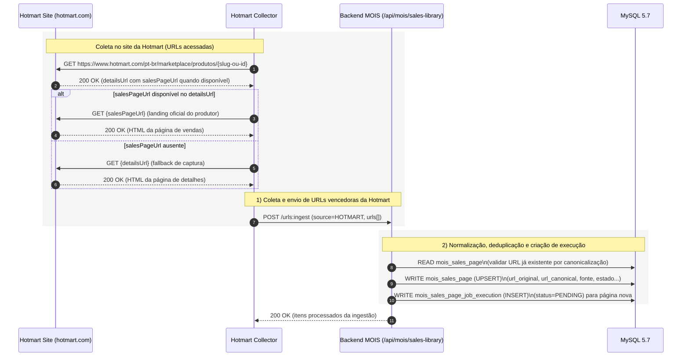
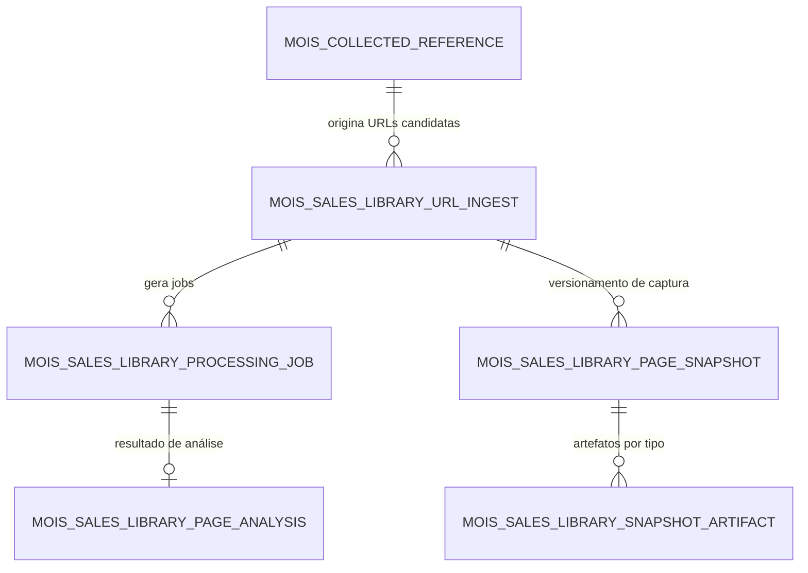
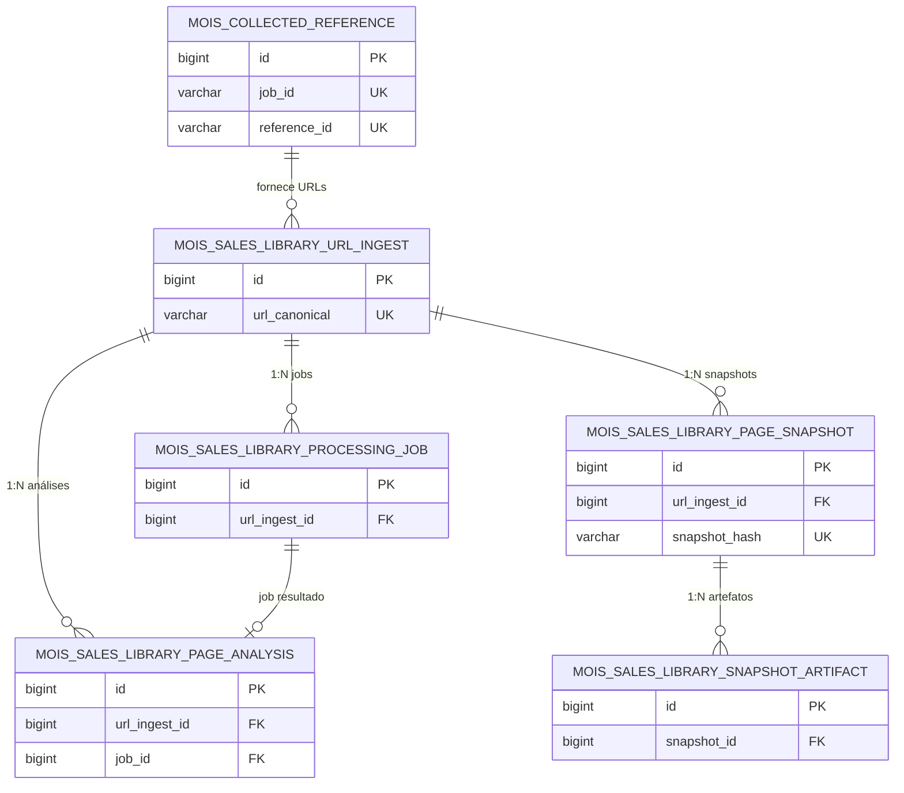
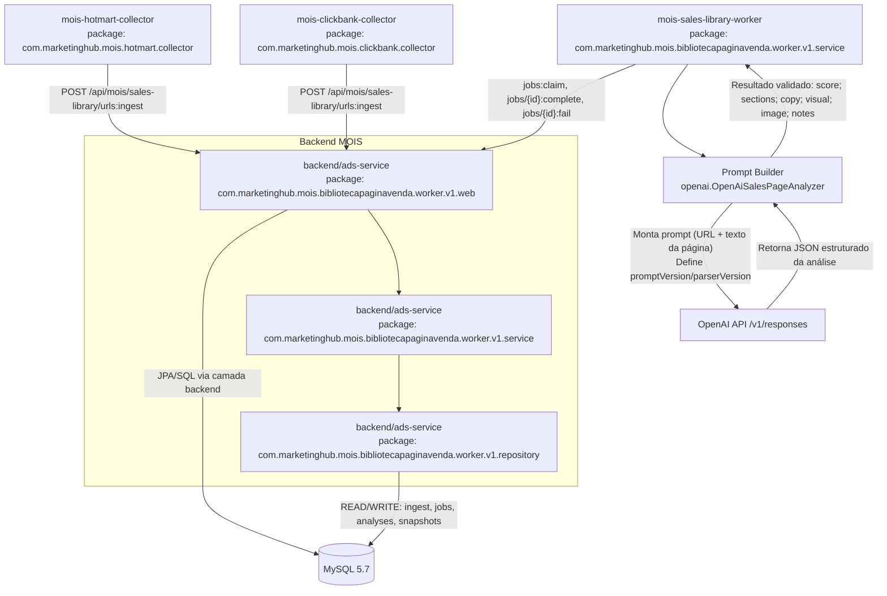
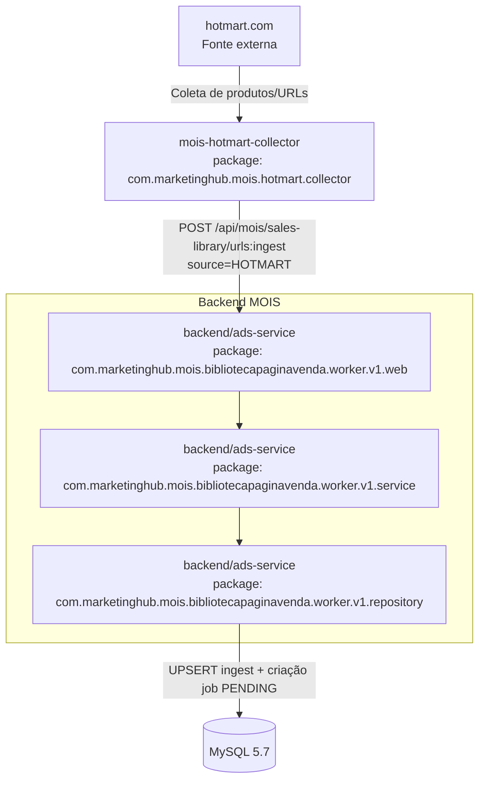
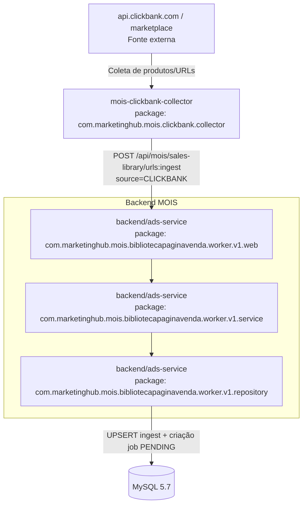

# Cânone Unificado — MOIS Worker (v1)

## 1. Objetivo
Definir, em um único documento canônico, as regras operacionais do worker do módulo MOIS com base no código implementado, incluindo ciclo de processamento, contratos de integração com backend e parâmetros de OpenAI.

## 2. Fonte de verdade
Este documento foi consolidado usando como referência principal o código dos módulos:
- `mois-sales-library-worker/src/main/java/com/marketinghub/mois/bibliotecapaginavenda/worker/v1/service/PipelineRunner.java`
- `mois-sales-library-worker/src/main/java/com/marketinghub/mois/bibliotecapaginavenda/worker/v1/config/WorkerProperties.java`
- `mois-sales-library-worker/src/main/resources/application.yml`

## 3. Escopo operacional do worker
O worker processa de forma assíncrona jobs `PENDING` da biblioteca de páginas de vendas do MOIS, executando:
1. claim de job no backend;
2. coleta do conteúdo textual da URL canônica da página;
3. análise com OpenAI;
4. conclusão do job com payload estruturado de análise;
5. marcação de falha em caso de erro.

## 4. Fluxo canônico
1. Worker chama `POST /api/mois/sales-library/jobs:claim` com `workspaceId` e `source`.
2. Backend retorna job e promove estado para `FETCHING`.
3. Worker baixa o HTML da `urlCanonical` (via Jsoup) e extrai texto principal (`body.text()`).
4. Worker chama analisador OpenAI (`OpenAiSalesPageAnalyzer`).
5. Em sucesso, worker chama `POST /api/mois/sales-library/jobs/{jobId}:complete` com:
   - `scoreTotal`
   - `sectionsJson`
   - `copyJson`
   - `visualJson`
   - `imageJson`
   - `analysisNotes`
   - `parserVersion`
   - `promptVersion`
   - `modelName`
   - `requestPayloadJson`
   - `processedAt`
6. Em falha, worker chama `POST /api/mois/sales-library/jobs/{jobId}:fail` com categoria `PIPELINE_ERROR` e mensagem de erro.

## 5. Contrato mínimo de saída de análise
- `score_total`: pontuação comercial agregada;
- `sections_json`: estrutura das seções da página;
- `copy_json`: sinais de copywriting;
- `visual_json`: sinais visuais relevantes;
- `image_json`: dados de imagem relevantes;
- `analysis_notes`: observações adicionais;
- `request_payload_json`: payload literal enviado ao modelo (JSONL da requisição batch) para auditoria;
- `parser_version`, `prompt_version`, `model_name`: rastreabilidade técnica.

## 6. Regras de fonte (source)
O worker seleciona a fonte por ciclo com a seguinte ordem canônica:
1. Se `MOIS_SOURCES` estiver definido (CSV), usar rotação cíclica (`round-robin`) entre as fontes normalizadas em maiúsculas, removendo duplicatas e valores vazios.
2. Se `MOIS_SOURCES` estiver vazio, usar `MOIS_SOURCE` (fallback).

## 7. Configuração canônica do worker (application.yml)
### 7.1 Worker
- `worker.backend-base-url` → `${BACKEND_BASE_URL:http://191.252.181.168:8000}`
- `worker.workspace-id` → `${MOIS_WORKSPACE_ID:workspace-001}`
- `worker.source` → `${MOIS_SOURCE:CLICKBANK}`
- `worker.sources` → `${MOIS_SOURCES:}`
- `worker.poll-interval-ms` → `${MOIS_POLL_INTERVAL_MS:15000}`
- `worker.request-timeout-ms` → `${MOIS_REQUEST_TIMEOUT_MS:30000}`

### 7.2 OpenAI
- `openai.model` → `${OPENAI_MODEL:gpt-5.2}`
- `openai.batch-poll-interval-ms` → `${OPENAI_BATCH_POLL_INTERVAL_MS:2000}`
- `openai.batch-timeout-ms` → `${OPENAI_BATCH_TIMEOUT_MS:1800000}`
- Para payload de `/v1/responses`, o formato estruturado deve usar `text.format` (não usar `response_format`).

## 8. Regra canônica de timeout OpenAI Batch (MOIS Worker)
Para integrações batch com OpenAI no contexto do MOIS Worker, o timeout canônico é de **30 minutos** (`1800000 ms` / `PT30M`), e não deve ser reduzido sem versionamento explícito deste cânone.

## 8.1 Taxonomia canônica de status (monitoramento de fetching)
Para acompanhamento operacional na tela de Biblioteca de Páginas de Vendas, o status de job deve refletir a etapa real do pipeline e permitir diagnóstico de causa-raiz sem depender apenas de `errorMessage`.

### 8.1.1 Estados canônicos (v1.1 planejado)
1. `PENDING`
   - Job criado e aguardando claim pelo worker.
2. `FETCHING`
   - Worker em coleta/parsing da página de origem.
3. `ANALYZING`
   - Conteúdo já coletado e enviado para processamento OpenAI (batch em andamento).
4. `RETRY_WAIT`
   - Falha transitória detectada; job aguardando nova tentativa automática.
5. `DONE`
   - Análise concluída e persistida com sucesso.
6. `FAILED`
   - Falha terminal após esgotar tentativas ou erro não recuperável de contrato/integração.

### 8.1.2 Regras mínimas de exibição na UI
- Exibir badge por status e tooltip com definição operacional curta.
- Exibir coluna `Último evento` com motivo objetivo da etapa atual (ex.: `batch.status=running`, `connect timeout`, `output_file_id ausente`).
- Exibir coluna `Tempo em etapa` (`agora - updatedAt`) para detectar stuck jobs em `FETCHING`/`ANALYZING`.
- Exibir `Tentativas` + `Próxima tentativa em` quando status for `RETRY_WAIT`.
- Exibir CTA de diagnóstico (link para detalhe do job) quando status for `FAILED`.

### 8.1.3 Critérios de transição
- `PENDING -> FETCHING`: claim confirmado pelo backend.
- `FETCHING -> ANALYZING`: coleta concluída e requisição batch enviada com sucesso.
- `ANALYZING -> DONE`: output válido persistido em `:complete`.
- `ANALYZING -> RETRY_WAIT`: timeout/intermitência recuperável com orçamento de retry restante.
- `FETCHING|ANALYZING|RETRY_WAIT -> FAILED`: erro terminal de contrato, parsing irrecuperável ou retries esgotados.

## 9. Restrições e conformidade
- O worker **não acessa banco diretamente**; todo tráfego de dados passa pelo backend principal.
- Transições de estado devem ocorrer exclusivamente pelos endpoints do backend MOIS.
- Falhas devem ser registradas com contexto e stack trace para diagnóstico de causa-raiz.
- Erros de contrato/integração OpenAI retornados no output do batch (ex.: `response.status_code >= 400` com `response.body.error`) são falhas terminais e devem:
  1. obter e processar também o arquivo `error_file_id` (JSONL) do batch para diagnóstico completo da causa-raiz;
  2. converter os detalhes relevantes do erro em mensagem legível com `status`, `requestId`, `type`, `code` e `message`;
  3. enviar a falha ao endpoint `jobs/{jobId}:fail` para persistência;
  4. manter os detalhes disponíveis para exibição ao usuário na tela de jobs (`errorMessage`).

## 10. Substituição documental
Este documento é o único cânone ativo para o worker do MOIS.

## 11. Referências normativas
- `docs/canonical/system-governance-canon.v2.md`
- `docs/canonical/modelo-canonico-artefatos-pipeline-experimento.md`
- `docs/canonical/experiments-automation-flow-canon.v1.md`

## 12. Fluxo canônico de alimentação da biblioteca de páginas de vendas

Esta seção consolida o fluxo ponta a ponta de **alimentação da biblioteca** (coleta de URLs de produtos vencedores, análise com OpenAI e persistência dos resultados) para remover ambiguidades operacionais entre coletores, backend e worker.

### 12.1 Etapas macro (visão executiva)
1. **Ingestão de produtos de sucesso (fontes de mercado)**
   - **Hotmart collector** seleciona produtos elegíveis, prioriza `salesPageUrl` com fallback em `detailsUrl` e envia para `POST /api/mois/sales-library/urls:ingest`.
   - **ClickBank collector** aplica o mesmo padrão: prioriza `salesPageUrl`, usa fallback quando necessário e envia para o mesmo endpoint de ingestão.
2. **URL fica disponível na biblioteca**
   - O backend normaliza/canonicaliza URL, faz upsert em `mois_sales_page` e, para páginas novas, cria execução `PENDING` em `mois_sales_page_job_execution`.
3. **Rotina que obtém conteúdo da página e envia para análise**
   - O worker faz `claim` (`jobs:claim`), muda job para `FETCHING`, baixa HTML da `urlCanonical`, extrai texto (`body.text()`) e inicia análise OpenAI.
4. **Prompt + schema de saída usados no worker**
   - O worker monta o prompt com `urlCanonical` + texto extraído (`body.text()`) e versão de parser/prompt para rastreabilidade da análise.
   - O worker envia instrução para análise comercial e exige resposta em JSON via `/v1/responses` com `text.format.type=json_object`.
   - Campos obrigatórios esperados no JSON de saída: `score_total`, `sections_json`, `copy_json`, `visual_json`, `image_json`, `analysis_notes`.
5. **Receber resultado OpenAI e persistir no banco**
   - Em sucesso: worker chama `jobs/{jobId}:complete`; backend atualiza `mois_sales_page_job_execution` e consolida `mois_sales_page` como `DONE`.
   - Em falha: worker chama `jobs/{jobId}:fail`; backend marca a execução e o estado consolidado da página como `FAILED` com categoria/mensagem para diagnóstico.

### 12.2 Diagrama (sequência ponta a ponta)

### 12.2.1 Diagrama de sequência focado no coletor Hotmart

### 12.2.2 Tabelas lidas e gravadas por etapa do fluxo

| Etapa | Leitura (READ) | Gravação (WRITE) |
|---|---|---|
| Ingestão (`/urls:ingest`) | `mois_sales_page` (deduplicação/canonicalização) | `mois_sales_page` (upsert), `mois_sales_page_job_execution` (insert `PENDING` para página nova) |
| Claim (`/jobs:claim`) | `mois_sales_page_job_execution` + `mois_sales_page` | `mois_sales_page_job_execution` (update `FETCHING`), `mois_sales_page` (estado atual) |
| Complete (`/jobs/{jobId}:complete`) | `mois_sales_page_job_execution` (validar execução vigente) | `mois_sales_page_job_execution` (update `DONE`), `mois_sales_page` (estado atual/score) |
| Fail (`/jobs/{jobId}:fail`) | `mois_sales_page_job_execution` (validar execução vigente) | `mois_sales_page_job_execution` + `mois_sales_page` (update `FAILED`) |

### 12.3 Contratos e tabelas de persistência (referência rápida)
- **Endpoint de ingestão**: `POST /api/mois/sales-library/urls:ingest`.
- **Endpoint de claim**: `POST /api/mois/sales-library/jobs:claim`.
- **Endpoint de conclusão**: `POST /api/mois/sales-library/jobs/{jobId}:complete`.
- **Endpoint de falha**: `POST /api/mois/sales-library/jobs/{jobId}:fail`.
- **Tabela operacional de páginas**: `mois_sales_page`.
- **Tabela operacional de execuções**: `mois_sales_page_job_execution`.
- **Resultado de análise atual/histórico**: `mois_sales_page_job_execution` + campos consolidados em `mois_sales_page`.

### 12.4 Regra operacional para evitar divergência de leitura
Quando houver dúvida sobre “onde o fluxo começa”, considerar canonicamente que a alimentação da biblioteca inicia nos coletores (Hotmart/ClickBank), passa obrigatoriamente pelo endpoint `/urls:ingest` no backend e só então entra no ciclo assíncrono do worker.

### 12.4 Ações manuais de status no detalhe da análise (2026-05-21)
- A tela de detalhe (`/mois/sales-pages-library/{pageId}`) passa a expor comandos operacionais manuais para acelerar triagem:
  - `Voltar para pendente`: cria novo ciclo de processamento para a página, persistindo status `PENDING`.
  - `Marcar como anulado`: registra status `ANULADO` para itens que não serão mais utilizados no funil.
- Contrato backend oficial: `POST /api/mois/sales-library/pages/{pageId}:status` com payload `{ "status": "PENDING" | "ANULADO", "reason"?: string }`.
- A interface de detalhe também deve exibir navegação sequencial com botão `Próximo →` para avançar ao próximo item da lista local.

## 13. Seção de Dados — Modelo compartilhado (Coletores Hotmart/ClickBank + Biblioteca de Páginas)

Esta seção define o **modelo de dados canônico mínimo** que conecta a coleta de produtos vencedores (Hotmart/ClickBank) com a operação da Biblioteca de Páginas de Vendas.

### 13.1 Visão relacional (macro)

### 13.2 Tabelas usadas pelos coletores (Hotmart e ClickBank)

#### 13.2.1 `mois_collected_reference`
- **Papel no fluxo**: persistir referências coletadas dos marketplaces com sinais de sucesso comercial, servindo de base para seleção de URLs de página de vendas.
- **Origem principal**: endpoints de persistência do MOIS alimentados pelos coletores Hotmart/ClickBank.
- **Campos funcionais de destaque**:
  - identificação e rastreio: `id`, `workspace_id`, `source`, `job_id`, `reference_id`;
  - dados do produto: `product_name`, `product_url`, `sales_page_url`, `details_url`, `cover_image_url`;
  - sinais de priorização: `success_score`, `temperature`, `hotmart_price`, `hotmart_currency`, `hotmart_highlights_json`;
  - auditoria: `collected_at`, `created_at`, `updated_at`.
- **Índices canônicos de operação**:
  - unicidade por referência coletada no job (`job_id`, `reference_id`);
  - busca por workspace/fonte (`workspace_id`, `source`);
  - ordenação por score (`workspace_id`, `success_score`).

### 13.3 Tabelas usadas no projeto da Biblioteca de Páginas de Vendas

#### 13.3.1 `mois_sales_page`
- **Papel no fluxo**: fonte operacional principal do estado atual da página de venda.
- **Função operacional**: deduplicar URLs, manter metadados de origem, status atual, captura atual, score e último erro.
- **Campos de destaque**: `id`, `workspace_id`, `source`, `source_job_id`, `source_reference_id`, `collected_reference_id`, `url_original`, `url_canonical`, `url_final`, `current_stage`, `current_status`, `capture_status`, `analysis_status`, `html_sha256`, `html_bytes`, `score_total`, `last_job_execution_id`, `created_at`, `updated_at`.

#### 13.3.2 `mois_sales_page_job_execution`
- **Papel no fluxo**: histórico/auditoria de cada execução operacional sobre uma página.
- **Função operacional**: registrar ciclos de ingestão, captura, análise, reanálise e atualização manual com payloads técnicos, HTML bruto, scores e erros.
- **Campos de destaque**: `id`, `sales_page_id`, `workspace_id`, `job_type`, `stage`, `status`, `attempt`, `input_url`, `final_url`, `raw_html`, `raw_html_sha256`, `raw_html_bytes`, `score_total`, `sections_json`, `request_payload_json`, `response_payload_json`, `error_category`, `error_message`, `started_at`, `finished_at`, `created_at`, `updated_at`.

#### 13.3.3 Tabelas legadas de auditoria
- **Papel no fluxo**: `mois_sales_library_url_ingest`, `mois_sales_library_processing_job` e `mois_sales_library_page_analysis` permanecem disponíveis para leitura histórica, mas não são fonte de verdade operacional após a Fase 5.
- **Função operacional**: nenhuma escrita principal nova deve depender dessas tabelas; novos comandos devem gravar em `mois_sales_page` e `mois_sales_page_job_execution`.

#### 13.3.4 `mois_sales_library_page_snapshot`
- **Papel no fluxo**: guardar snapshots/versionamento da página capturada para comparação temporal.
- **Função operacional**: registrar mudanças de conteúdo entre capturas e apoiar trilha de auditoria.
- **Campos de destaque**: `id`, `url_ingest_id`, `snapshot_hash`, `status`, `http_status`, `content_type`, `redirect_destination_url`, `redirect_root_url`, `raw_html_bytes`, `screenshot_bytes`, `captured_at`, `updated_at`.
- **Regra de fallback por redirecionamento**: quando a URL canônica redirecionar para um caminho que não entrega HTML capturável (ex.: 404/5xx/corpo vazio), a captura deve registrar `redirect_destination_url` com o destino final observado e `redirect_root_url` com a raiz `scheme://host[:port]`; em seguida, deve tentar capturar essa raiz antes de persistir falha terminal.

#### 13.3.5 `mois_sales_library_snapshot_artifact`
- **Papel no fluxo**: armazenar artefatos derivados por snapshot (ex.: sumários ou classificações por tipo).
- **Função operacional**: separar artefatos auxiliares por `artifact_type` vinculados ao snapshot.
- **Campos de destaque**: `id`, `snapshot_id`, `artifact_type`, `content_type`, `storage_kind`, `content_text`, `content_blob`, `size_bytes`, `created_at`.

### 13.4 Regras de integração entre coletores e biblioteca
1. A transição **coletor -> biblioteca** deve ocorrer por endpoint backend (`/api/mois/sales-library/urls:ingest`), nunca por escrita direta no banco.
2. A URL de priorização para ingestão deve seguir ordem canônica: `salesPageUrl` e fallback para `detailsUrl`.
3. Toda URL nova ingerida deve potencialmente gerar execução em `mois_sales_page_job_execution` com status inicial `PENDING`.
4. Persistência de análise final deve ficar em `mois_sales_page_job_execution`, mantendo resumo operacional atual em `mois_sales_page`.
5. Snapshots e artefatos complementares não substituem a análise principal; eles enriquecem histórico e diagnóstico.

### 13.6 Bootstrap operacional Hotmart com lote de até 400 produtos

Para iniciar o MVP da biblioteca com a base Hotmart já coletada, o backend expõe o contrato operacional:

- `POST /api/mois/sales-library/hotmart-products:ingest`
- payload: `{ "workspaceId": "workspace-001", "jobId"?: "...", "limit"?: 400 }`
- quando `jobId` não é informado, o backend seleciona o job Hotmart mais recente em `mois_collected_reference` para o workspace;
- o limite padrão e máximo é `400`, para manter o primeiro ciclo aderente ao plano de usar a base inicial de aproximadamente 400 produtos;
- a URL priorizada é `sales_page_url`, com fallback em `product_url` e depois `url`;
- cada URL elegível é inserida/atualizada em `mois_sales_page` e somente páginas novas geram execução `PENDING` em `mois_sales_page_job_execution`;
- a resposta retorna contadores de referências lidas, URLs elegíveis, URLs inseridas, URLs atualizadas, jobs criados e itens ignorados sem URL.

Esse bootstrap é a ponte entre a coleta Hotmart já persistida e o MVP 1 do plano de pipeline da Biblioteca de Páginas de Vendas, sem escrita direta por workers no banco.

### 13.5 Diagrama de dados (somente chaves)

### 12.5 Diagrama de arquitetura por módulo/pacote

Diagrama canônico da arquitetura lógica usando como unidade os módulos/pacotes, destacando dependências e integrações com banco e OpenAI.

#### 12.5.1 Hotmart Collector — arquitetura por módulo/pacote

#### 12.5.2 ClickBank Collector — arquitetura por módulo/pacote

#### Regras de integração refletidas no diagrama
- Coletores e worker **não acessam banco diretamente**; todo acesso a dados passa pelo backend MOIS.
- A integração com OpenAI é realizada pelo `mois-sales-library-worker`, com retorno consolidado ao backend via endpoint de conclusão/falha.
- A obtenção/montagem de prompt acontece no próprio worker (`OpenAiSalesPageAnalyzer`), combinando URL canônica, texto extraído da página e versão de prompt para rastreabilidade.
- A persistência em MySQL 5.7 ocorre apenas nos pacotes de serviço/repositório do backend.

### 12.6 Diagrama de arquitetura por módulo/pacote — Gera Landing (movido)

Este diagrama foi movido para o cânone de experimento em `docs/canonical/procedimento-experimento-canon.v1.md`, seção **15.4**, para centralizar as regras canônicas do fluxo Gera Landing em um único documento.

### 13.7 Diretriz alvo — simplificação da Biblioteca de Páginas de Vendas em duas tabelas operacionais

Para reduzir ambiguidade operacional entre referências coletadas, URLs consolidadas, snapshots, análises e jobs, o modelo alvo da Biblioteca de Páginas de Vendas passa a ser simplificado em duas tabelas operacionais principais:

1. `mois_sales_page` — fonte de verdade futura para o estado atual consolidado da página de venda.
2. `mois_sales_page_job_execution` — fonte de verdade futura para histórico, auditoria e payloads de execuções do pipeline.

A tabela `mois_collected_reference` permanece como origem bruta dos coletores Hotmart/ClickBank e não deve ser usada como estado operacional da UI principal da Biblioteca.

Na Fase 5, `mois_sales_page` e `mois_sales_page_job_execution` são a fonte operacional principal. As tabelas antigas (`mois_sales_library_url_ingest`, `mois_sales_library_processing_job`, `mois_sales_library_page_analysis`, `mois_sales_library_page_snapshot`, `mois_sales_library_snapshot_artifact` e `mois_collected_reference_html_capture`) permanecem disponíveis como legado/auditoria, mas não alimentam a UI principal nem recebem a escrita operacional principal.

O plano faseado obrigatório para essa migração está documentado em `docs/novos-modulos/MOIS/mois_sales_page_pipeline_simplificacao_duas_tabelas.md`.

#### 13.7.1 Modelo operacional canonizado — Fase 1 (duas tabelas)

A Fase 1 da simplificação canoniza somente o preparo estrutural do banco e da documentação, sem remover nem substituir tabelas legadas. O backend deve subir mantendo os endpoints atuais e as leituras/escritas existentes da Biblioteca de Páginas de Vendas até as fases seguintes.

Responsabilidades canônicas das novas tabelas:

- `mois_sales_page`: guarda o estado atual consolidado de cada página de venda por `workspace_id` + `url_canonical`, incluindo origem, URLs observadas, etapa/status atuais, resumo da última captura, resumo da última análise, último erro, score e ponteiro lógico para a última execução que alterou a página.
- `mois_sales_page_job_execution`: guarda o histórico/auditoria de execuções operacionais de uma página, incluindo tipo de job, etapa, status, tentativa, URLs usadas, HTTP/content type, HTML bruto do MVP, screenshot bruto opcional, payloads técnicos de auditoria, JSONs de análise, erro e timestamps de início/fim.

Índices mínimos obrigatórios para leitura operacional:

- `uk_mois_sales_page_workspace_url (workspace_id, url_canonical(512))` para deduplicação consolidada por workspace.
- `idx_mois_sales_page_source_status (workspace_id, source, current_status, updated_at)` para contadores por fonte/status.
- `idx_mois_sales_page_stage_status (workspace_id, current_stage, current_status, updated_at)` para fila operacional por etapa/status.
- `idx_mois_sales_page_score (workspace_id, score_total)` para priorização comercial.
- `idx_mois_sales_page_source_reference (workspace_id, source, source_job_id, source_reference_id)` para rastrear a origem coletada.
- `idx_mois_sales_page_job_page_created (sales_page_id, created_at)` para histórico por página.
- `idx_mois_sales_page_job_status (workspace_id, stage, status, updated_at)` para filas e diagnósticos por etapa.
- `idx_mois_sales_page_job_type_status (workspace_id, job_type, status, updated_at)` para filas e diagnósticos por tipo de execução.

Regra de legado após Fase 5:

- Não remover `mois_sales_library_url_ingest`, `mois_sales_library_processing_job`, `mois_sales_library_page_analysis`, `mois_sales_library_page_snapshot`, `mois_sales_library_snapshot_artifact` nem `mois_collected_reference_html_capture`; elas ficam fora do caminho principal de escrita/leitura operacional.
- A leitura principal da UI, incluindo listagem de entradas, páginas, resumo, jobs e histórico, deve consultar `mois_sales_page` e/ou `mois_sales_page_job_execution`; leituras legadas só podem existir para auditoria histórica explícita.
- Backfills corretivos podem existir apenas como rotinas idempotentes de migração/auditoria, sem recolocar tabelas legadas como fonte operacional.
- Qualquer gravação futura no modelo novo deve manter `mois_sales_page` como estado atual e `mois_sales_page_job_execution` como histórico/auditoria.

#### 13.7.2 Fase 5 — escrita operacional principal nas duas tabelas

A partir da Fase 5, os comandos operacionais de análise da Biblioteca de Páginas de Vendas devem tratar `mois_sales_page` e `mois_sales_page_job_execution` como fonte principal de escrita e leitura de estado atual.

Regras obrigatórias da Fase 5:

- o claim de análise deve reservar uma execução pendente em `mois_sales_page_job_execution` e atualizar `mois_sales_page.current_stage/current_status/analysis_status`;
- a conclusão ou falha de análise deve atualizar primeiro `mois_sales_page_job_execution` e depois o estado consolidado em `mois_sales_page`;
- reanálise e atualização manual de status devem criar execuções novas no histórico consolidado sem depender de tabelas legadas;
- tabelas legadas de URL, job e análise não podem receber a escrita operacional principal nem ser fonte de verdade da UI operacional;
- logs de transição devem informar `pageId`, `executionId`, operação executada e resultado para rastrear cada mudança de etapa;
- contratos Swagger da Biblioteca devem explicitar que `jobId` de claim/complete/fail representa `mois_sales_page_job_execution.id` nesta fase;
- o endpoint de listagem de entradas (`GET /api/mois/sales-library/entries`) deve ler `mois_sales_page`; o campo compatível `firstCapturedAt` passa a representar `first_seen_at` enquanto o contrato externo não for renomeado.

Critérios de aceite da Fase 5:

- o pipeline de análise executa ponta a ponta usando `mois_sales_page` e `mois_sales_page_job_execution` como tabelas operacionais;
- a UI principal continua independente das tabelas legadas para estado atual;
- os dados legados permanecem preservados apenas como auditoria até a Fase 6.

#### 13.7.3 Fase 6 — congelamento e desativação gradual do legado

A partir de 2026-06-04, a Biblioteca de Páginas de Vendas considera concluída a troca operacional para o modelo de duas tabelas. O estado atual da operação deve ser lido e escrito somente em `mois_sales_page`, e o histórico/auditoria de execuções deve ser lido e escrito somente em `mois_sales_page_job_execution`.

Tabelas legadas congeladas:

- `mois_sales_library_url_ingest`;
- `mois_sales_library_processing_job`;
- `mois_sales_library_page_analysis`;
- `mois_sales_library_page_snapshot`;
- `mois_sales_library_snapshot_artifact`;
- `mois_collected_reference_html_capture`.

Regra canônica de congelamento:

1. As tabelas legadas acima ficam em modo **somente leitura** para auditoria histórica e backfill corretivo idempotente.
2. Nenhum endpoint produtivo, worker ou rotina operacional pode executar `INSERT`, `UPDATE`, `DELETE`, `MERGE`, `TRUNCATE`, `ALTER` ou `DROP` nessas tabelas.
3. Consultas às tabelas legadas só podem existir em rotinas explicitamente identificadas como backfill, auditoria ou diagnóstico histórico.
4. A janela mínima de auditoria histórica é de **180 dias a partir de 2026-06-04**, encerrando em **2026-12-01**, salvo decisão canônica posterior.
5. Depois da janela mínima, o arquivamento ou limpeza deve ser planejado em changelog incremental próprio, com validação de contagem, amostragem de rastreabilidade e plano de rollback.
6. Qualquer necessidade de reativar escrita no legado deve ser tratada como exceção crítica, documentada no cânone antes da implementação e acompanhada de teste que prove a causa-raiz.

Critério operacional vigente:

- a UI principal (`/mois/sales-pages-library` e `/mois/sales-pages-library/pipeline`) não pode depender das tabelas legadas para totalizadores, status atual, detalhes ou histórico;
- o Swagger da Biblioteca deve declarar o modelo novo como contrato operacional atual;
- testes automatizados devem proteger o congelamento, impedindo DML acidental nas tabelas legadas.

### 13.8 Pipeline de captura de HTML bruto a partir de referências coletadas

A primeira etapa do pipeline de páginas de venda deve separar responsabilidades:

1. **Backend**: lê `mois_collected_reference`, cria/atualiza a página em `mois_sales_page`, reserva a próxima URL elegível criando execução `COLLECTED_REFERENCE_HTML` em `mois_sales_page_job_execution` e persiste ali o resultado bruto.
2. **Worker MOIS**: executa o processamento externo, buscando na internet o HTML completo da URL recebida e devolvendo o payload bruto ao backend.
3. A seleção da URL segue a prioridade `sales_page_url`, depois `product_url`, depois `url`.
4. O HTML bruto persistido em `mois_sales_page_job_execution.raw_html` é a entrada canônica para uma etapa posterior de parsing/análise, sem obrigar o worker a acessar diretamente o banco.
5. A tabela `mois_collected_reference` permanece como fonte de produtos coletados; ela não deve armazenar o HTML bruto capturado.
6. A seleção automática deve comparar a URL efetiva canonicalizada contra `mois_sales_page.url_canonical` e pular referências brutas cuja URL já esteja consolidada, mesmo que `collected_reference_id` seja diferente. O objetivo é reduzir o indicador `missingFromOperationalLibrary` por URL única, evitando gastar ciclos com duplicatas históricas.
7. URLs com snapshot `FAILED` recente não devem ser reprocessadas imediatamente pelo fluxo automático; o cooldown operacional mínimo é de 24 horas para evitar loop improdutivo em destinos indisponíveis.
8. URLs com 3 ou mais snapshots `FAILED` devem sair da seleção automática normal até uma revisão/acionamento forçado, preservando capacidade do pipeline para páginas que realmente entregam HTML útil.
9. Falhas de captura devem ser categorizadas no `error_message` com prefixo operacional claro, por exemplo `HTTP_404`, `DESTINATION_DNS_FAILURE`, `REDIRECT_WITHOUT_HTML`, `TIMEOUT`, `FINAL_URL_UNAVAILABLE` ou `CAPTURE_EXCEPTION`.
10. O acionamento `force=true` é reservado para revisão operacional e pode ignorar cooldown/limite de falhas, mantendo a decisão explícita e auditável.

Contratos operacionais do backend:

- `POST /api/mois/sales-library/collected-reference-html:claim` reserva uma referência coletada para captura e retorna `captureId` como identificador de execução em `mois_sales_page_job_execution`.
- `POST /api/mois/sales-library/collected-reference-html/{captureId}:complete` persiste HTML bruto, URL final, status HTTP, content type, hash e tamanho em `mois_sales_page_job_execution` e consolida `mois_sales_page`.
- `POST /api/mois/sales-library/collected-reference-html/{captureId}:fail` registra falha de captura em `mois_sales_page_job_execution` e atualiza o último erro consolidado da página.
