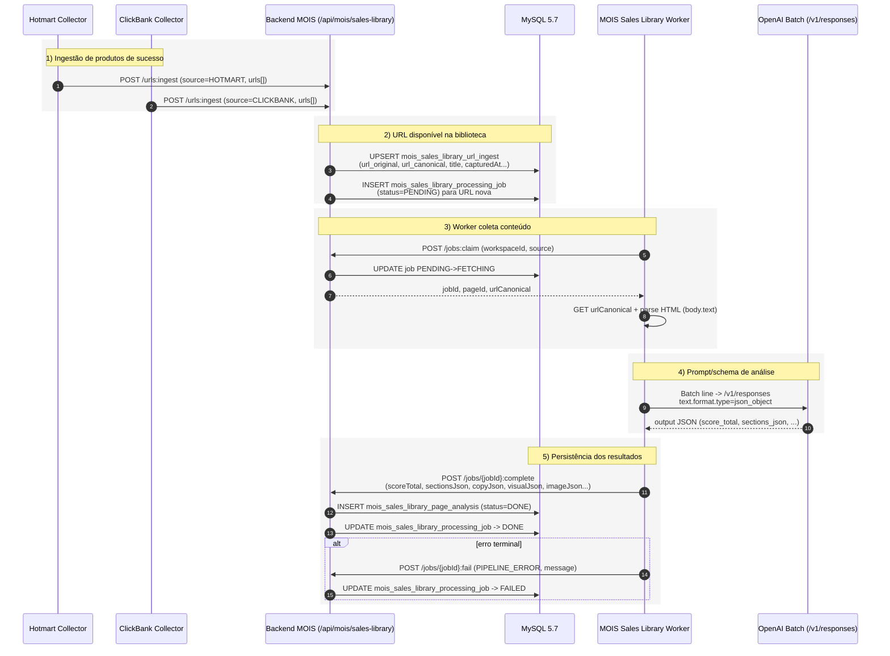

# Cânone Unificado — MOIS Worker (v1)

## 1. Objetivo
Definir, em um único documento canônico, as regras operacionais do worker do módulo MOIS com base no código implementado, incluindo ciclo de processamento, contratos de integração com backend e parâmetros de OpenAI.

## 2. Fonte de verdade
Este documento foi consolidado usando como referência principal o código dos módulos:
- `mois-sales-library-worker/src/main/java/com/marketinghub/mois/bibliotecapaginavenda/worker/v1/service/PipelineRunner.java`
- `mois-sales-library-worker/src/main/java/com/marketinghub/mois/bibliotecapaginavenda/worker/v1/config/WorkerProperties.java`
- `mois-sales-library-worker/src/main/resources/application.yml`

## 3. Escopo operacional do worker
O worker processa de forma assíncrona jobs `PENDING` da biblioteca de páginas de vendas do MOIS, executando:
1. claim de job no backend;
2. coleta do conteúdo textual da URL canônica da página;
3. análise com OpenAI;
4. conclusão do job com payload estruturado de análise;
5. marcação de falha em caso de erro.

## 4. Fluxo canônico
1. Worker chama `POST /api/mois/sales-library/jobs:claim` com `workspaceId` e `source`.
2. Backend retorna job e promove estado para `FETCHING`.
3. Worker baixa o HTML da `urlCanonical` (via Jsoup) e extrai texto principal (`body.text()`).
4. Worker chama analisador OpenAI (`OpenAiSalesPageAnalyzer`).
5. Em sucesso, worker chama `POST /api/mois/sales-library/jobs/{jobId}:complete` com:
   - `scoreTotal`
   - `sectionsJson`
   - `copyJson`
   - `visualJson`
   - `imageJson`
   - `analysisNotes`
   - `parserVersion`
   - `promptVersion`
   - `modelName`
   - `processedAt`
6. Em falha, worker chama `POST /api/mois/sales-library/jobs/{jobId}:fail` com categoria `PIPELINE_ERROR` e mensagem de erro.

## 5. Contrato mínimo de saída de análise
- `score_total`: pontuação comercial agregada;
- `sections_json`: estrutura das seções da página;
- `copy_json`: sinais de copywriting;
- `visual_json`: sinais visuais relevantes;
- `image_json`: dados de imagem relevantes;
- `analysis_notes`: observações adicionais;
- `parser_version`, `prompt_version`, `model_name`: rastreabilidade técnica.

## 6. Regras de fonte (source)
O worker seleciona a fonte por ciclo com a seguinte ordem canônica:
1. Se `MOIS_SOURCES` estiver definido (CSV), usar rotação cíclica (`round-robin`) entre as fontes normalizadas em maiúsculas, removendo duplicatas e valores vazios.
2. Se `MOIS_SOURCES` estiver vazio, usar `MOIS_SOURCE` (fallback).

## 7. Configuração canônica do worker (application.yml)
### 7.1 Worker
- `worker.backend-base-url` → `${BACKEND_BASE_URL:http://191.252.181.168:8000}`
- `worker.workspace-id` → `${MOIS_WORKSPACE_ID:workspace-001}`
- `worker.source` → `${MOIS_SOURCE:CLICKBANK}`
- `worker.sources` → `${MOIS_SOURCES:}`
- `worker.poll-interval-ms` → `${MOIS_POLL_INTERVAL_MS:15000}`
- `worker.request-timeout-ms` → `${MOIS_REQUEST_TIMEOUT_MS:30000}`

### 7.2 OpenAI
- `openai.model` → `${OPENAI_MODEL:gpt-5.2}`
- `openai.batch-poll-interval-ms` → `${OPENAI_BATCH_POLL_INTERVAL_MS:2000}`
- `openai.batch-timeout-ms` → `${OPENAI_BATCH_TIMEOUT_MS:1800000}`
- Para payload de `/v1/responses`, o formato estruturado deve usar `text.format` (não usar `response_format`).

## 8. Regra canônica de timeout OpenAI Batch (MOIS Worker)
Para integrações batch com OpenAI no contexto do MOIS Worker, o timeout canônico é de **30 minutos** (`1800000 ms` / `PT30M`), e não deve ser reduzido sem versionamento explícito deste cânone.

## 8.1 Taxonomia canônica de status (monitoramento de fetching)
Para acompanhamento operacional na tela de Biblioteca de Páginas de Vendas, o status de job deve refletir a etapa real do pipeline e permitir diagnóstico de causa-raiz sem depender apenas de `errorMessage`.

### 8.1.1 Estados canônicos (v1.1 planejado)
1. `PENDING`
   - Job criado e aguardando claim pelo worker.
2. `FETCHING`
   - Worker em coleta/parsing da página de origem.
3. `ANALYZING`
   - Conteúdo já coletado e enviado para processamento OpenAI (batch em andamento).
4. `RETRY_WAIT`
   - Falha transitória detectada; job aguardando nova tentativa automática.
5. `DONE`
   - Análise concluída e persistida com sucesso.
6. `FAILED`
   - Falha terminal após esgotar tentativas ou erro não recuperável de contrato/integração.

### 8.1.2 Regras mínimas de exibição na UI
- Exibir badge por status e tooltip com definição operacional curta.
- Exibir coluna `Último evento` com motivo objetivo da etapa atual (ex.: `batch.status=running`, `connect timeout`, `output_file_id ausente`).
- Exibir coluna `Tempo em etapa` (`agora - updatedAt`) para detectar stuck jobs em `FETCHING`/`ANALYZING`.
- Exibir `Tentativas` + `Próxima tentativa em` quando status for `RETRY_WAIT`.
- Exibir CTA de diagnóstico (link para detalhe do job) quando status for `FAILED`.

### 8.1.3 Critérios de transição
- `PENDING -> FETCHING`: claim confirmado pelo backend.
- `FETCHING -> ANALYZING`: coleta concluída e requisição batch enviada com sucesso.
- `ANALYZING -> DONE`: output válido persistido em `:complete`.
- `ANALYZING -> RETRY_WAIT`: timeout/intermitência recuperável com orçamento de retry restante.
- `FETCHING|ANALYZING|RETRY_WAIT -> FAILED`: erro terminal de contrato, parsing irrecuperável ou retries esgotados.

## 9. Restrições e conformidade
- O worker **não acessa banco diretamente**; todo tráfego de dados passa pelo backend principal.
- Transições de estado devem ocorrer exclusivamente pelos endpoints do backend MOIS.
- Falhas devem ser registradas com contexto e stack trace para diagnóstico de causa-raiz.
- Erros de contrato/integração OpenAI retornados no output do batch (ex.: `response.status_code >= 400` com `response.body.error`) são falhas terminais e devem:
  1. obter e processar também o arquivo `error_file_id` (JSONL) do batch para diagnóstico completo da causa-raiz;
  2. converter os detalhes relevantes do erro em mensagem legível com `status`, `requestId`, `type`, `code` e `message`;
  3. enviar a falha ao endpoint `jobs/{jobId}:fail` para persistência;
  4. manter os detalhes disponíveis para exibição ao usuário na tela de jobs (`errorMessage`).

## 10. Substituição documental
Este documento é o único cânone ativo para o worker do MOIS.

## 11. Referências normativas
- `docs/canonical/system-governance-canon.v2.md`
- `docs/canonical/modelo-canonico-artefatos-pipeline-experimento.md`
- `docs/canonical/experiments-automation-flow-canon.v1.md`

## 12. Fluxo canônico de alimentação da biblioteca de páginas de vendas

Esta seção consolida o fluxo ponta a ponta de **alimentação da biblioteca** (coleta de URLs de produtos vencedores, análise com OpenAI e persistência dos resultados) para remover ambiguidades operacionais entre coletores, backend e worker.

### 12.1 Etapas macro (visão executiva)
1. **Ingestão de produtos de sucesso (fontes de mercado)**
   - **Hotmart collector** seleciona produtos elegíveis, prioriza `salesPageUrl` com fallback em `detailsUrl` e envia para `POST /api/mois/sales-library/urls:ingest`.
   - **ClickBank collector** aplica o mesmo padrão: prioriza `salesPageUrl`, usa fallback quando necessário e envia para o mesmo endpoint de ingestão.
2. **URL fica disponível na biblioteca**
   - O backend normaliza/canonicaliza URL, faz upsert em `mois_sales_library_url_ingest` e, para entradas novas, cria job `PENDING` em `mois_sales_library_processing_job`.
3. **Rotina que obtém conteúdo da página e envia para análise**
   - O worker faz `claim` (`jobs:claim`), muda job para `FETCHING`, baixa HTML da `urlCanonical`, extrai texto (`body.text()`) e inicia análise OpenAI.
4. **Prompt + schema de saída usados no worker**
   - O worker envia instrução para análise comercial e exige resposta em JSON via `/v1/responses` com `text.format.type=json_object`.
   - Campos obrigatórios esperados no JSON de saída: `score_total`, `sections_json`, `copy_json`, `visual_json`, `image_json`, `analysis_notes`.
5. **Receber resultado OpenAI e persistir no banco**
   - Em sucesso: worker chama `jobs/{jobId}:complete`; backend persiste em `mois_sales_library_page_analysis` e marca job como `DONE`.
   - Em falha: worker chama `jobs/{jobId}:fail`; backend marca job como `FAILED` com categoria/mensagem para diagnóstico.

### 12.2 Diagrama (sequência ponta a ponta)

### 12.3 Contratos e tabelas de persistência (referência rápida)
- **Endpoint de ingestão**: `POST /api/mois/sales-library/urls:ingest`.
- **Endpoint de claim**: `POST /api/mois/sales-library/jobs:claim`.
- **Endpoint de conclusão**: `POST /api/mois/sales-library/jobs/{jobId}:complete`.
- **Endpoint de falha**: `POST /api/mois/sales-library/jobs/{jobId}:fail`.
- **Tabela de URLs**: `mois_sales_library_url_ingest`.
- **Tabela de jobs**: `mois_sales_library_processing_job`.
- **Tabela de análise**: `mois_sales_library_page_analysis`.

### 12.4 Regra operacional para evitar divergência de leitura
Quando houver dúvida sobre “onde o fluxo começa”, considerar canonicamente que a alimentação da biblioteca inicia nos coletores (Hotmart/ClickBank), passa obrigatoriamente pelo endpoint `/urls:ingest` no backend e só então entra no ciclo assíncrono do worker.

### 12.4 Ações manuais de status no detalhe da análise (2026-05-21)
- A tela de detalhe (`/mois/sales-pages-library/{pageId}`) passa a expor comandos operacionais manuais para acelerar triagem:
  - `Voltar para pendente`: cria novo ciclo de processamento para a página, persistindo status `PENDING`.
  - `Marcar como anulado`: registra status `ANULADO` para itens que não serão mais utilizados no funil.
- Contrato backend oficial: `POST /api/mois/sales-library/pages/{pageId}:status` com payload `{ "status": "PENDING" | "ANULADO", "reason"?: string }`.
- A interface de detalhe também deve exibir navegação sequencial com botão `Próximo →` para avançar ao próximo item da lista local.
