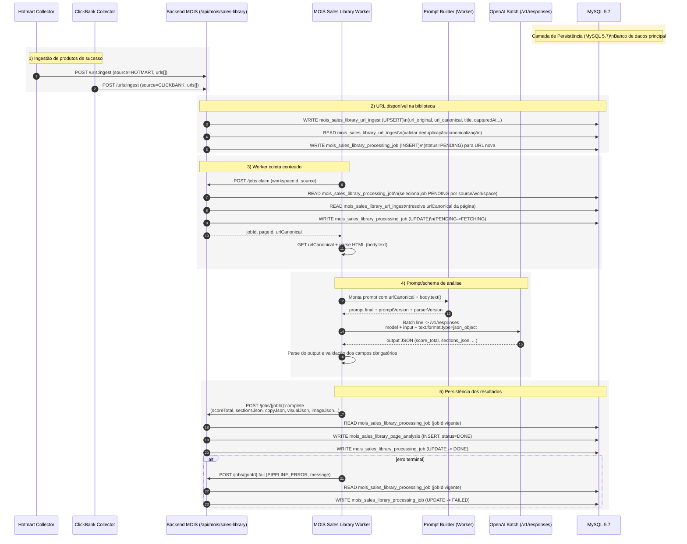
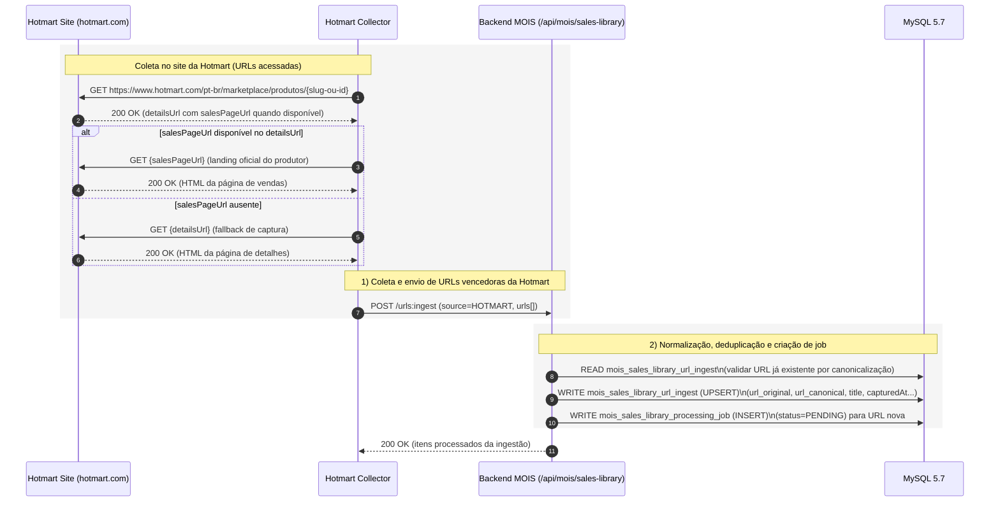
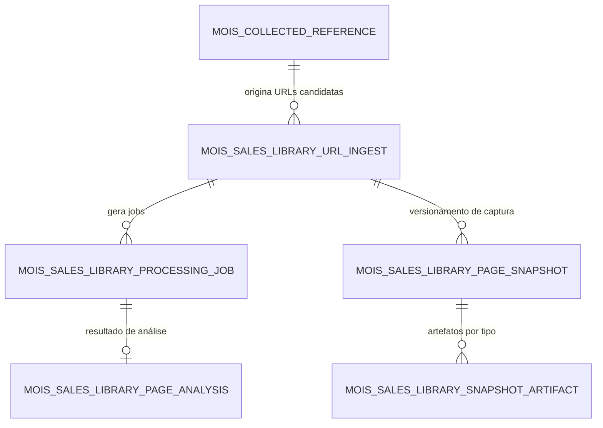
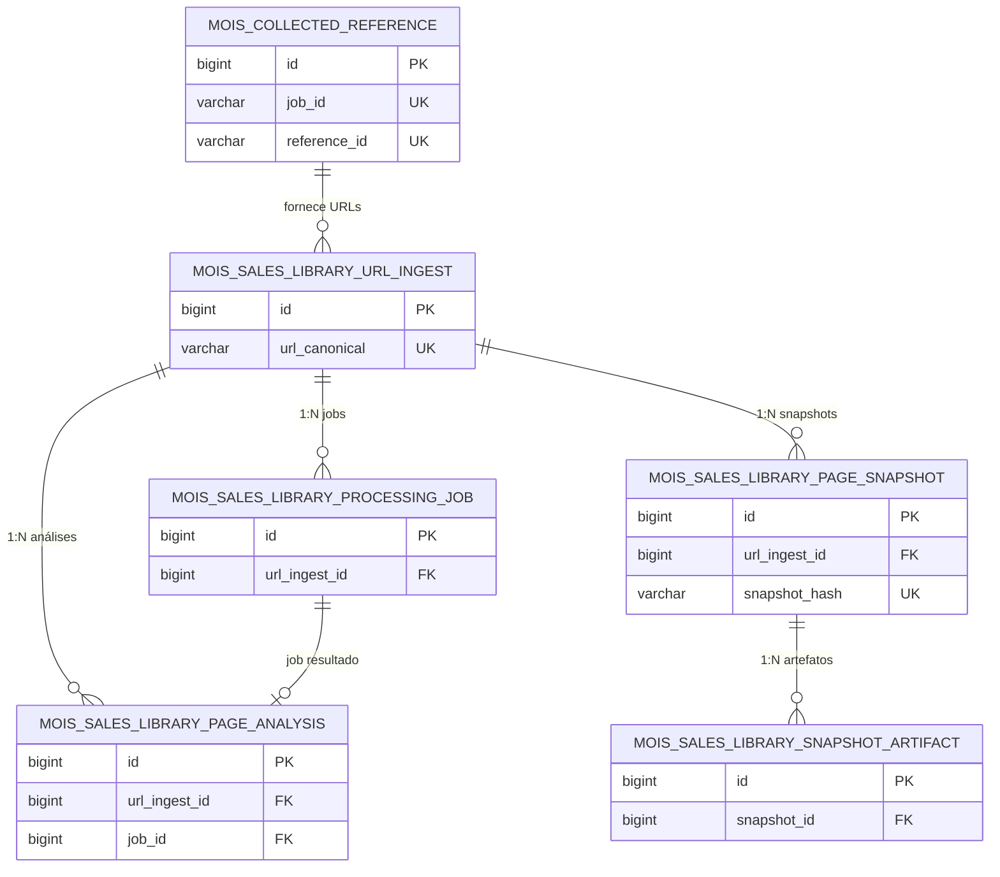
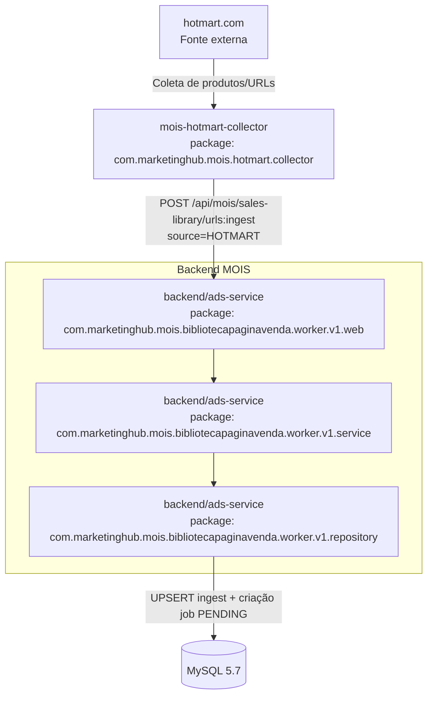
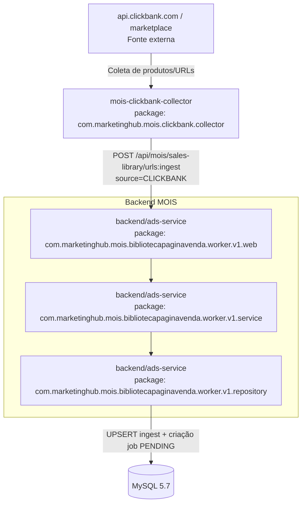

# Cânone Unificado — MOIS Worker (v1)

## 1. Objetivo
Definir, em um único documento canônico, as regras operacionais do worker do módulo MOIS com base no código implementado, incluindo ciclo de processamento, contratos de integração com backend e parâmetros de OpenAI.

## 2. Fonte de verdade
Este documento foi consolidado usando como referência principal o código dos módulos:
- `mois-sales-library-worker/src/main/java/com/marketinghub/mois/bibliotecapaginavenda/worker/v1/service/PipelineRunner.java`
- `mois-sales-library-worker/src/main/java/com/marketinghub/mois/bibliotecapaginavenda/worker/v1/config/WorkerProperties.java`
- `mois-sales-library-worker/src/main/resources/application.yml`

## 3. Escopo operacional do worker
O worker processa de forma assíncrona jobs `PENDING` da biblioteca de páginas de vendas do MOIS, executando:
1. claim de job no backend;
2. coleta do conteúdo textual da URL canônica da página;
3. análise com OpenAI;
4. conclusão do job com payload estruturado de análise;
5. marcação de falha em caso de erro.

## 4. Fluxo canônico
1. Worker chama `POST /api/mois/sales-library/jobs:claim` com `workspaceId` e `source`.
2. Backend retorna job e promove estado para `FETCHING`.
3. Worker baixa o HTML da `urlCanonical` (via Jsoup) e extrai texto principal (`body.text()`).
4. Worker chama analisador OpenAI (`OpenAiSalesPageAnalyzer`).
5. Em sucesso, worker chama `POST /api/mois/sales-library/jobs/{jobId}:complete` com:
   - `scoreTotal`
   - `sectionsJson`
   - `copyJson`
   - `visualJson`
   - `imageJson`
   - `analysisNotes`
   - `parserVersion`
   - `promptVersion`
   - `modelName`
   - `requestPayloadJson`
   - `processedAt`
6. Em falha, worker chama `POST /api/mois/sales-library/jobs/{jobId}:fail` com categoria `PIPELINE_ERROR` e mensagem de erro.

## 5. Contrato mínimo de saída de análise
- `score_total`: pontuação comercial agregada;
- `sections_json`: estrutura das seções da página;
- `copy_json`: sinais de copywriting;
- `visual_json`: sinais visuais relevantes;
- `image_json`: dados de imagem relevantes;
- `analysis_notes`: observações adicionais;
- `request_payload_json`: payload literal enviado ao modelo (JSONL da requisição batch) para auditoria;
- `parser_version`, `prompt_version`, `model_name`: rastreabilidade técnica.

## 6. Regras de fonte (source)
O worker seleciona a fonte por ciclo com a seguinte ordem canônica:
1. Se `MOIS_SOURCES` estiver definido (CSV), usar rotação cíclica (`round-robin`) entre as fontes normalizadas em maiúsculas, removendo duplicatas e valores vazios.
2. Se `MOIS_SOURCES` estiver vazio, usar `MOIS_SOURCE` (fallback).

## 7. Configuração canônica do worker (application.yml)
### 7.1 Worker
- `worker.backend-base-url` → `${BACKEND_BASE_URL:http://191.252.181.168:8000}`
- `worker.workspace-id` → `${MOIS_WORKSPACE_ID:workspace-001}`
- `worker.source` → `${MOIS_SOURCE:CLICKBANK}`
- `worker.sources` → `${MOIS_SOURCES:}`
- `worker.poll-interval-ms` → `${MOIS_POLL_INTERVAL_MS:15000}`
- `worker.request-timeout-ms` → `${MOIS_REQUEST_TIMEOUT_MS:30000}`

### 7.2 OpenAI
- `openai.model` → `${OPENAI_MODEL:gpt-5.2}`
- `openai.batch-poll-interval-ms` → `${OPENAI_BATCH_POLL_INTERVAL_MS:2000}`
- `openai.batch-timeout-ms` → `${OPENAI_BATCH_TIMEOUT_MS:1800000}`
- Para payload de `/v1/responses`, o formato estruturado deve usar `text.format` (não usar `response_format`).

## 8. Regra canônica de timeout OpenAI Batch (MOIS Worker)
Para integrações batch com OpenAI no contexto do MOIS Worker, o timeout canônico é de **30 minutos** (`1800000 ms` / `PT30M`), e não deve ser reduzido sem versionamento explícito deste cânone.


## 8.1 Taxonomia canônica de status (monitoramento de fetching)
Para acompanhamento operacional na tela de Biblioteca de Páginas de Vendas, o status de job deve refletir a etapa real do pipeline e permitir diagnóstico de causa-raiz sem depender apenas de `errorMessage`.

### 8.1.1 Estados canônicos (v1.1 planejado)
1. `PENDING`
   - Job criado e aguardando claim pelo worker.
2. `FETCHING`
   - Worker em coleta/parsing da página de origem.
3. `ANALYZING`
   - Conteúdo já coletado e enviado para processamento OpenAI (batch em andamento).
4. `RETRY_WAIT`
   - Falha transitória detectada; job aguardando nova tentativa automática.
5. `DONE`
   - Análise concluída e persistida com sucesso.
6. `FAILED`
   - Falha terminal após esgotar tentativas ou erro não recuperável de contrato/integração.

### 8.1.2 Regras mínimas de exibição na UI
- Exibir badge por status e tooltip com definição operacional curta.
- Exibir coluna `Último evento` com motivo objetivo da etapa atual (ex.: `batch.status=running`, `connect timeout`, `output_file_id ausente`).
- Exibir coluna `Tempo em etapa` (`agora - updatedAt`) para detectar stuck jobs em `FETCHING`/`ANALYZING`.
- Exibir `Tentativas` + `Próxima tentativa em` quando status for `RETRY_WAIT`.
- Exibir CTA de diagnóstico (link para detalhe do job) quando status for `FAILED`.

### 8.1.3 Critérios de transição
- `PENDING -> FETCHING`: claim confirmado pelo backend.
- `FETCHING -> ANALYZING`: coleta concluída e requisição batch enviada com sucesso.
- `ANALYZING -> DONE`: output válido persistido em `:complete`.
- `ANALYZING -> RETRY_WAIT`: timeout/intermitência recuperável com orçamento de retry restante.
- `FETCHING|ANALYZING|RETRY_WAIT -> FAILED`: erro terminal de contrato, parsing irrecuperável ou retries esgotados.

## 9. Restrições e conformidade
- O worker **não acessa banco diretamente**; todo tráfego de dados passa pelo backend principal.
- Transições de estado devem ocorrer exclusivamente pelos endpoints do backend MOIS.
- Falhas devem ser registradas com contexto e stack trace para diagnóstico de causa-raiz.
- Erros de contrato/integração OpenAI retornados no output do batch (ex.: `response.status_code >= 400` com `response.body.error`) são falhas terminais e devem:
  1. obter e processar também o arquivo `error_file_id` (JSONL) do batch para diagnóstico completo da causa-raiz;
  2. converter os detalhes relevantes do erro em mensagem legível com `status`, `requestId`, `type`, `code` e `message`;
  3. enviar a falha ao endpoint `jobs/{jobId}:fail` para persistência;
  4. manter os detalhes disponíveis para exibição ao usuário na tela de jobs (`errorMessage`).

## 10. Substituição documental
Este documento é o único cânone ativo para o worker do MOIS.

## 11. Referências normativas
- `docs/canonical/system-governance-canon.v2.md`
- `docs/canonical/modelo-canonico-artefatos-pipeline-experimento.md`
- `docs/canonical/experiments-automation-flow-canon.v1.md`

## 12. Fluxo canônico de alimentação da biblioteca de páginas de vendas

Esta seção consolida o fluxo ponta a ponta de **alimentação da biblioteca** (coleta de URLs de produtos vencedores, análise com OpenAI e persistência dos resultados) para remover ambiguidades operacionais entre coletores, backend e worker.

### 12.1 Etapas macro (visão executiva)
1. **Ingestão de produtos de sucesso (fontes de mercado)**
   - **Hotmart collector** seleciona produtos elegíveis, prioriza `salesPageUrl` com fallback em `detailsUrl` e envia para `POST /api/mois/sales-library/urls:ingest`.
   - **ClickBank collector** aplica o mesmo padrão: prioriza `salesPageUrl`, usa fallback quando necessário e envia para o mesmo endpoint de ingestão.
2. **URL fica disponível na biblioteca**
   - O backend normaliza/canonicaliza URL, faz upsert em `mois_sales_library_url_ingest` e, para entradas novas, cria job `PENDING` em `mois_sales_library_processing_job`.
3. **Rotina que obtém conteúdo da página e envia para análise**
   - O worker faz `claim` (`jobs:claim`), muda job para `FETCHING`, baixa HTML da `urlCanonical`, extrai texto (`body.text()`) e inicia análise OpenAI.
4. **Prompt + schema de saída usados no worker**
   - O worker monta o prompt com `urlCanonical` + texto extraído (`body.text()`) e versão de parser/prompt para rastreabilidade da análise.
   - O worker envia instrução para análise comercial e exige resposta em JSON via `/v1/responses` com `text.format.type=json_object`.
   - Campos obrigatórios esperados no JSON de saída: `score_total`, `sections_json`, `copy_json`, `visual_json`, `image_json`, `analysis_notes`.
5. **Receber resultado OpenAI e persistir no banco**
   - Em sucesso: worker chama `jobs/{jobId}:complete`; backend persiste em `mois_sales_library_page_analysis` e marca job como `DONE`.
   - Em falha: worker chama `jobs/{jobId}:fail`; backend marca job como `FAILED` com categoria/mensagem para diagnóstico.

### 12.2 Diagrama (sequência ponta a ponta)


### 12.2.1 Diagrama de sequência focado no coletor Hotmart


### 12.2.2 Tabelas lidas e gravadas por etapa do fluxo

| Etapa | Leitura (READ) | Gravação (WRITE) |
|---|---|---|
| Ingestão (`/urls:ingest`) | `mois_sales_library_url_ingest` (deduplicação/canonicalização) | `mois_sales_library_url_ingest` (upsert), `mois_sales_library_processing_job` (insert `PENDING`) |
| Claim (`/jobs:claim`) | `mois_sales_library_processing_job` (seleção de job pendente), `mois_sales_library_url_ingest` (obter `urlCanonical`) | `mois_sales_library_processing_job` (update `FETCHING`) |
| Complete (`/jobs/{jobId}:complete`) | `mois_sales_library_processing_job` (validar job vigente) | `mois_sales_library_page_analysis` (insert), `mois_sales_library_processing_job` (update `DONE`) |
| Fail (`/jobs/{jobId}:fail`) | `mois_sales_library_processing_job` (validar job vigente) | `mois_sales_library_processing_job` (update `FAILED`) |

### 12.3 Contratos e tabelas de persistência (referência rápida)
- **Endpoint de ingestão**: `POST /api/mois/sales-library/urls:ingest`.
- **Endpoint de claim**: `POST /api/mois/sales-library/jobs:claim`.
- **Endpoint de conclusão**: `POST /api/mois/sales-library/jobs/{jobId}:complete`.
- **Endpoint de falha**: `POST /api/mois/sales-library/jobs/{jobId}:fail`.
- **Tabela de URLs**: `mois_sales_library_url_ingest`.
- **Tabela de jobs**: `mois_sales_library_processing_job`.
- **Tabela de análise**: `mois_sales_library_page_analysis`.

### 12.4 Regra operacional para evitar divergência de leitura
Quando houver dúvida sobre “onde o fluxo começa”, considerar canonicamente que a alimentação da biblioteca inicia nos coletores (Hotmart/ClickBank), passa obrigatoriamente pelo endpoint `/urls:ingest` no backend e só então entra no ciclo assíncrono do worker.

### 12.4 Ações manuais de status no detalhe da análise (2026-05-21)
- A tela de detalhe (`/mois/sales-pages-library/{pageId}`) passa a expor comandos operacionais manuais para acelerar triagem:
  - `Voltar para pendente`: cria novo ciclo de processamento para a página, persistindo status `PENDING`.
  - `Marcar como anulado`: registra status `ANULADO` para itens que não serão mais utilizados no funil.
- Contrato backend oficial: `POST /api/mois/sales-library/pages/{pageId}:status` com payload `{ "status": "PENDING" | "ANULADO", "reason"?: string }`.
- A interface de detalhe também deve exibir navegação sequencial com botão `Próximo →` para avançar ao próximo item da lista local.


## 13. Seção de Dados — Modelo compartilhado (Coletores Hotmart/ClickBank + Biblioteca de Páginas)

Esta seção define o **modelo de dados canônico mínimo** que conecta a coleta de produtos vencedores (Hotmart/ClickBank) com a operação da Biblioteca de Páginas de Vendas.

### 13.1 Visão relacional (macro)


### 13.2 Tabelas usadas pelos coletores (Hotmart e ClickBank)

#### 13.2.1 `mois_collected_reference`
- **Papel no fluxo**: persistir referências coletadas dos marketplaces com sinais de sucesso comercial, servindo de base para seleção de URLs de página de vendas.
- **Origem principal**: endpoints de persistência do MOIS alimentados pelos coletores Hotmart/ClickBank.
- **Campos funcionais de destaque**:
  - identificação e rastreio: `id`, `workspace_id`, `source`, `job_id`, `reference_id`;
  - dados do produto: `product_name`, `product_url`, `sales_page_url`, `details_url`, `cover_image_url`;
  - sinais de priorização: `success_score`, `temperature`, `hotmart_price`, `hotmart_currency`, `hotmart_highlights_json`;
  - auditoria: `collected_at`, `created_at`, `updated_at`.
- **Índices canônicos de operação**:
  - unicidade por referência coletada no job (`job_id`, `reference_id`);
  - busca por workspace/fonte (`workspace_id`, `source`);
  - ordenação por score (`workspace_id`, `success_score`).

### 13.3 Tabelas usadas no projeto da Biblioteca de Páginas de Vendas

#### 13.3.1 `mois_sales_library_url_ingest`
- **Papel no fluxo**: tabela de entrada (ingestão) de URLs canônicas provenientes da coleta.
- **Função operacional**: deduplicar URLs, manter metadados de origem e disparar criação de job para itens novos.
- **Campos de destaque**: `id`, `workspace_id`, `source`, `url_original`, `url_canonical`, `title`, `first_captured_at`, `last_captured_at`, `ingest_count`, `created_at`, `updated_at`.

#### 13.3.2 `mois_sales_library_processing_job`
- **Papel no fluxo**: orquestrar estado assíncrono do processamento por URL.
- **Função operacional**: controlar ciclo `PENDING/FETCHING/ANALYZING/RETRY_WAIT/DONE/FAILED`.
- **Campos de destaque**: `id`, `url_ingest_id`, `status`, `attempts`, `error_category`, `error_message`, `next_retry_at`, `started_at`, `finished_at`, `created_at`, `updated_at`.

#### 13.3.3 `mois_sales_library_page_analysis`
- **Papel no fluxo**: armazenar o resultado estruturado da análise comercial executada pelo worker.
- **Função operacional**: persistir score, seções e sinais semânticos retornados pelo pipeline OpenAI.
- **Campos de destaque**: `id`, `url_ingest_id`, `job_id`, `status`, `score_total`, `sections_json`, `copy_json`, `visual_json`, `image_json`, `analysis_notes`, `request_payload_json`, `parser_version`, `prompt_version`, `model_name`, `analyzed_at`, `created_at`, `updated_at`.

#### 13.3.4 `mois_sales_library_page_snapshot`
- **Papel no fluxo**: guardar snapshots/versionamento da página capturada para comparação temporal.
- **Função operacional**: registrar mudanças de conteúdo entre capturas e apoiar trilha de auditoria.
- **Campos de destaque**: `id`, `url_ingest_id`, `snapshot_hash`, `status`, `http_status`, `content_type`, `raw_html_bytes`, `screenshot_bytes`, `captured_at`, `updated_at`.

#### 13.3.5 `mois_sales_library_snapshot_artifact`
- **Papel no fluxo**: armazenar artefatos derivados por snapshot (ex.: sumários ou classificações por tipo).
- **Função operacional**: separar artefatos auxiliares por `artifact_type` vinculados ao snapshot.
- **Campos de destaque**: `id`, `snapshot_id`, `artifact_type`, `content_type`, `storage_kind`, `content_text`, `content_blob`, `size_bytes`, `created_at`.

### 13.4 Regras de integração entre coletores e biblioteca
1. A transição **coletor -> biblioteca** deve ocorrer por endpoint backend (`/api/mois/sales-library/urls:ingest`), nunca por escrita direta no banco.
2. A URL de priorização para ingestão deve seguir ordem canônica: `salesPageUrl` e fallback para `detailsUrl`.
3. Toda URL nova ingerida deve potencialmente gerar job em `mois_sales_library_processing_job` com status inicial `PENDING`.
4. Persistência de análise final deve ficar em `mois_sales_library_page_analysis`, mantendo rastreabilidade por `job_id` e `url_ingest_id`.
5. Snapshots e artefatos complementares não substituem a análise principal; eles enriquecem histórico e diagnóstico.


### 13.5 Diagrama de dados (somente chaves)



### 12.5 Diagrama de arquitetura por módulo/pacote

Diagrama canônico da arquitetura lógica usando como unidade os módulos/pacotes, destacando dependências e integrações com banco e OpenAI.

```mermaid
graph TD
    HC[mois-hotmart-collector\npackage: com.marketinghub.mois.hotmart.collector] -->|POST /api/mois/sales-library/urls:ingest| BM[backend/ads-service\npackage: com.marketinghub.mois.bibliotecapaginavenda.worker.v1.web]
    CC[mois-clickbank-collector\npackage: com.marketinghub.mois.clickbank.collector] -->|POST /api/mois/sales-library/urls:ingest| BM

    WK[mois-sales-library-worker\npackage: com.marketinghub.mois.bibliotecapaginavenda.worker.v1.service] -->|"jobs:claim, jobs/{id}:complete, jobs/{id}:fail"| BM
    WK --> PB[Prompt Builder\nopenai.OpenAiSalesPageAnalyzer]
    PB -->|"Monta prompt (URL + texto da página)\nDefine promptVersion/parserVersion"| OAI[OpenAI API /v1/responses]
    OAI -->|Retorna JSON estruturado da análise| PB
    PB -->|Resultado validado (score, sections, copy, visual, image, notes)| WK

    BM -->|JPA/SQL via camada backend| DB[(MySQL 5.7)]

    subgraph Backend MOIS
      BM
      BS[backend/ads-service\npackage: com.marketinghub.mois.bibliotecapaginavenda.worker.v1.service]
      BR[backend/ads-service\npackage: com.marketinghub.mois.bibliotecapaginavenda.worker.v1.repository]
      BM --> BS --> BR
    end

    BR -->|READ/WRITE: ingest, jobs, analyses, snapshots| DB
```


#### 12.5.1 Hotmart Collector — arquitetura por módulo/pacote



#### 12.5.2 ClickBank Collector — arquitetura por módulo/pacote



#### Regras de integração refletidas no diagrama
- Coletores e worker **não acessam banco diretamente**; todo acesso a dados passa pelo backend MOIS.
- A integração com OpenAI é realizada pelo `mois-sales-library-worker`, com retorno consolidado ao backend via endpoint de conclusão/falha.
- A obtenção/montagem de prompt acontece no próprio worker (`OpenAiSalesPageAnalyzer`), combinando URL canônica, texto extraído da página e versão de prompt para rastreabilidade.
- A persistência em MySQL 5.7 ocorre apenas nos pacotes de serviço/repositório do backend.


### 12.6 Diagrama de arquitetura por módulo/pacote — Gera Landing (movido)

Este diagrama foi movido para o cânone de experimento em `docs/canonical/procedimento-experimento-canon.v1.md`, seção **15.4**, para centralizar as regras canônicas do fluxo Gera Landing em um único documento.
