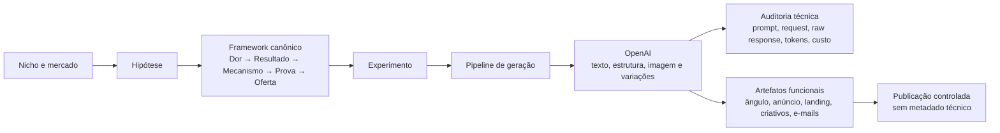
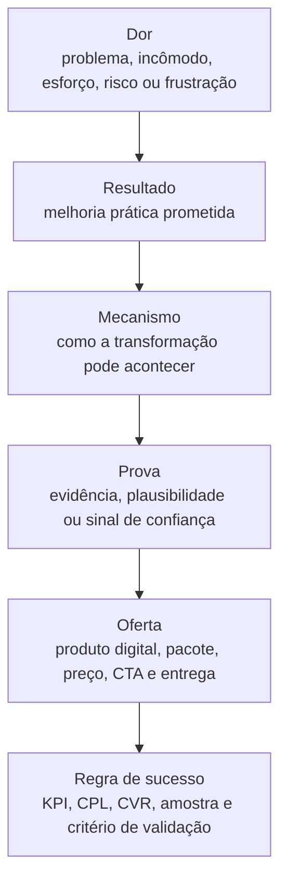
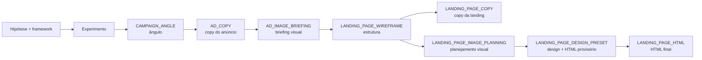
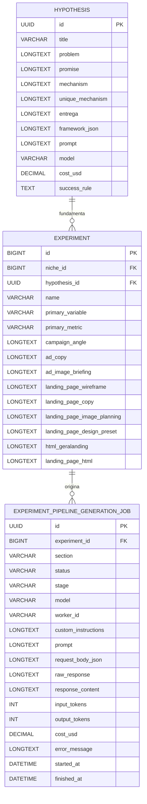
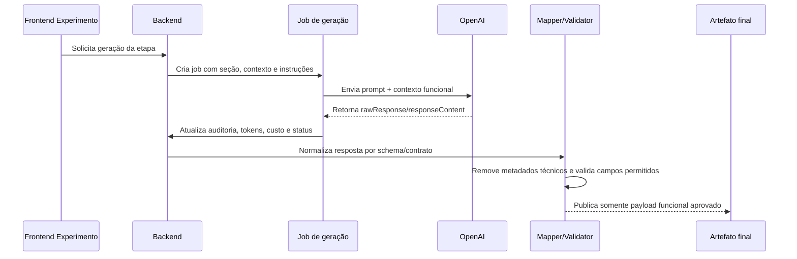

# Cânone v1 — Informações Tratadas pela OpenAI no Marketing Hub

## 1. Objetivo

Este documento define, em nível canônico, quais informações do Marketing Hub podem ser enviadas para a OpenAI, quais respostas podem retornar, como esses dados se conectam ao framework de hipóteses e como os atributos do experimento alimentam as etapas do pipeline.

A finalidade é preservar rastreabilidade, evitar vazamento de metadados técnicos para artefatos finais e manter o eixo comercial do sistema: **Dor → Resultado → Mecanismo → Prova → Oferta**.

## 2. Escopo

Aplica-se aos fluxos que usam OpenAI para estruturar ou gerar artefatos comerciais, principalmente:

- geração do framework de hipótese;
- geração de etapas do pipeline de experimento;
- geração de etapas do Gera Landing;
- geração de criativos, e-mails, entregáveis e fluxos do portal do lead quando derivados do experimento.

Este documento não substitui o cânone operacional de execução do experimento; ele complementa esse cânone com a visão de dados tratados pela OpenAI.

## 3. Princípios obrigatórios

1. **Enviar somente contexto útil para transformação comercial**: toda informação enviada à OpenAI deve ajudar a entender dor real, resultado desejado, mecanismo, prova, oferta, público, canal ou restrição de execução.
2. **Separar dado funcional de metadado técnico**: prompts, modelos, custos, IDs de job e respostas brutas são necessários para auditoria, mas não podem contaminar artefatos finais publicados.
3. **Persistir rastreabilidade**: toda geração deve guardar, quando disponível, modelo, prompt, corpo de requisição, resposta bruta, resposta normalizada, tokens, custo e status operacional.
4. **Evitar JSON dentro de JSON em campo textual**: quando houver payload estruturado, preferir campos/contratos explícitos e schema por etapa.
5. **Preservar a cadeia de valor**: a OpenAI deve transformar dados existentes e hipóteses explícitas em artefatos melhores, não inventar demanda artificial sem aderência ao mercado.

## 4. Visão macro dos dados tratados

## 5. Framework canônico da hipótese

O framework da hipótese é o principal insumo semântico para a OpenAI. Ele deve organizar a tese de venda antes da geração de artefatos.

### 5.1 Atributos de hipótese usados pela OpenAI

| Atributo | Uso esperado pela OpenAI | Observação canônica |
|---|---|---|
| `title` | nome curto da tese comercial | deve resumir a oportunidade sem excesso técnico |
| `marketNiche` | contexto de mercado e público | origem do recorte comercial |
| `premiseAngle` | ângulo inicial de persuasão | usado para posicionamento e variações de copy |
| `promise` | promessa de valor | deve ser verificável e ligada ao resultado |
| `problem` | dor/insight do cliente | insumo central para evitar demanda artificial |
| `persona` | público/persona alvo | orienta linguagem, objeções e canais |
| `mechanism` | mecanismo de solução | base para explicação e diferenciação |
| `uniqueMechanism` | mecanismo único | reforça singularidade da oferta |
| `entrega` | entregável ou formato do produto | conecta promessa ao que o cliente recebe |
| `frameworkJson` | snapshot estruturado do framework | fonte preferencial para prompts estruturados |
| `prompt` | prompt usado para gerar a hipótese | metadado técnico de auditoria, não artefato final |
| `model` | modelo responsável pela geração | metadado técnico de auditoria |
| `costUsd`, `cost`, `totalCost`, `expense` | custos de geração/execução | métricas operacionais e econômicas |
| `imageFilterTitle` | filtro semântico para imagens | ajuda a manter coerência visual |
| `successRule` | critério de validação da hipótese | guia decisões de aprovação/reprovação |
| `offerType`, `price`, `offerPackage` | embalagem comercial | usados para proposta, CTA e valor percebido |
| `kpiTargetCpl`, `status`, `generatedAt` | governança da hipótese | usados para priorização e auditoria |

## 6. Atributos do experimento que alimentam a OpenAI

O experimento transforma a hipótese em execução validável. A OpenAI pode usar atributos do experimento para gerar mensagens, páginas, imagens, entregáveis e fluxos, sempre respeitando o estágio e o contrato da etapa.

### 6.1 Contexto comercial e de vínculo

| Atributo | Uso esperado |
|---|---|
| `id`, `name` | identificação operacional e nome do experimento |
| `niche` | recorte de mercado usado no contexto do prompt |
| `hypothesis` | texto curto da hipótese no experimento |
| `hypothesisRef.id`, `hypothesisRef.title`, `hypothesisRef.frameworkJson` | vínculo com a hipótese canônica e seu framework |
| `platform` | canal de execução e adaptação de linguagem |
| `stage` | fase operacional do experimento |
| `primaryVariable` | variável principal testada |
| `primaryMetric` | métrica principal usada para julgamento |

### 6.2 Métricas, orçamento e critérios de validação

| Atributo | Uso esperado |
|---|---|
| `metricPreset` | padrão de métricas aplicado ao experimento |
| `kpiTargetCpl` | CPL alvo para validar aquisição |
| `stopLossCpl` | limite de perda aceitável |
| `sampleSize` | tamanho de amostra desejado |
| `baselineCvr` | taxa de conversão base |
| `targetCvr` | taxa de conversão alvo |
| `dailyBudget` | orçamento diário |
| `unitPrice` | preço unitário em BRL |
| `cost`, `totalCost`, `expense` | custos e despesas acumuladas |
| `mdePercent` | efeito mínimo detectável |
| `startDate`, `endDate`, `status` | janela e estado do experimento |

### 6.3 Canais, contas e publicação

| Atributo | Uso esperado |
|---|---|
| `facebookPage`, `facebookInstantForm`, `instagramAccount` | contexto de publicação Meta/Instagram |
| `facebookReleaseRequestedAt` | auditoria da solicitação de liberação |
| `funnelResetAt` | controle operacional do funil |
| `followUpActionUrl` | destino operacional pós-lead |
| `journeyTemplate` | jornada aplicável ao lead |
| `leadPortalFlow`, `leadPortalFlowModel`, `schemaFirstLeadPortalEnabled` | geração e governança do portal do lead |
| `imageGenerationModel`, `imageGenerationQuality` | configuração para geração visual |

### 6.4 Artefatos produzidos ou refinados pela OpenAI no experimento

| Atributo persistido no experimento | Etapa/uso |
|---|---|
| `creativeTextPrompt` | prompt funcional para texto de criativo |
| `creativeImagePrompt` | prompt funcional para imagem de criativo |
| `campaignAngle` | saída da etapa `CAMPAIGN_ANGLE` |
| `adCopy` | saída da etapa `AD_COPY` |
| `adImageBriefing` | saída da etapa `AD_IMAGE_BRIEFING` |
| `landingPageWireframe` | saída da etapa `LANDING_PAGE_WIREFRAME` |
| `landingPageCopy` | saída da etapa `LANDING_PAGE_COPY` |
| `landingPageImagePlanning` | saída da etapa `LANDING_PAGE_IMAGE_PLANNING` |
| `landingPageDesignPreset` | JSON funcional da etapa `LANDING_PAGE_DESIGN_PRESET` |
| `htmlGeraLanding` | HTML consolidado operacional do Gera Landing |
| `landingPageDeliverables` | entregáveis previstos para a landing/produto |
| `landingPageHtml` | HTML final aprovado/publicável |
| `landingPageCopyJobId`, `landingPageWireframeJobId` | vínculo técnico com jobs de geração |

### 6.5 Contadores de geração assistida por IA

| Atributo | Uso esperado |
|---|---|
| `creativesToGenerate` | quantidade de criativos a gerar |
| `instantFormsToGenerate` | quantidade de formulários instantâneos a gerar |
| `emailsToGenerate` | quantidade de e-mails a gerar |
| `sampleEmailsToGenerate` | quantidade de e-mails de amostra a gerar |
| `deliverablesToGenerate` | quantidade de definições de entregáveis a gerar |
| `leadPortalFlowsToGenerate` | quantidade de fluxos do portal do lead a gerar |
| `imagesPerPackage`, `openImagesPerPackage`, `compressedImagesPerPackage` | parâmetros de pacote de imagens/entregáveis |

## 7. Pipeline canônico de experimento e informações por etapa

| Etapa | Entradas principais para OpenAI | Saída funcional | Persistência principal |
|---|---|---|---|
| `CAMPAIGN_ANGLE` | hipótese, framework, nicho, persona, dor, promessa, mecanismo, prova, oferta e instruções customizadas | tese/ângulo central de campanha | `experiment.campaign_angle` |
| `AD_COPY` | ângulo aprovado, hipótese, público, plataforma e restrições de anúncio | texto do anúncio | `experiment.ad_copy` |
| `AD_IMAGE_BRIEFING` | copy do anúncio, ângulo, persona, oferta e direção visual | briefing/prompt de imagem | `experiment.ad_image_briefing` |
| `LANDING_PAGE_WIREFRAME` | briefing visual, oferta, promessa, mecanismo e CTA | estrutura de seções da landing | `experiment.landing_page_wireframe` |
| `LANDING_PAGE_COPY` | wireframe, ângulo, anúncio, framework e prova | textos finais por seção | `experiment.landing_page_copy` |
| `LANDING_PAGE_IMAGE_PLANNING` | wireframe/copy, intenção visual, oferta e slots de imagem | lista de imagens e prompts visuais | `experiment.landing_page_image_planning` |
| `LANDING_PAGE_DESIGN_PRESET` | wireframe, copy, plano de imagens e restrições visuais | preset de design e HTML provisório consolidado | `experiment.landing_page_design_preset`, `experiment.html_geralanding` |
| `LANDING_PAGE_HTML` | preset, copy, imagens finais e validações de contrato | HTML final publicável | `experiment.landing_page_html` |

## 8. Job de geração: envelope técnico auditável

Cada chamada controlada para a OpenAI no pipeline deve produzir ou atualizar um registro de job com metadados operacionais.

### 8.1 Campos técnicos do job

| Campo | Função | Pode ir para artefato final? |
|---|---|---|
| `section` | identifica a etapa do pipeline | não |
| `status`, `stage` | estado operacional | não |
| `model`, `workerId` | auditoria do executor/modelo | não |
| `customInstructions` | instruções adicionais do usuário/operador | somente se forem conteúdo funcional explícito da etapa |
| `prompt` | prompt final enviado à OpenAI | não |
| `requestBodyJson` | corpo técnico da requisição | não |
| `rawResponse` | resposta bruta do modelo | não |
| `responseContent` | conteúdo funcional normalizado | sim, após validação e mapeamento por whitelist |
| `inputTokens`, `outputTokens`, `costUsd` | custo/telemetria | não |
| `errorMessage`, `startedAt`, `finishedAt` | diagnóstico operacional | não |

## 9. Fluxo de controle contra contaminação de artefato final

Regras mandatórias:

1. O payload final publicado deve conter somente campos do contrato funcional da etapa.
2. Comentários técnicos, flags internas, IDs de job, prompts, mensagens de debug e instruções operacionais não podem aparecer em HTML, copy, JSON final de oferta ou payload público.
3. Resposta bruta de modelo deve ficar em campo de auditoria, não em campo funcional.
4. Validações de etapa devem bloquear metainstruções do modelo, placeholders, instruções para operador e textos como “substituir depois”, “targetSectionId real” ou equivalentes.

## 10. Matriz de governança das informações tratadas

| Categoria | Exemplos | Destino correto | Regra de governança |
|---|---|---|---|
| Contexto de mercado | nicho, persona, dor, problema | prompt e artefato funcional validado | deve reforçar necessidade real |
| Estratégia de venda | promessa, resultado, mecanismo, prova, oferta | prompt e artefato funcional validado | deve manter coerência com framework |
| Parâmetros do experimento | KPI, CPL, orçamento, amostra, variável, métrica | prompt quando relevante e auditoria | não transformar métrica técnica em texto público sem necessidade |
| Conteúdo gerado | copy, briefing, wireframe, plano de imagem, HTML | campos funcionais do experimento | publicar somente após validação |
| Telemetria OpenAI | modelo, tokens, custo, request, raw response | job/auditoria | nunca publicar como artefato final |
| Diagnóstico operacional | erro, status, stage, worker | job/log | usado para causa-raiz, nunca para o cliente final |

## 11. Checklist canônico antes de enviar contexto à OpenAI

- [ ] O contexto enviado tem relação direta com dor, resultado, mecanismo, prova, oferta, público ou execução?
- [ ] Dados sensíveis, secrets e credenciais foram excluídos?
- [ ] O prompt deixa claro a etapa e o contrato de saída?
- [ ] O prompt evita pedir JSON serializado dentro de texto quando existe schema próprio?
- [ ] O framework da hipótese foi usado como fonte semântica principal quando disponível?
- [ ] As saídas anteriores do pipeline foram usadas somente quando são predecessoras lógicas da etapa?

## 12. Checklist canônico antes de publicar artefato gerado

- [ ] O conteúdo foi normalizado para o contrato da etapa?
- [ ] O mapper usa whitelist de campos funcionais?
- [ ] `prompt`, `requestBodyJson`, `rawResponse`, `model`, `workerId`, tokens, custo e erro ficaram fora do payload final?
- [ ] O HTML/copy final não contém comentário técnico, placeholder, metainstrução ou instrução ao operador?
- [ ] O artefato mantém coerência com o framework Dor → Resultado → Mecanismo → Prova → Oferta?
- [ ] A publicação está rastreável por job, etapa, data e custo, sem expor metadados ao cliente?

## 13. Relação com outros documentos canônicos

- Procedimento operacional do experimento: `docs/canonical/procedimento-experimento-canon.v1.md`.
- Arquitetura do Gera Landing: `docs/canonical/geralanding-arquitetura-canon.v1.md`.
- Publicação de campanha no Facebook: `docs/canonical/facebook-campaign-publication-canon.v1.md`.

Qualquer mudança em atributos enviados à OpenAI, ordem de etapas, contratos de saída ou regras de publicação deve atualizar este documento e o cânone operacional correspondente.
