# Cânone v1 — Modelo de Dados das Informações Tratadas por IA

## 1. Objetivo do modelo de dados

Este documento define exclusivamente o **modelo de dados** onde ficam persistidas as informações tratadas pelos modelos de IA no Marketing Hub.

O foco deste cânone é responder:

- em quais tabelas ficam os dados enviados aos modelos;
- em quais tabelas ficam as respostas recebidas dos modelos;
- em quais colunas ficam prompts, respostas brutas, respostas normalizadas, artefatos funcionais, modelo usado, tokens, custo e status;
- como hipótese, experimento e jobs de geração se relacionam.

Este documento **não** define fluxo operacional, estratégia de prompt, critérios comerciais, checklist de publicação, UI ou regras de execução. Esses temas pertencem a outros cânones.

## 2. Escopo do modelo

O modelo canônico das informações tratadas por IA é composto por cinco grupos de persistência:

1. **Entrada semântica e resultado consolidado da hipótese**: tabela `hypothesis`.
2. **Jobs de geração do framework da hipótese**: tabela `hypothesis_framework_generation_job`.
3. **Artefatos consolidados do experimento**: tabela `experiment`.
4. **Jobs de geração do pipeline do experimento e imagens derivadas**: tabelas `experiment_pipeline_generation_job` e `framework_image_generation_job`.
5. **Registro genérico de geração por worker**: tabela `ai_worker_generation`, usada quando a geração não pertence a uma fila especializada.

## 3. Diagrama entidade-relacionamento canônico

```mermaid
erDiagram
    MARKET_NICHE ||--o{ HYPOTHESIS : "origina"
    HYPOTHESIS ||--o{ HYPOTHESIS_FRAMEWORK_GENERATION_JOB : "possui"
    HYPOTHESIS ||--o{ EXPERIMENT : "fundamenta"
    EXPERIMENT ||--o{ EXPERIMENT_PIPELINE_GENERATION_JOB : "possui"
    EXPERIMENT ||--o{ FRAMEWORK_IMAGE_GENERATION_JOB : "possui"

    HYPOTHESIS {
        BINARY16 id PK
        BIGINT market_niche_id FK
        VARCHAR title
        BIGINT premise_angle_id FK
        LONGTEXT promise
        LONGTEXT problem
        VARCHAR persona
        LONGTEXT mechanism
        LONGTEXT unique_mechanism
        LONGTEXT entrega
        LONGTEXT framework_json
        LONGTEXT prompt
        VARCHAR model
        DECIMAL cost_usd
        DECIMAL cost
        DECIMAL total_cost
        DECIMAL expense
        VARCHAR image_filter_title
        TEXT success_rule
        VARCHAR offer_type
        DECIMAL price
        BIGINT offer_package_id FK
        DECIMAL kpi_target_cpl
        VARCHAR status
        TIMESTAMP generated_at
        TIMESTAMP created_at
        TIMESTAMP updated_at
    }

    HYPOTHESIS_FRAMEWORK_GENERATION_JOB {
        BINARY16 id PK
        BINARY16 hypothesis_id FK
        VARCHAR section
        VARCHAR status
        VARCHAR stage
        VARCHAR model
        VARCHAR worker_id
        LONGTEXT custom_instructions
        LONGTEXT prompt
        LONGTEXT request_body_json
        LONGTEXT raw_response
        LONGTEXT response_content
        INT input_tokens
        INT output_tokens
        DECIMAL cost_usd
        LONGTEXT error_message
        DATETIME started_at
        DATETIME finished_at
        DATETIME created_at
        DATETIME updated_at
    }

    EXPERIMENT {
        BIGINT id PK
        BIGINT niche_id FK
        BINARY16 hypothesis_id FK
        VARCHAR name
        VARCHAR hypothesis
        VARCHAR platform
        VARCHAR stage
        VARCHAR primary_variable
        VARCHAR primary_metric
        LONGTEXT creative_text_prompt
        LONGTEXT creative_image_prompt
        LONGTEXT campaign_angle
        LONGTEXT ad_copy
        LONGTEXT ad_image_briefing
        LONGTEXT landing_page_wireframe
        BINARY36 landing_page_wireframe_job_id
        LONGTEXT landing_page_copy
        BINARY36 landing_page_copy_job_id
        LONGTEXT landing_page_image_planning
        LONGTEXT landing_page_design_preset
        LONGTEXT html_geralanding
        LONGTEXT landing_page_deliverables
        LONGTEXT landing_page_html
        BIGINT image_model_id FK
        BIGINT image_model_quality_id FK
        VARCHAR lead_portal_flow_model
        BIGINT lead_portal_flow_id FK
        BOOLEAN schema_first_lead_portal_enabled
        INT creatives_to_generate
        INT instant_forms_to_generate
        INT emails_to_generate
        INT sample_emails_to_generate
        INT deliverables_to_generate
        INT lead_portal_flows_to_generate
        INT images_per_package
        INT open_images_per_package
        INT compressed_images_per_package
        DECIMAL cost
        DECIMAL total_cost
        DECIMAL expense
        TIMESTAMP created_at
        TIMESTAMP updated_at
    }

    EXPERIMENT_PIPELINE_GENERATION_JOB {
        CHAR36 id PK
        BIGINT experiment_id FK
        VARCHAR section
        VARCHAR status
        VARCHAR stage
        VARCHAR model
        VARCHAR worker_id
        LONGTEXT custom_instructions
        LONGTEXT prompt
        LONGTEXT request_body_json
        LONGTEXT raw_response
        LONGTEXT response_content
        INT input_tokens
        INT output_tokens
        DECIMAL cost_usd
        LONGTEXT error_message
        DATETIME started_at
        DATETIME finished_at
        DATETIME created_at
        DATETIME updated_at
    }

    FRAMEWORK_IMAGE_GENERATION_JOB {
        CHAR36 id PK
        BIGINT experiment_id FK
        VARCHAR planning_item_key
        VARCHAR status
        VARCHAR stage
        VARCHAR worker_id
        VARCHAR model
        LONGTEXT prompt
        VARCHAR batch_id
        BIGINT asset_id
        VARCHAR source_url
        VARCHAR web_url
        LONGTEXT error_message
        DATETIME started_at
        DATETIME finished_at
        DATETIME created_at
        DATETIME updated_at
    }

    AI_WORKER_GENERATION {
        BIGINT id PK
        VARCHAR domain
        VARCHAR reference_id
        VARCHAR model
        LONGTEXT prompt
        LONGTEXT raw_response
        INT input_tokens
        INT output_tokens
        DECIMAL cost_usd
        TIMESTAMP created_at
    }
```

## 4. Tabela `hypothesis`

A tabela `hypothesis` armazena a hipótese comercial, seu framework consolidado e metadados diretos da geração da hipótese por IA.

| Coluna | Tipo lógico | Natureza do dado de IA | Finalidade no modelo |
|---|---|---|---|
| `id` | `BINARY(16)` | chave | Identificador da hipótese. |
| `market_niche_id` | FK | vínculo de contexto | Liga a hipótese ao nicho de mercado. |
| `title` | `VARCHAR(255)` | artefato funcional | Nome curto da hipótese. |
| `promise` | `LONGTEXT` | artefato funcional | Promessa de valor gerada/refinada. |
| `problem` | `LONGTEXT` | artefato funcional | Dor ou problema do cliente. |
| `persona` | `VARCHAR` | artefato funcional | Persona alvo da hipótese. |
| `mechanism` | `LONGTEXT` | artefato funcional | Mecanismo de solução. |
| `unique_mechanism` | `LONGTEXT` | artefato funcional | Diferencial do mecanismo. |
| `entrega` | `LONGTEXT` | artefato funcional | Entregável prometido. |
| `framework_json` | `LONGTEXT` | artefato funcional estruturado | Snapshot do framework Dor → Resultado → Mecanismo → Prova → Oferta. |
| `prompt` | `LONGTEXT` | metadado técnico | Prompt usado para gerar a hipótese. |
| `model` | `VARCHAR(191)` | metadado técnico | Modelo usado na geração da hipótese. |
| `cost_usd` | `DECIMAL(10,4)` | telemetria | Custo estimado em USD. |
| `cost`, `total_cost`, `expense` | `DECIMAL` | métrica econômica | Custos em BRL ou acumulados ligados à hipótese. |
| `image_filter_title` | `VARCHAR(255)` | artefato auxiliar | Rótulo semântico para seleção/filtragem visual. |
| `success_rule` | `TEXT` | artefato funcional | Regra de sucesso da hipótese. |
| `offer_type` | `VARCHAR`/enum | artefato funcional | Tipo de oferta. |
| `price` | `DECIMAL(6,2)` | artefato funcional | Preço planejado. |
| `offer_package_id` | FK | vínculo de artefato | Liga a hipótese a um pacote de entregáveis. |
| `kpi_target_cpl` | `DECIMAL(7,2)` | métrica de validação | CPL alvo da hipótese. |
| `status` | `VARCHAR`/enum | governança | Estado da hipótese. |
| `generated_at` | `TIMESTAMP` | auditoria | Data/hora de geração por IA. |
| `created_at`, `updated_at` | `TIMESTAMP` | auditoria | Datas de criação e atualização. |

### 4.1 Regra estrutural da tabela `hypothesis`

- Campos funcionais consolidados ficam diretamente na hipótese (`promise`, `problem`, `mechanism`, `framework_json` etc.).
- Campos técnicos da geração direta ficam na própria hipótese somente quando representam a geração consolidada da hipótese (`prompt`, `model`, `cost_usd`, `generated_at`).
- Histórico detalhado por seção do framework não fica em `hypothesis`; fica em `hypothesis_framework_generation_job`.

## 5. Tabela `hypothesis_framework_generation_job`

A tabela `hypothesis_framework_generation_job` armazena cada job de geração ou refinamento de seções do framework da hipótese.

| Coluna | Tipo lógico | Natureza do dado de IA | Finalidade no modelo |
|---|---|---|---|
| `id` | `BINARY(16)` | chave | Identificador do job. |
| `hypothesis_id` | FK | vínculo | Hipótese atendida pelo job. |
| `section` | `VARCHAR(32)` | classificador funcional | Seção do framework gerada/refinada. |
| `status` | `VARCHAR(32)` | estado operacional | Estado do job. |
| `stage` | `VARCHAR(32)` | estado operacional | Estágio de processamento. |
| `model` | `VARCHAR(191)` | metadado técnico | Modelo usado no job. |
| `worker_id` | `VARCHAR(191)` | metadado técnico | Worker responsável. |
| `custom_instructions` | `LONGTEXT` | entrada controlada | Instruções adicionais aplicadas ao job. |
| `prompt` | `LONGTEXT` | entrada técnica | Prompt final enviado ao modelo. |
| `request_body_json` | `LONGTEXT` | entrada técnica estruturada | Corpo de requisição enviado ao modelo. |
| `raw_response` | `LONGTEXT` | saída bruta | Resposta integral retornada pelo modelo. |
| `response_content` | `LONGTEXT` | saída normalizada | Conteúdo extraído para aplicação no domínio. |
| `input_tokens` | `INT` | telemetria | Tokens de entrada. |
| `output_tokens` | `INT` | telemetria | Tokens de saída. |
| `cost_usd` | `DECIMAL(10,4)` | telemetria | Custo do job. |
| `error_message` | `LONGTEXT` | diagnóstico | Erro persistido quando o job falha. |
| `started_at`, `finished_at` | `DATETIME` | auditoria | Janela de execução do job. |
| `created_at`, `updated_at` | `DATETIME` | auditoria | Datas de criação e atualização. |

### 5.1 Índices e vínculos

| Estrutura | Colunas | Finalidade |
|---|---|---|
| PK | `id` | Identificação do job. |
| FK | `hypothesis_id -> hypothesis.id` | Vincular job à hipótese. |
| Índice | `status`, `created_at` | Busca de jobs pendentes ou recentes. |
| Índice | `hypothesis_id` | Histórico por hipótese. |

## 6. Tabela `experiment`

A tabela `experiment` armazena o experimento e os artefatos funcionais consolidados produzidos/refinados por IA para execução comercial.

| Coluna | Tipo lógico | Natureza do dado de IA | Finalidade no modelo |
|---|---|---|---|
| `id` | `BIGINT` | chave | Identificador do experimento. |
| `niche_id` | FK | vínculo de contexto | Nicho do experimento. |
| `hypothesis_id` | FK | vínculo semântico | Hipótese que fundamenta o experimento. |
| `name` | `VARCHAR(255)` | identificação funcional | Nome do experimento. |
| `hypothesis` | `VARCHAR(255)` | snapshot textual | Resumo da hipótese no experimento. |
| `platform` | `VARCHAR`/enum | contexto funcional | Plataforma/canal do experimento. |
| `stage` | `VARCHAR`/enum | estado funcional | Estágio macro do experimento. |
| `primary_variable` | `VARCHAR(191)` | métrica de teste | Variável principal do teste. |
| `primary_metric` | `VARCHAR(191)` | métrica de teste | Métrica principal de avaliação. |
| `creative_text_prompt` | `LONGTEXT` | entrada funcional | Prompt funcional para geração de texto de criativo. |
| `creative_image_prompt` | `LONGTEXT` | entrada funcional | Prompt funcional para geração de imagem de criativo. |
| `campaign_angle` | `LONGTEXT` | artefato funcional | Resultado consolidado da etapa de ângulo de campanha. |
| `ad_copy` | `LONGTEXT` | artefato funcional | Texto de anúncio consolidado. |
| `ad_image_briefing` | `LONGTEXT` | artefato funcional | Briefing/prompt visual do anúncio. |
| `landing_page_wireframe` | `LONGTEXT` | artefato funcional | Estrutura consolidada da landing page. |
| `landing_page_wireframe_job_id` | `BINARY(36)` | vínculo técnico | Job que originou/atualizou o wireframe. |
| `landing_page_copy` | `LONGTEXT` | artefato funcional | Copy consolidada da landing page. |
| `landing_page_copy_job_id` | `BINARY(36)` | vínculo técnico | Job que originou/atualizou a copy. |
| `landing_page_image_planning` | `LONGTEXT` | artefato funcional | Planejamento de imagens da landing page. |
| `landing_page_image_assets` | `LONGTEXT` | artefato funcional consolidado | Manifesto JSON com URLs finais das imagens da landing por item planejado, materializado a partir de `framework_image_generation_job`. |
| `landing_page_design_preset` | `LONGTEXT` | artefato funcional estruturado | Preset de design da landing page. |
| `html_geralanding` | `LONGTEXT` | artefato funcional | HTML operacional consolidado do Gera Landing. |
| `landing_page_deliverables` | `LONGTEXT` | artefato funcional | Entregáveis associados à landing/produto. |
| `landing_page_html` | `LONGTEXT` | artefato funcional publicável | HTML final da landing page. |
| `image_model_id` | FK | configuração de IA | Modelo de imagem configurado. |
| `image_model_quality_id` | FK | configuração de IA | Qualidade/parâmetro de geração de imagem. |
| `lead_portal_flow_model` | `VARCHAR(191)` | configuração/artefato | Modelo ou identificador funcional do fluxo do portal. |
| `lead_portal_flow_id` | FK | vínculo de artefato | Fluxo do portal do lead associado. |
| `schema_first_lead_portal_enabled` | `BOOLEAN` | configuração | Indica geração orientada por schema no portal do lead. |
| `creatives_to_generate` | `INT` | parâmetro de geração | Quantidade de criativos a gerar. |
| `instant_forms_to_generate` | `INT` | parâmetro de geração | Quantidade de formulários a gerar. |
| `emails_to_generate` | `INT` | parâmetro de geração | Quantidade de e-mails a gerar. |
| `sample_emails_to_generate` | `INT` | parâmetro de geração | Quantidade de e-mails de amostra a gerar. |
| `deliverables_to_generate` | `INT` | parâmetro de geração | Quantidade de entregáveis a gerar. |
| `lead_portal_flows_to_generate` | `INT` | parâmetro de geração | Quantidade de fluxos do portal a gerar. |
| `images_per_package` | `INT` | parâmetro de geração | Quantidade padrão de imagens por pacote. |
| `open_images_per_package` | `INT` | parâmetro de geração | Quantidade de imagens abertas por pacote. |
| `compressed_images_per_package` | `INT` | parâmetro de geração | Quantidade de imagens compactadas por pacote. |
| `cost`, `total_cost`, `expense` | `DECIMAL` | métrica econômica | Custos associados ao experimento. |
| `created_at`, `updated_at` | `TIMESTAMP` | auditoria | Datas de criação e atualização. |

### 6.1 Regra estrutural da tabela `experiment`

- `experiment` guarda o **estado consolidado** dos artefatos funcionais usados no experimento.
- `experiment` não é a tabela de auditoria completa das chamadas à IA.
- Auditoria de chamada, request, resposta bruta, tokens e custo por etapa ficam em `experiment_pipeline_generation_job`.
- Jobs de imagem por item planejado ficam em `framework_image_generation_job`.
- O manifesto consolidado consumível pelas etapas seguintes fica em `experiment.landing_page_image_assets`, sem sobrescrever o planejamento/prompt original em `experiment.landing_page_image_planning`.

## 7. Tabela `experiment_pipeline_generation_job`

A tabela `experiment_pipeline_generation_job` armazena os jobs textuais/estruturais do pipeline do experimento.

| Coluna | Tipo lógico | Natureza do dado de IA | Finalidade no modelo |
|---|---|---|---|
| `id` | `CHAR(36)` | chave | Identificador do job. |
| `experiment_id` | FK | vínculo | Experimento atendido pelo job. |
| `section` | `VARCHAR` | classificador funcional | Etapa do pipeline gerada/refinada. |
| `status` | `VARCHAR(32)` | estado operacional | Estado do job. |
| `stage` | `VARCHAR(32)` | estado operacional | Estágio de processamento. |
| `model` | `VARCHAR(191)` | metadado técnico | Modelo usado. |
| `worker_id` | `VARCHAR(191)` | metadado técnico | Worker responsável. |
| `custom_instructions` | `LONGTEXT` | entrada controlada | Instruções adicionais da etapa. |
| `prompt` | `LONGTEXT` | entrada técnica | Prompt final enviado ao modelo. |
| `request_body_json` | `LONGTEXT` | entrada técnica estruturada | Corpo de requisição enviado ao modelo. |
| `raw_response` | `LONGTEXT` | saída bruta | Resposta integral retornada pelo modelo. |
| `response_content` | `LONGTEXT` | saída normalizada | Conteúdo extraído para a etapa. |
| `input_tokens` | `INT` | telemetria | Tokens de entrada. |
| `output_tokens` | `INT` | telemetria | Tokens de saída. |
| `cost_usd` | `DECIMAL(10,4)` | telemetria | Custo do job. |
| `error_message` | `LONGTEXT` | diagnóstico | Erro persistido quando o job falha. |
| `started_at`, `finished_at` | `DATETIME` | auditoria | Janela de execução. |
| `created_at`, `updated_at` | `DATETIME` | auditoria | Datas de criação e atualização. |

### 7.1 Valores canônicos de `section`

| `section` | Campo consolidado principal em `experiment` |
|---|---|
| `CAMPAIGN_ANGLE` | `campaign_angle` |
| `AD_COPY` | `ad_copy` |
| `AD_IMAGE_BRIEFING` | `ad_image_briefing` |
| `LANDING_PAGE_WIREFRAME` | `landing_page_wireframe`, `landing_page_wireframe_job_id` |
| `LANDING_PAGE_COPY` | `landing_page_copy`, `landing_page_copy_job_id` |
| `LANDING_PAGE_IMAGE_PLANNING` | `landing_page_image_planning` |
| `LANDING_PAGE_DESIGN_PRESET` | `landing_page_design_preset`, `html_geralanding` |
| `LANDING_PAGE_HTML` | `landing_page_html` |
| `LANDING_PAGE_DELIVERABLES` | `landing_page_deliverables` |

### 7.2 Índices e vínculos

| Estrutura | Colunas | Finalidade |
|---|---|---|
| PK | `id` | Identificação do job. |
| FK | `experiment_id -> experiment.id` | Vincular job ao experimento. |
| Índice | `status`, `created_at` | Busca de jobs pendentes ou recentes. |
| Índice | `experiment_id` | Histórico por experimento. |

## 8. Tabela `framework_image_generation_job`

A tabela `framework_image_generation_job` armazena jobs de geração de imagens associados a itens do planejamento visual do experimento.

| Coluna | Tipo lógico | Natureza do dado de IA | Finalidade no modelo |
|---|---|---|---|
| `id` | `CHAR(36)` | chave | Identificador do job de imagem. |
| `experiment_id` | FK | vínculo | Experimento atendido pelo job. |
| `planning_item_key` | `VARCHAR(191)` | classificador funcional | Item do planejamento visual que originou a imagem. |
| `status` | `VARCHAR(32)` | estado operacional | Estado do job. |
| `stage` | `VARCHAR(32)` | estado operacional | Estágio de processamento. |
| `worker_id` | `VARCHAR(191)` | metadado técnico | Worker responsável. |
| `model` | `VARCHAR(191)` | metadado técnico | Modelo de imagem usado. |
| `prompt` | `LONGTEXT` | entrada técnica/funcional | Prompt de imagem enviado ao modelo. |
| `batch_id` | `VARCHAR(191)` | metadado técnico | Lote externo/interno de geração. |
| `asset_id` | `BIGINT` | vínculo de artefato | Asset gerado e armazenado no sistema. |
| `source_url` | `VARCHAR(1024)` | saída funcional/técnica | URL de origem retornada pela geração. |
| `web_url` | `VARCHAR(1024)` | saída funcional/técnica | URL pública ou web da imagem. |
| `error_message` | `LONGTEXT` | diagnóstico | Erro persistido quando o job falha. |
| `started_at`, `finished_at` | `DATETIME` | auditoria | Janela de execução. |
| `created_at`, `updated_at` | `DATETIME` | auditoria | Datas de criação e atualização. |

### 8.1 Índices e vínculos

| Estrutura | Colunas | Finalidade |
|---|---|---|
| PK | `id` | Identificação do job. |
| FK | `experiment_id -> experiment.id` | Vincular job ao experimento. |
| Índice | `status`, `created_at` | Busca de jobs pendentes ou recentes. |
| Índice | `experiment_id`, `planning_item_key`, `status`, `created_at` | Histórico por item visual do experimento. |

## 9. Tabela `ai_worker_generation`

A tabela `ai_worker_generation` armazena registros genéricos de geração por IA quando o fluxo não usa uma tabela especializada de job.

| Coluna | Tipo lógico | Natureza do dado de IA | Finalidade no modelo |
|---|---|---|---|
| `id` | `BIGINT` | chave | Identificador do registro. |
| `domain` | `VARCHAR(100)` | classificador funcional | Domínio ou tipo de geração. |
| `reference_id` | `VARCHAR(100)` | vínculo externo | Identificador do objeto relacionado no domínio. |
| `model` | `VARCHAR(191)` | metadado técnico | Modelo usado. |
| `prompt` | `LONGTEXT` | entrada técnica | Prompt enviado ao modelo. |
| `raw_response` | `LONGTEXT` | saída bruta | Resposta integral retornada pelo modelo. |
| `input_tokens` | `INT` | telemetria | Tokens de entrada. |
| `output_tokens` | `INT` | telemetria | Tokens de saída. |
| `cost_usd` | `DECIMAL(10,4)` | telemetria | Custo da geração. |
| `created_at` | `TIMESTAMP` | auditoria | Data de criação do registro. |

### 9.1 Índices

| Estrutura | Colunas | Finalidade |
|---|---|---|
| PK | `id` | Identificação do registro. |
| Índice | `domain`, `created_at DESC` | Consulta por domínio e recência. |

## 10. Tabela `openai_model`

A tabela `openai_model` mantém o catálogo financeiro dos modelos OpenAI usado para estimar custo antes/depois das chamadas de IA. Os preços são valores oficiais por 1 milhão de tokens e devem ser sincronizados automaticamente todos os dias às 04:00 pelo backend, usando a página oficial de preços da OpenAI como fonte.

| Coluna | Tipo lógico | Natureza do dado de IA | Finalidade no modelo |
|---|---|---|---|
| `id` | `BIGINT` | chave | Identificador do modelo no catálogo interno. |
| `name` | `VARCHAR(255)` | metadado técnico | Nome exibido do modelo. |
| `code` | `VARCHAR(128)` | metadado técnico | Código oficial do modelo usado em chamadas OpenAI. |
| `price_input_standard` | `DECIMAL(12,5)` | telemetria financeira | Preço standard de entrada por 1 milhão de tokens. |
| `price_input_cached_standard` | `DECIMAL(12,5)` | telemetria financeira | Preço standard de entrada em cache por 1 milhão de tokens. |
| `price_output_standard` | `DECIMAL(12,5)` | telemetria financeira | Preço standard de saída por 1 milhão de tokens. |
| `price_input_batch` | `DECIMAL(12,5)` | telemetria financeira | Preço batch de entrada por 1 milhão de tokens. |
| `price_input_cached_batch` | `DECIMAL(12,5)` | telemetria financeira | Preço batch de entrada em cache por 1 milhão de tokens. |
| `price_output_batch` | `DECIMAL(12,5)` | telemetria financeira | Preço batch de saída por 1 milhão de tokens. |
| `accepts_image_input` | `BOOLEAN` | capacidade operacional | Indica se o modelo aceita imagem como entrada. |
| `pricing_source` | `VARCHAR(255)` | auditoria | Fonte oficial usada na última sincronização automática de preços. |
| `last_pricing_sync_at` | `DATETIME(6)` | auditoria | Data/hora da última sincronização automática de preços. |
| `created_at`, `updated_at` | `DATETIME` | auditoria | Datas de criação e atualização do cadastro. |

### 10.1 Regras operacionais do catálogo financeiro

1. A sincronização automática deve atualizar modelos existentes por `code` e criar novos modelos textuais/reasoning quando aparecerem na fonte oficial.
2. Na tela de criação manual de modelo OpenAI, o usuário deve informar somente o nome/código desejado; o backend deve consultar a API oficial `/models` para validar e resolver o `code`, consultar a fonte oficial de preços para preencher os valores financeiros e persistir os demais campos sem exigir edição manual desses dados.
3. O backend deve ler o token OpenAI de `OPENAI_API_KEY` ou, quando ausente, do arquivo seguro `/root/infra/openai-token/openai_api_key`.
4. Quando a fonte oficial não publicar preço de cache, persistir `0` para manter o contrato numérico explícito e evitar JSON dentro de JSON ou metadado ambíguo.
5. A rotina deve registrar logs de sucesso e logs com stack trace completo em caso de falha, sem expor o token.

## 11. Separação canônica por tipo de dado persistido

| Tipo de dado | Colunas/tabelas principais | Observação de modelo |
|---|---|---|
| Entrada funcional consolidada | `hypothesis.promise`, `hypothesis.problem`, `hypothesis.mechanism`, `experiment.creative_text_prompt`, `experiment.creative_image_prompt` | Dados usados como insumo semântico ou prompt funcional. |
| Entrada técnica enviada ao modelo | `*.prompt`, `*.request_body_json`, `*.custom_instructions` nas tabelas de job | Deve permanecer em tabelas de auditoria/job quando representa chamada específica. |
| Saída bruta do modelo | `hypothesis_framework_generation_job.raw_response`, `experiment_pipeline_generation_job.raw_response`, `ai_worker_generation.raw_response` | Resposta integral, sem ser o artefato consolidado. |
| Saída normalizada por job | `hypothesis_framework_generation_job.response_content`, `experiment_pipeline_generation_job.response_content` | Conteúdo extraído da resposta para aplicação no domínio. |
| Artefato funcional consolidado | `hypothesis.framework_json`, `experiment.campaign_angle`, `experiment.ad_copy`, `experiment.landing_page_*`, `experiment.html_geralanding` | Estado atual aprovado/assumido pelo domínio. |
| Configuração de modelo | `hypothesis.model`, `experiment_pipeline_generation_job.model`, `hypothesis_framework_generation_job.model`, `framework_image_generation_job.model`, `ai_worker_generation.model`, `experiment.image_model_id`, `experiment.image_model_quality_id` | Identifica modelo ou configuração usada. |
| Telemetria | `input_tokens`, `output_tokens`, `cost_usd`, `cost`, `total_cost`, `expense` | Custos e uso. |
| Estado operacional | `status`, `stage`, `worker_id`, `error_message`, `started_at`, `finished_at` | Controle de fila, execução e diagnóstico. |
| Vínculo de origem | `hypothesis_id`, `experiment_id`, `section`, `planning_item_key`, `reference_id`, `domain` | Permite rastrear a que objeto a geração pertence. |

## 12. Cardinalidades canônicas

| Relação | Cardinalidade | Significado no modelo |
|---|---|---|
| `market_niche -> hypothesis` | 1:N | Um nicho pode originar várias hipóteses. |
| `hypothesis -> hypothesis_framework_generation_job` | 1:N | Uma hipótese pode ter vários jobs de framework. |
| `hypothesis -> experiment` | 1:N | Uma hipótese pode fundamentar vários experimentos. |
| `experiment -> experiment_pipeline_generation_job` | 1:N | Um experimento pode ter vários jobs por etapa do pipeline. |
| `experiment -> framework_image_generation_job` | 1:N | Um experimento pode ter vários jobs de imagem. |
| `ai_worker_generation.domain/reference_id -> objeto de domínio` | N:1 lógico | Vínculo genérico, sem FK física canônica obrigatória. |

## 13. Regras canônicas de localização de dados

1. **Hipótese consolidada** fica em `hypothesis`.
2. **Histórico de geração/refinamento de framework da hipótese** fica em `hypothesis_framework_generation_job`.
3. **Experimento e artefatos consolidados do pipeline** ficam em `experiment`.
4. **Histórico de chamadas textuais/estruturais do pipeline do experimento** fica em `experiment_pipeline_generation_job`.
5. **Jobs de imagem por item planejado** ficam em `framework_image_generation_job`; o snapshot consolidado de URLs finais fica em `experiment.landing_page_image_assets`.
6. **Gerações genéricas não cobertas por filas especializadas** ficam em `ai_worker_generation`.
7. **Resposta bruta do modelo** deve ficar em coluna `raw_response` de tabela de job/auditoria, não em coluna de artefato consolidado.
8. **Conteúdo normalizado de uma chamada** deve ficar em `response_content` quando existir tabela de job especializada.
9. **Artefato funcional atual do domínio** deve ficar no campo consolidado do objeto de domínio (`hypothesis` ou `experiment`).
10. **Catálogo financeiro de modelos OpenAI** deve ficar em `openai_model`, com preços por 1 milhão de tokens, fonte e data da última sincronização.
11. **Modelo, tokens, custo, worker, status e erro** são metadados técnicos e pertencem às colunas de auditoria/job, exceto campos agregados já existentes em `hypothesis` e `experiment`.

## 14. Documentos relacionados de modelo de dados

- `docs/modelo-dados-hipotese.md`
- `docs/modelo-dados-experimento.md`
- `docs/data-model.md`
- `docs/canonical/procedimento-experimento-canon.v1.md`
- `docs/canonical/geralanding-arquitetura-canon.v1.md`
