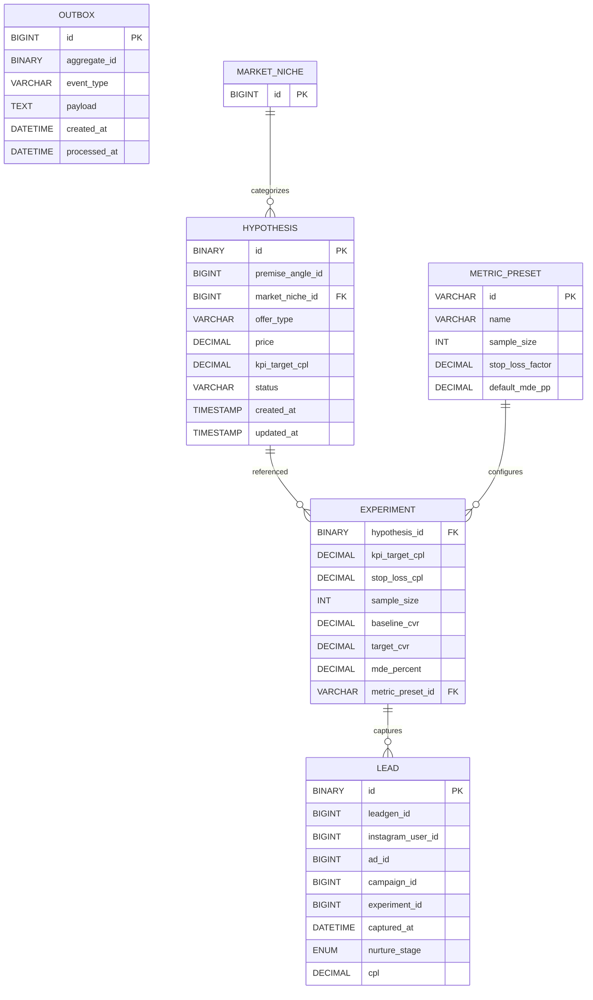

# MarketingHub Data Model

This document summarizes the database schema derived from the Liquibase change logs in `backend/ads-service/src/main/resources/db/changelog`.

## Tables

### hypothesis
- `id` BINARY(16) PRIMARY KEY
- `title` VARCHAR(255) NOT NULL
- `premise_angle_id` BIGINT NOT NULL
- `offer_type` VARCHAR(20) NOT NULL
- `price` DECIMAL(6,2)
- `kpi_target_cpl` DECIMAL(7,2) NOT NULL
- `status` VARCHAR(20) DEFAULT 'BACKLOG'
- `created_at` TIMESTAMP DEFAULT CURRENT_TIMESTAMP
- `updated_at` TIMESTAMP DEFAULT CURRENT_TIMESTAMP ON UPDATE CURRENT_TIMESTAMP
- `market_niche_id` BIGINT NOT NULL (FK `fk_hypothesis_niche`)

### experiment
Columns added via change logs:
- `hypothesis_id` BINARY(16) NOT NULL (FK `fk_experiment_hypothesis`)
- `kpi_target_cpl` DECIMAL(10,2) DEFAULT 45.00
- `stop_loss_cpl` DECIMAL(10,2) DEFAULT 90.00
- `sample_size` INT DEFAULT 1500
- `baseline_cvr` DECIMAL(5,2) DEFAULT 3.00
- `target_cvr` DECIMAL(5,2) DEFAULT 5.00
- `mde_percent` DECIMAL(5,2) DEFAULT 40.0
- `metric_preset_id` VARCHAR(50) (FK `fk_experiment_metric_preset`)

### lead
- `id` BINARY(16) PRIMARY KEY
- `leadgen_id` BIGINT UNIQUE
- `instagram_user_id` BIGINT
- `ad_id` BIGINT
- `campaign_id` BIGINT
- `experiment_id` BIGINT
- `captured_at` DATETIME
- `nurture_stage` ENUM('NEW','WARM','HOT') DEFAULT 'NEW'
- `cpl` DECIMAL(10,2)

### outbox
- `id` BIGINT PRIMARY KEY AUTO_INCREMENT
- `aggregate_id` BINARY(16)
- `event_type` VARCHAR(50)
- `payload` TEXT
- `created_at` DATETIME NOT NULL DEFAULT CURRENT_TIMESTAMP
- `processed_at` DATETIME

### metric_preset
- `id` VARCHAR(50) PRIMARY KEY
- `name` VARCHAR(100)
- `sample_size` INT
- `stop_loss_factor` DECIMAL(5,2)
- `default_mde_pp` DECIMAL(5,2)

Additional change logs add foreign keys to existing `creative_variants` and `ad_set` tables linking them to `experiment`.

## Diagram

