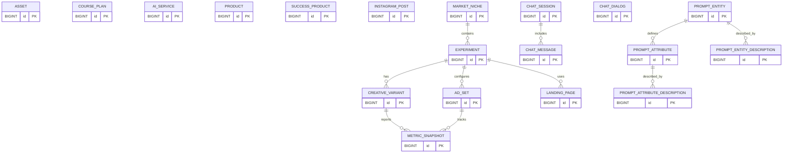

# MarketingHub Data Model

This document summarizes the current database schema defined in `schema.sql`.

## Tables

### asset

- `id` BIGINT AUTO_INCREMENT PRIMARY KEY
- `type` VARCHAR(20)
- `provider` VARCHAR(20)
- `external_id` VARCHAR(100)
- `status` VARCHAR(20)
- `url` VARCHAR(500)
- `payload` TEXT
- `campaign_id` BIGINT
- `created_at` TIMESTAMP DEFAULT CURRENT_TIMESTAMP
- `updated_at` TIMESTAMP DEFAULT CURRENT_TIMESTAMP ON UPDATE CURRENT_TIMESTAMP

### course_plan

- `id` BIGINT AUTO_INCREMENT PRIMARY KEY
- `target_audience` VARCHAR(255)
- `transformation` VARCHAR(255)
- `macro_topics` TEXT
- `modules` TEXT
- `objectives` TEXT
- `resources` TEXT
- `created_at` TIMESTAMP DEFAULT CURRENT_TIMESTAMP
- `updated_at` TIMESTAMP DEFAULT CURRENT_TIMESTAMP ON UPDATE CURRENT_TIMESTAMP

### ai_service

- `id` BIGINT AUTO_INCREMENT PRIMARY KEY
- `name` VARCHAR(255)
- `objective` LONGTEXT
- `url` VARCHAR(255)
- `phase` VARCHAR(255)
- `price` DECIMAL(10,2)
- `cost` DECIMAL(10,2)
- `observation` LONGTEXT
- `created_at` TIMESTAMP DEFAULT CURRENT_TIMESTAMP
- `updated_at` TIMESTAMP DEFAULT CURRENT_TIMESTAMP ON UPDATE CURRENT_TIMESTAMP

### product

- `id` BIGINT AUTO_INCREMENT PRIMARY KEY
- `niche` VARCHAR(255)
- `avatar` VARCHAR(255)
- `instagram_account_id` BIGINT
- `explicit_pain` LONGTEXT
- `promise` LONGTEXT
- `unique_mechanism` LONGTEXT
- `tripwire` LONGTEXT
- `risk_reversal` LONGTEXT
- `social_proof` LONGTEXT
- `checkout_monetization` LONGTEXT
- `funnel` LONGTEXT
- `creative_volume` LONGTEXT
- `storytelling` LONGTEXT
- `ai_cost` DECIMAL(10,2) DEFAULT 0
- `created_at` TIMESTAMP DEFAULT CURRENT_TIMESTAMP
- `updated_at` TIMESTAMP DEFAULT CURRENT_TIMESTAMP ON UPDATE CURRENT_TIMESTAMP

### success_product

- `id` BIGINT AUTO_INCREMENT PRIMARY KEY
- `description` LONGTEXT
- `name` VARCHAR(255)
- `novo` BOOLEAN DEFAULT TRUE
- `platform` VARCHAR(20) NOT NULL DEFAULT 'COFRE'
- `niche` VARCHAR(255)
- `avatar` VARCHAR(255)
- `audience_type` VARCHAR(255)
- `sales_page_url` VARCHAR(500)
- `instagram_url` VARCHAR(500)
- `facebook_url` VARCHAR(500)
- `youtube_url` VARCHAR(500)
- `instagram_account_id` BIGINT
- `explicit_pain` LONGTEXT
- `promise` LONGTEXT
- `unique_mechanism` LONGTEXT
- `tripwire` LONGTEXT
- `risk_reversal` LONGTEXT
- `social_proof` LONGTEXT
- `checkout_monetization` LONGTEXT
- `sales_funnel` LONGTEXT
- `creative_volume` LONGTEXT
- `storytelling` LONGTEXT
- `created_at` TIMESTAMP DEFAULT CURRENT_TIMESTAMP
- `updated_at` TIMESTAMP DEFAULT CURRENT_TIMESTAMP ON UPDATE CURRENT_TIMESTAMP

### instagram_post

- `id` BIGINT AUTO_INCREMENT PRIMARY KEY
- `instagram_account_id` BIGINT
- `caption` TEXT
- `media_url` VARCHAR(500)
- `created_at` TIMESTAMP DEFAULT CURRENT_TIMESTAMP
- `updated_at` TIMESTAMP DEFAULT CURRENT_TIMESTAMP ON UPDATE CURRENT_TIMESTAMP

### market_niche

- `id` BIGINT AUTO_INCREMENT PRIMARY KEY
- `name` VARCHAR(255)
- `description` LONGTEXT
- `demand_volume` LONGTEXT
- `promises` LONGTEXT
- `offers` LONGTEXT
- `hypotheses_to_generate` INT
- `base_segmentation` LONGTEXT
- `interests` LONGTEXT
- `demographic_filters` LONGTEXT
- `extra_tips` LONGTEXT
- `chat_dialog_id` BIGINT
- `created_at` TIMESTAMP DEFAULT CURRENT_TIMESTAMP
- `updated_at` TIMESTAMP DEFAULT CURRENT_TIMESTAMP ON UPDATE CURRENT_TIMESTAMP

### experiment

- `id` BIGINT AUTO_INCREMENT PRIMARY KEY
- `niche_id` BIGINT NOT NULL
- `name` VARCHAR(255) NOT NULL
- `hypothesis` VARCHAR(255)
- `kpi_target_cpl` DECIMAL(10,2) DEFAULT 45.00
- `stop_loss_cpl` DECIMAL(10,2) DEFAULT 90.00
- `sample_size` INT DEFAULT 1500
- `baseline_cvr` DECIMAL(5,2) DEFAULT 3.00
- `target_cvr` DECIMAL(5,2) DEFAULT 5.00
- `mde_percent` DECIMAL(5,2) DEFAULT 40.0
- `start_date` DATE
- `end_date` DATE
- `status` VARCHAR(20)
- `platform` VARCHAR(50)
- `sales_funnel_id` BINARY(16)
- `created_at` TIMESTAMP DEFAULT CURRENT_TIMESTAMP
- `updated_at` TIMESTAMP DEFAULT CURRENT_TIMESTAMP ON UPDATE CURRENT_TIMESTAMP

### creative_variant

- `id` BIGINT AUTO_INCREMENT PRIMARY KEY
- `experiment_id` BIGINT
- `type` VARCHAR(20)
- `asset_url` VARCHAR(500)
- `titles` LONGTEXT
- `descriptions` LONGTEXT
- `created_at` TIMESTAMP DEFAULT CURRENT_TIMESTAMP
- `updated_at` TIMESTAMP DEFAULT CURRENT_TIMESTAMP ON UPDATE CURRENT_TIMESTAMP

### ad_set

- `id` BIGINT AUTO_INCREMENT PRIMARY KEY
- `experiment_id` BIGINT
- `location` VARCHAR(255)
- `interests` LONGTEXT
- `lookalikes` LONGTEXT
- `budget` DECIMAL(10,2)
- `duration_days` INT
- `created_at` TIMESTAMP DEFAULT CURRENT_TIMESTAMP
- `updated_at` TIMESTAMP DEFAULT CURRENT_TIMESTAMP ON UPDATE CURRENT_TIMESTAMP

### metric_snapshot

- `id` BIGINT AUTO_INCREMENT PRIMARY KEY
- `creative_id` BIGINT
- `ad_set_id` BIGINT
- `impressions` INT
- `clicks` INT
- `cost` DECIMAL(10,2)
- `roas` DECIMAL(10,2)
- `ctr` DOUBLE
- `cpa` DECIMAL(10,2)
- `created_at` TIMESTAMP DEFAULT CURRENT_TIMESTAMP

### landing_page

- `id` BIGINT AUTO_INCREMENT PRIMARY KEY
- `experiment_id` BIGINT NOT NULL
- `url` VARCHAR(500)
- `type` VARCHAR(20)
- `status` VARCHAR(20)
- `created_at` TIMESTAMP DEFAULT CURRENT_TIMESTAMP
- `updated_at` TIMESTAMP DEFAULT CURRENT_TIMESTAMP ON UPDATE CURRENT_TIMESTAMP

### chat_session

- `id` BIGINT AUTO_INCREMENT PRIMARY KEY
- `user_id` VARCHAR(255)
- `channel` VARCHAR(50)
- `state` VARCHAR(20)
- `created_at` TIMESTAMP DEFAULT CURRENT_TIMESTAMP
- `updated_at` TIMESTAMP DEFAULT CURRENT_TIMESTAMP ON UPDATE CURRENT_TIMESTAMP

### chat_message

- `id` BIGINT AUTO_INCREMENT PRIMARY KEY
- `session_id` BIGINT
- `origin` VARCHAR(50)
- `content` LONGTEXT
- `created_at` TIMESTAMP DEFAULT CURRENT_TIMESTAMP
- `updated_at` TIMESTAMP DEFAULT CURRENT_TIMESTAMP ON UPDATE CURRENT_TIMESTAMP

### chat_dialog

- `id` BIGINT AUTO_INCREMENT PRIMARY KEY
- `url` VARCHAR(500)
- `description` LONGTEXT
- `theme` VARCHAR(255)
- `created_at` TIMESTAMP DEFAULT CURRENT_TIMESTAMP
- `updated_at` TIMESTAMP DEFAULT CURRENT_TIMESTAMP ON UPDATE CURRENT_TIMESTAMP

### prompt_entity

- `id` BIGINT AUTO_INCREMENT PRIMARY KEY
- `name` VARCHAR(255) UNIQUE
- `created_at` TIMESTAMP DEFAULT CURRENT_TIMESTAMP
- `updated_at` TIMESTAMP DEFAULT CURRENT_TIMESTAMP ON UPDATE CURRENT_TIMESTAMP

### prompt_attribute

- `id` BIGINT AUTO_INCREMENT PRIMARY KEY
- `prompt_entity_id` BIGINT
- `name` VARCHAR(255)
- `version` INT
- `created_at` TIMESTAMP DEFAULT CURRENT_TIMESTAMP
- `updated_at` TIMESTAMP DEFAULT CURRENT_TIMESTAMP ON UPDATE CURRENT_TIMESTAMP

### prompt_entity_description

- `id` BIGINT AUTO_INCREMENT PRIMARY KEY
- `prompt_entity_id` BIGINT
- `description` LONGTEXT
- `version` INT
- `active` BOOLEAN
- `created_at` TIMESTAMP DEFAULT CURRENT_TIMESTAMP
- `updated_at` TIMESTAMP DEFAULT CURRENT_TIMESTAMP ON UPDATE CURRENT_TIMESTAMP

### prompt_attribute_description

- `id` BIGINT AUTO_INCREMENT PRIMARY KEY
- `prompt_attribute_id` BIGINT
- `description` LONGTEXT
- `version` INT
- `active` BOOLEAN
- `created_at` TIMESTAMP DEFAULT CURRENT_TIMESTAMP
- `updated_at` TIMESTAMP DEFAULT CURRENT_TIMESTAMP ON UPDATE CURRENT_TIMESTAMP

## Diagram

