| stimulus_type | VARCHAR(255) | Tipo do estímulo aplicado no passo da jornada |

This document summarizes the current database schema defined in `schema.sql`.
It also highlights the tables used by the [Facebook Ads Worker](../facebook-ads-worker/README.md)
for managing campaigns and tracking their performance.

For a mapping between frontend screens and these entities, see [Frontend Screens and Entities](./frontend-screens-entities.md).

## Tables

### asset

- `id` BIGINT AUTO_INCREMENT PRIMARY KEY
- `type` VARCHAR(20)
- `provider` VARCHAR(20)
- `external_id` VARCHAR(100)
- `status` VARCHAR(20)
- `url` VARCHAR(500)
- `payload` TEXT
- `campaign_id` BIGINT
- `created_at` TIMESTAMP DEFAULT CURRENT_TIMESTAMP
- `updated_at` TIMESTAMP DEFAULT CURRENT_TIMESTAMP ON UPDATE CURRENT_TIMESTAMP

### course_plan

- `id` BIGINT AUTO_INCREMENT PRIMARY KEY
- `target_audience` VARCHAR(255)
- `transformation` VARCHAR(255)
- `macro_topics` TEXT
- `modules` TEXT
- `objectives` TEXT
- `resources` TEXT
- `created_at` TIMESTAMP DEFAULT CURRENT_TIMESTAMP
- `updated_at` TIMESTAMP DEFAULT CURRENT_TIMESTAMP ON UPDATE CURRENT_TIMESTAMP

### ai_service

- `id` BIGINT AUTO_INCREMENT PRIMARY KEY
- `name` VARCHAR(255)
- `objective` LONGTEXT
- `url` VARCHAR(255)
- `phase` VARCHAR(255)
- `price` DECIMAL(10,2)
- `cost` DECIMAL(10,2)
- `observation` LONGTEXT
- `created_at` TIMESTAMP DEFAULT CURRENT_TIMESTAMP
- `updated_at` TIMESTAMP DEFAULT CURRENT_TIMESTAMP ON UPDATE CURRENT_TIMESTAMP

### ai_worker_generation

- `id` BIGINT AUTO_INCREMENT PRIMARY KEY
- `domain` VARCHAR(100)
- `reference_id` VARCHAR(100)
- `model` VARCHAR(191)
- `prompt` LONGTEXT
- `raw_response` LONGTEXT
- `input_tokens` INT
- `output_tokens` INT
- `cost_usd` DECIMAL(10,4)
- `created_at` TIMESTAMP DEFAULT CURRENT_TIMESTAMP

Stores every AI worker output alongside the original prompt, raw response and
token usage to estimate the associated cost.

### product

- `id` BIGINT AUTO_INCREMENT PRIMARY KEY
- `niche` VARCHAR(255)
- `avatar` VARCHAR(255)
- `instagram_account_id` BIGINT
- `market_niche_id` BIGINT
- `explicit_pain` LONGTEXT
- `promise` LONGTEXT
- `unique_mechanism` LONGTEXT
- `tripwire` LONGTEXT
- `risk_reversal` LONGTEXT
- `social_proof` LONGTEXT
- `checkout_monetization` LONGTEXT
- `funnel` LONGTEXT
- `creative_volume` LONGTEXT
- `storytelling` LONGTEXT
- `ai_cost` DECIMAL(10,2) DEFAULT 0
- `created_at` TIMESTAMP DEFAULT CURRENT_TIMESTAMP
- `updated_at` TIMESTAMP DEFAULT CURRENT_TIMESTAMP ON UPDATE CURRENT_TIMESTAMP

### member_area

- `id` BIGINT AUTO_INCREMENT PRIMARY KEY
- `product_id` BIGINT NOT NULL REFERENCES `product(id)`
- `name` VARCHAR(255)
- `access_url` VARCHAR(500)
- `description` LONGTEXT
- `created_at` TIMESTAMP DEFAULT CURRENT_TIMESTAMP
- `updated_at` TIMESTAMP DEFAULT CURRENT_TIMESTAMP ON UPDATE CURRENT_TIMESTAMP

### app_idea

- `id` BIGINT AUTO_INCREMENT PRIMARY KEY
- `name` VARCHAR(255)
- `market_niche_id` BIGINT NOT NULL REFERENCES `market_niche(id)`
- `target_audience` VARCHAR(255)
- `problem_to_solve` LONGTEXT
- `value_proposition` LONGTEXT
- `core_features` LONGTEXT
- `differentiator` LONGTEXT
- `monetization` LONGTEXT
- `go_to_market` LONGTEXT
- `technology_stack` LONGTEXT
- `model` VARCHAR(255)
- `prompt` LONGTEXT
- `created_at` TIMESTAMP DEFAULT CURRENT_TIMESTAMP
- `updated_at` TIMESTAMP DEFAULT CURRENT_TIMESTAMP ON UPDATE CURRENT_TIMESTAMP

Each record belongs to exactly one entry in `market_niche`, enabling a niche to
aggregate many associated application ideas.

### success_product

- `id` BIGINT AUTO_INCREMENT PRIMARY KEY
- `description` LONGTEXT
- `name` VARCHAR(255)
- `novo` BOOLEAN DEFAULT TRUE
- `platform` VARCHAR(20) NOT NULL DEFAULT 'COFRE'
- `generate_niche_hypothesis` BOOLEAN DEFAULT FALSE
- `niche` VARCHAR(255)
- `avatar` VARCHAR(255)
- `audience_type` VARCHAR(255)
- `sales_page_url` VARCHAR(500)
- `instagram_url` VARCHAR(500)
- `facebook_url` VARCHAR(500)
- `youtube_url` VARCHAR(500)
- `instagram_account_id` BIGINT
- `explicit_pain` LONGTEXT
- `promise` LONGTEXT
- `unique_mechanism` LONGTEXT
- `tripwire` LONGTEXT
- `risk_reversal` LONGTEXT
- `social_proof` LONGTEXT
- `checkout_monetization` LONGTEXT
- `sales_funnel` LONGTEXT
- `creative_volume` LONGTEXT
- `storytelling` LONGTEXT
- `created_at` TIMESTAMP DEFAULT CURRENT_TIMESTAMP
- `updated_at` TIMESTAMP DEFAULT CURRENT_TIMESTAMP ON UPDATE CURRENT_TIMESTAMP

### instagram_post

- `id` BIGINT AUTO_INCREMENT PRIMARY KEY
- `instagram_account_id` BIGINT
- `caption` TEXT
- `media_url` VARCHAR(500)
- `created_at` TIMESTAMP DEFAULT CURRENT_TIMESTAMP
- `updated_at` TIMESTAMP DEFAULT CURRENT_TIMESTAMP ON UPDATE CURRENT_TIMESTAMP

### market_niche

- `id` BIGINT AUTO_INCREMENT PRIMARY KEY
- `name` VARCHAR(255)
- `description` LONGTEXT
- `demand_volume` LONGTEXT
- `promises` LONGTEXT
- `offers` LONGTEXT
- `cost` DECIMAL(10,2)
- `expense` DECIMAL(10,2)
- `hypotheses_to_generate` INT
- `audiences_to_generate` INT
- `base_segmentation` LONGTEXT
- `interests` LONGTEXT
- `demographic_filters` LONGTEXT
- `extra_tips` LONGTEXT
- `chat_dialog_id` BIGINT
- `created_at` TIMESTAMP DEFAULT CURRENT_TIMESTAMP
- `updated_at` TIMESTAMP DEFAULT CURRENT_TIMESTAMP ON UPDATE CURRENT_TIMESTAMP

### deliverable

- `id` BIGINT AUTO_INCREMENT PRIMARY KEY
- `market_niche_id` BIGINT NOT NULL REFERENCES `market_niche(id)`
- `title` VARCHAR(255) NOT NULL
- `description` LONGTEXT
- `content` LONGTEXT
- `model` VARCHAR(255)
- `prompt` LONGTEXT NOT NULL
- `created_at` TIMESTAMP DEFAULT CURRENT_TIMESTAMP
- `updated_at` TIMESTAMP DEFAULT CURRENT_TIMESTAMP ON UPDATE CURRENT_TIMESTAMP

Stores each deliverable generated for a niche, including the AI model and
prompt used to produce it.

### deliverable_package

- `id` BIGINT AUTO_INCREMENT PRIMARY KEY
- `experiment_id` BIGINT NOT NULL REFERENCES `experiment(id)`
- `name` VARCHAR(255) NOT NULL
- `description` LONGTEXT
- `model` VARCHAR(255)
- `prompt` LONGTEXT NOT NULL
- `created_at` TIMESTAMP DEFAULT CURRENT_TIMESTAMP
- `updated_at` TIMESTAMP DEFAULT CURRENT_TIMESTAMP ON UPDATE CURRENT_TIMESTAMP

Represents curated bundles of deliverables attached to an experiment.

### deliverable_package_item

- `deliverable_package_id` BIGINT NOT NULL REFERENCES `deliverable_package(id)`
- `deliverable_id` BIGINT NOT NULL REFERENCES `deliverable(id)`
- PRIMARY KEY (`deliverable_package_id`, `deliverable_id`)

Join table that links packages to the deliverables they include.

### image_deliverable_package

- `id` BIGINT AUTO_INCREMENT PRIMARY KEY
- `lead_id` BINARY(16) NOT NULL REFERENCES `lead(id)`
- `input_asset_id` BIGINT NOT NULL REFERENCES `asset(id)`
- `status` VARCHAR(30) NOT NULL
- `planned_outputs` INT
- `free_images` INT NOT NULL DEFAULT 0
- `model` VARCHAR(255)
- `prompt` LONGTEXT NOT NULL
- `created_at` TIMESTAMP DEFAULT CURRENT_TIMESTAMP
- `updated_at` TIMESTAMP DEFAULT CURRENT_TIMESTAMP ON UPDATE CURRENT_TIMESTAMP

Registers the batch of images generated from a lead submission, keeping the
input asset, processing status and publishing details for the vitrine.

### image_deliverable_item

- `id` BIGINT AUTO_INCREMENT PRIMARY KEY
- `package_id` BIGINT NOT NULL REFERENCES `image_deliverable_package(id)`
- `asset_id` BIGINT NOT NULL REFERENCES `asset(id)`
- `access_type` VARCHAR(20) NOT NULL
- `position_index` INT NOT NULL
- `created_at` TIMESTAMP DEFAULT CURRENT_TIMESTAMP

Stores each generated image associated with a package, including its
access type (free or premium) and display order.

### hypothesis

- `id` BINARY(16) PRIMARY KEY
- `experiment_id` BIGINT NOT NULL
- `market_niche_id` BIGINT NOT NULL
- `title` VARCHAR(255) NOT NULL
- `premise_angle_id` BIGINT NOT NULL
- `offer_type` VARCHAR(20) NOT NULL
- `entrega` LONGTEXT
- `price` DECIMAL(6,2)
- `kpi_target_cpl` DECIMAL(7,2) NOT NULL
- `cost` DECIMAL(10,2)
- `expense` DECIMAL(10,2)
- `status` VARCHAR(20) DEFAULT 'BACKLOG' NOT NULL
- `created_at` TIMESTAMP DEFAULT CURRENT_TIMESTAMP
- `updated_at` TIMESTAMP DEFAULT CURRENT_TIMESTAMP ON UPDATE CURRENT_TIMESTAMP

### audience

- `id` BIGINT AUTO_INCREMENT PRIMARY KEY
- `name` VARCHAR(255)
- `description` LONGTEXT
- `prompt` LONGTEXT
- `model` VARCHAR(255)
- `approved` BOOLEAN DEFAULT FALSE
- `market_niche_id` BIGINT
- `hypothesis_id` BINARY(16)
- `created_at` TIMESTAMP DEFAULT CURRENT_TIMESTAMP
- `updated_at` TIMESTAMP DEFAULT CURRENT_TIMESTAMP ON UPDATE CURRENT_TIMESTAMP

Tracks the audiences generated for each market niche or hypothesis. The
`approved` flag lets the marketing team validate individual segments before
triggering ad set generation.

### experiment

- `id` BIGINT AUTO_INCREMENT PRIMARY KEY
- `niche_id` BIGINT NOT NULL
- `hypothesis_id` BINARY(16) NOT NULL
- `name` VARCHAR(255) NOT NULL
- `hypothesis` VARCHAR(255)
- `facebook_page_id` BIGINT
- `facebook_instant_form_id` BIGINT
- `facebook_pixel_id` VARCHAR(64)
- `facebook_pixel_code` LONGTEXT
- `facebook_pixel_created_at` TIMESTAMP
- `facebook_release_requested_at` DATETIME
- `funnel_reset_at` DATETIME(6)
- `follow_up_action_url` VARCHAR(512)
- `lead_portal_flow_model` VARCHAR(191)
- `lead_portal_flow_id` BIGINT
- `selected_sample_email_id` BIGINT
- `image_model_id` BIGINT
- `image_model_quality_id` BIGINT
- `instagram_account_id` BIGINT
- `metric_preset_id` VARCHAR(50)
- `kpi_target_cpl` DECIMAL(10,2) DEFAULT 45.00
- `stop_loss_cpl` DECIMAL(10,2) DEFAULT 90.00
- `sample_size` INT DEFAULT 1500
- `baseline_cvr` DECIMAL(5,2) DEFAULT 3.00
- `target_cvr` DECIMAL(5,2) DEFAULT 5.00
- `mde_percent` DECIMAL(5,2) DEFAULT 40.0
- `daily_budget` DECIMAL(10,2)
- `unit_price_brl` DECIMAL(10,2)
- `cost` DECIMAL(10,2)
- `total_cost` DECIMAL(12,2)
- `expense` DECIMAL(10,2)
- `creatives_to_generate` INT
- `instant_forms_to_generate` INT
- `emails_to_generate` INT
- `sample_emails_to_generate` INT
- `deliverables_to_generate` INT
- `lead_portal_flows_to_generate` INT
- `images_per_package` INT NOT NULL DEFAULT 20
- `open_images_per_package` INT
- `compressed_images_per_package` INT
- `start_date` DATE
- `end_date` DATE
- `status` VARCHAR(32)
- `platform` VARCHAR(50)
- `stage` VARCHAR(32) NOT NULL DEFAULT 'AD'
- `creative_generation_mode` VARCHAR(32) NOT NULL DEFAULT 'DEFAULT'
- `primary_variable` VARCHAR(191)
- `primary_metric` VARCHAR(191)
- `creative_approved` BOOLEAN DEFAULT FALSE
- `journey_template_id` BIGINT NOT NULL
- `creative_text_prompt` LONGTEXT
- `creative_image_prompt` LONGTEXT
- `campaign_angle` LONGTEXT
- `ad_copy` LONGTEXT
- `ad_image_briefing` LONGTEXT
- `landing_page_copy` LONGTEXT
- `landing_page_wireframe` LONGTEXT
- `created_at` TIMESTAMP DEFAULT CURRENT_TIMESTAMP
- `updated_at` TIMESTAMP DEFAULT CURRENT_TIMESTAMP ON UPDATE CURRENT_TIMESTAMP

Defines a marketing experiment for a specific niche and hypothesis. Each
experiment aggregates the creative variants, ad sets, landing pages and lead
capture assets that will be executed and measured during the test cycle.

**Relationships**

- `hypothesis_id` → FK `hypothesis.id`: associação obrigatória com a hipótese
  validada para o experimento.
- `facebook_page_id` → FK `fb_page.id`: página utilizada para publicar anúncios
  quando o experimento precisa sobrescrever o padrão da conta.
- `facebook_instant_form_id` → FK `fb_instant_form.id`: instant form padrão
  reutilizado para as campanhas ligadas ao experimento.
- `lead_portal_flow_id` → FK `lead_portal_flow.id`: define o fluxo do Portal
  Lead usado para captação e coleta de respostas.
- `follow_up_action_url` padroniza a URL de agradecimento para os instant
  forms e jornadas de conversão do experimento.
- `selected_sample_email_id` → FK `experiment_sample_email.id`: e-mail de
  amostra escolhido para notificações e fluxos de follow-up.
- `image_model_id` → FK `image_generation_model.id` e
  `image_model_quality_id` → FK `image_generation_quality.id`: controla o
  provedor e a qualidade configurada para geração de imagens no pipeline.
- `metric_preset_id` → FK `metric_preset.id`: preset opcional para preencher
  automaticamente metas de métricas (amostra, stop loss e MDE).
- `journey_template_id` → FK `journey_template.id`: vínculo obrigatório com o
  blueprint de jornada aprovado para campanhas omnichannel.
- `instagram_account_id` → FK `ig_account.id`: conta de Instagram usada para
  publicação quando a estratégia inclui posicionamentos dessa rede.

### lead_portal_flow

- `id` BIGINT AUTO_INCREMENT PRIMARY KEY
- `name` VARCHAR(150) NOT NULL
- `slug` VARCHAR(120) NOT NULL UNIQUE
- `description` VARCHAR(500)
- `model` VARCHAR(128)
- `prompt` LONGTEXT
- `experiment_id` BIGINT → FK `experiment.id`
- `simple_form_style_id` BIGINT → FK `lead_portal_simple_form_style.id`
- `approved` TINYINT(1) DEFAULT 0
- `approved_at` TIMESTAMP
- `created_at` TIMESTAMP DEFAULT CURRENT_TIMESTAMP
- `updated_at` TIMESTAMP DEFAULT CURRENT_TIMESTAMP ON UPDATE CURRENT_TIMESTAMP

Representa o fluxo configurado no Portal Lead. Cada fluxo é identificado por um
`slug` único que pode ser consumido pela aplicação externa para carregar as
perguntas corretas e instruções de coleta de dados. Os campos `model` e `prompt`
armazenam o histórico de geração realizado pelo Worker IA, enquanto
`experiment_id` associa o fluxo ao experimento que solicitou sua geração e
`approved/approved_at` registram quando o fluxo foi validado para uso em
campanhas.

### lead_portal_simple_form_style

- `id` BIGINT AUTO_INCREMENT PRIMARY KEY
- `name` VARCHAR(150) NOT NULL
- `slug` VARCHAR(120) NOT NULL UNIQUE
- `description` VARCHAR(500)
- `text_model` VARCHAR(128)
- `text_prompt` LONGTEXT
- `text_parameters` LONGTEXT
- `image_model` VARCHAR(128)
- `image_prompt` LONGTEXT
- `image_negative_prompt` LONGTEXT
- `image_parameters` LONGTEXT
- `image_batch_size` INT
- `image_aspect_ratio` VARCHAR(32)
- `preview_image_url` VARCHAR(512)
- `definition` LONGTEXT
- `created_at` TIMESTAMP DEFAULT CURRENT_TIMESTAMP
- `updated_at` TIMESTAMP DEFAULT CURRENT_TIMESTAMP ON UPDATE CURRENT_TIMESTAMP

Catálogo de estilos visuais aplicados ao formulário simples do Lead Portal. O campo
`definition` guarda o JSON com as cores, gradientes e tokens de layout que serão
expostos para os usuários, enquanto os blocos `text_*` e `image_*` registram os
prompts e parâmetros usados para gerar o estilo (copy e imagens decorativas) em
lote pelos modelos de IA.

### lead_portal_flow_question

- `id` BIGINT AUTO_INCREMENT PRIMARY KEY
- `flow_id` BIGINT NOT NULL → FK `lead_portal_flow.id`
- `title` VARCHAR(255) NOT NULL
- `data_key` VARCHAR(120) NOT NULL
- `type` VARCHAR(40) NOT NULL
- `required` BOOLEAN NOT NULL
- `description` VARCHAR(500)
- `placeholder` VARCHAR(255)
- `position_index` INT NOT NULL

Agrupa as perguntas que compõem um fluxo do portal. O campo `data_key` é único
por fluxo e identifica o atributo que será preenchido pelo lead. O tipo de
pergunta define o formato esperado (texto, múltipla escolha, upload de imagem
etc.).

### lead_portal_flow_question_option

- `id` BIGINT AUTO_INCREMENT PRIMARY KEY
- `question_id` BIGINT NOT NULL → FK `lead_portal_flow_question.id`
- `option_order` INT NOT NULL
- `option_value` VARCHAR(255) NOT NULL
- UNIQUE (`question_id`, `option_order`)

Armazena as opções ordenadas de perguntas do tipo seleção única ou múltipla.
Quando a pergunta for removida, as opções correspondentes são excluídas em
efeito cascata. A restrição de unicidade em (`question_id`, `option_order`)
preserva a ordenação dentro de cada pergunta e evita duplicidades durante a
edição do fluxo.

### lead_portal_submission

- `id` BIGINT AUTO_INCREMENT PRIMARY KEY
- `flow_id` BIGINT NOT NULL → FK `lead_portal_flow.id`
- `experiment_id` BIGINT → FK `experiment.id`
- `lead_id` BINARY(16) → FK `lead.id`
- `status` VARCHAR(20) DEFAULT 'COMPLETED'
- `source` VARCHAR(64)
- `primary_contact_name` VARCHAR(255)
- `primary_contact_email` VARCHAR(320)
- `primary_contact_phone` VARCHAR(40)
- `utm_source` VARCHAR(100)
- `utm_medium` VARCHAR(100)
- `utm_campaign` VARCHAR(150)
- `utm_content` VARCHAR(150)
- `utm_term` VARCHAR(150)
- `submitted_at` TIMESTAMP DEFAULT CURRENT_TIMESTAMP
- `created_at` TIMESTAMP DEFAULT CURRENT_TIMESTAMP
- `updated_at` TIMESTAMP DEFAULT CURRENT_TIMESTAMP ON UPDATE CURRENT_TIMESTAMP

Guarda cada submissão concluída no Portal Lead. O registro vincula o fluxo que
originou o formulário, opcionalmente referencia o experimento que disparou a
captação e preserva um resumo rápido dos dados de contato e parâmetros UTM
usados na origem da lead.

### lead_portal_submission_answer

- `id` BIGINT AUTO_INCREMENT PRIMARY KEY
- `submission_id` BIGINT NOT NULL → FK `lead_portal_submission.id`
- `question_id` BIGINT NOT NULL → FK `lead_portal_flow_question.id`
- `data_key_snapshot` VARCHAR(120) NOT NULL
- `text_value` LONGTEXT
- `number_value` DECIMAL(18,4)
- `date_value` DATE
- `boolean_value` TINYINT(1)
- `selected_option_id` BIGINT → FK `lead_portal_flow_question_option.id`
- `asset_id` BIGINT → FK `asset.id`
- `created_at` TIMESTAMP DEFAULT CURRENT_TIMESTAMP
- `updated_at` TIMESTAMP DEFAULT CURRENT_TIMESTAMP ON UPDATE CURRENT_TIMESTAMP

Normaliza as respostas de cada pergunta preenchida durante a submissão. O campo
`data_key_snapshot` congela o identificador lógico usado na coleta, permitindo
auditorias mesmo que o fluxo seja reordenado ou renomeado. Campos específicos
armazenam o valor em diferentes formatos (texto, número, data, booleano), além
de vínculos com opções pré-definidas e ativos de imagem enviados pelo usuário.

### lead_portal_submission_answer_option

- `answer_id` BIGINT NOT NULL → FK `lead_portal_submission_answer.id`
- `option_id` BIGINT NOT NULL → FK `lead_portal_flow_question_option.id`

Relaciona respostas do tipo múltipla escolha às opções marcadas pelo usuário.
Cada par (`answer_id`, `option_id`) é único, permitindo capturar quantas
alternativas forem selecionadas em perguntas de seleção múltipla.

### flow_submissions

- `id` CHAR(36) PRIMARY KEY
- `flow_slug` VARCHAR(190) NOT NULL
- `name` VARCHAR(255) NOT NULL
- `email` VARCHAR(255) NOT NULL
- `answers` LONGTEXT
- `image_question_key` VARCHAR(255)
- `stored_file_name` VARCHAR(255)
- `original_file_name` VARCHAR(255)
- `content_type` VARCHAR(255)
- `created_at` TIMESTAMP NOT NULL DEFAULT CURRENT_TIMESTAMP

Armazena cada submissão realizada diretamente no portal, incluindo o arquivo de
imagem enviado. O JSON em `answers` preserva as respostas do formulário enquanto
os campos de arquivo mantêm o nome gerado pelo storage, o nome original e o tipo
de conteúdo para uso posterior pelo pipeline de geração de criativos.

### flow_submission_image_package

- `id` BIGINT AUTO_INCREMENT PRIMARY KEY
- `submission_id` VARCHAR(36) NOT NULL → FK `flow_submissions.id`
- `status` VARCHAR(30) NOT NULL DEFAULT 'RECEIVED'
- `planned_outputs` INT
- `free_images` INT NOT NULL DEFAULT 0
- `model` VARCHAR(255)
- `prompt` LONGTEXT NOT NULL
- `created_at` TIMESTAMP DEFAULT CURRENT_TIMESTAMP
- `updated_at` TIMESTAMP DEFAULT CURRENT_TIMESTAMP ON UPDATE CURRENT_TIMESTAMP

Agrupa os derivados gerados a partir da imagem enviada na submissão. O status
segue o fluxo de processamento (recebido, processado, gerações com ou sem marca
d'água, falha), enquanto `planned_outputs` e `free_images` ajudam a controlar
quantas variações devem ser geradas e quais serão disponibilizadas
gratuitamente. O Marketing Hub exibe a fila de pacotes pendentes diretamente
desta tabela, substituindo o uso anterior de `image_deliverable_package` para
itens vindos do Lead Portal.

### flow_submission_image_item

- `id` BIGINT AUTO_INCREMENT PRIMARY KEY
- `package_id` BIGINT NOT NULL → FK `flow_submission_image_package.id`
- `asset_id` BIGINT NOT NULL → FK `asset.id`
- `access_type` VARCHAR(20) NOT NULL
- `position_index` INT NOT NULL
- `created_at` TIMESTAMP DEFAULT CURRENT_TIMESTAMP

Lista cada imagem derivada associada ao pacote, relacionando o ativo gravado no
storage com o tipo de acesso (gratuito com marca d'água ou premium sem marca
d'água). O índice de posição mantém a ordenação das variações apresentadas ao
cliente.

### fb_page

- `id` BIGINT AUTO_INCREMENT PRIMARY KEY
- `account_id` BIGINT NOT NULL → FK `fb_account.id`
- `page_id` VARCHAR(128) NOT NULL
- `name` VARCHAR(255) NOT NULL

Stores the Facebook Pages that were authorized for each Ads account. The
combination `(account_id, page_id)` is unique, ensuring the same page is not
registered twice for the same account. Experiments reference this table through
`experiment.facebook_page_id` when a campaign must run on a specific page.

### fb_instant_form

- `id` BIGINT AUTO_INCREMENT PRIMARY KEY
- `hypothesis_id` BINARY(16) NOT NULL → FK `hypothesis.id`
- `page_id` BIGINT NOT NULL → FK `fb_page.id`
- `form_id` VARCHAR(128) NOT NULL UNIQUE
- `name` VARCHAR(255) NOT NULL
- `status` VARCHAR(50)
- `locale` VARCHAR(12)
- `leads_count` BIGINT
- `created_time` DATETIME
- `updated_time` DATETIME
- `follow_up_action_url` VARCHAR(512)
- `privacy_policy_url` VARCHAR(512)
- `model` VARCHAR(128)
- `prompt` LONGTEXT
- `created_at` DATETIME DEFAULT CURRENT_TIMESTAMP
- `updated_at` DATETIME DEFAULT CURRENT_TIMESTAMP ON UPDATE CURRENT_TIMESTAMP

Captures the configuration of Meta Instant Forms (Lead Ads forms) planned for a
hypothesis. Each record stores the metadata returned by the Facebook Marketing
API, including locale, status and lead counts, and tracks the AI worker
prompt/model responsible for the form generation. Experiments can reuse these
forms through `experiment.facebook_instant_form_id` to keep capture journeys
consistent across tests.

### general_setting

- `id` BIGINT AUTO_INCREMENT PRIMARY KEY
- `name` VARCHAR(100) NOT NULL UNIQUE
- `value` LONGTEXT
- `created_at` DATETIME DEFAULT CURRENT_TIMESTAMP
- `updated_at` DATETIME DEFAULT CURRENT_TIMESTAMP ON UPDATE CURRENT_TIMESTAMP

Persists organization-wide configuration flags and URLs that need to be reused
across services. Keys are stored in lowercase and enforced as unique, allowing
the backend to serve defaults such as the privacy policy URL whenever an
Instant Form or integration omits a specific value.

### creative

- `id` BIGINT AUTO_INCREMENT PRIMARY KEY
- `experiment_id` BIGINT NOT NULL
- `headline` VARCHAR(255)
- `primary_text` VARCHAR(255)
- `image_url` VARCHAR(500)
- `ad_format` VARCHAR(32)
- `description` VARCHAR(255)
- `call_to_action` VARCHAR(32)
- `destination_url` VARCHAR(512)
- `instagram_user_id` VARCHAR(64)
- `image_hash` VARCHAR(255)
- `video_id` VARCHAR(255)
- `status` VARCHAR(20)

Stores ad creatives generated by the AI Worker for each experiment.
These records can later be sent to the Facebook API and are displayed on
the experiment detail page in the frontend.

### creative_variant

- `id` BIGINT AUTO_INCREMENT PRIMARY KEY
- `experiment_id` BIGINT
- `type` VARCHAR(20)
- `asset_url` VARCHAR(500)
- `titles` LONGTEXT
- `descriptions` LONGTEXT
- `created_at` TIMESTAMP DEFAULT CURRENT_TIMESTAMP
- `updated_at` TIMESTAMP DEFAULT CURRENT_TIMESTAMP ON UPDATE CURRENT_TIMESTAMP

Stores the individual assets generated for an experiment. The
`experiment_id` column is a foreign key to `experiment.id` and is optional to
allow variants to be created before an experiment is defined.

### ad_set

- `id` BIGINT AUTO_INCREMENT PRIMARY KEY
- `experiment_id` BIGINT
- `location` VARCHAR(255)
- `interests` LONGTEXT
- `lookalikes` LONGTEXT
- `targeting_json` LONGTEXT
- `budget` DECIMAL(10,2)
- `duration_days` INT
- `prompt` LONGTEXT
- `model` VARCHAR(255)
- `created_at` TIMESTAMP DEFAULT CURRENT_TIMESTAMP
- `updated_at` TIMESTAMP DEFAULT CURRENT_TIMESTAMP ON UPDATE CURRENT_TIMESTAMP

### metric_snapshot

- `id` BIGINT AUTO_INCREMENT PRIMARY KEY
- `creative_id` BIGINT
- `ad_set_id` BIGINT
- `impressions` INT
- `clicks` INT
- `cost` DECIMAL(10,2)
- `roas` DECIMAL(10,2)
- `ctr` DOUBLE
- `cpa` DECIMAL(10,2)
- `created_at` TIMESTAMP DEFAULT CURRENT_TIMESTAMP

### landing_page

- `id` BIGINT AUTO_INCREMENT PRIMARY KEY
- `experiment_id` BIGINT NOT NULL
- `url` VARCHAR(500)
- `type` VARCHAR(20)
- `status` VARCHAR(20)
- `created_at` TIMESTAMP DEFAULT CURRENT_TIMESTAMP
- `updated_at` TIMESTAMP DEFAULT CURRENT_TIMESTAMP ON UPDATE CURRENT_TIMESTAMP

### chat_session

- `id` BIGINT AUTO_INCREMENT PRIMARY KEY
- `user_id` VARCHAR(255)
- `channel` VARCHAR(50)
- `state` VARCHAR(20)
- `created_at` TIMESTAMP DEFAULT CURRENT_TIMESTAMP
- `updated_at` TIMESTAMP DEFAULT CURRENT_TIMESTAMP ON UPDATE CURRENT_TIMESTAMP

### chat_message

- `id` BIGINT AUTO_INCREMENT PRIMARY KEY
- `session_id` BIGINT
- `origin` VARCHAR(50)
- `content` LONGTEXT
- `created_at` TIMESTAMP DEFAULT CURRENT_TIMESTAMP
- `updated_at` TIMESTAMP DEFAULT CURRENT_TIMESTAMP ON UPDATE CURRENT_TIMESTAMP

### chat_dialog

- `id` BIGINT AUTO_INCREMENT PRIMARY KEY
- `url` VARCHAR(500)
- `description` LONGTEXT
- `theme` VARCHAR(255)
- `created_at` TIMESTAMP DEFAULT CURRENT_TIMESTAMP
- `updated_at` TIMESTAMP DEFAULT CURRENT_TIMESTAMP ON UPDATE CURRENT_TIMESTAMP

### prompt_entity

- `id` BIGINT AUTO_INCREMENT PRIMARY KEY
- `name` VARCHAR(255) UNIQUE
- `created_at` TIMESTAMP DEFAULT CURRENT_TIMESTAMP
- `updated_at` TIMESTAMP DEFAULT CURRENT_TIMESTAMP ON UPDATE CURRENT_TIMESTAMP

### prompt_attribute

- `id` BIGINT AUTO_INCREMENT PRIMARY KEY
- `prompt_entity_id` BIGINT
- `name` VARCHAR(255)
- `created_at` TIMESTAMP DEFAULT CURRENT_TIMESTAMP
- `updated_at` TIMESTAMP DEFAULT CURRENT_TIMESTAMP ON UPDATE CURRENT_TIMESTAMP

### prompt_entity_description

- `id` BIGINT AUTO_INCREMENT PRIMARY KEY
- `prompt_entity_id` BIGINT
- `description` LONGTEXT
- `active` BOOLEAN
- `created_at` TIMESTAMP DEFAULT CURRENT_TIMESTAMP
- `updated_at` TIMESTAMP DEFAULT CURRENT_TIMESTAMP ON UPDATE CURRENT_TIMESTAMP

### prompt_attribute_description

- `id` BIGINT AUTO_INCREMENT PRIMARY KEY
- `prompt_attribute_id` BIGINT
- `description` LONGTEXT
- `active` BOOLEAN
- `created_at` TIMESTAMP DEFAULT CURRENT_TIMESTAMP
- `updated_at` TIMESTAMP DEFAULT CURRENT_TIMESTAMP ON UPDATE CURRENT_TIMESTAMP

### hypothesis_prompt_attribute_description

- `hypothesis_id` BINARY(16)
- `prompt_attribute_description_id` BIGINT

### facebook_ads_campaign

- `id` CHAR(36) PRIMARY KEY
- `external_id` VARCHAR(64)
- `ad_account_id` VARCHAR(64) NOT NULL
- `experiment_id` BIGINT NOT NULL → FK `experiment.id`
- `facebook_account_id` BIGINT NOT NULL → FK `fb_account.id`
- `name` VARCHAR(255) NOT NULL
- `objective` VARCHAR(64) NOT NULL
- `status` ENUM(PAUSED,ACTIVE,ARCHIVED,DELETED) DEFAULT "PAUSED"
- `budget_mode` ENUM("CAMPAIGN","ADSET") NOT NULL
- `daily_budget_minor` BIGINT
- `lifetime_budget_minor` BIGINT
- `api_version` VARCHAR(16)
- `created_at` TIMESTAMP DEFAULT CURRENT_TIMESTAMP
- `updated_at` TIMESTAMP DEFAULT CURRENT_TIMESTAMP ON UPDATE CURRENT_TIMESTAMP

### facebook_ads_campaign_special_ad_category

- `campaign_id` CHAR(36)
- `category` ENUM(NONE,CREDIT,EMPLOYMENT,HOUSING,ISSUES_ELECTIONS_POLITICS)
- `PRIMARY KEY` (`campaign_id`, `category`)

### facebook_ads_campaign_special_ad_country

- `campaign_id` CHAR(36)
- `country_iso2` CHAR(2)
- `PRIMARY KEY` (`campaign_id`, `country_iso2`)

### facebook_ads_ad_set

- `id` CHAR(36) PRIMARY KEY
- `external_id` VARCHAR(64)
- `campaign_id` CHAR(36)
- `name` VARCHAR(255)
- `status` ENUM(PAUSED,ACTIVE,ARCHIVED,DELETED) DEFAULT "PAUSED"
- `daily_budget_minor` BIGINT
- `lifetime_budget_minor` BIGINT
- `start_time` DATETIME
- `end_time` DATETIME
- `billing_event` VARCHAR(32)
- `optimization_goal` VARCHAR(64)
- `bid_strategy` VARCHAR(64)
- `bid_amount_minor` BIGINT
- `promoted_object_json` LONGTEXT
- `targeting_json` LONGTEXT
- `created_at` TIMESTAMP DEFAULT CURRENT_TIMESTAMP
- `updated_at` TIMESTAMP DEFAULT CURRENT_TIMESTAMP ON UPDATE CURRENT_TIMESTAMP

### facebook_ads_media_asset

- `id` CHAR(36) PRIMARY KEY
- `kind` ENUM(IMAGE,VIDEO)
- `source_uri` VARCHAR(1024)
- `image_hash` VARCHAR(128)
- `video_id` VARCHAR(64)
- `width` INT
- `height` INT
- `duration_ms` INT
- `checksum` VARCHAR(128)
- `created_at` TIMESTAMP DEFAULT CURRENT_TIMESTAMP

### facebook_ads_ad_creative

- `id` CHAR(36) PRIMARY KEY
- `external_id` VARCHAR(64)
- `page_id` VARCHAR(64)
- `instagram_user_id` VARCHAR(64)
- `kind` ENUM(LINK,VIDEO,CAROUSEL)
- `link_data_json` LONGTEXT
- `video_data_json` LONGTEXT
- `carousel_data_json` LONGTEXT
- `last_preview_url` VARCHAR(1024)
- `created_at` TIMESTAMP DEFAULT CURRENT_TIMESTAMP
- `updated_at` TIMESTAMP DEFAULT CURRENT_TIMESTAMP ON UPDATE CURRENT_TIMESTAMP

### facebook_ads_ad

- `id` CHAR(36) PRIMARY KEY
- `external_id` VARCHAR(64)
- `adset_id` CHAR(36)
- `name` VARCHAR(255)
- `creative_id` CHAR(36)
- `status` ENUM(PAUSED,ACTIVE,ARCHIVED,DELETED) DEFAULT "PAUSED"
- `created_at` TIMESTAMP DEFAULT CURRENT_TIMESTAMP
- `updated_at` TIMESTAMP DEFAULT CURRENT_TIMESTAMP ON UPDATE CURRENT_TIMESTAMP

### facebook_ads_ad_tracking_utm

- `ad_id` CHAR(36) PRIMARY KEY
- `utm_source` VARCHAR(64)
- `utm_medium` VARCHAR(64)
- `utm_campaign` VARCHAR(128)
- `utm_content` VARCHAR(128)
- `utm_term` VARCHAR(128)

### fb_account

- `id` BIGINT AUTO_INCREMENT PRIMARY KEY
- `name` VARCHAR(255)
- `currency` VARCHAR(10)
- `access_token` LONGTEXT
- `token_expires_at` DATETIME
- `token_last_refreshed_at` DATETIME
- `authorized_user_id` VARCHAR(128)
- `authorized_user_name` VARCHAR(255)
- `authorized_user_email` VARCHAR(320)
- `app_id` VARCHAR(255)
- `app_secret` LONGTEXT
- `token_renewal_enabled` TINYINT(1) DEFAULT 0
- `token_renewal_status` VARCHAR(40)
- `token_renewal_last_attempt_at` DATETIME
- `token_renewed_at` DATETIME
- `token_renewal_last_error` LONGTEXT
- `ad_account_id` VARCHAR(64)
- `default_page_id` VARCHAR(128)
- `default_website_url` VARCHAR(512)
- `default_instagram_actor_id` VARCHAR(64)
- `default_creative_message_template` VARCHAR(255)
- `default_call_to_action_type` VARCHAR(64)
- `ad_set_daily_budget` VARCHAR(32)
- `ad_set_billing_event` VARCHAR(64)
- `ad_set_optimization_goal` VARCHAR(64)
- `ad_set_destination_type` VARCHAR(64)
- `ad_set_bid_strategy` VARCHAR(64)
- `ad_set_bid_amount` VARCHAR(32)
- `ad_set_target_country` VARCHAR(32)
- `worker_enabled` TINYINT(1) DEFAULT 0

Registra as credenciais do Facebook Ads configuradas no backend. Quando a
renovação automática está habilitada (`token_renewal_enabled = 1`), o Facebook
Ads Worker monitora `token_expires_at` e solicita um novo token de longa duração
antes do vencimento. Cada tentativa atualiza `token_renewal_status`,
`token_renewal_last_attempt_at`, `token_renewed_at` e armazena mensagens de erro
em `token_renewal_last_error` quando a renovação falha. A conta marcada como
`worker_enabled = 1` é exposta pelo endpoint `GET /api/accounts/facebook/worker-config`
e fornece os parâmetros padrão utilizados pelo `facebook-ads-worker` (ID da conta
de anúncios, token, App ID/Secret, página fallback, orçamento diário etc.).

### ig_account

- `id` BIGINT AUTO_INCREMENT PRIMARY KEY
- `name` VARCHAR(255)
- `handle` VARCHAR(255)
- `account_code` VARCHAR(255)

Centraliza as informações essenciais da conta de Instagram que são exibidas na
interface administrativa. O campo `handle` armazena o nome de usuário exibido
com o símbolo `@`, enquanto `account_code` guarda o identificador interno usado
pelas equipes de atendimento ou suporte. Informações adicionais de campanhas
devem ser fornecidas diretamente nos objetos responsáveis por cada fluxo.

## Diagram

```mermaid
erDiagram
    ASSET {
        BIGINT id PK
    }
    COURSE_PLAN {
        BIGINT id PK
    }
    AI_SERVICE {
        BIGINT id PK
    }
    PRODUCT {
        BIGINT id PK
    }
    SUCCESS_PRODUCT {
        BIGINT id PK
    }
    INSTAGRAM_POST {
        BIGINT id PK
    }
    MARKET_NICHE {
        BIGINT id PK
    }
    AUDIENCE {
        BIGINT id PK
    }
    EXPERIMENT {
        BIGINT id PK
    }
    CREATIVE_VARIANT {
        BIGINT id PK
    }
    AD_SET {
        BIGINT id PK
    }
    METRIC_SNAPSHOT {
        BIGINT id PK
    }
    LANDING_PAGE {
        BIGINT id PK
    }
    CHAT_SESSION {
        BIGINT id PK
    }
    CHAT_MESSAGE {
        BIGINT id PK
    }
    CHAT_DIALOG {
        BIGINT id PK
    }
    PROMPT_ENTITY {
        BIGINT id PK
    }
    PROMPT_ATTRIBUTE {
        BIGINT id PK
    }
    PROMPT_ENTITY_DESCRIPTION {
        BIGINT id PK
    }
    PROMPT_ATTRIBUTE_DESCRIPTION {
        BIGINT id PK
    }
    HYPOTHESIS {
        BINARY(16) id PK
    }
    HYPOTHESIS_PROMPT_ATTRIBUTE_DESCRIPTION {
        BINARY(16) hypothesis_id PK
        BIGINT prompt_attribute_description_id PK
    }

    FACEBOOK_ADS_CAMPAIGN {
        CHAR(36) id PK
    }
    FACEBOOK_ADS_AD_SET {
        CHAR(36) id PK
    }
    FACEBOOK_ADS_AD_CREATIVE {
        CHAR(36) id PK
    }
    FACEBOOK_ADS_AD {
        CHAR(36) id PK
    }
    FACEBOOK_ADS_AD_TRACKING_UTM {
        CHAR(36) ad_id PK
    }
    FB_ACCOUNT {
        BIGINT id PK
    }
    FB_PAGE {
        BIGINT id PK
    }

    FACEBOOK_ADS_CAMPAIGN ||--o{ FACEBOOK_ADS_AD_SET : contains
    FACEBOOK_ADS_AD_SET ||--o{ FACEBOOK_ADS_AD : includes
    FACEBOOK_ADS_AD }o--|| FACEBOOK_ADS_AD_CREATIVE : uses
    FACEBOOK_ADS_AD ||--|| FACEBOOK_ADS_AD_TRACKING_UTM : tracks

    MARKET_NICHE ||--o{ HYPOTHESIS : generates
    MARKET_NICHE ||--o{ EXPERIMENT : contains
    MARKET_NICHE ||--o{ AUDIENCE : has
    HYPOTHESIS ||--o{ EXPERIMENT : tests
    HYPOTHESIS ||--o{ AUDIENCE : defines
    EXPERIMENT ||--o{ CREATIVE_VARIANT : has
    EXPERIMENT ||--o{ AD_SET : configures
    EXPERIMENT ||--o{ LANDING_PAGE : uses
    CREATIVE_VARIANT ||--o{ METRIC_SNAPSHOT : reports
    AD_SET ||--o{ METRIC_SNAPSHOT : tracks
    CHAT_SESSION ||--o{ CHAT_MESSAGE : includes
    PROMPT_ENTITY ||--o{ PROMPT_ATTRIBUTE : defines
    PROMPT_ENTITY ||--o{ PROMPT_ENTITY_DESCRIPTION : described_by
    PROMPT_ATTRIBUTE ||--o{ PROMPT_ATTRIBUTE_DESCRIPTION : described_by
    HYPOTHESIS ||--o{ HYPOTHESIS_PROMPT_ATTRIBUTE_DESCRIPTION : uses
    PROMPT_ATTRIBUTE_DESCRIPTION ||--o{ HYPOTHESIS_PROMPT_ATTRIBUTE_DESCRIPTION : referenced_by
    FB_ACCOUNT ||--o{ FB_PAGE : owns
    FB_PAGE ||--o{ EXPERIMENT : assigned_to
```

