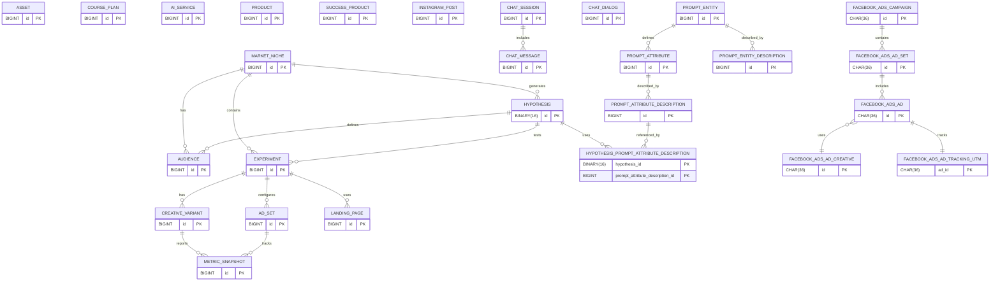

# MarketingHub Data Model

This document summarizes the current database schema defined in `schema.sql`.
It also highlights the tables used by the [Facebook Ads Worker](../facebook-ads-worker/README.md)
for managing campaigns and tracking their performance.

For a mapping between frontend screens and these entities, see [Frontend Screens and Entities](./frontend-screens-entities.md).

## Tables

### asset

- `id` BIGINT AUTO_INCREMENT PRIMARY KEY
- `type` VARCHAR(20)
- `provider` VARCHAR(20)
- `external_id` VARCHAR(100)
- `status` VARCHAR(20)
- `url` VARCHAR(500)
- `payload` TEXT
- `campaign_id` BIGINT
- `created_at` TIMESTAMP DEFAULT CURRENT_TIMESTAMP
- `updated_at` TIMESTAMP DEFAULT CURRENT_TIMESTAMP ON UPDATE CURRENT_TIMESTAMP

### course_plan

- `id` BIGINT AUTO_INCREMENT PRIMARY KEY
- `target_audience` VARCHAR(255)
- `transformation` VARCHAR(255)
- `macro_topics` TEXT
- `modules` TEXT
- `objectives` TEXT
- `resources` TEXT
- `created_at` TIMESTAMP DEFAULT CURRENT_TIMESTAMP
- `updated_at` TIMESTAMP DEFAULT CURRENT_TIMESTAMP ON UPDATE CURRENT_TIMESTAMP

### ai_service

- `id` BIGINT AUTO_INCREMENT PRIMARY KEY
- `name` VARCHAR(255)
- `objective` LONGTEXT
- `url` VARCHAR(255)
- `phase` VARCHAR(255)
- `price` DECIMAL(10,2)
- `cost` DECIMAL(10,2)
- `observation` LONGTEXT
- `created_at` TIMESTAMP DEFAULT CURRENT_TIMESTAMP
- `updated_at` TIMESTAMP DEFAULT CURRENT_TIMESTAMP ON UPDATE CURRENT_TIMESTAMP

### product

- `id` BIGINT AUTO_INCREMENT PRIMARY KEY
- `niche` VARCHAR(255)
- `avatar` VARCHAR(255)
- `instagram_account_id` BIGINT
- `explicit_pain` LONGTEXT
- `promise` LONGTEXT
- `unique_mechanism` LONGTEXT
- `tripwire` LONGTEXT
- `risk_reversal` LONGTEXT
- `social_proof` LONGTEXT
- `checkout_monetization` LONGTEXT
- `funnel` LONGTEXT
- `creative_volume` LONGTEXT
- `storytelling` LONGTEXT
- `ai_cost` DECIMAL(10,2) DEFAULT 0
- `created_at` TIMESTAMP DEFAULT CURRENT_TIMESTAMP
- `updated_at` TIMESTAMP DEFAULT CURRENT_TIMESTAMP ON UPDATE CURRENT_TIMESTAMP

### success_product

- `id` BIGINT AUTO_INCREMENT PRIMARY KEY
- `description` LONGTEXT
- `name` VARCHAR(255)
- `novo` BOOLEAN DEFAULT TRUE
- `platform` VARCHAR(20) NOT NULL DEFAULT 'COFRE'
- `generate_niche_hypothesis` BOOLEAN DEFAULT FALSE
- `niche` VARCHAR(255)
- `avatar` VARCHAR(255)
- `audience_type` VARCHAR(255)
- `sales_page_url` VARCHAR(500)
- `instagram_url` VARCHAR(500)
- `facebook_url` VARCHAR(500)
- `youtube_url` VARCHAR(500)
- `instagram_account_id` BIGINT
- `explicit_pain` LONGTEXT
- `promise` LONGTEXT
- `unique_mechanism` LONGTEXT
- `tripwire` LONGTEXT
- `risk_reversal` LONGTEXT
- `social_proof` LONGTEXT
- `checkout_monetization` LONGTEXT
- `sales_funnel` LONGTEXT
- `creative_volume` LONGTEXT
- `storytelling` LONGTEXT
- `created_at` TIMESTAMP DEFAULT CURRENT_TIMESTAMP
- `updated_at` TIMESTAMP DEFAULT CURRENT_TIMESTAMP ON UPDATE CURRENT_TIMESTAMP

### instagram_post

- `id` BIGINT AUTO_INCREMENT PRIMARY KEY
- `instagram_account_id` BIGINT
- `caption` TEXT
- `media_url` VARCHAR(500)
- `created_at` TIMESTAMP DEFAULT CURRENT_TIMESTAMP
- `updated_at` TIMESTAMP DEFAULT CURRENT_TIMESTAMP ON UPDATE CURRENT_TIMESTAMP

### market_niche

- `id` BIGINT AUTO_INCREMENT PRIMARY KEY
- `name` VARCHAR(255)
- `description` LONGTEXT
- `demand_volume` LONGTEXT
- `promises` LONGTEXT
- `offers` LONGTEXT
- `hypotheses_to_generate` INT
- `audiences_to_generate` INT
- `base_segmentation` LONGTEXT
- `interests` LONGTEXT
- `demographic_filters` LONGTEXT
- `extra_tips` LONGTEXT
- `chat_dialog_id` BIGINT
- `created_at` TIMESTAMP DEFAULT CURRENT_TIMESTAMP
- `updated_at` TIMESTAMP DEFAULT CURRENT_TIMESTAMP ON UPDATE CURRENT_TIMESTAMP

### hypothesis

- `id` BINARY(16) PRIMARY KEY
- `experiment_id` BIGINT NOT NULL
- `market_niche_id` BIGINT NOT NULL
- `title` VARCHAR(255) NOT NULL
- `premise_angle_id` BIGINT NOT NULL
- `offer_type` VARCHAR(20) NOT NULL
- `entrega` LONGTEXT
- `price` DECIMAL(6,2)
- `kpi_target_cpl` DECIMAL(7,2) NOT NULL
- `status` VARCHAR(20) DEFAULT 'BACKLOG' NOT NULL
- `created_at` TIMESTAMP DEFAULT CURRENT_TIMESTAMP
- `updated_at` TIMESTAMP DEFAULT CURRENT_TIMESTAMP ON UPDATE CURRENT_TIMESTAMP

### audience

- `id` BIGINT AUTO_INCREMENT PRIMARY KEY
- `name` VARCHAR(255)
- `description` LONGTEXT
- `prompt` LONGTEXT
- `model` VARCHAR(255)
- `market_niche_id` BIGINT
- `hypothesis_id` BINARY(16)
- `approved` BOOLEAN DEFAULT FALSE
- `created_at` TIMESTAMP DEFAULT CURRENT_TIMESTAMP
- `updated_at` TIMESTAMP DEFAULT CURRENT_TIMESTAMP ON UPDATE CURRENT_TIMESTAMP

### experiment

- `id` BIGINT AUTO_INCREMENT PRIMARY KEY
- `niche_id` BIGINT NOT NULL
- `hypothesis_id` BINARY(16) NOT NULL
- `name` VARCHAR(255) NOT NULL
- `hypothesis` VARCHAR(255)
- `kpi_target_cpl` DECIMAL(10,2) DEFAULT 45.00
- `stop_loss_cpl` DECIMAL(10,2) DEFAULT 90.00
- `sample_size` INT DEFAULT 1500
- `baseline_cvr` DECIMAL(5,2) DEFAULT 3.00
- `target_cvr` DECIMAL(5,2) DEFAULT 5.00
- `mde_percent` DECIMAL(5,2) DEFAULT 40.0
- `creatives_to_generate` INT
- `start_date` DATE
- `end_date` DATE
- `status` VARCHAR(20)
- `platform` VARCHAR(50)
- `creative_approved` BOOLEAN DEFAULT FALSE
- `sales_funnel_id` BINARY(16)
- `created_at` TIMESTAMP DEFAULT CURRENT_TIMESTAMP
- `updated_at` TIMESTAMP DEFAULT CURRENT_TIMESTAMP ON UPDATE CURRENT_TIMESTAMP

Defines a marketing experiment for a specific niche and hypothesis. Each
experiment aggregates the creative variants, ad sets and landing pages that
will be executed and measured during the test cycle.

### creative

- `id` BIGINT AUTO_INCREMENT PRIMARY KEY
- `experiment_id` BIGINT NOT NULL
- `headline` VARCHAR(255)
- `primary_text` VARCHAR(255)
- `image_url` VARCHAR(500)
- `image_hash` VARCHAR(255)
- `video_id` VARCHAR(255)
- `status` VARCHAR(20)

Stores ad creatives generated by the AI Worker for each experiment.
These records can later be sent to the Facebook API and are displayed on
the experiment detail page in the frontend.

### creative_variant

- `id` BIGINT AUTO_INCREMENT PRIMARY KEY
- `experiment_id` BIGINT
- `type` VARCHAR(20)
- `asset_url` VARCHAR(500)
- `titles` LONGTEXT
- `descriptions` LONGTEXT
- `created_at` TIMESTAMP DEFAULT CURRENT_TIMESTAMP
- `updated_at` TIMESTAMP DEFAULT CURRENT_TIMESTAMP ON UPDATE CURRENT_TIMESTAMP

Stores the individual assets generated for an experiment. The
`experiment_id` column is a foreign key to `experiment.id` and is optional to
allow variants to be created before an experiment is defined.

### ad_set

- `id` BIGINT AUTO_INCREMENT PRIMARY KEY
- `experiment_id` BIGINT
- `location` VARCHAR(255)
- `interests` LONGTEXT
- `lookalikes` LONGTEXT
- `targeting_json` LONGTEXT
- `budget` DECIMAL(10,2)
- `duration_days` INT
- `prompt` LONGTEXT
- `model` VARCHAR(255)
- `created_at` TIMESTAMP DEFAULT CURRENT_TIMESTAMP
- `updated_at` TIMESTAMP DEFAULT CURRENT_TIMESTAMP ON UPDATE CURRENT_TIMESTAMP

### metric_snapshot

- `id` BIGINT AUTO_INCREMENT PRIMARY KEY
- `creative_id` BIGINT
- `ad_set_id` BIGINT
- `impressions` INT
- `clicks` INT
- `cost` DECIMAL(10,2)
- `roas` DECIMAL(10,2)
- `ctr` DOUBLE
- `cpa` DECIMAL(10,2)
- `created_at` TIMESTAMP DEFAULT CURRENT_TIMESTAMP

### landing_page

- `id` BIGINT AUTO_INCREMENT PRIMARY KEY
- `experiment_id` BIGINT NOT NULL
- `url` VARCHAR(500)
- `type` VARCHAR(20)
- `status` VARCHAR(20)
- `created_at` TIMESTAMP DEFAULT CURRENT_TIMESTAMP
- `updated_at` TIMESTAMP DEFAULT CURRENT_TIMESTAMP ON UPDATE CURRENT_TIMESTAMP

### chat_session

- `id` BIGINT AUTO_INCREMENT PRIMARY KEY
- `user_id` VARCHAR(255)
- `channel` VARCHAR(50)
- `state` VARCHAR(20)
- `created_at` TIMESTAMP DEFAULT CURRENT_TIMESTAMP
- `updated_at` TIMESTAMP DEFAULT CURRENT_TIMESTAMP ON UPDATE CURRENT_TIMESTAMP

### chat_message

- `id` BIGINT AUTO_INCREMENT PRIMARY KEY
- `session_id` BIGINT
- `origin` VARCHAR(50)
- `content` LONGTEXT
- `created_at` TIMESTAMP DEFAULT CURRENT_TIMESTAMP
- `updated_at` TIMESTAMP DEFAULT CURRENT_TIMESTAMP ON UPDATE CURRENT_TIMESTAMP

### chat_dialog

- `id` BIGINT AUTO_INCREMENT PRIMARY KEY
- `url` VARCHAR(500)
- `description` LONGTEXT
- `theme` VARCHAR(255)
- `created_at` TIMESTAMP DEFAULT CURRENT_TIMESTAMP
- `updated_at` TIMESTAMP DEFAULT CURRENT_TIMESTAMP ON UPDATE CURRENT_TIMESTAMP

### prompt_entity

- `id` BIGINT AUTO_INCREMENT PRIMARY KEY
- `name` VARCHAR(255) UNIQUE
- `created_at` TIMESTAMP DEFAULT CURRENT_TIMESTAMP
- `updated_at` TIMESTAMP DEFAULT CURRENT_TIMESTAMP ON UPDATE CURRENT_TIMESTAMP

### prompt_attribute

- `id` BIGINT AUTO_INCREMENT PRIMARY KEY
- `prompt_entity_id` BIGINT
- `name` VARCHAR(255)
- `created_at` TIMESTAMP DEFAULT CURRENT_TIMESTAMP
- `updated_at` TIMESTAMP DEFAULT CURRENT_TIMESTAMP ON UPDATE CURRENT_TIMESTAMP

### prompt_entity_description

- `id` BIGINT AUTO_INCREMENT PRIMARY KEY
- `prompt_entity_id` BIGINT
- `description` LONGTEXT
- `active` BOOLEAN
- `created_at` TIMESTAMP DEFAULT CURRENT_TIMESTAMP
- `updated_at` TIMESTAMP DEFAULT CURRENT_TIMESTAMP ON UPDATE CURRENT_TIMESTAMP

### prompt_attribute_description

- `id` BIGINT AUTO_INCREMENT PRIMARY KEY
- `prompt_attribute_id` BIGINT
- `description` LONGTEXT
- `active` BOOLEAN
- `created_at` TIMESTAMP DEFAULT CURRENT_TIMESTAMP
- `updated_at` TIMESTAMP DEFAULT CURRENT_TIMESTAMP ON UPDATE CURRENT_TIMESTAMP

### hypothesis_prompt_attribute_description

- `hypothesis_id` BINARY(16)
- `prompt_attribute_description_id` BIGINT

### facebook_ads_campaign

- `id` CHAR(36) PRIMARY KEY
- `external_id` VARCHAR(64)
- `ad_account_id` VARCHAR(64) NOT NULL
- `name` VARCHAR(255) NOT NULL
- `objective` VARCHAR(64) NOT NULL
- `status` ENUM(PAUSED,ACTIVE,ARCHIVED,DELETED) DEFAULT "PAUSED"
- `budget_mode` ENUM("CAMPAIGN","ADSET") NOT NULL
- `daily_budget_minor` BIGINT
- `lifetime_budget_minor` BIGINT
- `api_version` VARCHAR(16)
- `created_at` TIMESTAMP DEFAULT CURRENT_TIMESTAMP
- `updated_at` TIMESTAMP DEFAULT CURRENT_TIMESTAMP ON UPDATE CURRENT_TIMESTAMP

### facebook_ads_campaign_special_ad_category

- `campaign_id` CHAR(36)
- `category` ENUM(NONE,CREDIT,EMPLOYMENT,HOUSING,ISSUES_ELECTIONS_POLITICS)
- `PRIMARY KEY` (`campaign_id`, `category`)

### facebook_ads_campaign_special_ad_country

- `campaign_id` CHAR(36)
- `country_iso2` CHAR(2)
- `PRIMARY KEY` (`campaign_id`, `country_iso2`)

### facebook_ads_ad_set

- `id` CHAR(36) PRIMARY KEY
- `external_id` VARCHAR(64)
- `campaign_id` CHAR(36)
- `name` VARCHAR(255)
- `status` ENUM(PAUSED,ACTIVE,ARCHIVED,DELETED) DEFAULT "PAUSED"
- `daily_budget_minor` BIGINT
- `lifetime_budget_minor` BIGINT
- `start_time` DATETIME
- `end_time` DATETIME
- `billing_event` VARCHAR(32)
- `optimization_goal` VARCHAR(64)
- `bid_strategy` VARCHAR(64)
- `bid_amount_minor` BIGINT
- `promoted_object_json` LONGTEXT
- `targeting_json` LONGTEXT
- `created_at` TIMESTAMP DEFAULT CURRENT_TIMESTAMP
- `updated_at` TIMESTAMP DEFAULT CURRENT_TIMESTAMP ON UPDATE CURRENT_TIMESTAMP

### facebook_ads_media_asset

- `id` CHAR(36) PRIMARY KEY
- `kind` ENUM(IMAGE,VIDEO)
- `source_uri` VARCHAR(1024)
- `image_hash` VARCHAR(128)
- `video_id` VARCHAR(64)
- `width` INT
- `height` INT
- `duration_ms` INT
- `checksum` VARCHAR(128)
- `created_at` TIMESTAMP DEFAULT CURRENT_TIMESTAMP

### facebook_ads_ad_creative

- `id` CHAR(36) PRIMARY KEY
- `external_id` VARCHAR(64)
- `page_id` VARCHAR(64)
- `instagram_user_id` VARCHAR(64)
- `kind` ENUM(LINK,VIDEO,CAROUSEL)
- `link_data_json` LONGTEXT
- `video_data_json` LONGTEXT
- `carousel_data_json` LONGTEXT
- `last_preview_url` VARCHAR(1024)
- `created_at` TIMESTAMP DEFAULT CURRENT_TIMESTAMP
- `updated_at` TIMESTAMP DEFAULT CURRENT_TIMESTAMP ON UPDATE CURRENT_TIMESTAMP

### facebook_ads_ad

- `id` CHAR(36) PRIMARY KEY
- `external_id` VARCHAR(64)
- `adset_id` CHAR(36)
- `name` VARCHAR(255)
- `creative_id` CHAR(36)
- `status` ENUM(PAUSED,ACTIVE,ARCHIVED,DELETED) DEFAULT "PAUSED"
- `created_at` TIMESTAMP DEFAULT CURRENT_TIMESTAMP
- `updated_at` TIMESTAMP DEFAULT CURRENT_TIMESTAMP ON UPDATE CURRENT_TIMESTAMP

### facebook_ads_ad_tracking_utm

- `ad_id` CHAR(36) PRIMARY KEY
- `utm_source` VARCHAR(64)
- `utm_medium` VARCHAR(64)
- `utm_campaign` VARCHAR(128)
- `utm_content` VARCHAR(128)
- `utm_term` VARCHAR(128)

## Diagram

