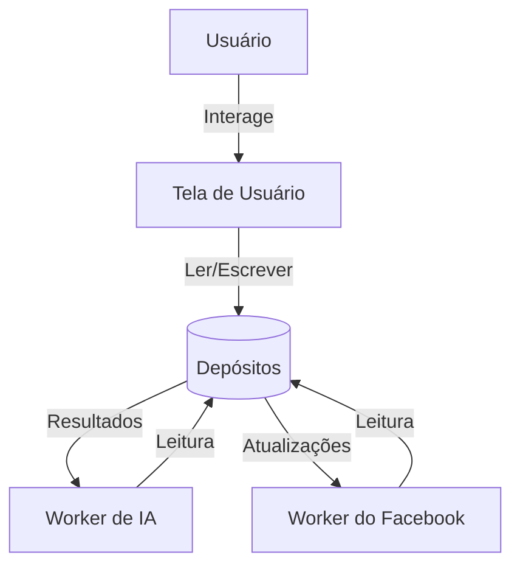

# Diagrama de Fluxo de Dados - Depósitos

Este diagrama destaca os depósitos como repositório principal e os processos que realizam leitura e escrita nesses dados: tela de usuário, worker de IA e worker do Facebook.

## Entidades Principais

- **Usuário**: origem das interações com o sistema.
- **Tela de Usuário**: interface para consultar e modificar depósitos.
- **Worker de IA**: processa dados para análises ou classificações.
- **Worker do Facebook**: sincroniza informações com serviços externos.
- **Depósitos**: armazenamento central de dados.

## Processos e Fluxos

| Processo            | Entradas                          | Saídas                                 |
|---------------------|-----------------------------------|-----------------------------------------|
| Tela de Usuário     | Ações do usuário, dados dos depósitos | Solicitações de leitura/escrita, informações exibidas |
| Worker de IA        | Dados dos depósitos                | Resultados de análise                   |
| Worker do Facebook  | Dados dos depósitos                | Atualizações enviadas ou registros retornados |
