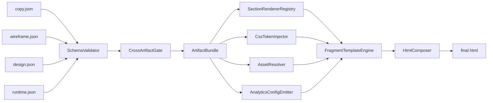
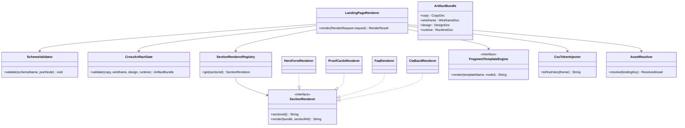

# Padrões de landing pages de alta conversão e arquitetura determinística de renderização

## Resumo executivo

A convergência entre fontes oficiais, páginas primárias e pesquisas de UX é forte: landing pages que tendem a converter melhor são páginas de campanha com **objetivo único**, **CTA principal explícito**, **mensagem coerente com o anúncio/origem do tráfego** e **baixa distração navegacional**. Isso aparece de modo direto na definição da Unbounce de landing page como página de foco único, nas orientações do Google Ads para fazer a página refletir a promessa e o CTA do anúncio, e nas definições do RD Station de LP como página pensada para uma ação específica. As referências mais úteis para essa síntese vieram de entity["company","Google","tech company"], da entity["organization","Nielsen Norman Group","ux research firm"], do design system do entity["organization","GOV.UK","uk government service"], das recomendações da entity["organization","W3C","web standards body"] e de materiais/páginas primárias de entity["company","Hotmart","digital products platform"], entity["company","RD Station","marketing automation company"], entity["company","Unbounce","landing page software"], entity["company","Kajabi","knowledge commerce platform"] e entity["company","ClickFunnels","funnel software company"]. citeturn24view0turn16view0turn13view1turn15view6turn15view2

“Landing longa” versus “landing curta” é a pergunta errada. A pergunta certa é: **o primeiro viewport deixa claro para quem é, qual valor entrega, qual prova existe e qual próximo passo deve ser tomado?** O fold continua relevante: a NN/g registra diferença material de atenção entre o que está acima e abaixo da dobra, e o Google Ads recomenda colocar informação importante no topo da página. Em paralelo, páginas longas podem funcionar muito bem se o topo “ganhar o scroll” com informação útil, sinalização do que vem a seguir e um caminho de ação inequívoco. citeturn28view0turn28view1turn16view0

Nas páginas de venda digitais mais maduras, a persuasão não depende de um único recurso, mas de uma pilha de evidências: **proposta de valor clara**, **mecanismo simples**, **prova tangível** do que será recebido, **prova social/autoridade**, **tratamento de objeções** e **microcopy de confiança** perto do ponto de conversão. Isso aparece tanto nos guias da Hotmart sobre página de vendas quanto nas páginas observadas de Kajabi, ClickFunnels e Hotmart Pages & Send, que combinam métricas, depoimentos, previews de entrega, FAQ, garantia e repetição do CTA. citeturn13view2turn21view0turn20view0turn12view2turn11view0

Para produtos digitais, a diferença entre uma LP “bonita” e uma LP que escala vem da operação do front-end: **formulários com pouco atrito e boa acessibilidade, erros claros, responsividade real e performance medida em campo**. Label visível, poucos campos, erro resumido + erro no campo, targets confortáveis para toque e bons Core Web Vitals não são detalhes cosméticos; eles influenciam abandono, engajamento e conversão. Casos do web.dev mostram ganhos reais de negócios ao melhorar performance, inclusive em páginas de entrada e jornadas de conversão. citeturn14view2turn14view3turn14view4turn15view0turn15view1turn17view0turn8search0turn8search1turn8search2turn8search13

Para transformar isso em **renderização determinística**, a melhor saída é separar rigorosamente quatro contratos: **copy**, **wireframe**, **design** e **runtime** (assets + analytics + performance budget). O renderer deve ser um **montador estrito**, não um “gerador criativo”: ele valida, escapa, ordena, injeta tokens aprovados e liga `sectionId` a fragmentos fixos. Se um detalhe necessário não estiver no contrato, o comportamento correto é **falhar de forma explícita** ou usar um fallback previamente autorizado — nunca inventar. Como os anexos foram tratados nesta pergunta como existentes, mas não especificados integralmente, tudo o que não está formalizado abaixo deve ser tratado como **não especificado**.

## Padrões estruturais, persuasivos e UX

A tabela abaixo resume os padrões mais recorrentes e como eles devem virar contrato em JSON, em vez de “decisão escondida” dentro do renderer.

| Padrão recorrente | O que aparece nas fontes e páginas observadas | Como codificar no contrato |
|---|---|---|
| Objetivo único e CTA canônico | Unbounce define landing page como página de campanha com um único foco/CTA; o Google Ads recomenda que a landing espelhe o CTA do anúncio; o RD Station reforça o foco em uma ação específica. citeturn24view0turn16view0turn13view1 | `copy.primaryCTA`, `wireframe.ctaCanonical`, `wireframe.sectionOrder[].ctaSlot[]`. |
| Message match de origem → página | Unbounce fala explicitamente em “message match”; o Google Ads pede que a página corresponda ao anúncio, às keywords e ao CTA prometido. citeturn24view0turn16view0turn16view2 | `copy.messageMatchSource`, `copy.hero.headline/subheadline`, `wireframe.mobilePriority.aboveFoldMustShow`. |
| Topo forte e acima da dobra | A NN/g mostra que o fold continua importando; o Google Ads recomenda colocar informação importante no topo; usuários só rolam se o topo parecer promissor. citeturn28view0turn16view0 | `wireframe.mobilePriority`, `wireframe.aboveFoldRequirements`, `wireframe.sectionOrder` com hero primeiro. |
| Conteúdo enxuto, mas suficiente | Unbounce recomenda conteúdo focado e conciso; “somente o necessário” para levar à ação; páginas podem ser longas, mas devem merecer o scroll. citeturn24view0turn28view0turn28view1 | `copy.sections[].body`, `copy.sections[].bullets`, `wireframe.readingFlow.maxParagraphLines`, `wireframe.readingFlow.bulletDensity`. |
| Prova em camadas | Hotmart destaca título/copy/prova social/descrição clara/garantia; Kajabi usa métricas, depoimentos e casos; ClickFunnels combina volume, steps, depoimentos e FAQ; Hotmart Pages & Send usa métricas, planos, garantia e FAQ. citeturn13view2turn21view0turn20view0turn12view2turn11view0 | `copy.proofMetrics`, `copy.testimonials`, `copy.offerPreview`, `wireframe.proofPlan`, `runtime.assets`. |
| Mecanismo explicado sem excesso | ClickFunnels organiza a página em passos explícitos; Kajabi distribui blocos por tipo de produto, checkout e funnels; Hotmart recomenda explicar benefícios, objeções, preço e garantia. citeturn20view0turn21view0turn13view2 | `copy.sections[].sectionId="mechanism-*"` com peças separadas por tópico; `wireframe.fragmentKey` específico para stepper/timeline/cards. |
| Objeções e FAQ perto do fim da decisão | Hotmart lista objeções/garantia como parte central da página de vendas; ClickFunnels mantém FAQ explícita; Hotmart Pages & Send encerra com FAQ e suporte. citeturn13view2turn20view0turn10view0 | `copy.faq[]`, `wireframe.sectionOrder` com FAQ antes do CTA final, `trustSignals.supportContact`. |
| Formulário com baixo atrito | RD Station recomenda poucos campos e mostra caso de formulário inteligente reduzindo atrito; web.dev e W3C reforçam labels claras e campos apropriados. citeturn13view1turn25view0turn14view2turn19view0turn19view3 | `wireframe.formSpec.fields[]`, `wireframe.formSpec.progressiveProfiling`, `wireframe.formSpec.validationRules`. |
| Continuidade visual e de confiança | A Hotmart mostra que páginas e checkout que convertem melhor mantêm identidade visual consistente; a quebra brusca de ambiente aumenta insegurança. citeturn26view0 | `design.theme`, `design.componentVariants`, `runtime.security.allowedHosts`, `wireframe.trustSignals`. |

Como síntese operacional, a estrutura que mais se repete nas páginas observadas e mais facilmente se traduz em contratos é:

**match de tráfego → hero claro → prova rápida → mecanismo/“como funciona” → prova social/tangível → FAQ/objeções → CTA final**. Em páginas de captura, o formulário sobe para o hero. Em páginas de venda direta, preço/checkout entram depois que valor, prova e objeções foram trabalhados. Isso é exatamente o que se vê, com variações, nas páginas observadas de Hotmart Pages & Send, Kajabi e ClickFunnels, e no próprio enquadramento da Hotmart sobre página de vendas. citeturn12view2turn21view0turn20view0turn13view2

## Boas práticas técnicas, performance e medição

Do ponto de vista técnico, a evidência mais forte é que velocidade e estabilidade visual têm impacto real de negócio. Casos publicados pelo web.dev envolvendo entity["company","Vodafone","telecom company"], entity["company","Rakuten","japanese ecommerce group"], entity["company","redBus","bus ticketing platform"] e entity["company","QuintoAndar","brazil proptech"] relacionam melhorias de Core Web Vitals a aumento de vendas, taxa de conversão e páginas por sessão. O ponto importante para uma landing page é tratar performance como requisito funcional da oferta, e não como refino posterior. citeturn8search0turn8search1turn8search2turn8search13turn14view0

| Tema | Prática recomendada | Base oficial/principal |
|---|---|---|
| Labels e instruções | Labels visíveis, preferencialmente acima do campo; instruções curtas quando necessário; nunca depender apenas de placeholder. | web.dev e GOV.UK recomendam labels acima; W3C exige labels/instruções; NN/g mostra que placeholder como label piora usabilidade. citeturn14view2turn15view3turn19view3turn14view4 |
| Menos campos | Pedir apenas o necessário; usar progressive profiling quando possível. | RD Station recomenda formulários simplificados e mostra caso de menor atrito com formulário inteligente. citeturn13view1turn25view0 |
| Obrigatoriedade clara | Marcar campos obrigatórios de forma explícita e consistente. | NN/g recomenda marcar obrigatórios; W3C exige que o usuário saiba o que deve informar. citeturn14view6turn19view3 |
| Erros úteis | Reexibir o formulário preenchido, mostrar resumo de erros no topo, foco no resumo e mensagem junto ao campo. | GOV.UK define esse padrão de validação/recuperação. citeturn15view0turn15view1 |
| Agrupamento semântico | Usar `fieldset`/`legend` para grupos relacionados de inputs. | GOV.UK documenta agrupamento com `fieldset`. citeturn15view4 |
| Autocomplete e input purpose | Declarar `autocomplete` por campo quando fizer sentido, inclusive por conformidade com WCAG. | GOV.UK e W3C. citeturn15view5turn19view4 |
| Tap targets e legibilidade mobile | Targets de pelo menos 44×44 CSS px; margem/padding confortáveis; tipografia legível em mobile. | W3C, web.dev e o próprio guidance de formulários do web.dev. citeturn19view1turn14view3 |
| Contraste | Texto normal com contraste mínimo de 4.5:1. | W3C WCAG. citeturn19view2 |
| Core Web Vitals | Medir LCP, INP e CLS em campo, com meta de bom desempenho no percentil 75: LCP ≤ 2,5 s; INP ≤ 200 ms; CLS ≤ 0,1. | web.dev/WV. citeturn17view0 |
| Medição em campo | Instrumentar RUM; laboratório ajuda no desenvolvimento, mas não substitui dados de usuários reais. | web.dev recomenda campo + percentil 75 e instrumentação própria. citeturn17view0 |
| Performance do hero | Renderizar HTML crítico do hero, reduzir JS bloqueante, otimizar imagens e adiar recursos não críticos. | Técnicas destacadas em casos de CWV do web.dev. citeturn14view1turn18search12 |
| A/B de performance | Para medir impacto de velocidade, preferir teste server-side; landing pages de anúncio são bons candidatos de experimento. | web.dev. citeturn27view1 |
| A/B sem prejudicar SEO | Não fazer cloaking; em variantes por URL, usar as boas práticas do Google Search, incluindo canonical para a original/preferida. | Google Search Central. citeturn27view0 |
| Avaliação de LP no tráfego pago | Monitorar mobile-friendliness, CTR, cliques e páginas populares na visão de landing pages do Google Ads. | Google Ads Help. citeturn16view1 |

Em páginas maduras, a medição não para em `page_view`. A home da Kajabi, por exemplo, expõe rastreios como `Scroll: Top 25 Percent` e `Page Viewed past 15s`, o que é um bom indicativo de que profundidade de consumo e engajamento temporal são úteis como sinais auxiliares entre chegada e conversão. Isso não substitui eventos de funil, mas complementa a leitura de qualidade da página. citeturn21view0

## Esquemas JSON canônicos

A melhor forma de reduzir ambiguidade é adotar **JSON Schema Draft 2020-12**, com `additionalProperties: false` no root e nos objetos críticos. O ponto principal não é “validar JSON”, e sim **isolar responsabilidade**: copy não decide layout; wireframe não decide cor; design não decide narrativa; runtime não decide mensagem. Os campos abaixo codificam exatamente os padrões observados nas fontes: foco único, message match, prova, FAQ, formulário com baixo atrito, mobile-first, analytics e performance como parte do produto. citeturn24view0turn16view0turn13view1turn17view0

| Schema | Mínimo obrigatório | Extensões opcionais | Responsabilidade |
|---|---|---|---|
| `landing-copy` | `schemaVersion`, `artifactType`, `pageId`, `locale`, `pageGoal`, `messageMatchSource`, `primaryCTA`, `hero`, `sections[]` | `faq[]`, `seo`, `compliance`, `testimonials`, `proofMetrics`, `thankYouCopy` | Texto e semântica persuasiva |
| `landing-wireframe` | `schemaVersion`, `artifactType`, `pageId`, `variantLayoutId`, `sectionOrder[]`, `ctaCanonical`, `accessibilitySpec` | `formSpec`, `trustSignals`, `mobilePriority`, `readingFlow`, `proofPlan` | Ordem, slots, hierarquia, comportamento |
| `landing-design` | `schemaVersion`, `artifactType`, `pageId`, `theme`, `sectionPresets[]` | `defaultSectionPreset`, `motion`, `componentVariants`, `iconSet` | Tokens visuais e variantes de componentes |
| `landing-runtime` | `schemaVersion`, `artifactType`, `pageId`, `assets[]`, `analytics`, `performanceBudget` | `experiment`, `security`, `monitoring`, `assetBaseUrl` | Assets aprovados, tracking, budgets e hooks |

| Família de campos | Dono do campo | O renderer faz | O renderer nunca faz |
|---|---|---|---|
| `copy.*` | Copy | Escapa e posiciona textos nos slots corretos | Reescrever, resumir, trocar CTA ou inventar bullets |
| `wireframe.sectionOrder` | Wireframe | Ordena e escolhe o fragmento por `sectionId` | Reordenar ou criar/remover seções por conta própria |
| `wireframe.formSpec` | Wireframe | Renderiza inputs, labels, consent, erros e sucesso | Criar campos extras ou inferir validação não definida |
| `design.theme` | Design | Injeta tokens aprovados e classes previstas | Criar CSS arbitrário ou derivar estilo da copy |
| `design.sectionPresets` | Design | Aplica variantes por `sectionId` | Trocar o layout/fragmento decidido no wireframe |
| `runtime.assets` | Runtime | Vincula assets aprovados aos slots declarados | Buscar URLs desconhecidas ou usar assets “parecidos” |
| `runtime.analytics` | Runtime | Emite `data-*`/config JSON estático | Inventar eventos ou selectors não declarados |
| `runtime.performanceBudget` | Runtime | Publica metas e ativa gates de CI | Relaxar budget para “fazer passar” |

### Proposta de schema `landing-copy`

| Campo | Tipo | Obrig. | Restrições | Exemplo | Regra de validação |
|---|---|---:|---|---|---|
| `schemaVersion` | `string` | Sim | semver (`^\d+\.\d+\.\d+$`) | `"1.0.0"` | deve bater com a versão suportada pelo renderer |
| `artifactType` | `string` | Sim | constante `"landing-copy"` | `"landing-copy"` | valor fixo |
| `pageId` | `string` | Sim | slug 3–64 chars | `"personal-amostra-pdf"` | igual nos 4 schemas |
| `locale` | `string` | Sim | BCP-47 simples | `"pt-BR"` | vira `lang` do HTML |
| `pageGoal` | `string` | Sim | 20–240 chars | `"Gerar pedidos de prévia..."` | obrigatório para telemetry e documentação |
| `messageMatchSource` | `string` | Sim | 1–180 chars | `"Pare de brigar por preço no WhatsApp"` | deve ser coerente com hero |
| `primaryCTA` | `object` | Sim | `label`, `actionRef` obrigatórios | `{"label":"Preencha o briefing","actionRef":"lead-capture-primary"}` | `label` deve bater com `wireframe.ctaCanonical.labelLiteral` |
| `hero` | `object` | Sim | `headline` obrigatório; demais opcionais | `{"headline":"...","subheadline":"...","proofBadge":"..."}` | `headline` 1–180 chars; sem HTML por padrão |
| `sections[]` | `array<object>` | Sim | mínimo 1; `sectionId` único | `[{"sectionId":"proof-kit","title":"O que você recebe"}]` | todo `sectionId` deve existir no wireframe |
| `sections[].title` | `string` | Não | 1–120 chars | `"O que você recebe"` | opcional, mas recomendado |
| `sections[].body` | `string` | Não | 1–1200 chars | `"Em minutos..."` | plain text por padrão |
| `sections[].bullets[]` | `array<string>` | Não | 1–7 itens | `["Convite","Roteiro","Check-ins"]` | sem itens vazios |
| `faq[]` | `array<object>` | Não | 0–12 itens | `[{"id":"f1","question":"...","answer":"..."}]` | `id` único; pergunta e resposta obrigatórias |
| `seo` | `object` | Não | `metaTitle`, `metaDescription` | `{"metaTitle":"Prévia em PDF para personal"}` | se ausente, renderer usa fallback fixo |
| `compliance` | `object` | Não | disclaimers, claims proibidas | `{"disclaimerShort":"Sem garantia..."}` | se houver, vira bloco legal explícito |

**Validações adicionais do `landing-copy`:**

- todos os textos são **plain text** por padrão; qualquer exceção rica deve usar um campo separado, como `richHtml`, sujeito a sanitização;
- `primaryCTA.label` não pode variar por seção, salvo se o wireframe declarar explicitamente uma exceção;
- `sections[]` não pode introduzir `sectionId` inexistente no wireframe;
- `faq[]` não substitui copy das seções; é um bloco próprio.

### Proposta de schema `landing-wireframe`

| Campo | Tipo | Obrig. | Restrições | Exemplo | Regra de validação |
|---|---|---:|---|---|---|
| `schemaVersion` | `string` | Sim | semver | `"1.0.0"` | versão suportada |
| `artifactType` | `string` | Sim | constante `"landing-wireframe"` | `"landing-wireframe"` | valor fixo |
| `pageId` | `string` | Sim | slug | `"personal-amostra-pdf"` | igual nos 4 docs |
| `variantLayoutId` | `string` | Sim | enum controlado | `"form-first"` | sem efeito se não houver templates compatíveis |
| `sectionOrder[]` | `array<object>` | Sim | mínimo 1; ordem estável; `sectionId` único | `[{"sectionId":"hero-form","fragmentKey":"hero-form-split"}]` | sequência é a fonte de verdade da página |
| `sectionOrder[].sectionId` | `string` | Sim | slug | `"hero-form"` | vira `id` da seção no DOM |
| `sectionOrder[].fragmentKey` | `string` | Sim | enum controlado de fragmentos | `"hero-form-split"` | precisa existir no registry/templates |
| `sectionOrder[].required` | `boolean` | Sim | — | `true` | se `true`, ausência de dados gera erro |
| `sectionOrder[].assetBindingKeys[]` | `array<string>` | Não | refs externas | `["hero-proof-image"]` | cada binding deve existir em `runtime.assets[]` |
| `ctaCanonical` | `object` | Sim | `labelLiteral`, `actionRef` obrigatórios | `{"labelLiteral":"Preencha o briefing","actionRef":"lead-capture-primary"}` | deve bater com `copy.primaryCTA` |
| `formSpec` | `object` | Condicional | obrigatório se houver form section | `{"formId":"lead-capture-primary", ...}` | campos com `name` únicos e labels não vazias |
| `accessibilitySpec` | `object` | Sim | `minTextContrast`, `minTouchTargetPx`, `formFieldMinHeightPx` | `{"minTextContrast":"4.5:1","minTouchTargetPx":44}` | renderer e CI precisam respeitar |
| `trustSignals` | `object` | Não | brand/privacy/legal | `{"brandIdentityRequired":true,"privacyNoticeNearForm":true}` | se `privacyNoticeNearForm=true`, precisa haver slot/microcopy |
| `mobilePriority` | `object` | Não | acima da dobra e sticky CTA | `{"aboveFoldRequiredSectionIds":["hero-form"]}` | refs devem existir em `sectionOrder` |
| `readingFlow` | `object` | Não | parágrafos, bullets, scan pattern | `{"maxParagraphLinesMobile":4}` | usado como gate, não como heuristic engine |
| `proofPlan` | `object` | Não | tipos de prova e seção | `{"requiredProofTypes":["deliverable-preview"]}` | ajuda a validar cobertura narrativa |

**Validações adicionais do `landing-wireframe`:**

- `sectionOrder[].sectionId` é **a chave canônica** de binding entre wireframe, copy, design, assets e analytics;
- `fragmentKey` vem de allowlist fechada;
- se `formSpec` existir, todo campo precisa ter `type`, `name`, `label` e `required`;
- se `ctaCanonical.actionRef` apontar para formulário, `formSpec.formId` deve existir;
- se `trustSignals.brandIdentityRequired = true`, deve existir ao menos um slot de marca no topo ou rodapé.

### Proposta de schema `landing-design`

| Campo | Tipo | Obrig. | Restrições | Exemplo | Regra de validação |
|---|---|---:|---|---|---|
| `schemaVersion` | `string` | Sim | semver | `"1.0.0"` | versão suportada |
| `artifactType` | `string` | Sim | constante `"landing-design"` | `"landing-design"` | valor fixo |
| `pageId` | `string` | Sim | slug | `"personal-amostra-pdf"` | igual nos 4 docs |
| `theme.colors` | `object` | Sim | allowlist de tokens; valores válidos | `{"bg":"#F7F9FC","text":"#0B1220","brand":"#0B5FFF"}` | hex/rgb/hsl/oklch validados |
| `theme.typography` | `object` | Sim | escalas, line-height, famílias aprovadas | `{"bodySize":"16px","lineHeight":"1.6"}` | sem CSS livre |
| `theme.spacing` | `object` | Sim | tokens numéricos/px/rem | `{"sectionYMobile":"56px","containerMax":"1120px"}` | valores positivos e dentro da allowlist |
| `theme.radius` | `object` | Não | tokens curtos | `{"md":"16px"}` | sem curvas arbitrárias fora do padrão |
| `theme.shadow` | `object` | Não | tokens aprovados | `{"card":"0 10px 30px rgba(0,0,0,.06)"}` | só se passar validador |
| `sectionPresets[]` | `array<object>` | Sim | `sectionId` único | `[{"sectionId":"hero-form","surfaceStyle":"solid","buttonVariant":"primary"}]` | todo `sectionId` deve existir no wireframe |
| `sectionPresets[].surfaceStyle` | `string` | Sim | enum | `"solid"` | não muda layout |
| `sectionPresets[].containerToken` | `string` | Não | enum | `"container-wide"` | estiliza, não reestrutura |
| `sectionPresets[].buttonVariant` | `string` | Não | enum | `"primary"` | só variantes aprovadas |
| `defaultSectionPreset` | `object` | Não | preset fallback global | `{"surfaceStyle":"plain"}` | usado apenas quando seção não tiver preset explícito |
| `motion` | `object` | Não | intensidade baixa/média/nenhuma | `{"enabled":true,"intensity":"subtle"}` | se `none`, renderer não emite classes de animação |

**Regra central do `landing-design`:** ele **não pode escolher fragmentos nem reorganizar seções**. Design decide **tokens e variantes**, nunca a arquitetura da página. Se você permitir `layoutPreset` aqui, recoloca no renderer a tentação de tomar decisão de wireframe.

### Proposta de schema `landing-runtime`

| Campo | Tipo | Obrig. | Restrições | Exemplo | Regra de validação |
|---|---|---:|---|---|---|
| `schemaVersion` | `string` | Sim | semver | `"1.0.0"` | versão suportada |
| `artifactType` | `string` | Sim | constante `"landing-runtime"` | `"landing-runtime"` | valor fixo |
| `pageId` | `string` | Sim | slug | `"personal-amostra-pdf"` | igual nos 4 docs |
| `assets[]` | `array<object>` | Sim | mínimo 0; `assetId` e `bindingKey` únicos | `[{"assetId":"a1","bindingKey":"hero-proof-image",...}]` | URLs `https`, host allowlist, largura/altura > 0 |
| `assets[].role` | `string` | Sim | enum | `"hero-proof"`, `"logo"`, `"testimonial-avatar"` | decide política de falha |
| `assets[].src` | `string` | Sim | URL absoluta `https` ou caminho CDN permitido | `"https://cdn.example.com/hero.webp"` | rejeitar `javascript:`, `data:` não aprovados |
| `assets[].alt` | `string` | Sim* | obrigatório para imagem informativa | `"Prévia em PDF..."` | `alt=""` apenas para decorativa |
| `assets[].required` | `boolean` | Sim | — | `true` | se faltou, gate falha |
| `assets[].contentHash` | `string` | Não | hash estável | `"sha256-..."` | útil para cache/SRI interno |
| `analytics` | `object` | Sim | `events[]` e namespacing | `{"namespace":"lp","events":[...]}` | eventos e refs únicos |
| `analytics.events[]` | `array<object>` | Sim | cada evento aponta para ref semântico | `{"eventKey":"hero_cta_click","trigger":"click","refType":"ctaSlot","refId":"hero-primary"}` | `refId` deve resolver para DOM previsível |
| `experiment` | `object` | Não | ids de experimento/variante | `{"experimentId":"exp-15","variantId":"v17"}` | útil para A/B hooks |
| `performanceBudget` | `object` | Sim | budgets numéricos positivos | `{"cwv":{"lcpP75Ms":2500,"inpP75Ms":200,"clsP75":0.1}}` | usado por CI e monitoring |
| `security` | `object` | Não | CSP/hosts/form-action | `{"imageHostAllowlist":["cdn.example.com"]}` | valida assets e integra com cabeçalhos |

**Validações adicionais do `landing-runtime`:**

- `analytics.events[].refId` deve apontar para `sectionId`, `formId`, `field.name` ou `ctaSlotId`, nunca para seletor CSS livre;
- assets informativos sem `alt` válido falham;
- budgets devem ser comparáveis em CI (`failOnBudgetExceeded: true` opcional, mas recomendado);
- se `security.imageHostAllowlist` existir, todo asset deve respeitá-la.

### Regras de validação cruzada entre schemas

| Regra cruzada | Falha se… | Código sugerido |
|---|---|---|
| Identidade do artefato | `pageId` divergir | `E-CROSS-PAGE-ID` |
| Cobertura de seções | houver `sectionId` em copy/design/runtime fora do wireframe | `E-CROSS-SECTION-ID` |
| CTA canônico | label/`actionRef` divergirem entre copy e wireframe | `E-CROSS-CTA` |
| Form binding | `primaryCTA.actionRef` apontar para formulário inexistente | `E-CROSS-FORM-REF` |
| Assets declarados | `assetBindingKey` referenciado no wireframe não existir em runtime | `E-CROSS-ASSET-BINDING` |
| Analytics refs | evento apontar para `refId` inexistente | `E-CROSS-EVENT-REF` |
| Presets visuais | design não cobrir seção obrigatória e não houver `defaultSectionPreset` | `E-CROSS-DESIGN-COVERAGE` |
| Legal/privacy | wireframe exigir notice/política e copy/runtime não fornecerem o necessário | `E-CROSS-TRUST` |

## Arquitetura do renderer Java determinístico

A proposta abaixo assume um renderer Java que é **estritamente assembler**. Ele **não escreve copy**, **não escolhe estrutura**, **não “embelezha” wireframe**, **não busca assets na internet em tempo de build** e **não relaxa budgets para “fazer passar”**. Ele faz cinco coisas: **parse**, **valida schema**, **faz gates cruzados**, **renderiza fragmentos por `sectionId`** e **escreve HTML estável**.





### Regras estritas do renderer

- usa somente os quatro artefatos fornecidos;
- respeita a ordem exata de `wireframe.sectionOrder`;
- resolve cada seção por `sectionId` explícito;
- insere somente os textos de `copy`;
- aplica somente tokens e variantes aprovados em `design`;
- carrega somente assets aprovados em `runtime`;
- gera ids e classes estáveis;
- falha em ausência de dependência obrigatória;
- não executa chamadas de rede em tempo de render;
- não embute scripts inline se puder emitir `data-*` + JSON estático e carregar JS externo versionado.

### Comportamento de erro e gates

| Situação | Política | Resultado |
|---|---|---|
| JSON inválido | fail-fast | build aborta |
| Schema inválido | fail-fast | build aborta |
| `sectionId` sem renderer/fragmento | fail-fast | build aborta |
| CTA canônico divergente | fail-fast | build aborta |
| asset obrigatório ausente | fail-fast | build aborta |
| asset decorativo opcional ausente | omitir ou placeholder local, conforme policy explícita | build segue |
| token CSS inválido | fail-fast | build aborta |
| URL de asset fora da allowlist | fail-fast | build aborta |
| campo de formulário sem label/accessible name | fail-fast | build aborta |
| budget extrapolado em CI | fail build ou no mínimo bloqueio de merge | depende da política, mas o recomendado é falhar |

### Regras de escaping por contexto

As regras de escaping devem seguir **contexto de saída**, não apenas “sanitizar tudo”. A entity["organization","OWASP","security nonprofit"] recomenda encoding apropriado por contexto, evitar `eval`, preferir sinks seguros como `textContent`/`value` e usar sanitização **somente** quando você de fato aceita HTML autorado. Também é recomendável restringir inline scripts por CSP. citeturn23view0turn23view1turn23view2

| Contexto | Regra |
|---|---|
| Texto HTML | escape de texto (`forHtml`) |
| Atributo HTML | escape de atributo (`forHtmlAttribute`) |
| URL em `href/src/action` | **validar** esquema/host primeiro; depois escapar como atributo |
| CSS custom properties | não “escapar”: **validar contra allowlist** de formatos (`hex`, `rgb`, `hsl`, `oklch`, `px`, `rem`, tokens enumerados) |
| JSON em `<script type="application/json">` | serializar com Jackson; substituir `<` por `\u003c` para evitar término prematuro de script |
| JS inline | evitar; se inevitável, encoding específico de JavaScript e CSP adequada |
| HTML rico opcional | sanitizar por allowlist uma vez; não modificar depois da sanitização |

### Política para assets ausentes

| Tipo de asset | Política |
|---|---|
| Logo, mockup principal, imagem de prova, selo legal, avatar de depoimento exibido como prova | obrigatório → falha se ausente |
| Decorativo de seção, textura, divisor visual | opcional → omitir ou usar placeholder **local** e estático se `fallbackPolicy` permitir |
| Asset sem dimensões conhecidas | obrigatório para render responsivo determinístico → falha |
| Asset informativo sem `alt` | falha |
| Asset decorativo com `alt` não vazio | aviso ou falha por inconsistência semântica, conforme gate |

### Pontos de integração

| Camada | Integração recomendada |
|---|---|
| Template engine | `FragmentTemplateEngine` abstrato; implementação possível com JTE, Thymeleaf, Pebble ou engine própria de fragmentos estáticos |
| CSS base | arquivo estático `base.css` com classes semânticas e sem decisões por conteúdo |
| CSS tokens | `tokens.css` estático por preset ou bloco `:root{--token:...}` gerado exclusivamente a partir de tokens validados |
| Assets | CDN/objeto imutável com hashes/versionamento; renderer usa apenas manifest aprovado |
| Analytics | JS estático externo + `data-*`/JSON de configuração gerado pelo renderer |
| CSP e headers | idealmente definidos no servidor/CDN; renderer pode emitir o manifesto necessário |
| Hosting | build gera HTML estático; deploy em edge/CDN é o cenário mais previsível para LP |

### Esqueleto mínimo em Java

```java
import com.fasterxml.jackson.databind.JsonNode;
import com.fasterxml.jackson.databind.ObjectMapper;

import java.io.IOException;
import java.nio.charset.StandardCharsets;
import java.nio.file.Files;
import java.nio.file.Path;
import java.util.Map;
import java.util.stream.Collectors;

public final class LandingPageRenderer {

    private final ObjectMapper mapper;
    private final SchemaValidator schemaValidator;
    private final CrossArtifactGate crossGate;
    private final FragmentTemplateEngine templateEngine;
    private final SectionRendererRegistry registry;
    private final CssTokenInjector cssTokenInjector;
    private final AssetResolver assetResolver;

    public LandingPageRenderer(
            ObjectMapper mapper,
            SchemaValidator schemaValidator,
            CrossArtifactGate crossGate,
            FragmentTemplateEngine templateEngine,
            SectionRendererRegistry registry,
            CssTokenInjector cssTokenInjector,
            AssetResolver assetResolver
    ) {
        this.mapper = mapper;
        this.schemaValidator = schemaValidator;
        this.crossGate = crossGate;
        this.templateEngine = templateEngine;
        this.registry = registry;
        this.cssTokenInjector = cssTokenInjector;
        this.assetResolver = assetResolver;
    }

    public void render(Path copyJson,
                       Path wireframeJson,
                       Path designJson,
                       Path runtimeJson,
                       Path outputHtml) throws IOException {

        JsonNode copyNode = mapper.readTree(Files.readString(copyJson));
        JsonNode wireframeNode = mapper.readTree(Files.readString(wireframeJson));
        JsonNode designNode = mapper.readTree(Files.readString(designJson));
        JsonNode runtimeNode = mapper.readTree(Files.readString(runtimeJson));

        schemaValidator.validate("landing-copy.schema.json", copyNode);
        schemaValidator.validate("landing-wireframe.schema.json", wireframeNode);
        schemaValidator.validate("landing-design.schema.json", designNode);
        schemaValidator.validate("landing-runtime.schema.json", runtimeNode);

        CopyDoc copy = mapper.treeToValue(copyNode, CopyDoc.class);
        WireframeDoc wireframe = mapper.treeToValue(wireframeNode, WireframeDoc.class);
        DesignDoc design = mapper.treeToValue(designNode, DesignDoc.class);
        RuntimeDoc runtime = mapper.treeToValue(runtimeNode, RuntimeDoc.class);

        ArtifactBundle bundle = crossGate.validate(copy, wireframe, design, runtime);

        String sectionHtml = bundle.wireframe().sectionOrder().stream()
                .map(sectionRef -> registry.get(sectionRef.sectionId()).render(bundle, sectionRef))
                .collect(Collectors.joining("\n"));

        String tokenStyle = cssTokenInjector.toRootVars(bundle.design().theme());
        String analyticsJson = JsonScriptEscaper.toSafeJson(bundle.runtime().analytics(), mapper);

        Map<String, Object> layoutModel = Map.of(
                "lang", bundle.copy().locale(),
                "title", HtmlEscapers.htmlText(bundle.copy().resolvedTitle()),
                "metaDescription", HtmlEscapers.htmlText(bundle.copy().resolvedMetaDescription()),
                "tokenStyle", tokenStyle,
                "bodyHtml", sectionHtml,
                "analyticsJson", analyticsJson
        );

        String html = templateEngine.render("layout/page", layoutModel);
        Files.writeString(outputHtml, html, StandardCharsets.UTF_8);
    }
}
```

### Snippet de validação de schema com Jackson + JSON Schema

```java
import com.fasterxml.jackson.databind.JsonNode;
import com.fasterxml.jackson.databind.ObjectMapper;
import com.networknt.schema.JsonSchema;
import com.networknt.schema.JsonSchemaFactory;
import com.networknt.schema.SpecVersion;
import com.networknt.schema.ValidationMessage;

import java.io.InputStream;
import java.nio.file.Files;
import java.nio.file.Path;
import java.util.Set;

public final class SchemaValidator {

    private final ObjectMapper mapper = new ObjectMapper();
    private final JsonSchemaFactory factory =
            JsonSchemaFactory.getInstance(SpecVersion.VersionFlag.V202012);

    public void validate(String schemaClasspathName, JsonNode document) {
        try (InputStream in = getClass().getResourceAsStream("/schemas/" + schemaClasspathName)) {
            if (in == null) {
                throw new IllegalStateException("Schema não encontrado: " + schemaClasspathName);
            }
            JsonSchema schema = factory.getSchema(in);
            Set<ValidationMessage> errors = schema.validate(document);
            if (!errors.isEmpty()) {
                throw new IllegalArgumentException(
                        "Falha de schema (" + schemaClasspathName + "):\n" +
                        errors.stream().map(ValidationMessage::getMessage).sorted().reduce("", (a, b) -> a + b + "\n")
                );
            }
        } catch (Exception e) {
            throw new RuntimeException("Erro validando schema: " + schemaClasspathName, e);
        }
    }

    public JsonNode read(Path path) {
        try {
            return mapper.readTree(Files.readString(path));
        } catch (Exception e) {
            throw new RuntimeException("Erro lendo JSON: " + path, e);
        }
    }
}
```

### Snippet de escaping por contexto

```java
import org.owasp.encoder.Encode;

import java.net.URI;
import java.util.Set;

public final class HtmlEscapers {

    private HtmlEscapers() {}

    public static String htmlText(String raw) {
        return Encode.forHtml(raw == null ? "" : raw);
    }

    public static String htmlAttr(String raw) {
        return Encode.forHtmlAttribute(raw == null ? "" : raw);
    }

    public static String jsString(String raw) {
        return Encode.forJavaScript(raw == null ? "" : raw);
    }

    public static String safeUrlAttr(String raw, Set<String> allowedHosts) {
        if (raw == null || raw.isBlank()) {
            throw new IllegalArgumentException("URL vazia");
        }
        URI uri = URI.create(raw);
        if (!"https".equalsIgnoreCase(uri.getScheme())) {
            throw new IllegalArgumentException("Esquema não permitido: " + raw);
        }
        if (uri.getHost() == null || !allowedHosts.contains(uri.getHost().toLowerCase())) {
            throw new IllegalArgumentException("Host não permitido: " + raw);
        }
        return Encode.forHtmlAttribute(uri.toASCIIString());
    }
}
```

### Snippet de injeção de tokens

```java
import java.util.Map;
import java.util.TreeMap;
import java.util.regex.Pattern;
import java.util.stream.Collectors;

public final class CssTokenInjector {

    private static final Pattern HEX = Pattern.compile("^#([0-9a-fA-F]{6}|[0-9a-fA-F]{8})$");
    private static final Pattern LENGTH = Pattern.compile("^\\d+(\\.\\d+)?(px|rem|em|%)$");
    private static final Pattern NUMBER = Pattern.compile("^\\d+(\\.\\d+)?$");

    public String toRootVars(Theme theme) {
        Map<String, String> tokens = new TreeMap<>();
        tokens.put("color-bg", validate(theme.colors().bg()));
        tokens.put("color-surface", validate(theme.colors().surface()));
        tokens.put("color-text", validate(theme.colors().text()));
        tokens.put("color-brand", validate(theme.colors().brand()));
        tokens.put("space-section-y-mobile", validate(theme.spacing().sectionYMobile()));
        tokens.put("container-max", validate(theme.spacing().containerMax()));
        tokens.put("line-height-body", validate(theme.typography().lineHeight()));

        String cssVars = tokens.entrySet().stream()
                .map(e -> "--" + e.getKey() + ":" + e.getValue() + ";")
                .collect(Collectors.joining());

        return "<style>:root{" + cssVars + "}</style>";
    }

    private String validate(String value) {
        if (value == null || value.isBlank()) {
            throw new IllegalArgumentException("Token vazio");
        }
        if (HEX.matcher(value).matches() || LENGTH.matcher(value).matches() || NUMBER.matcher(value).matches()) {
            return value;
        }
        throw new IllegalArgumentException("Token não permitido: " + value);
    }
}
```

### Snippet de registry por `sectionId`

```java
import java.util.Map;

public interface SectionRenderer {
    String sectionId();
    String render(ArtifactBundle bundle, SectionRef sectionRef);
}

public final class SectionRendererRegistry {

    private final Map<String, SectionRenderer> bySectionId;

    public SectionRendererRegistry(Map<String, SectionRenderer> renderers) {
        this.bySectionId = Map.copyOf(renderers);
    }

    public SectionRenderer get(String sectionId) {
        SectionRenderer renderer = bySectionId.get(sectionId);
        if (renderer == null) {
            throw new IllegalStateException("Nenhum renderer registrado para sectionId=" + sectionId);
        }
        return renderer;
    }
}

public final class HeroFormRenderer implements SectionRenderer {

    private final FragmentTemplateEngine templateEngine;

    public HeroFormRenderer(FragmentTemplateEngine templateEngine) {
        this.templateEngine = templateEngine;
    }

    @Override
    public String sectionId() {
        return "hero-form";
    }

    @Override
    public String render(ArtifactBundle bundle, SectionRef sectionRef) {
        CopySection copy = bundle.copy().sectionOrThrow("hero-form");
        FormSpec form = bundle.wireframe().formSpecOrThrow();
        ResolvedAsset heroImage = bundle.runtime().findAsset("hero-proof-image").orElse(null);

        return templateEngine.render("sections/hero-form", Map.of(
                "eyebrow", HtmlEscapers.htmlText(bundle.copy().hero().eyebrow()),
                "headline", HtmlEscapers.htmlText(bundle.copy().hero().headline()),
                "subheadline", HtmlEscapers.htmlText(bundle.copy().hero().subheadline()),
                "ctaLabel", HtmlEscapers.htmlText(bundle.copy().primaryCTA().label()),
                "form", form,
                "heroImage", heroImage
        ));
    }
}
```

## Exemplos mínimos de JSON e HTML

Abaixo estão exemplos pequenos, mas coerentes entre si, para um cenário de hero + formulário.

### Exemplo mínimo de `landing-copy`

```json
{
  "schemaVersion": "1.0.0",
  "artifactType": "landing-copy",
  "pageId": "personal-amostra-pdf",
  "locale": "pt-BR",
  "pageGoal": "Gerar pedidos de prévia personalizada em PDF.",
  "messageMatchSource": "Pare de brigar por preço no WhatsApp",
  "primaryCTA": {
    "label": "Preencha o briefing de 2 minutos",
    "actionRef": "lead-capture-primary"
  },
  "hero": {
    "eyebrow": "Para personal trainers",
    "headline": "Transforme seu acompanhamento em um caminho claro antes do “quanto custa?”",
    "subheadline": "Gere uma prévia em PDF com marca d’água e um mini-kit com convite, roteiro e check-ins.",
    "proofBadge": "Prévia visível antes: PDF + mini-kit"
  },
  "sections": [
    {
      "sectionId": "hero-form",
      "bullets": [
        "Convite pronto",
        "Roteiro curto de WhatsApp",
        "Mapa de 4 semanas"
      ]
    },
    {
      "sectionId": "faq",
      "title": "Perguntas frequentes"
    }
  ],
  "faq": [
    {
      "id": "f1",
      "question": "Vai ficar genérico?",
      "answer": "Não. A prévia é gerada a partir do briefing e serve para validar clareza e estrutura antes do próximo passo."
    }
  ]
}
```

### Exemplo mínimo de `landing-wireframe`

```json
{
  "schemaVersion": "1.0.0",
  "artifactType": "landing-wireframe",
  "pageId": "personal-amostra-pdf",
  "variantLayoutId": "form-first",
  "ctaCanonical": {
    "labelLiteral": "Preencha o briefing de 2 minutos",
    "actionRef": "lead-capture-primary"
  },
  "accessibilitySpec": {
    "minTextContrast": "4.5:1",
    "minTouchTargetPx": 44,
    "formFieldMinHeightPx": 44
  },
  "mobilePriority": {
    "aboveFoldRequiredSectionIds": ["hero-form"]
  },
  "sectionOrder": [
    {
      "sectionId": "hero-form",
      "fragmentKey": "hero-form-split",
      "required": true,
      "assetBindingKeys": ["hero-proof-image"]
    },
    {
      "sectionId": "faq",
      "fragmentKey": "faq-accordion",
      "required": false
    }
  ],
  "formSpec": {
    "formId": "lead-capture-primary",
    "submitTarget": "/api/flows/personal-amostra-pdf/submissions",
    "submitMethod": "POST",
    "submitLabel": "Preencha o briefing de 2 minutos",
    "fields": [
      {
        "name": "nome",
        "type": "text",
        "label": "Nome",
        "required": true
      },
      {
        "name": "email",
        "type": "email",
        "label": "E-mail",
        "required": true
      }
    ],
    "consent": {
      "enabled": true,
      "required": false,
      "label": "Quero receber a prévia em PDF e conteúdos práticos."
    }
  }
}
```

### Exemplo mínimo de `landing-design`

```json
{
  "schemaVersion": "1.0.0",
  "artifactType": "landing-design",
  "pageId": "personal-amostra-pdf",
  "theme": {
    "colors": {
      "bg": "#F7F9FC",
      "surface": "#FFFFFF",
      "text": "#0B1220",
      "brand": "#0B5FFF"
    },
    "typography": {
      "bodySize": "16px",
      "lineHeight": "1.6"
    },
    "spacing": {
      "sectionYMobile": "56px",
      "containerMax": "1120px"
    }
  },
  "sectionPresets": [
    {
      "sectionId": "hero-form",
      "surfaceStyle": "solid",
      "containerToken": "container-wide",
      "buttonVariant": "primary"
    },
    {
      "sectionId": "faq",
      "surfaceStyle": "plain",
      "buttonVariant": "ghost"
    }
  ]
}
```

### Exemplo mínimo de `landing-runtime`

```json
{
  "schemaVersion": "1.0.0",
  "artifactType": "landing-runtime",
  "pageId": "personal-amostra-pdf",
  "assets": [
    {
      "assetId": "asset-hero-01",
      "bindingKey": "hero-proof-image",
      "role": "hero-proof",
      "src": "https://cdn.example.com/lp/personal/hero-proof.webp",
      "width": 960,
      "height": 960,
      "alt": "Prévia do PDF com marca d’água exibida em um notebook",
      "required": true
    }
  ],
  "analytics": {
    "namespace": "lp",
    "events": [
      {
        "eventKey": "page_view",
        "trigger": "page_view",
        "refType": "page",
        "refId": "personal-amostra-pdf"
      },
      {
        "eventKey": "hero_cta_click",
        "trigger": "click",
        "refType": "form",
        "refId": "lead-capture-primary"
      },
      {
        "eventKey": "form_submit_success",
        "trigger": "submit_success",
        "refType": "form",
        "refId": "lead-capture-primary"
      }
    ]
  },
  "performanceBudget": {
    "cwv": {
      "lcpP75Ms": 2500,
      "inpP75Ms": 200,
      "clsP75": 0.1
    },
    "payload": {
      "htmlGzipKb": 35,
      "cssGzipKb": 25,
      "jsGzipKb": 70,
      "imagesAboveFoldKb": 250
    },
    "requests": {
      "critical": 12,
      "total": 35
    }
  },
  "experiment": {
    "experimentId": "exp-personal-copy-vs-proof",
    "variantId": "v17"
  },
  "security": {
    "imageHostAllowlist": ["cdn.example.com"]
  }
}
```

### Snippet HTML resultante para a seção hero + form

```html
<section id="hero-form" class="lp-section lp-section--hero lp-surface--solid" data-section-id="hero-form">
  <div class="lp-container lp-container--wide lp-layout lp-layout--split">
    <div class="lp-copy">
      <p class="lp-eyebrow">Para personal trainers</p>
      <h1 class="lp-title">Transforme seu acompanhamento em um caminho claro antes do “quanto custa?”</h1>
      <p class="lp-subtitle">
        Gere uma prévia em PDF com marca d’água e um mini-kit com convite, roteiro e check-ins.
      </p>

      <div class="lp-badge" aria-label="Prova principal">
        Prévia visível antes: PDF + mini-kit
      </div>

      <ul class="lp-bullets">
        <li>Convite pronto</li>
        <li>Roteiro curto de WhatsApp</li>
        <li>Mapa de 4 semanas</li>
      </ul>
    </div>

    <aside class="lp-card lp-card--form">
      <form id="lead-capture-primary"
            method="post"
            action="/api/flows/personal-amostra-pdf/submissions"
            novalidate
            data-analytics-form="lead-capture-primary">
        <h2 class="lp-form-title">Receba sua prévia</h2>

        <div class="lp-field">
          <label for="nome">Nome</label>
          <input id="nome" name="nome" type="text" required autocomplete="name">
        </div>

        <div class="lp-field">
          <label for="email">E-mail</label>
          <input id="email" name="email" type="email" required autocomplete="email">
        </div>

        <div class="lp-consent">
          <input id="consent" name="consent" type="checkbox">
          <label for="consent">Quero receber a prévia em PDF e conteúdos práticos.</label>
        </div>

        <button type="submit" class="lp-btn lp-btn--primary">
          Preencha o briefing de 2 minutos
        </button>

        <p class="lp-microcopy">
          Seus dados serão usados apenas para entregar a prévia e materiais relacionados.
        </p>
      </form>
    </aside>
  </div>
</section>
```

## Checklist de deploy, regras de determinismo e exemplos reais

Os thresholds abaixo usam como referência os Core Web Vitals do web.dev/Google, o contraste e tamanho de alvo da W3C e os padrões de validação/formulário do GOV.UK. Para A/B tests e SEO, o referencial primário é o Google Search Central. citeturn17view0turn19view1turn19view2turn15view0turn15view1turn27view0

| Gate de deploy/CI | Critério recomendado | Automação sugerida |
|---|---|---|
| Schema | 4 JSONs válidos contra Draft 2020-12 | validação em build |
| Cross-artifact | todos os `sectionId`, CTA refs, assets e events resolvidos | teste unitário do `CrossArtifactGate` |
| HTML | sem ids duplicados, sem links quebrados, sem fragmentos faltando | HTML validator + link checker |
| Formulário | labels presentes, accessible names válidos, erros renderizados corretamente | axe-core + testes E2E |
| Acessibilidade | contraste AA, targets ≥ 44 px quando aplicável, foco visível, navegação por teclado | axe-core + visual diff + checks customizados |
| Performance lab | budgets de HTML/CSS/JS/requests respeitados | Lighthouse CI + bundle size |
| Performance field | LCP/INP/CLS monitorados em RUM no p75 | `web-vitals` + analytics/warehouse |
| Tracking | `page_view`, `cta_click`, `form_start`, `submit_success`, `submit_error`, `faq_toggle` e `section_view` testados | testes E2E com dataLayer interceptado |
| Segurança | CSP aplicada, sem inline JS desnecessário, hosts/URLs aprovados | integration tests + header checks |
| SEO e testes | variantes com canonical/redirect corretos; sem cloaking | smoke tests + validação de headers/HTML |
| Regressão visual | páginas-chave sem drift indevido | screenshot diff por variante |
| Experimentos | `experimentId`, `variantId`, `exposure event` e segmentação presentes | testes de contrato do runtime |

### Regras explícitas para o renderer ser determinístico

1. **Mesmos inputs, mesmos bytes de saída.** O renderer não insere timestamp, UUID randômico nem depende da ordem de `HashMap`.
2. **A ordem da página é exclusivamente `wireframe.sectionOrder`.**
3. **Todo binding de conteúdo é feito por `sectionId` exato.**
4. **Seção ausente não é inventada.**
5. **Seção opcional só pode ser omitida se `required=false` e os dados faltantes forem opcionais.**
6. **CTA principal é canônico.** Se houver repetição, o texto é idêntico salvo exceção explicitamente autorizada.
7. **Copy é tratada como dado, não como prompt.** O renderer não resume, não suaviza, não “otimiza”.
8. **Design só injeta tokens e variantes aprovados.** Nenhuma regra estilística nova surge no Java.
9. **Assets só saem do manifest aprovado.**
10. **Nenhuma chamada de rede é feita durante renderização.**
11. **Todos os tokens CSS são ordenados alfabeticamente antes de virar `:root`.**
12. **Todos os ids de DOM derivam deterministicamente de `sectionId`, `formId` e `field.name`.**
13. **Todos os contextos de saída usam encoding/validação específicos.**
14. **Analytics usa refs semânticos (`sectionId`, `formId`, `ctaSlotId`), nunca seletor “solto”.**
15. **Faltou requisito obrigatório, o build falha.**
16. **Placeholder só é permitido quando a policy já está no schema.**
17. **Mapas e listas que afetam o HTML final são serializados em ordem estável.**
18. **Feature flags só podem ligar/desligar caminhos declarados em schema; nunca criar comportamento implícito.**

### Três exemplos reais e quais campos eles exemplificam

Os exemplos abaixo são úteis como **referências estruturais primárias**, não como prova definitiva de “maior conversão absoluta”.

| Exemplo real | O que a página exemplifica | Campos do schema exemplificados | Fontes |
|---|---|---|---|
| Hotmart Pages e Send | Hero com headline + CTA, prova quantitativa (`+142 mil`, `+2.1 mi`, `+3.7 bi`), prova de autoridade por nomes do mercado, planos, benefícios, garantia de 7 dias, depoimentos e FAQ. | `copy.hero`, `copy.proofMetrics`, `wireframe.pricing`, `wireframe.trustSignals`, `copy.testimonials`, `copy.faq`, `runtime.assets.logo` | Hotmart Pages & Send. citeturn12view2turn11view0turn10view0 |
| Kajabi | Hero com promessa ampla, termos/política próximos ao form, métricas de escala, depoimentos com resultado, blocos por produto/capacidade, seção específica de payments e section específica de funnels, além de hooks de analytics no front. | `copy.hero`, `copy.testimonials`, `copy.proofMetrics`, `wireframe.sectionOrder`, `wireframe.offer/payments`, `runtime.analytics.events`, `runtime.experiment` | Kajabi home. citeturn21view0 |
| ClickFunnels AI Funnel Builder | Formulário de e-mail acima da dobra, CTA repetido, privacy copy junto do form, mecanismo em passos, goal selection, prova de uso, depoimentos, FAQ de objeções e CTA final. | `wireframe.formSpec`, `copy.sections[mechanism]`, `copy.primaryCTA`, `wireframe.ctaCanonical`, `copy.faq`, `wireframe.mobilePriority`, `trustSignals.privacyNoticeNearForm` | ClickFunnels AI Funnel Builder. citeturn20view0 |

A leitura dos três exemplos reais confirma a tese central deste relatório: o que mais melhora previsibilidade e escala não é “mais criatividade no renderer”, mas **mais contrato explícito** entre mensagem, ordem, prova, formulário, tracking e budget. Quando esses contratos estão claros, a página pode variar de tom e design sem perder consistência operacional.