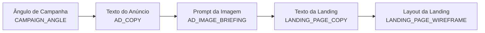
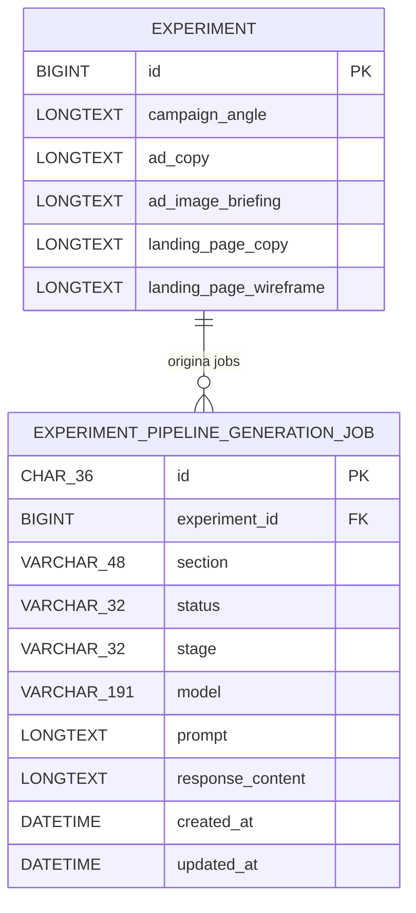

# Pipeline de Artefatos do Experimento (visão visual)

Este documento mostra, de forma visual, os itens do pipeline:

- Ângulo de Campanha
- Texto do Anúncio
- Prompt da Imagem
- Texto da Landing
- Layout da Landing

---

## Fluxo entre os itens

---

## Onde cada item é salvo

> Observação: os cinco artefatos acima ficam no registro de `experiment`.
> A tabela `experiment_pipeline_generation_job` registra execução, status e metadados da geração por seção.

---

## Mapeamento rápido (item → seção → coluna)

| Item visual | Seção do pipeline | Coluna na tabela `experiment` |
|---|---|---|
| Ângulo de Campanha | `CAMPAIGN_ANGLE` | `campaign_angle` |
| Texto do Anúncio | `AD_COPY` | `ad_copy` |
| Prompt da Imagem | `AD_IMAGE_BRIEFING` | `ad_image_briefing` |
| Texto da Landing | `LANDING_PAGE_COPY` | `landing_page_copy` |
| Layout da Landing | `LANDING_PAGE_WIREFRAME` | `landing_page_wireframe` |

---

## Dependência lógica entre os artefatos

1. **Ângulo de Campanha** define a tese central.
2. **Texto do Anúncio** usa o ângulo como base de copy.
3. **Prompt da Imagem** deriva do texto para orientar direção visual.
4. **Texto da Landing** mantém consistência com promessa/copy.
5. **Layout da Landing** organiza visualmente o texto final em blocos.

Esse encadeamento ajuda a manter coerência entre mensagem, criativo e página de destino.
