# Diagrama de Classes do Facebook Ads Worker

O diagrama abaixo apresenta as principais classes que participam do fluxo de
criação de campanhas no Facebook Ads a partir de experimentos aprovados pelo
backend. Estão incluídos o agendador, o serviço responsável por orquestrar as
chamadas e o cliente usado para conversar com a Graph API do Facebook.

> **Atualização:** Experimentos enviados pelo backend agora precisam informar o
> campo `instagramAccount`. O `FacebookCampaignService` ignora qualquer
> experimento sem essa associação para garantir que o criativo receba um
> `instagram_actor_id` válido.

```mermaid
classDiagram
    class FacebookCampaignScheduler {
        +schedule()
    }

    class FacebookCampaignService {
        -facebookAdsService : FacebookAdsService
        -backendClient : WebClient
        -backendBaseUrl : String
        -apiPrefix : String
        -configurationClient : FacebookWorkerConfigurationClient
        -experimentsBlockedByPermissions : Set<Long>
        +createCampaignsFromExperiments()
        -processExperiment(exp, config)
        -formatCreativeMessage(name, config) String
    }

    class FacebookAdsService {
        -webClient : WebClient
        -accessToken : AtomicReference<String>
        +createCampaign(adAccountId, name) String
        +createAdSet(adAccountId, request) String
        +createAdCreative(adAccountId, request) String
        +createAd(adAccountId, request) String
        +getCampaignMetrics(campaignId) JsonNode
        +renewLongLivedToken(appId, appSecret, token) TokenRenewalResponse
        +updateAccessToken(token)
    }

    class AdSetRequest {
        <<record>>
        +name : String
        +campaignId : String
        +dailyBudget : String
        +billingEvent : String
        +optimizationGoal : String
        +destinationType : String
        +bidStrategy : String
        +bidAmount : String
        +pageId : String
        +targetCountry : String
    }

    class AdCreativeRequest {
        <<record>>
        +name : String
        +pageId : String
        +instagramActorId : String
        +websiteUrl : String
        +leadGenFormId : String
        +message : String
        +callToActionType : String
        +headline : String
        +description : String
    }

    class AdRequest {
        <<record>>
        +name : String
        +adSetId : String
        +creativeId : String
    }

    class FacebookTokenRenewalScheduler {
        +scheduleRenewal()
    }

    class FacebookTokenRenewalService {
        -backendClient : WebClient
        -facebookAdsService : FacebookAdsService
        -tokenRenewalClient : FacebookTokenRenewalClient
        -backendBaseUrl : String
        -apiPrefix : String
        +renewTokensIfNeeded()
        +renewTokenForAccount(accountId, appId, appSecret, token, updateInMemory) : TokenRenewalAttemptResult
        -fetchEligibleAccounts()
        -performTokenRenewal(accountId, appId, appSecret, token) : TokenRenewalAttemptResult
    }

    class FacebookAccessTokenManager {
        -facebookAdsService : FacebookAdsService
        -configurationClient : FacebookWorkerConfigurationClient
        -tokenRenewalService : FacebookTokenRenewalService
        +tryRenewAccessTokenIfPossible() : RenewalAttemptResult
    }

    class FacebookTokenRenewalClient {
        -backendClient : WebClient
        -backendBaseUrl : String
        -apiPrefix : String
        +reportSuccess(accountId, token, expiresAt, renewedAt, attemptedAt)
        +reportFailure(accountId, attemptedAt, error)
    }

    class RenewalAttemptResult {
        <<record>>
        +outcome : RenewalOutcome
        +newToken : String
        +errorMessage : String
    }

    class RenewalOutcome {
        <<enum>>
        SUCCESS
        NOT_CONFIGURED
        FAILED
    }

    class CreateCampaignRequest {
        <<record>>
        +id : String
        +adAccountId : String
        +name : String
        +objective : String
        +budgetMode : BudgetMode
        +experimentId : Long
        +facebookAccountId : Long
        +adSet : AdSetPayload
        +adCreative : AdCreativePayload
        +ad : AdPayload
    }

    class AdSetPayload {
        <<record>>
        +id : String
        +name : String
        +billingEvent : String
        +optimizationGoal : String
        +bidStrategy : String
        +bidAmount : String
        +dailyBudget : String
        +lifetimeBudget : String
        +targetCountry : String
        +destinationType : String
        +pageId : String
    }

    class AdCreativePayload {
        <<record>>
        +id : String
        +pageId : String
        +instagramActorId : String
        +websiteUrl : String
        +leadGenFormId : String
        +message : String
        +callToActionType : String
        +headline : String
        +description : String
    }

    class AdPayload {
        <<record>>
        +id : String
        +name : String
        +adSetId : String
        +creativeId : String
    }

    class FacebookAdsCampaign {
        <<entity>>
        +id : String
        +externalId : String
        +adAccountId : String
        +name : String
        +objective : String
        +status : FacebookAdStatus
        +budgetMode : BudgetMode
        +dailyBudgetMinor : Long
        +lifetimeBudgetMinor : Long
        +apiVersion : String
        +experiment : Experiment
        +facebookAccount : FacebookAccount
        +specialAdCategories : Set<SpecialAdCategory>
        +specialAdCountries : Set<String>
        +createdAt : Instant
        +updatedAt : Instant
    }

    class FacebookAdsAdSet {
        <<entity>>
        +id : String
        +campaign : FacebookAdsCampaign
        +name : String
        +billingEvent : String
        +optimizationGoal : String
        +bidStrategy : String
        +bidAmountMinor : Long
        +dailyBudgetMinor : Long
        +targetingJson : String
        +promotedObjectJson : String
    }

    class FacebookAdsAdCreative {
        <<entity>>
        +id : String
        +pageId : String
        +instagramUserId : String
        +kind : AdCreativeKind
        +linkDataJson : String
    }

    class FacebookAdsAd {
        <<entity>>
        +id : String
        +adSet : FacebookAdsAdSet
        +creative : FacebookAdsAdCreative
        +name : String
    }

    class FacebookAdStatus {
        <<enum>>
        PAUSED
        ACTIVE
        ARCHIVED
        DELETED
    }

    class BudgetMode {
        <<enum>>
        CAMPAIGN
        ADSET
    }

    class SpecialAdCategory {
        <<enum>>
        NONE
        CREDIT
        EMPLOYMENT
        HOUSING
        ISSUES_ELECTIONS_POLITICS
    }

    class UrlUtils {
        <<utility>>
        +joinPath(base, prefix, path) String
    }

    FacebookCampaignScheduler --> FacebookCampaignService : dispara ciclo
    FacebookCampaignService --> FacebookAdsService : cria campanha/ad set/ad
    FacebookCampaignService --> FacebookAccessTokenManager : gerencia expiração de token
    FacebookCampaignService --> FacebookWorkerConfigurationClient : carrega configuração
    FacebookAdsService --> AdSetRequest
    FacebookAdsService --> AdCreativeRequest
    FacebookAdsService --> AdRequest
    FacebookCampaignService --> CreateCampaignRequest : monta payload do backend
    CreateCampaignRequest --> AdSetPayload
    CreateCampaignRequest --> AdCreativePayload
    CreateCampaignRequest --> AdPayload
    CreateCampaignRequest ..> FacebookAdsCampaign : persiste campanha
    CreateCampaignRequest ..> FacebookAdsAdSet : persiste ad set
    CreateCampaignRequest ..> FacebookAdsAdCreative : persiste criativo
    CreateCampaignRequest ..> FacebookAdsAd : persiste anúncio
    FacebookAdsCampaign --> FacebookAdStatus
    FacebookAdsCampaign --> BudgetMode
    FacebookAdsCampaign --> SpecialAdCategory
    FacebookAdsCampaign --> Experiment
    FacebookAdsCampaign --> FacebookAccount
    FacebookAdsAd --> FacebookAdsAdSet
    FacebookAdsAd --> FacebookAdsAdCreative
    FacebookCampaignService ..> UrlUtils : compõe URLs do backend
    FacebookTokenRenewalScheduler --> FacebookTokenRenewalService : agenda renovação
    FacebookTokenRenewalService --> FacebookTokenRenewalClient : reporta resultado da geração
    FacebookAccessTokenManager --> FacebookWorkerConfigurationClient : lê credenciais do backend
    FacebookAccessTokenManager --> FacebookTokenRenewalService : solicita novo token após expiração
    FacebookTokenRenewalService ..> UrlUtils : reutiliza composição de URLs
```

* `FacebookCampaignScheduler` agenda a execução periódica do worker utilizando
  `@Scheduled`.
* `FacebookCampaignService` consulta o backend por experimentos prontos, carrega
  a configuração ativa (`worker-config`), sincroniza o token em memória e cria a
  hierarquia de campanha na Graph API. O serviço resolve o `pageId` priorizando o
  valor padrão da conta e, em seguida, a página associada ao experimento; caso
  nenhuma dessas fontes esteja preenchida, o experimento é ignorado até que uma
  página seja configurada. O resultado completo (campanha, ad set, criativo e
  anúncio) é registrado no backend. Quando o Facebook devolve erro de permissão,
  o serviço adiciona o experimento a uma lista de bloqueio em memória para evitar
  novas tentativas até que o worker seja reiniciado.
* `FacebookAdsService` encapsula as chamadas à Graph API (criação da hierarquia
  de mídia, consulta de métricas e renovação de tokens de longa duração por meio
  do método `renewLongLivedToken`).
* `FacebookTokenRenewalScheduler` agenda o fluxo periódico de renovação de token
  e delega para `FacebookTokenRenewalService`.
* `FacebookTokenRenewalService` busca as contas elegíveis no backend, gera um
  novo token de 60 dias diretamente na Graph API reutilizando `FacebookAdsService`
  e reporta o resultado para o backend através de
  `POST /api/accounts/facebook/{id}/token/renewal`, atualizando o token em
  memória quando a resposta pertence à conta configurada no worker.
* `FacebookAccessTokenManager` encapsula a renovação imediata de tokens quando o
  `FacebookCampaignService` detecta expiração durante a criação de campanhas,
  delegando para o `FacebookTokenRenewalService` gerar o novo token e sincronizar
  o valor em memória.
* `FacebookWorkerConfigurationClient` fornece acesso ao endpoint
  `/api/accounts/facebook/worker-config`, permitindo que os serviços leiam as
  credenciais e parâmetros padrão preenchidos na interface web.
* `CreateCampaignRequest` representa o payload enviado ao backend contendo os
  campos mínimos para materializar a entidade de campanha, incluindo os
  identificadores do experimento e da conta de Facebook responsáveis pela
  geração automática.
* `FacebookAdsCampaign` é a entidade JPA do backend responsável por armazenar a
  campanha criada com seus metadados básicos e enums auxiliares.
* `UrlUtils` garante a composição correta das URLs ao concatenar `base-url`,
  `api-prefix` e o caminho dos endpoints do backend.

## Modelo de Dados de Campanha

O backend persiste os dados das campanhas na entidade `FacebookAdsCampaign`,
que reflete a tabela `facebook_ads_campaign`. Além dos atributos básicos
utilizados hoje (`id`, `adAccountId`, `name`, `objective` e `budgetMode`), o
modelo inclui campos para controle de status (`FacebookAdStatus`), valores de
orçamento (`dailyBudgetMinor`, `lifetimeBudgetMinor`), versão da API utilizada e
listas para categorias e países especiais (`specialAdCategories` e
`specialAdCountries`). Esses dados são enriquecidos conforme novas informações
forem fornecidas pelo worker e pelo backend.
    class FacebookWorkerConfigurationClient {
        -backendClient : WebClient
        -backendBaseUrl : String
        -apiPrefix : String
        +fetchConfiguration() Optional<FacebookWorkerConfiguration>
    }

    class FacebookWorkerConfiguration {
        <<record>>
        +accountId : Long
        +adAccountId : String
        +accessToken : String
        +appId : String
        +appSecret : String
        +defaultPageId : String
        +defaultInstagramActorId : String
        +defaultWebsiteUrl : String
        +defaultLeadGenFormId : String
        +defaultCreativeMessageTemplate : String
        +defaultCallToActionType : String
        +adSetDailyBudget : String
        +adSetBillingEvent : String
        +adSetOptimizationGoal : String
        +adSetDestinationType : String
        +adSetBidStrategy : String
        +adSetBidAmount : String
        +adSetTargetCountry : String
    }

