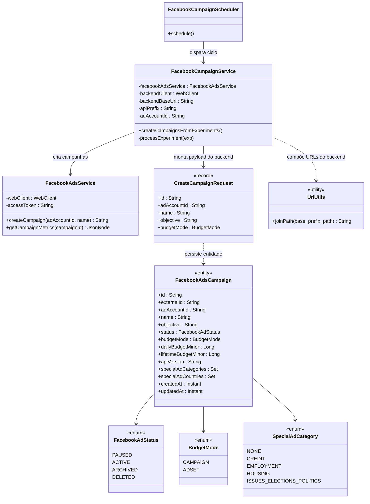

# Diagrama de Classes do Facebook Ads Worker

O diagrama abaixo apresenta as principais classes que participam do fluxo de
criação de campanhas no Facebook Ads a partir de experimentos aprovados pelo
backend. Estão incluídos o agendador, o serviço responsável por orquestrar as
chamadas e o cliente usado para conversar com a Graph API do Facebook.

* `FacebookCampaignScheduler` agenda a execução periódica do worker utilizando
  `@Scheduled`.
* `FacebookCampaignService` consulta o backend por experimentos prontos, cria a
  campanha na Graph API e registra o resultado de volta no backend.
* `FacebookAdsService` encapsula as chamadas à Graph API (criação de campanhas e
  consulta de métricas).
* `CreateCampaignRequest` representa o payload enviado ao backend contendo os
  campos mínimos para materializar a entidade de campanha.
* `FacebookAdsCampaign` é a entidade JPA do backend responsável por armazenar a
  campanha criada com seus metadados básicos e enums auxiliares.
* `UrlUtils` garante a composição correta das URLs ao concatenar `base-url`,
  `api-prefix` e o caminho dos endpoints do backend.

## Modelo de Dados de Campanha

O backend persiste os dados das campanhas na entidade `FacebookAdsCampaign`,
que reflete a tabela `facebook_ads_campaign`. Além dos atributos básicos
utilizados hoje (`id`, `adAccountId`, `name`, `objective` e `budgetMode`), o
modelo inclui campos para controle de status (`FacebookAdStatus`), valores de
orçamento (`dailyBudgetMinor`, `lifetimeBudgetMinor`), versão da API utilizada e
listas para categorias e países especiais (`specialAdCategories` e
`specialAdCountries`). Esses dados são enriquecidos conforme novas informações
forem fornecidas pelo worker e pelo backend.
