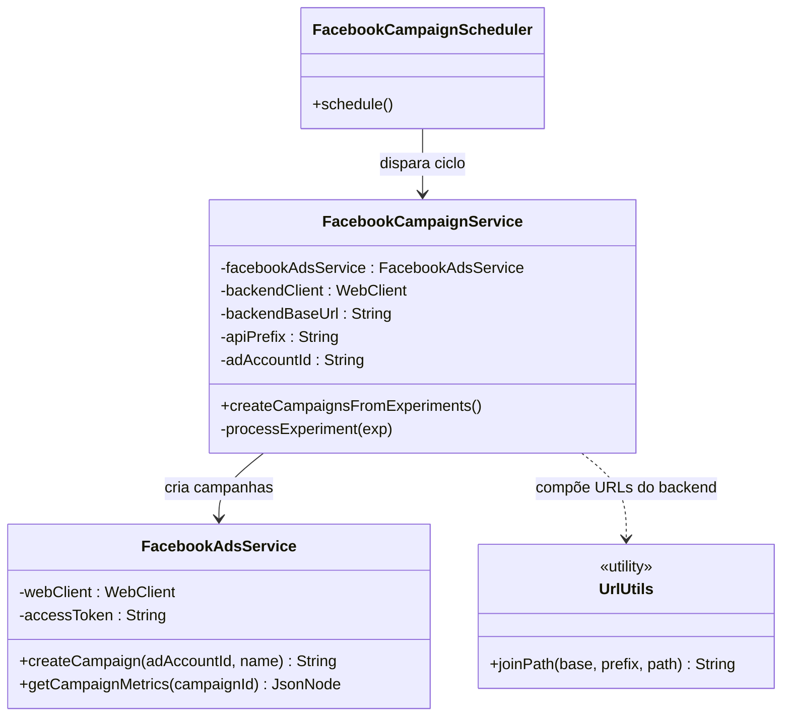

# Diagrama de Classes do Facebook Ads Worker

O diagrama abaixo apresenta as principais classes que participam do fluxo de
criação de campanhas no Facebook Ads a partir de experimentos aprovados pelo
backend. Estão incluídos o agendador, o serviço responsável por orquestrar as
chamadas e o cliente usado para conversar com a Graph API do Facebook.

* `FacebookCampaignScheduler` agenda a execução periódica do worker utilizando
  `@Scheduled`.
* `FacebookCampaignService` consulta o backend por experimentos prontos, cria a
  campanha na Graph API e registra o resultado de volta no backend.
* `FacebookAdsService` encapsula as chamadas à Graph API (criação de campanhas e
  consulta de métricas).
* `UrlUtils` garante a composição correta das URLs ao concatenar `base-url`,
  `api-prefix` e o caminho dos endpoints do backend.
