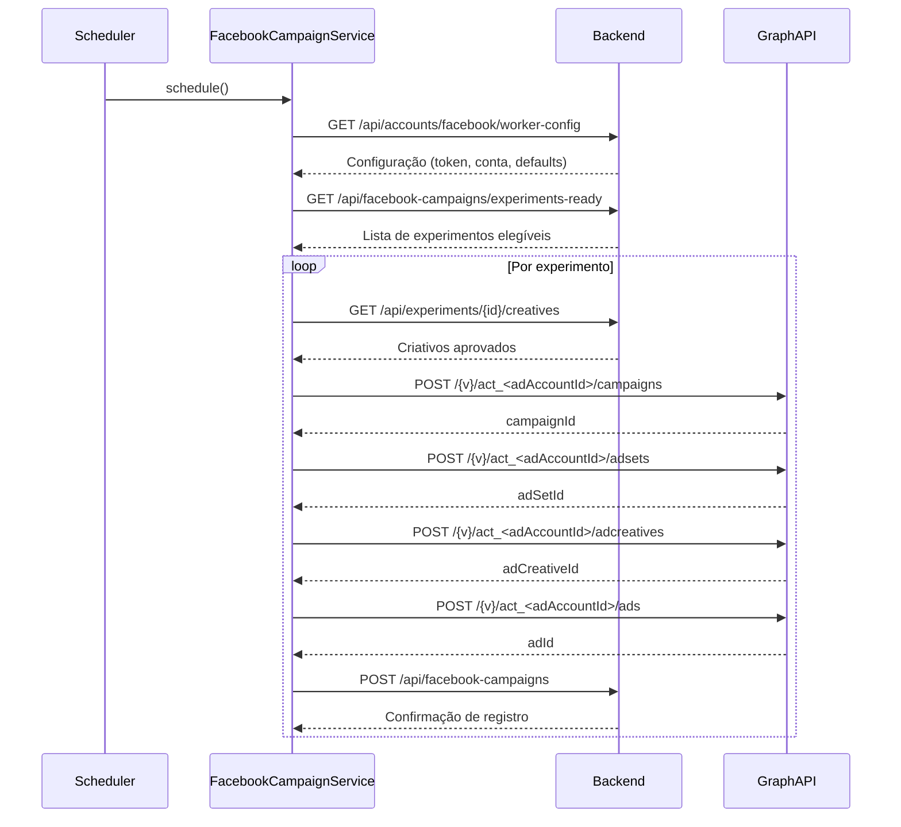
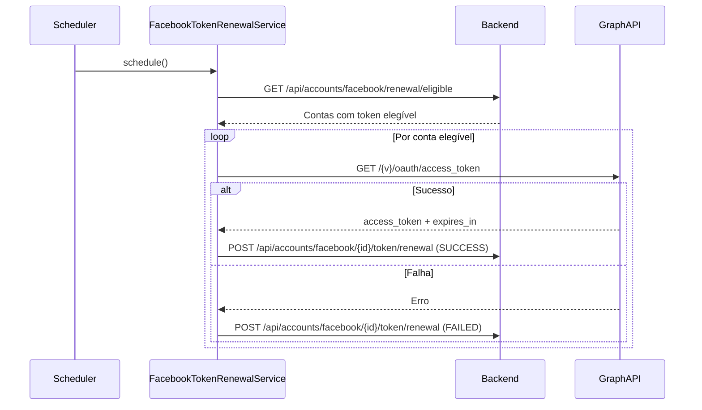

# Fluxo de chamadas do Facebook Ads Worker

> **Atualização 2025-08-22:** os experimentos retornados pelo backend devem
> conter `instagramAccount`. O worker ignora qualquer item sem essa associação,
> garantindo que o criativo seja criado com um `instagram_user_id` válido.

Este documento detalha como o **Facebook Ads Worker** conversa com o backend do
Marketing Hub e com a **Facebook Graph API** em três contextos principais:
publicação de instant forms, criação de campanhas e renovação automática de
tokens. Sempre que possível os fluxos são ilustrados com diagramas de sequência
para facilitar o entendimento sobre quais componentes iniciam as chamadas e
como as respostas são tratadas.

> **Responsabilidade de integrações:** Somente o Facebook Ads Worker chama as
> APIs do Facebook. O Worker IA integra exclusivamente com serviços de
> Inteligência Artificial e apenas persiste rascunhos aguardando aprovação.

## Criação de Instant Forms aprovados

Depois que o usuário aprova um instant form no backend, o Facebook Ads Worker
cria o formulário diretamente na Meta e devolve o `form_id` para persistência. O
processo automatizado cobre todo o ciclo de criação, enriquecendo o payload e
registrando métricas operacionais:

1. **Agendamento e descoberta** – O `FacebookInstantFormPublicationScheduler`
   consulta periodicamente `/api/instant-forms/approved-drafts`. Quando a rota
   não está disponível o worker repete a chamada usando
   `/api/instant-forms/ready-to-publish`, garantindo compatibilidade retroativa.
   Apenas formulários com `status = APPROVED` e identificador externo em branco
   são considerados.
2. **Carregar detalhes e defaults** – O serviço utiliza
   `/api/accounts/facebook/worker-config` para sincronizar token e página padrão,
   depois recupera os detalhes completos via `GET /api/instant-forms/{id}`. A URL
   de follow-up é herdada do experimento associado e a política de privacidade é
   resolvida a partir do formulário, do experimento ou, em último caso, de
   `/api/settings/privacy_policy_url`.
3. **Criação na Graph API** – Com os dados consolidados, o worker chama
   `POST /{pageId}/leadgen_forms`, enviando perguntas customizadas (ou o fallback
   `FULL_NAME` + `EMAIL`), `locale`, `follow_up_action_url` e a política de
   privacidade normalizada. O token da página é priorizado e os logs seguem o
   padrão `==>`/`<==`. Métricas Micrometer (`facebook.instant_form.creation.*`)
   monitoram quantidade processada, tempo de criação, erros por código HTTP e
   execuções em modo dry-run.
4. **Persistir e evitar duplicações** – O identificador retornado pela Meta é
   enviado ao backend via `PATCH /api/instant-forms/{id}/publication` com
   `status = CREATED`. Se o backend já possuir `externalId`/`facebookFormId`, a
   execução é ignorada, garantindo idempotência.
5. **Dry-run e testes** – Definir `facebook.instant-forms.dry-run=true` mantém o
   fluxo sem criar formulários reais. Para validações ponta-a-ponta a equipe pode
   usar os [test leads da Meta](https://developers.facebook.com/docs/marketing-api/guides/lead-ads/testing/).

### Chamadas ao backend

| Método | Caminho | Origem | Objetivo | Tratamento de erro |
| --- | --- | --- | --- | --- |
| GET | `/api/instant-forms/approved-drafts` | `FacebookInstantFormPublicationService` | Listar formulários aprovados sem `externalId` | `404` aciona fallback para `/ready-to-publish`; falhas de rede retornam lista vazia |
| GET | `/api/instant-forms/ready-to-publish` | `FacebookInstantFormPublicationService` | Fallback legacy para descoberta de formulários | `404` vira lista vazia; falhas de rede geram apenas `WARN` |
| GET | `/api/instant-forms/{id}` | `FacebookInstantFormPublicationService` | Carregar detalhes antes da criação | `404` encerra a tentativa e o formulário é ignorado até correção |
| GET | `/api/settings/privacy_policy_url` | `FacebookInstantFormPublicationService` | Fallback global de política de privacidade | `404` é logado uma vez; falhas de rede retornam `null` |
| PATCH | `/api/instant-forms/{id}/publication` | `FacebookInstantFormPublicationService` | Persistir `status = CREATED` e `facebookFormId` | Exceções são logadas; o agendamento segue com os demais itens |

### Chamadas à Graph API

| Método | Caminho (versão inclusa) | Origem | Dados relevantes | Observações |
| --- | --- | --- | --- | --- |
| POST | `/v23.0/{pageId}/leadgen_forms` | `FacebookAdsService.createInstantForm` | `name`, `locale`, `privacy_policy`, perguntas, `follow_up_action_*` | Usa token da página quando disponível; resposta retorna `id`/`draft_id`/`form_id` |

## Criação de campanhas

A rotina `FacebookCampaignScheduler` aciona periodicamente o
`FacebookCampaignService.createCampaignsFromExperiments()`, que orquestra o
processo descrito abaixo.

### Passo a passo

1. **Carregar configuração ativa** – O worker busca a conta marcada para
   processamento em `/api/accounts/facebook/worker-config`. A configuração
   fornece token, credenciais do app, conta de anúncios e valores padrão para
   mensagens, CTA, orçamento e segmentação. Respostas `404` ou falhas de rede
   são logadas uma vez por ciclo e fazem o worker aguardar a próxima execução
   sem interromper o serviço.
2. **Sincronizar token de acesso** – Quando o token vindo do backend diverge do
   que está em memória, `FacebookAdsService.updateAccessToken` atualiza o valor
   e mascara os logs para evitar exposição de segredos. Tokens vazios abortam o
   processamento.
3. **Buscar experimentos prontos** – O worker chama
   `/api/facebook-campaigns/experiments-ready`. Respostas `404` são interpretadas
   como “nenhum experimento disponível”, enquanto erros de rede apenas geram um
   aviso para manter o agendamento saudável.
4. **Carregar criativos aprovados** – Para cada experimento elegível, o worker
   consulta `/api/experiments/{id}/creatives` e escolhe o primeiro criativo com
   status `READY` (ou o primeiro da lista quando não há aprovados). Falhas nessa
   etapa impedem a criação da campanha específica, mas não interrompem o ciclo.
5. **Resolver página, destino e mensagens** – Antes de falar com a Graph API o
   worker calcula página do Facebook, Instagram user ID, URL/lead form e CTA,
   combinando valores vindos do experimento com os defaults da conta.
6. **Criar a hierarquia na Graph API** – A sequência de chamadas `POST` cria a
   campanha (`/campaigns`), conjunto (`/adsets`), criativo (`/adcreatives`) e
   anúncio (`/ads`) usando `facebook.graph-api.version` (padrão `v23.0`). Todas
   são enviadas com `status=PAUSED` e token mascarado nos logs. A composição dos
   payloads inclui segmentação geográfica, promoted object com `page_id`, CTA e
   mensagem do criativo.
7. **Persistir no backend** – Depois de obter os IDs da Graph API o worker envia
   `POST /api/facebook-campaigns` com `CreateCampaignRequest`, preservando os
   identificadores de campanha, conjunto, criativo e anúncio para rastreabilidade.
8. **Tratar erros de permissão** – Respostas `(#200)` da Graph API geram um
   bloqueio em memória para o experimento, log dedicado e chamada
   `PATCH /api/experiments/{id}/status?status=FAILED`. O backend pode falhar nessa
   atualização sem interromper o worker; nesse caso o experimento permanece em
   uma lista de bloqueio até reinício manual.
9. **Detectar token expirado em tempo de execução** – Exceções `(#190)` acionam o
   `FacebookAccessTokenManager`. Quando a renovação automática falha o worker
   pausa novas campanhas até que um token válido seja fornecido.

### Chamadas ao backend

| Método | Caminho | Origem | Objetivo | Tratamento de erro |
| --- | --- | --- | --- | --- |
| GET | `/api/accounts/facebook/worker-config` | `FacebookWorkerConfigurationClient` | Carregar token, conta e defaults | Loga `404` ou `PrematureClose` uma vez por indisponibilidade |
| GET | `/api/facebook-campaigns/experiments-ready` | `FacebookCampaignService` | Recuperar experimentos elegíveis | `404` vira lista vazia; falhas de rede apenas emitem `WARN` |
| GET | `/api/experiments/{id}/creatives` | `FacebookCampaignService` | Buscar criativos aprovados | Erros retornam `null`; o experimento é ignorado |
| POST | `/api/facebook-campaigns` | `FacebookCampaignService` | Registrar campanha, conjunto, criativo e anúncio criados | Exceções interrompem apenas o experimento atual |
| PATCH | `/api/experiments/{id}/status?status=FAILED` | `FacebookCampaignService` | Marcar experimento bloqueado por permissão | Falhas são apenas logadas |
| GET | `/api/accounts/facebook/renewal/eligible` | `FacebookTokenRenewalService` | Listar contas com renovação necessária | Erros retornam lista vazia |
| POST | `/api/accounts/facebook/{id}/token/renewal` | `FacebookTokenRenewalClient` | Persistir sucesso ou falha da renovação | Erros são logados com `ERROR` |

### Chamadas à Graph API

| Método | Caminho (versão inclusa) | Origem | Dados relevantes | Observações |
| --- | --- | --- | --- | --- |
| POST | `/v23.0/act_<adAccountId>/campaigns` | `FacebookAdsService.createCampaign` | Nome, objetivo dinâmico (`OUTCOME_TRAFFIC` ou `OUTCOME_LEADS`), `special_ad_categories=[]`, `status=PAUSED` | Usado tanto para campanhas Facebook quanto Instagram |
| POST | `/v23.0/act_<adAccountId>/adsets` | `FacebookAdsService.createAdSet` | Daily budget, billing event, optimization goal, destination type, targeting por país, promoted page | Inclui `bid_strategy` e `bid_amount` quando configurados |
| POST | `/v23.0/act_<adAccountId>/adcreatives` | `FacebookAdsService.createAdCreative` | `object_story_spec` com `page_id`, `instagram_user_id`, mensagem, CTA, link ou lead form | CTA só envia `value` quando há URL ou formulário |
| POST | `/v23.0/act_<adAccountId>/ads` | `FacebookAdsService.createAd` | Nome, `adset_id`, `creative_id`, `status=PAUSED` | Mantido pausado para revisão manual |
| GET | `/v23.0/{campaignId}/insights` | `FacebookAdsService.getCampaignMetrics` | Retorna métricas agregadas da campanha | Trata `(#190)` como token expirado |
| GET | `/v23.0/oauth/access_token` | `FacebookAdsService.renewLongLivedToken` | Query com `grant_type=fb_exchange_token`, `client_id`, `client_secret`, `fb_exchange_token` | Logs mascaram o token e retornam `expires_in` |

## Renovação automática de tokens

O `FacebookTokenRenewalScheduler` executa `FacebookTokenRenewalService` em um
intervalo configurado, cuidando tanto das renovações proativas quanto das
renovações emergenciais disparadas pelo `FacebookAccessTokenManager` quando a
Graph API devolve `(#190) OAuthException`.

### Passo a passo

1. **Descobrir contas elegíveis** – `GET /api/accounts/facebook/renewal/eligible`
   retorna apenas contas com renovação habilitada, token próximo do vencimento e
   credenciais completas (`appId`, `appSecret`). Erros devolvem lista vazia.
2. **Chamar a Graph API** – Para cada conta o serviço executa
   `GET /{version}/oauth/access_token` com `grant_type=fb_exchange_token`.
   A resposta traz o novo token e a validade em segundos; quando o Facebook não
   informa `expires_in`, aplica-se um fallback de 60 dias.
3. **Atualizar token em memória** – Se o token renovado pertence à conta usada
   pelo worker naquele momento, `FacebookAdsService.updateAccessToken` é chamado
   para sincronizar o valor sem reiniciar o serviço.
4. **Persistir o resultado no backend** – Sucessos enviam
   `POST /api/accounts/facebook/{id}/token/renewal` com status `SUCCESS`, novo
   token e data de expiração calculada. Falhas reportam o mesmo endpoint com
   status `FAILED`, mensagem de erro e datas de tentativa, permitindo que o
   frontend exiba os motivos do insucesso.
5. **Renovação automática em caso de erro `(#190)`** – Quando uma criação de
   campanha identifica token expirado, o `FacebookAccessTokenManager` reaproveita
   o mesmo fluxo acima. Se a renovação automática não estiver configurada ou
   continuar falhando, o worker pausa o processamento até receber um token
   válido, registrando mensagens de orientação nos logs.

## Referências adicionais

- Código-fonte principal: `facebook-ads-worker/src/main/java/com/marketinghub/facebookadsworker`
- Documentação oficial da Graph API: <https://developers.facebook.com/docs/graph-api>
- Referências de endpoints da Marketing API: <https://developers.facebook.com/docs/marketing-api/reference>
