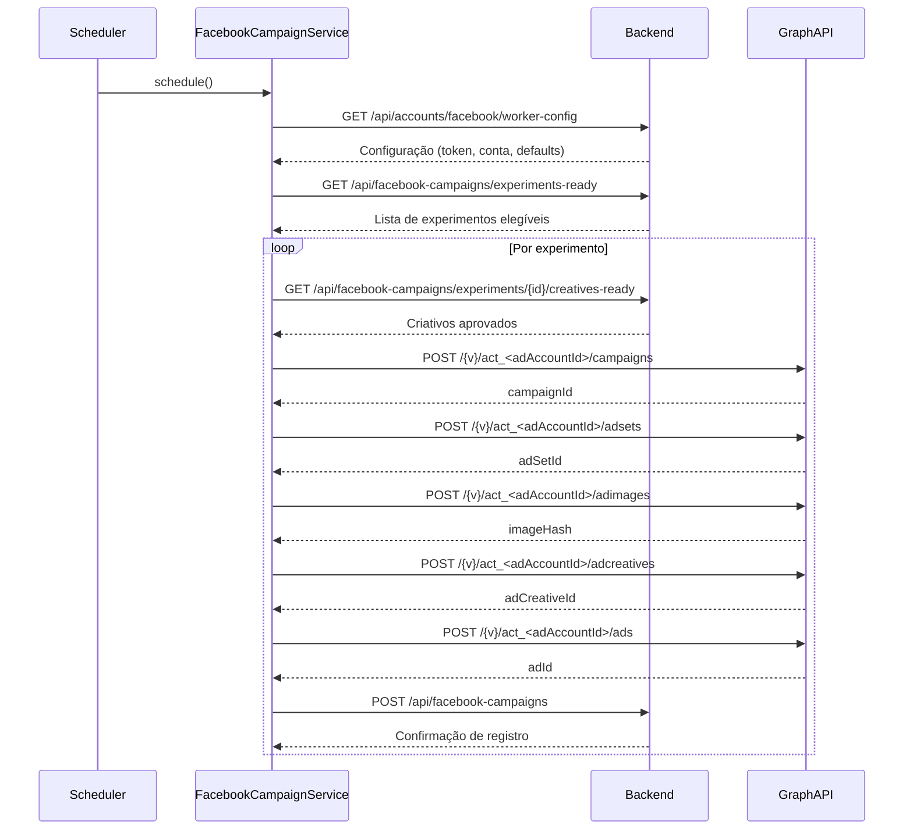
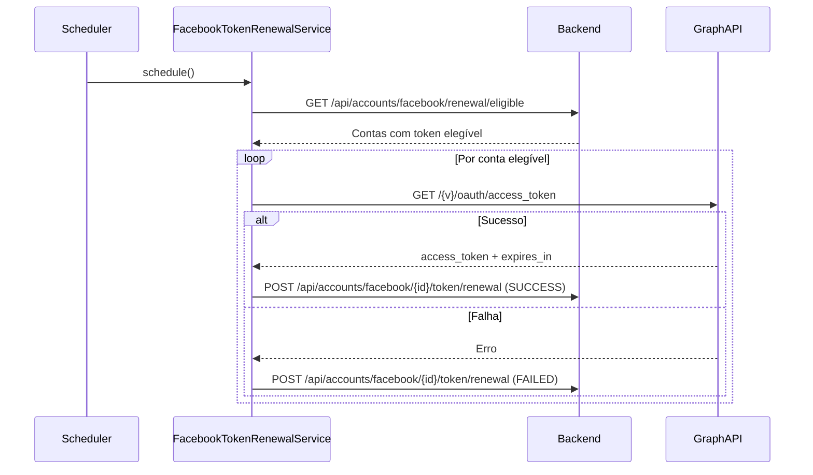

# Fluxo de chamadas do Facebook Ads Worker

> **Atualização 2025-08-22:** os experimentos retornados pelo backend devem
> conter `instagramAccount`. O worker ignora qualquer item sem essa associação,
> garantindo que o criativo seja criado com um `instagram_user_id` válido.

Este documento detalha como o **Facebook Ads Worker** conversa com o backend do
Marketing Hub e com a **Facebook Graph API** em três contextos principais:
publicação de instant forms, criação de campanhas e renovação automática de
tokens. Sempre que possível os fluxos são ilustrados com diagramas de sequência
para facilitar o entendimento sobre quais componentes iniciam as chamadas e
como as respostas são tratadas.

> **Responsabilidade de integrações:** Somente o Facebook Ads Worker chama as
> APIs do Facebook. O Worker IA integra exclusivamente com serviços de
> Inteligência Artificial e apenas persiste rascunhos aguardando aprovação.

## Publicação de Instant Forms aprovados

Quando o usuário aprova um instant form no backend, a criação do formulário na Meta é realizada manualmente pela equipe de operação. O Facebook Ads Worker apenas publica formulários existentes e sincroniza os identificadores antes de ativar campanhas que dependem deles:

1. **Verificação durante a campanha** – Ao preparar o criativo, o `FacebookCampaignService` normaliza o identificador informado (`facebookFormId` ou link de compartilhamento) e chama `FacebookAdsService.publishInstantForm` para garantir que o formulário esteja `ACTIVE`.
2. **Sincronização com o backend** – Depois de publicar o formulário, o worker atualiza o backend com `PATCH /api/instant-forms/{id}/publication`, registrando `published = true`, o `shareLink` definitivo e o `facebookFormId` retornado pela Meta.

### Chamadas ao backend

| Método | Caminho | Origem | Objetivo | Tratamento de erro |
| --- | --- | --- | --- | --- |
| PATCH | `/api/instant-forms/{id}/publication` | `FacebookCampaignService` | Registrar publicação, share link e `facebookFormId` | Exceções são logadas; o worker prossegue com o experimento |

### Chamadas à Graph API

| Método | Caminho (versão inclusa) | Origem | Dados relevantes | Observações |
| --- | --- | --- | --- | --- |
| POST | `/v23.0/{formId}` | `FacebookAdsService.publishInstantForm` | `status=ACTIVE`, `access_token` | Ignora erro `404` durante a verificação prévia; logs mascaram o token |

## Criação de campanhas

A rotina `FacebookCampaignScheduler` aciona periodicamente o
`FacebookCampaignService.createCampaignsFromExperiments()`, que orquestra o
processo descrito abaixo.

### Passo a passo

1. **Carregar configuração ativa** – O worker busca a conta marcada para
   processamento em `/api/accounts/facebook/worker-config`. A configuração
   fornece token, credenciais do app, conta de anúncios e valores padrão para
   mensagens, CTA, orçamento e segmentação. Respostas `404` ou falhas de rede
   são logadas uma vez por ciclo e fazem o worker aguardar a próxima execução
   sem interromper o serviço.
2. **Sincronizar token de acesso** – Quando o token vindo do backend diverge do
   que está em memória, `FacebookAdsService.updateAccessToken` atualiza o valor
   e mascara os logs para evitar exposição de segredos. Tokens vazios abortam o
   processamento.
3. **Buscar experimentos prontos** – O worker chama
   `/api/facebook-campaigns/experiments-ready`. Respostas `404` são interpretadas
   como “nenhum experimento disponível”, enquanto erros de rede apenas geram um
   aviso para manter o agendamento saudável.
4. **Carregar criativos aprovados** – Para cada experimento elegível, o worker
   consulta `/api/facebook-campaigns/experiments/{id}/creatives-ready`, contrato exclusivo
   do módulo Facebook para consumo de criativos, e recebe somente criativos `READY`.
   Falhas nessa etapa impedem a criação da campanha específica, mas não interrompem o ciclo.
5. **Resolver página, destino e mensagens** – Antes de falar com a Graph API o
   worker calcula página do Facebook, Instagram user ID, URL/lead form e CTA,
   combinando valores vindos do experimento com os defaults da conta.
6. **Criar a hierarquia na Graph API** – A sequência de chamadas `POST` cria a
   campanha (`/campaigns`), conjunto (`/adsets`), faz upload da imagem em
   `/adimages` para obter `image_hash`, cria o criativo (`/adcreatives`)
   referenciando esse hash e finaliza com anúncio (`/ads`) usando
   `facebook.graph-api.version` (padrão `v23.0`). Todas
   são enviadas com `status=PAUSED` e token mascarado nos logs. A composição dos
   payloads inclui segmentação geográfica, promoted object com `page_id`, CTA e
   mensagem do criativo.
7. **Persistir no backend** – Depois de obter os IDs da Graph API o worker envia
   `POST /api/facebook-campaigns` com `CreateCampaignRequest`, preservando os
   identificadores de campanha, conjunto, criativo e anúncio para rastreabilidade.
8. **Tratar erros de permissão** – Respostas `(#200)` da Graph API geram um
   bloqueio em memória para o experimento, log dedicado e chamada
   `PATCH /api/experiments/{id}/status?status=FAILED`. O backend pode falhar nessa
   atualização sem interromper o worker; nesse caso o experimento permanece em
   uma lista de bloqueio até reinício manual.
9. **Detectar token expirado em tempo de execução** – Exceções `(#190)` acionam o
   `FacebookAccessTokenManager`. Quando a renovação automática falha o worker
   pausa novas campanhas até que um token válido seja fornecido.

### Chamadas ao backend

| Método | Caminho | Origem | Objetivo | Tratamento de erro |
| --- | --- | --- | --- | --- |
| GET | `/api/accounts/facebook/worker-config` | `FacebookWorkerConfigurationClient` | Carregar token, conta e defaults | Loga `404` ou `PrematureClose` uma vez por indisponibilidade |
| GET | `/api/facebook-campaigns/experiments-ready` | `FacebookCampaignService` | Recuperar experimentos elegíveis | `404` vira lista vazia; falhas de rede apenas emitem `WARN` |
| GET | `/api/facebook-campaigns/experiments/{id}/creatives-ready` | `FacebookCampaignService` | Buscar criativos aprovados pelo contrato exclusivo de consumo do módulo Facebook | Erros retornam lista vazia; o experimento é ignorado |
| POST | `/api/facebook-campaigns` | `FacebookCampaignService` | Registrar campanha, conjunto, criativo e anúncio criados | Exceções interrompem apenas o experimento atual |
| PATCH | `/api/experiments/{id}/status?status=FAILED` | `FacebookCampaignService` | Marcar experimento bloqueado por permissão | Falhas são apenas logadas |
| GET | `/api/accounts/facebook/renewal/eligible` | `FacebookTokenRenewalService` | Listar contas com renovação necessária | Erros retornam lista vazia |
| POST | `/api/accounts/facebook/{id}/token/renewal` | `FacebookTokenRenewalClient` | Persistir sucesso ou falha da renovação | Erros são logados com `ERROR` |

### Chamadas à Graph API

| Método | Caminho (versão inclusa) | Origem | Dados relevantes | Observações |
| --- | --- | --- | --- | --- |
| POST | `/v23.0/act_<adAccountId>/campaigns` | `FacebookAdsService.createCampaign` | Nome, objetivo dinâmico (`OUTCOME_TRAFFIC` ou `OUTCOME_LEADS`), `special_ad_categories=[]`, `status=PAUSED` | Usado tanto para campanhas Facebook quanto Instagram |
| POST | `/v23.0/act_<adAccountId>/adsets` | `FacebookAdsService.createAdSet` | Daily budget, billing event, optimization goal, destination type, targeting por país, promoted page | Inclui `bid_strategy` e `bid_amount` quando configurados |
| POST | `/v23.0/act_<adAccountId>/adimages` | `FacebookAdsService.uploadAdImage` | upload binário/URL da imagem do criativo + `access_token` | Upload é independente do anúncio/criativo e retorna `image_hash` reutilizável na biblioteca da conta |
| POST | `/v23.0/act_<adAccountId>/adcreatives` | `FacebookAdsService.createAdCreative` | `object_story_spec` com `page_id`, `instagram_user_id`, mensagem, CTA, link ou lead form + `image_hash` | Evitar `image_url` direto no criativo; usar hash retornado por `/adimages` |
| POST | `/v23.0/act_<adAccountId>/ads` | `FacebookAdsService.createAd` | Nome, `adset_id`, `creative_id`, `status=PAUSED` | Mantido pausado para revisão manual |
| POST | `/v23.0/{campaignId}` | `FacebookAdsService.pauseCampaign` | `status=PAUSED`, `access_token` | Conforme [referência oficial da Marketing API](https://developers.facebook.com/docs/marketing-api/reference/ad-campaign/#Updating) |
| GET | `/v23.0/{campaignId}/insights` | `FacebookAdsService.getCampaignMetrics` | Retorna métricas agregadas da campanha | Trata `(#190)` como token expirado |
| GET | `/v23.0/oauth/access_token` | `FacebookAdsService.renewLongLivedToken` | Query com `grant_type=fb_exchange_token`, `client_id`, `client_secret`, `fb_exchange_token` | Logs mascaram o token e retornam `expires_in` |

## Pausa automática de campanhas

- Quando o backend identifica reprovação estatística no estágio de envio do formulário (limite de 3%), cada campanha vinculada recebe `stop_reason` e `stop_requested_at`.
- O agendador `FacebookCampaignStopScheduler` dispara `FacebookCampaignService.pauseCampaignsRequestedForStop()` para consumir esses pedidos periodicamente.
- Se uma campanha ainda não foi publicada (`external_id` ausente), o worker apenas confirma o pedido; caso contrário envia `status=PAUSED` para a Graph API antes da confirmação.

### Chamadas ao backend

| Método | Caminho | Origem | Objetivo | Observações |
| --- | --- | --- | --- | --- |
| GET | `/api/facebook-campaigns/stop-requests` | `FacebookCampaignService` | Listar campanhas com pausa pendente | Lista vazia indica nenhuma ação necessária |
| POST | `/api/facebook-campaigns/{id}/stop-results` | `FacebookCampaignService` | Confirmar sucesso ou erro da pausa | Erros mantêm o pedido ativo e registram `stop_last_error` |

## Renovação automática de tokens

O `FacebookTokenRenewalScheduler` executa `FacebookTokenRenewalService` em um
intervalo configurado, cuidando tanto das renovações proativas quanto das
renovações emergenciais disparadas pelo `FacebookAccessTokenManager` quando a
Graph API devolve `(#190) OAuthException`.

### Passo a passo

1. **Descobrir contas elegíveis** – `GET /api/accounts/facebook/renewal/eligible`
   retorna apenas contas com renovação habilitada, token próximo do vencimento e
   credenciais completas (`appId`, `appSecret`). Erros devolvem lista vazia.
2. **Chamar a Graph API** – Para cada conta o serviço executa
   `GET /{version}/oauth/access_token` com `grant_type=fb_exchange_token`.
   A resposta traz o novo token e a validade em segundos; quando o Facebook não
   informa `expires_in`, aplica-se um fallback de 60 dias.
3. **Atualizar token em memória** – Se o token renovado pertence à conta usada
   pelo worker naquele momento, `FacebookAdsService.updateAccessToken` é chamado
   para sincronizar o valor sem reiniciar o serviço.
4. **Persistir o resultado no backend** – Sucessos enviam
   `POST /api/accounts/facebook/{id}/token/renewal` com status `SUCCESS`, novo
   token e data de expiração calculada. Falhas reportam o mesmo endpoint com
   status `FAILED`, mensagem de erro e datas de tentativa, permitindo que o
   frontend exiba os motivos do insucesso.
5. **Renovação automática em caso de erro `(#190)`** – Quando uma criação de
   campanha identifica token expirado, o `FacebookAccessTokenManager` reaproveita
   o mesmo fluxo acima. Se a renovação automática não estiver configurada ou
   continuar falhando, o worker pausa o processamento até receber um token
   válido, registrando mensagens de orientação nos logs.

## Diretriz de tratamento de imagens em publicação de campanha

- Para publicação de campanhas, **não enviar `image_url` diretamente no payload do criativo** quando a imagem precisar ser materializada na conta de anúncio.
- O fluxo recomendado é: fazer upload da imagem em `POST /act_<adAccountId>/adimages`, capturar o `image_hash` retornado e então enviar esse `image_hash` no `POST /adcreatives`.
- A Meta documenta que o envio e gerenciamento de imagens pode ocorrer de forma independente do anúncio/criativo, por isso o worker deve priorizar esse fluxo baseado em biblioteca de imagens da conta.

## Referências adicionais

- Código-fonte principal: `facebook-ads-worker/src/main/java/com/marketinghub/facebookadsworker`
- Documentação oficial da Graph API: <https://developers.facebook.com/docs/graph-api>
- Referências de endpoints da Marketing API: <https://developers.facebook.com/docs/marketing-api/reference>
