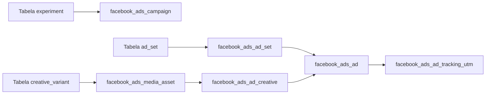

# Mapeamento de Campos de Entrada e Saída do Facebook Ads Worker

Este documento descreve como o **Facebook Ads Worker** transforma dados de planejamento em registros nas tabelas `facebook_ads_*` que são usados para chamadas à API do Facebook. Os campos de entrada vêm das tabelas `experiment`, `ad_set` e `creative_variant` descritas no [modelo de dados](../data-model.md), e são convertidos em campos de saída persistidos nas tabelas de destino.

## Visão Geral do Fluxo

## facebook_ads_campaign

| Campo de Entrada (`experiment`) | Campo de Saída | Transformação |
| --- | --- | --- |
| `name` | `facebook_ads_campaign.name` | Copiado diretamente do experimento |
| `start_date`, `end_date` | `facebook_ads_campaign.budget_mode`, `daily_budget_minor` | Define modo de orçamento e converte valores de `ad_set.budget` para a menor unidade monetária |
| `platform` | `facebook_ads_campaign.objective` | Objetivo configurado conforme a plataforma do experimento |

## facebook_ads_ad_set

| Campo de Entrada (`ad_set`, `experiment`) | Campo de Saída | Transformação |
| --- | --- | --- |
| `ad_set.location`, `interests`, `lookalikes` | `facebook_ads_ad_set.targeting_json` | Monta JSON de segmentação |
| `ad_set.budget` | `facebook_ads_ad_set.daily_budget_minor` | Converte orçamento em centavos |
| `experiment.start_date`, `ad_set.duration_days` | `facebook_ads_ad_set.start_time`, `end_time` | Calcula datas de início e fim |

## facebook_ads_media_asset

| Campo de Entrada (`creative_variant`) | Campo de Saída | Transformação |
| --- | --- | --- |
| `type` | `facebook_ads_media_asset.kind` | Mapeia tipo do criativo (imagem ou vídeo) |
| `asset_url` | `facebook_ads_media_asset.source_uri` | Usa URL do ativo original |

## facebook_ads_ad_creative

| Campo de Entrada (`creative_variant`) | Campo de Saída | Transformação |
| --- | --- | --- |
| `titles`, `descriptions` | `facebook_ads_ad_creative.link_data_json`/`video_data_json` | Gera payload JSON para pré-visualização |
| `type` | `facebook_ads_ad_creative.kind` | Define o tipo do criativo |
| `asset_url` | `facebook_ads_ad_creative.last_preview_url` | Usa URL gerada após upload do ativo |

## facebook_ads_ad

| Campo de Entrada | Campo de Saída | Transformação |
| --- | --- | --- |
| `facebook_ads_ad_set.id` | `facebook_ads_ad.adset_id` | Relaciona anúncio ao conjunto de anúncios |
| `facebook_ads_ad_creative.id` | `facebook_ads_ad.creative_id` | Relaciona anúncio ao criativo |
| `creative_variant.id` | `facebook_ads_ad.name` | Gera nome amigável para o anúncio |

## facebook_ads_ad_tracking_utm

| Campo de Entrada | Campo de Saída | Transformação |
| --- | --- | --- |
| `experiment.name` | `utm_campaign` | Utiliza nome do experimento como identificador de campanha |
| `ad_set.location` ou `creative_variant.id` | `utm_content` | Identifica variações do anúncio |
| Configuração global | `utm_source`, `utm_medium`, `utm_term` | Valores padrão definidos pelo produto |

