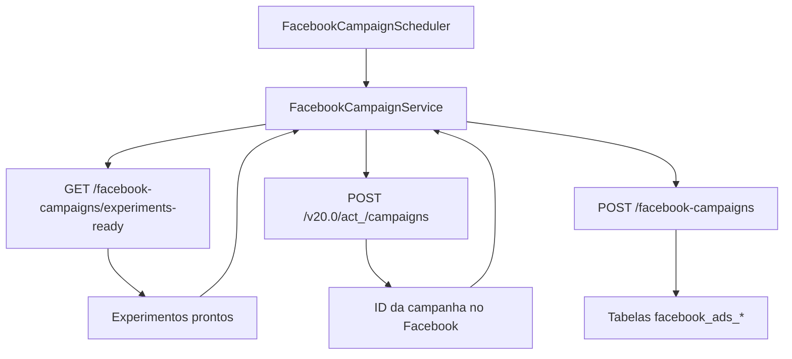

# Mapeamento de Campos de Entrada e Saída do Facebook Ads Worker

Este documento descreve como o **Facebook Ads Worker** converte os
experimentos aprovados pelo backend em chamadas à Graph API do Facebook e em
registros persistidos nas tabelas `facebook_ads_*`. O fluxo atual utiliza apenas
os dados necessários para registrar a campanha criada; o enriquecimento com
informações de conjuntos de anúncios, criativos e UTM permanece listado em
[pendencias.md](./pendencias.md).

Os experimentos que alimentam esse fluxo são apresentados ao time na tela
"Experimentos para Campanha" do frontend, garantindo o alinhamento entre a visão
operacional e a automação do worker.

## Visão Geral do Fluxo

## 1. Coleta de experimentos prontos

* **Endpoint consultado:** `GET {backend.base-url}{api-prefix}/facebook-campaigns/experiments-ready`
* **Tratamento de respostas:** se o backend retornar `404 NOT FOUND`, o worker
  considera que não há experimentos pendentes e encerra o ciclo atual.
* **Contrato esperado:** uma lista de objetos `Experiment` com a estrutura abaixo.

| Campo | Tipo | Uso atual |
| --- | --- | --- |
| `id` | `long` | Disponível para evoluções futuras (não utilizado na criação da campanha) |
| `name` | `string` | Usado como nome da campanha no Facebook e no backend |

## 2. Criação de campanha no Facebook

* **Endpoint da Graph API:** `POST https://graph.facebook.com/v20.0/act_<adAccountId>/campaigns`
* **Payload enviado:**

| Campo | Origem | Observações |
| --- | --- | --- |
| `name` | `Experiment.name` | Nome exibido no Gerenciador de Anúncios |
| `objective` | Constante | Valor fixo `OUTCOME_TRAFFIC` |
| `access_token` | Configuração `facebook.access-token` | Token com permissão para o Ad Account |

* **Resposta tratada:** apenas o identificador retornado em `id` é utilizado.

## 3. Persistência da campanha no backend

Após receber o `id` da Graph API, o worker envia um `CreateCampaignRequest` para
o backend.

* **Endpoint chamado:** `POST {backend.base-url}{api-prefix}/facebook-campaigns`
* **Campos enviados:**

| Campo | Fonte | Transformação |
| --- | --- | --- |
| `id` | Resposta da Graph API | Copiado diretamente do `id` retornado na criação |
| `adAccountId` | Propriedade `facebook.ad-account-id` | Mantido conforme configuração do worker |
| `name` | `Experiment.name` | Replicado para manter rastreabilidade entre backend e Facebook |
| `objective` | Constante | Valor fixo `OUTCOME_TRAFFIC` (mesmo utilizado na Graph API) |
| `budgetMode` | Constante | Valor fixo `CAMPAIGN` até que o backend passe a enviar planejamento detalhado |

## Observações

* As tabelas `facebook_ads_campaign`, `facebook_ads_ad_set`, `facebook_ads_ad`
  e demais estruturas descritas em [../data-model.md](../data-model.md) recebem
  atualmente apenas os dados relacionados à criação da campanha. O preenchimento
  de campos adicionais será implementado junto com as pendências listadas em
  [pendencias.md](./pendencias.md).
* A composição das URLs dos endpoints do backend utiliza `UrlUtils.joinPath`
  para garantir que `backend.base-url`, `backend.api-prefix` e o caminho do
  recurso não gerem barras duplicadas.
