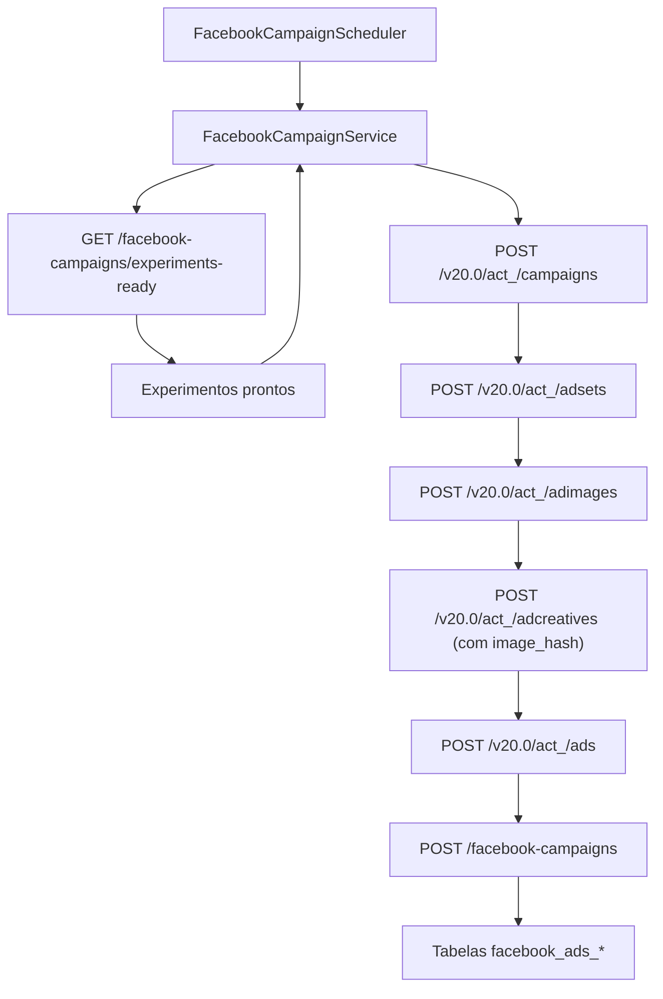

# Mapeamento de Campos de Entrada e Saída do Facebook Ads Worker

> **Atualização 2025-08-22:** o backend passou a enviar o campo
> `instagramAccount` junto com cada experimento. O worker usa o código dessa
> conta para preencher `instagram_user_id` e ignora registros sem essa
> informação.

Este documento descreve como o **Facebook Ads Worker** converte os
experimentos aprovados pelo backend em chamadas à Graph API do Facebook e em
registros persistidos nas tabelas `facebook_ads_*`. O fluxo atual cria a
hierarquia completa (campanha → ad set → criativo → anúncio) utiliza os valores
definidos na conta marcada para o worker na tela **Contas do Facebook**. O
backend expõe esses dados via `GET /api/accounts/facebook/worker-config`, que
reúne token, App ID/Secret e parâmetros padrão de orçamento, destino e criativos.

## Instant forms

Quando um formulário aprovado ainda não possui identificador externo, o worker
consulta `/api/instant-forms/approved-drafts` (com fallback para
`/ready-to-publish`), carrega os detalhes em `GET /api/instant-forms/{id}` e
envia `POST /{pageId}/leadgen_forms` com perguntas customizadas, `locale`,
`follow_up_action_url` herdado do experimento e a política de privacidade
resolvida a partir do formulário ou do endpoint
`/api/settings/privacy_policy_url`. O `form_id`/`draft_id` retornado é
persistido com `PATCH /api/instant-forms/{id}/publication`, registrando
`status = CREATED` e `published=false`.

Os experimentos que alimentam esse fluxo são apresentados ao time na tela
"Experimentos para Campanha" do frontend, garantindo o alinhamento entre a visão
operacional e a automação do worker.

## Visão Geral do Fluxo

## 1. Coleta de experimentos prontos

* **Endpoint consultado:** `GET {backend.base-url}{api-prefix}/facebook-campaigns/experiments-ready`
* **Tratamento de respostas:** se o backend retornar `404 NOT FOUND`, o worker
  considera que não há experimentos pendentes e encerra o ciclo atual.
* **Contrato esperado:** uma lista de objetos `Experiment` com a estrutura abaixo.

| Campo | Tipo | Uso atual |
| --- | --- | --- |
| `id` | `long` | Disponível para evoluções futuras (não utilizado diretamente na criação) |
| `name` | `string` | Usado como nome base para campanha, ad set, criativo e anúncio |

## 2. Criação da campanha no Facebook

* **Endpoint da Graph API:** `POST https://graph.facebook.com/v20.0/act_<adAccountId>/campaigns`
* **Payload enviado:**

| Campo | Origem | Observações |
| --- | --- | --- |
| `name` | `Experiment.name` | Nome exibido no Gerenciador de Anúncios |
| `objective` | Destino resolvido | `OUTCOME_TRAFFIC` para sites ou `OUTCOME_LEADS` quando o fluxo usa formulário de leads |
| `status` | Constante | `PAUSED` para evitar publicação automática |
| `special_ad_categories` | Constante | Lista com `NONE`, atendendo às políticas atuais |
| `access_token` | Conta configurada (`worker-config.accessToken`) | Token com permissão para o Ad Account |

* **Resposta tratada:** o identificador retornado em `id` abastece as etapas seguintes.

## 3. Criação do conjunto de anúncios

* **Endpoint da Graph API:** `POST https://graph.facebook.com/v20.0/act_<adAccountId>/adsets`
* **Payload enviado:**

| Campo | Origem | Observações |
| --- | --- | --- |
| `name` | `Experiment.name` + sufixo | Mantém rastreabilidade visual no Gerenciador |
| `campaign_id` | Resposta da campanha | Vincula o ad set à campanha recém-criada |
| `daily_budget` | Conta configurada (`worker-config.adSetDailyBudget`) | Valor em centavos da moeda da conta |
| `billing_event` | Conta configurada (`worker-config.adSetBillingEvent`) | Default `IMPRESSIONS` |
| `optimization_goal` | Conta configurada (`worker-config.adSetOptimizationGoal`); forçado para `LEAD_GENERATION` quando o criativo referencia um formulário de leads | Default `LINK_CLICKS` |
| `destination_type` | Conta configurada (`worker-config.adSetDestinationType`) ou `ON_AD` quando o criativo referencia um formulário de leads | Ajustado dinamicamente conforme o destino resolvido |
| `targeting.geo_locations.countries` | Conta configurada (`worker-config.adSetTargetCountry`) | Segmentação inicial simplificada |
| `promoted_object.page_id` | Conta configurada (`worker-config.defaultPageId`) ou página associada ao experimento | Necessário para campanhas de tráfego |
| `status` | Constante | `PAUSED` |
| `access_token` | Conta configurada (`worker-config.accessToken`) | Token com permissão para o Ad Account |

* **Resposta tratada:** o `id` do ad set é utilizado na criação do anúncio.

## 4. Upload da imagem para a biblioteca da conta

* **Endpoint da Graph API:** `POST https://graph.facebook.com/v20.0/act_<adAccountId>/adimages`
* **Objetivo:** enviar a imagem do anúncio para a biblioteca da conta de anúncio e recuperar o `image_hash` oficial.
* **Observação:** a Meta permite enviar e gerenciar imagens de forma independente de anúncios/criativos; por isso o worker deve priorizar esse fluxo em vez de depender de `image_url` no criativo.

## 5. Criação do criativo

* **Endpoint da Graph API:** `POST https://graph.facebook.com/v20.0/act_<adAccountId>/adcreatives`
* **Payload enviado:**

| Campo | Origem | Observações |
| --- | --- | --- |
| `name` | `Experiment.name` + sufixo | Nome amigável para o criativo |
| `object_story_spec.page_id` | Conta configurada (`worker-config.defaultPageId`) ou página associada ao experimento | Página responsável pelo anúncio |
| `object_story_spec.instagram_user_id` | Conta configurada (`worker-config.defaultInstagramActorId`) | Opcional; usado quando há Instagram vinculado |
| `object_story_spec.link_data.message` | Template (`worker-config.defaultCreativeMessageTemplate`) | Substitui `%s` pelo nome do experimento |
| `object_story_spec.link_data.link` | Conta configurada (`worker-config.defaultWebsiteUrl`) ou `Creative.destinationUrl` | O worker envia apenas quando existe URL; formulários de leads funcionam sem este campo |
| `object_story_spec.link_data.call_to_action.type` | Conta configurada (`worker-config.defaultCallToActionType`) ou `Creative.cta` | Lista completa documentada em [call-to-action-types.md](call-to-action-types.md) |
| `object_story_spec.link_data.call_to_action.value.link` | Mesmo valor de `link` | Omitido quando a campanha utiliza formulário de leads |
| `object_story_spec.link_data.call_to_action.value.lead_gen_form_id` | `Creative.leadGenFormId` ou `worker-config.defaultLeadGenFormId` | Permite direcionar o CTA para formulários do Facebook ou Instagram |
| `object_story_spec.link_data.image_hash` | Retorno de `POST /adimages` | Referencia a imagem já enviada à biblioteca da conta; preferível a `image_url` no criativo |
| `access_token` | Conta configurada (`worker-config.accessToken`) | Token com permissão para o Ad Account |

* **Resposta tratada:** o `id` do criativo abastece a criação do anúncio.

## 6. Criação do anúncio

* **Endpoint da Graph API:** `POST https://graph.facebook.com/v20.0/act_<adAccountId>/ads`
* **Payload enviado:**

| Campo | Origem | Observações |
| --- | --- | --- |
| `name` | `Experiment.name` + sufixo | Permite localizar o anúncio dentro do conjunto |
| `adset_id` | Resposta do ad set | Mantém o vínculo com a etapa anterior |
| `creative.creative_id` | Resposta do criativo | Referencia o criativo recém-criado |
| `status` | Constante | `PAUSED` |
| `access_token` | Conta configurada (`worker-config.accessToken`) | Token com permissão para o Ad Account |

* **Resposta tratada:** o identificador alimenta o payload enviado ao backend,
  mantendo o vínculo entre anúncio, conjunto e criativo na base própria.

## 7. Persistência da campanha no backend

Após criar a hierarquia na Graph API, o worker envia um `CreateCampaignRequest`
para o backend.

* **Endpoint chamado:** `POST {backend.base-url}{api-prefix}/facebook-campaigns`
* **Campos enviados:**

| Campo | Fonte | Transformação |
| --- | --- | --- |
| `id` | Resposta da Graph API (campanha) | Copiado diretamente do `id` retornado na criação |
| `adAccountId` | Conta configurada (`worker-config.adAccountId`) | Mantido conforme configuração do worker |
| `name` | `Experiment.name` | Replicado para manter rastreabilidade entre backend e Facebook |
| `objective` | Valor retornado na criação da campanha | `OUTCOME_TRAFFIC` ou `OUTCOME_LEADS`, refletindo o destino configurado |
| `budgetMode` | Constante | Valor fixo `CAMPAIGN` até que o backend passe a enviar planejamento detalhado |
| `experimentId` | `Experiment.id` | Garante vínculo direto com o experimento que originou a campanha |
| `facebookAccountId` | `worker-config.accountId` | Mantém rastreabilidade com a conta utilizada pelo worker |
| `adSet.id` | Resposta da Graph API (ad set) | Persistido como `facebook_ads_ad_set.id` |
| `adSet.targetCountry` | `worker-config.adSetTargetCountry` | Serializado para JSON em `facebook_ads_ad_set.targeting_json` |
| `adSet.pageId` | `worker-config.defaultPageId` ou página associada ao experimento | Serializado como `promoted_object_json` |
| `adCreative.id` | Resposta da Graph API (criativo) | Persistido como `facebook_ads_ad_creative.id` |
| `adCreative.websiteUrl` | Configuração do worker ou criativo aprovado | Serializado em `link_data_json` |
| `adCreative.leadGenFormId` | `Creative.leadGenFormId` ou fallback da conta | Persistido em `link_data_json.call_to_action.value.lead_gen_form_id` |
| `ad.id` | Resposta da Graph API (anúncio) | Persistido como `facebook_ads_ad.id` e vinculado ao ad set/criativo salvos |

## Observações

* O payload enviado ao backend inclui `experimentId`, `facebookAccountId` e as
  estruturas completas de `adSet`, `adCreative` e `ad`, garantindo que todas as
  tabelas `facebook_ads_*` recebam os identificadores gerados na Graph API.
* A persistência do ad set replica a segmentação simplificada utilizada hoje
  (`geo_locations.countries`) e o `page_id` promovido. Evoluções futuras podem
  complementar esse JSON com segmentações ricas e planejamento de orçamento.
* A composição das URLs dos endpoints do backend utiliza `UrlUtils.joinPath`
  para garantir que `backend.base-url`, `backend.api-prefix` e o caminho do
  recurso não gerem barras duplicadas.
