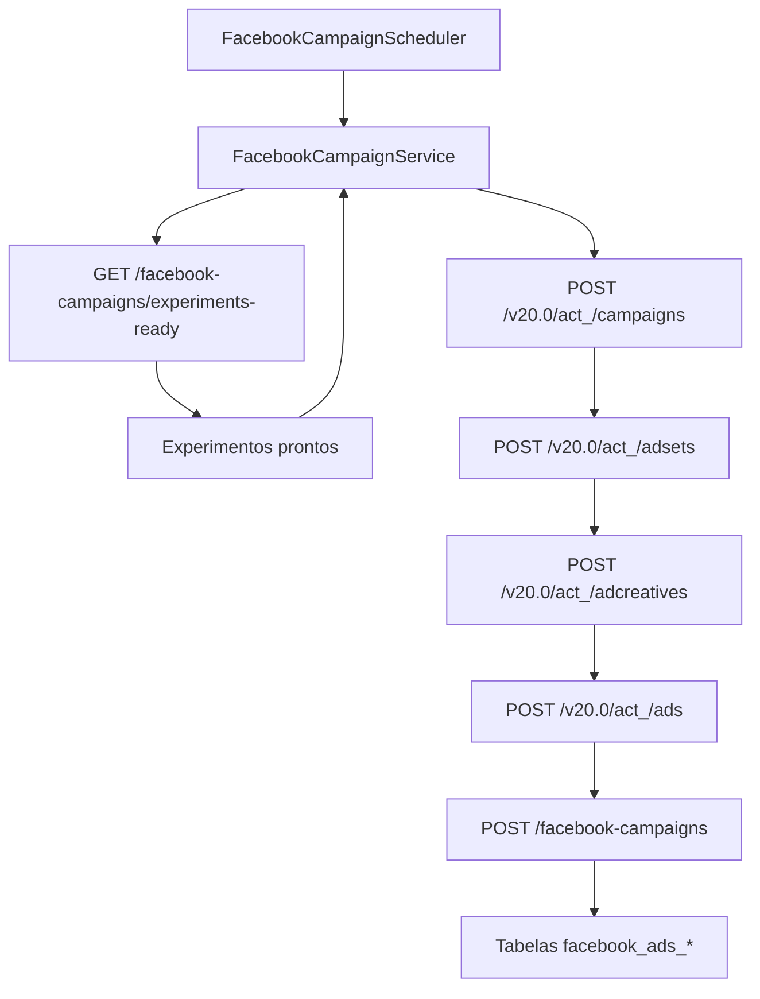

# Mapeamento de Campos de Entrada e Saída do Facebook Ads Worker

Este documento descreve como o **Facebook Ads Worker** converte os
experimentos aprovados pelo backend em chamadas à Graph API do Facebook e em
registros persistidos nas tabelas `facebook_ads_*`. O fluxo atual cria a
hierarquia completa (campanha → ad set → criativo → anúncio) utilizando valores
padrão configuráveis enquanto o backend evolui para fornecer parâmetros mais
ricos.

Os experimentos que alimentam esse fluxo são apresentados ao time na tela
"Experimentos para Campanha" do frontend, garantindo o alinhamento entre a visão
operacional e a automação do worker.

## Visão Geral do Fluxo

## 1. Coleta de experimentos prontos

* **Endpoint consultado:** `GET {backend.base-url}{api-prefix}/facebook-campaigns/experiments-ready`
* **Tratamento de respostas:** se o backend retornar `404 NOT FOUND`, o worker
  considera que não há experimentos pendentes e encerra o ciclo atual.
* **Contrato esperado:** uma lista de objetos `Experiment` com a estrutura abaixo.

| Campo | Tipo | Uso atual |
| --- | --- | --- |
| `id` | `long` | Disponível para evoluções futuras (não utilizado diretamente na criação) |
| `name` | `string` | Usado como nome base para campanha, ad set, criativo e anúncio |

## 2. Criação da campanha no Facebook

* **Endpoint da Graph API:** `POST https://graph.facebook.com/v20.0/act_<adAccountId>/campaigns`
* **Payload enviado:**

| Campo | Origem | Observações |
| --- | --- | --- |
| `name` | `Experiment.name` | Nome exibido no Gerenciador de Anúncios |
| `objective` | Constante | Valor fixo `OUTCOME_TRAFFIC` |
| `status` | Constante | `PAUSED` para evitar publicação automática |
| `special_ad_categories` | Constante | Lista com `NONE`, atendendo às políticas atuais |
| `access_token` | Configuração `facebook.access-token` | Token com permissão para o Ad Account |

* **Resposta tratada:** o identificador retornado em `id` abastece as etapas seguintes.

## 3. Criação do conjunto de anúncios

* **Endpoint da Graph API:** `POST https://graph.facebook.com/v20.0/act_<adAccountId>/adsets`
* **Payload enviado:**

| Campo | Origem | Observações |
| --- | --- | --- |
| `name` | `Experiment.name` + sufixo | Mantém rastreabilidade visual no Gerenciador |
| `campaign_id` | Resposta da campanha | Vincula o ad set à campanha recém-criada |
| `daily_budget` | Configuração `facebook.ad-set.daily-budget` | Valor em centavos da moeda da conta |
| `billing_event` | Configuração `facebook.ad-set.billing-event` | Default `IMPRESSIONS` |
| `optimization_goal` | Configuração `facebook.ad-set.optimization-goal` | Default `LINK_CLICKS` |
| `destination_type` | Configuração `facebook.ad-set.destination-type` | Default `WEBSITE` |
| `targeting.geo_locations.countries` | Configuração `facebook.ad-set.target-country` | Segmentação inicial simplificada |
| `promoted_object.page_id` | Configuração `facebook.page-id` | Necessário para campanhas de tráfego |
| `status` | Constante | `PAUSED` |
| `access_token` | Configuração `facebook.access-token` | Token com permissão para o Ad Account |

* **Resposta tratada:** o `id` do ad set é utilizado na criação do anúncio.

## 4. Criação do criativo

* **Endpoint da Graph API:** `POST https://graph.facebook.com/v20.0/act_<adAccountId>/adcreatives`
* **Payload enviado:**

| Campo | Origem | Observações |
| --- | --- | --- |
| `name` | `Experiment.name` + sufixo | Nome amigável para o criativo |
| `object_story_spec.page_id` | Configuração `facebook.page-id` | Página responsável pelo anúncio |
| `object_story_spec.instagram_actor_id` | Configuração `facebook.instagram-actor-id` | Opcional; usado quando há Instagram vinculado |
| `object_story_spec.link_data.message` | Template `facebook.creative.message-template` | Substitui `%s` pelo nome do experimento |
| `object_story_spec.link_data.link` | Configuração `facebook.website-url` | URL de destino padrão |
| `object_story_spec.link_data.call_to_action.type` | Configuração `facebook.creative.call-to-action-type` | Default `LEARN_MORE` |
| `object_story_spec.link_data.call_to_action.value.link` | Configuração `facebook.website-url` | Mesmo destino do link principal |
| `access_token` | Configuração `facebook.access-token` | Token com permissão para o Ad Account |

* **Resposta tratada:** o `id` do criativo abastece a criação do anúncio.

## 5. Criação do anúncio

* **Endpoint da Graph API:** `POST https://graph.facebook.com/v20.0/act_<adAccountId>/ads`
* **Payload enviado:**

| Campo | Origem | Observações |
| --- | --- | --- |
| `name` | `Experiment.name` + sufixo | Permite localizar o anúncio dentro do conjunto |
| `adset_id` | Resposta do ad set | Mantém o vínculo com a etapa anterior |
| `creative.creative_id` | Resposta do criativo | Referencia o criativo recém-criado |
| `status` | Constante | `PAUSED` |
| `access_token` | Configuração `facebook.access-token` | Token com permissão para o Ad Account |

* **Resposta tratada:** o identificador é armazenado apenas para auditoria de execução (não é persistido no backend ainda).

## 6. Persistência da campanha no backend

Após criar a hierarquia na Graph API, o worker envia um `CreateCampaignRequest`
para o backend.

* **Endpoint chamado:** `POST {backend.base-url}{api-prefix}/facebook-campaigns`
* **Campos enviados:**

| Campo | Fonte | Transformação |
| --- | --- | --- |
| `id` | Resposta da Graph API (campanha) | Copiado diretamente do `id` retornado na criação |
| `adAccountId` | Propriedade `facebook.ad-account-id` | Mantido conforme configuração do worker |
| `name` | `Experiment.name` | Replicado para manter rastreabilidade entre backend e Facebook |
| `objective` | Constante | Valor fixo `OUTCOME_TRAFFIC` |
| `budgetMode` | Constante | Valor fixo `CAMPAIGN` até que o backend passe a enviar planejamento detalhado |

## Observações

* As tabelas `facebook_ads_ad_set`, `facebook_ads_ad` e entidades auxiliares já
  estão preparadas no backend, mas ainda não recebem dados adicionais além do
  identificador da campanha. O enriquecimento com segmentação detalhada, criativos
  aprovados pelo usuário e UTMs permanece listado em [pendencias.md](./pendencias.md).
* A composição das URLs dos endpoints do backend utiliza `UrlUtils.joinPath`
  para garantir que `backend.base-url`, `backend.api-prefix` e o caminho do
  recurso não gerem barras duplicadas.
