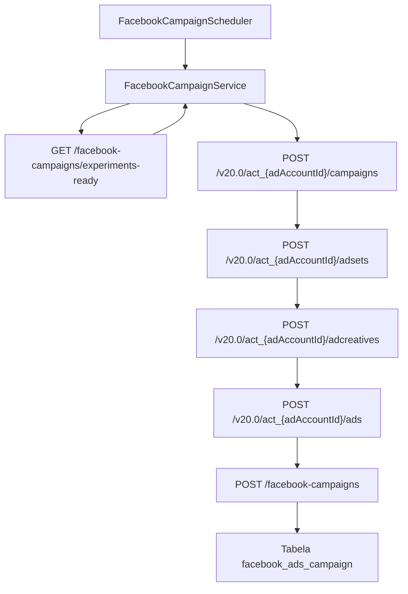

# Transformação de Experimentos em Campanhas do Facebook

Este documento descreve como o MarketingHub converte experimentos aprovados em
campanhas no Facebook Ads, criando automaticamente conjuntos de anúncios,
criativos e anúncios associados antes de registrar os dados no backend.

A fila de trabalho usada aqui é a mesma exibida na tela "Experimentos para
Campanha" do frontend, que lista os experimentos aprovados e prontos para serem
transformados em campanhas.

## Visão geral do fluxo

## Etapas do processo atual

### 1. Agendamento e coleta de experimentos

O `FacebookCampaignScheduler` agenda periodicamente a execução de
`createCampaignsFromExperiments()`, delegando a transformação para o
[FacebookCampaignService](../../facebook-ads-worker/src/main/java/com/marketinghub/facebookadsworker/facebookcampaign/FacebookCampaignService.java).
Quando executado, o serviço faz um `GET` em
`/api/facebook-campaigns/experiments-ready`, aceitando respostas `404` como
"nenhum experimento disponível" e, em caso de sucesso, converte o corpo em uma
lista de `Experiment` antes de prosseguir ([FacebookCampaignScheduler.java](../../facebook-ads-worker/src/main/java/com/marketinghub/facebookadsworker/facebookcampaign/FacebookCampaignScheduler.java#L7-L17), [FacebookCampaignService.java](../../facebook-ads-worker/src/main/java/com/marketinghub/facebookadsworker/facebookcampaign/FacebookCampaignService.java#L70-L99)).

O endpoint `experiments-ready` é exposto pelo backend e retorna os experimentos
planejados para Facebook cuja audiência e criativos já foram aprovados, graças à
consulta `listReadyForCampaign()` no serviço de experimentos ([FacebookAdsCampaignController.java](../../backend/ads-service/src/main/java/com/marketinghub/facebookads/web/FacebookAdsCampaignController.java#L22-L37), [ExperimentService.java](../../backend/ads-service/src/main/java/com/marketinghub/experiment/service/ExperimentService.java#L157-L160)).

### 2. Criação da hierarquia na Graph API

Para cada experimento, o worker utiliza o
[FacebookAdsService](../../facebook-ads-worker/src/main/java/com/marketinghub/facebookadsworker/FacebookAdsService.java) para
montar a hierarquia completa:

1. **Campanha**: `POST /campaigns` com objetivo `OUTCOME_TRAFFIC`, status
   `PAUSED` e `special_ad_categories = NONE`. O identificador retornado alimenta
   as etapas seguintes ([FacebookCampaignService.java](../../facebook-ads-worker/src/main/java/com/marketinghub/facebookadsworker/facebookcampaign/FacebookCampaignService.java#L195-L205)).
2. **Conjunto de anúncios**: `POST /adsets` com orçamento diário, billing event,
   objetivo de otimização e tipo de destino vindos da conta configurada no
   backend (`worker-config`). Quando o criativo ou o fallback informam
   `leadGenFormId`, o worker troca `destination_type` para `LEAD_GENERATION`.
   A segmentação inicial utiliza apenas o país padrão enquanto o backend não
   envia dados mais ricos. O `id` retornado é usado na criação do anúncio ([FacebookCampaignService.java](../../facebook-ads-worker/src/main/java/com/marketinghub/facebookadsworker/facebookcampaign/FacebookCampaignService.java#L196-L208)).
3. **Criativo**: `POST /adcreatives` baseado em um `object_story_spec` que inclui
   `page_id`, `instagram_actor_id` opcional, template de mensagem com o nome do
   experimento e call-to-action vindos da mesma configuração. Quando o criativo
   ou a conta informam `leadGenFormId`, o worker adiciona `call_to_action.value.lead_gen_form_id`
   e torna o campo `link` opcional, habilitando formulários instantâneos no
   Facebook/Instagram. O `id` retornado alimenta o anúncio ([FacebookCampaignService.java](../../facebook-ads-worker/src/main/java/com/marketinghub/facebookadsworker/facebookcampaign/FacebookCampaignService.java#L209-L219)).
4. **Anúncio**: `POST /ads` referenciando o ad set e o criativo recém-criados, em
   status `PAUSED` para permitir revisão manual antes da ativação
   ([FacebookCampaignService.java](../../facebook-ads-worker/src/main/java/com/marketinghub/facebookadsworker/facebookcampaign/FacebookCampaignService.java#L220-L225)).

Todos os pontos de contato com a Graph API reutilizam o `access_token` exposto
pelo `worker-config`. Quando a Graph API responde com `(#190) OAuthException`
indicando expiração do token, o `FacebookCampaignService` interrompe o fluxo
temporariamente e delega a renovação para o `FacebookAccessTokenManager`, que
consulta novamente o backend antes de atualizar o token em memória.

### 3. Persistência no backend

Após concluir as chamadas à Graph API, o worker envia um
`CreateCampaignRequest` para o backend com os campos necessários para registrar
a campanha, o conjunto, o criativo e o anúncio gerados. O payload replica os
identificadores retornados pela Graph API, os parâmetros de segmentação
utilizados (`targetCountry`, `pageId`) e os metadados do criativo (`websiteUrl`,
`message`, `callToActionType`), garantindo rastreabilidade completa nas tabelas
`facebook_ads_campaign`, `facebook_ads_ad_set`, `facebook_ads_ad_creative` e
`facebook_ads_ad`
([FacebookCampaignService.java](../../facebook-ads-worker/src/main/java/com/marketinghub/facebookadsworker/facebookcampaign/FacebookCampaignService.java#L195-L269), [FacebookAdsCampaignController.java](../../backend/ads-service/src/main/java/com/marketinghub/facebookads/web/FacebookAdsCampaignController.java#L39-L196)).

## Mapeamento de campos

| Fonte | Destino | Observações |
| --- | --- | --- |
| `Experiment.name` | `Graph API - name` | Nome base para campanha, ad set, criativo e anúncio ([FacebookCampaignService.java](../../facebook-ads-worker/src/main/java/com/marketinghub/facebookadsworker/facebookcampaign/FacebookCampaignService.java#L169-L224)) |
| `Experiment.name` | `CreateCampaignRequest.name` | Mantém rastreabilidade entre backend e Facebook ([FacebookCampaignService.java](../../facebook-ads-worker/src/main/java/com/marketinghub/facebookadsworker/facebookcampaign/FacebookCampaignService.java#L226-L263)) |
| `worker-config.adAccountId` | `Graph API - URLs` | Define o Ad Account usado em todas as chamadas `POST` ([FacebookCampaignService.java](../../facebook-ads-worker/src/main/java/com/marketinghub/facebookadsworker/facebookcampaign/FacebookCampaignService.java#L38-L67)) |
| `worker-config.accessToken` | `Graph API - access_token` | Token reutilizado em campanha, ad set, criativo e anúncio ([FacebookAdsService.java](../../facebook-ads-worker/src/main/java/com/marketinghub/facebookadsworker/FacebookAdsService.java#L18-L208)) |
| `worker-config.adSet*` | `Graph API - adsets` e `CreateCampaignRequest.adSet` | Define orçamento, otimização e país padrão, replicados no backend ([FacebookCampaignService.java](../../facebook-ads-worker/src/main/java/com/marketinghub/facebookadsworker/facebookcampaign/FacebookCampaignService.java#L196-L245)) |
| `worker-config.defaultPageId` | `Graph API - promoted_object` / `object_story_spec.page_id` / `CreateCampaignRequest.adSet.pageId` | Necessário para ad sets e criativos; caso ausente, o worker usa a página associada ao experimento ou o `pageId` legado ([FacebookCampaignService.java](../../facebook-ads-worker/src/main/java/com/marketinghub/facebookadsworker/facebookcampaign/FacebookCampaignService.java#L177-L245)) |
| `worker-config.defaultInstagramActorId` | `Graph API - object_story_spec.instagram_actor_id` / `CreateCampaignRequest.adCreative.instagramActorId` | Opcional, incluído apenas quando configurado ([FacebookCampaignService.java](../../facebook-ads-worker/src/main/java/com/marketinghub/facebookadsworker/facebookcampaign/FacebookCampaignService.java#L209-L255)) |
| `worker-config.defaultCreativeMessageTemplate` | `Graph API - object_story_spec.link_data.message` | Template com suporte a `%s` para o nome do experimento ([FacebookCampaignService.java](../../facebook-ads-worker/src/main/java/com/marketinghub/facebookadsworker/facebookcampaign/FacebookCampaignService.java#L189-L193)) |
| `worker-config.defaultWebsiteUrl` | `Graph API - link_data.link`/`call_to_action.value.link` e `CreateCampaignRequest.adCreative.websiteUrl` | URL padrão de destino persistida no backend; opcional quando há formulário configurado ([FacebookCampaignService.java](../../facebook-ads-worker/src/main/java/com/marketinghub/facebookadsworker/facebookcampaign/FacebookCampaignService.java#L209-L255)) |
| `worker-config.defaultLeadGenFormId` | `Graph API - call_to_action.value.lead_gen_form_id` e `CreateCampaignRequest.adCreative.leadGenFormId` | Fallback para formulários Instant/Lead Ads quando o criativo não define `leadGenFormId` |
| Resposta da Graph API (`id`) | `CreateCampaignRequest.id`/`adSet.id`/`adCreative.id`/`ad.id` | Identificadores de campanha, ad set, criativo e anúncio persistidos nas respectivas tabelas |
| Constante `OUTCOME_TRAFFIC` | `Graph API - objective` e `CreateCampaignRequest.objective` | Objetivo padrão até existir planejamento específico |
| Constante `CAMPAIGN` | `CreateCampaignRequest.budgetMode` | Modo de orçamento usado atualmente pelo backend |
| `Experiment.id` | `CreateCampaignRequest.experimentId` | Usado para preencher a FK `facebook_ads_campaign.experiment_id` |
| `FacebookWorkerConfiguration.accountId` | `CreateCampaignRequest.facebookAccountId` | Alimenta a FK `facebook_ads_campaign.facebook_account_id` |

## Informações de experimento ainda não utilizadas

O backend já expõe no resumo do experimento campos como hipótese, KPI alvo de
CPL, janelas de veiculação e audiências detalhadas, mas o worker ainda não os
consome. Esses atributos serão necessários para parametrizar orçamento,
segmentações ricas e mensagens específicas em versões futuras ([FacebookAdsCampaignController.java](../../backend/ads-service/src/main/java/com/marketinghub/facebookads/web/FacebookAdsCampaignController.java#L22-L57), [ExperimentReadyForAdSetDto.java](../../backend/ads-service/src/main/java/com/marketinghub/facebookads/dto/ExperimentReadyForAdSetDto.java#L18-L23)).

## Entidades relacionadas e próximos passos

Os experimentos concentram entidades auxiliares que precisarão ser mapeadas
para completar a configuração avançada da campanha:

- `creative` (variantes de criativos gerados para o experimento). ([data-model.md](../data-model.md#creative))
- `ad_set` (configurações completas de orçamento, duração e segmentação). ([data-model.md](../data-model.md#ad_set))
- `landing_page` e `metric_snapshot` (rastreio de performance e destino de
  tráfego). ([data-model.md](../data-model.md#landing_page), [data-model.md](../data-model.md#metric_snapshot))

Com a hierarquia básica persistida, as próximas evoluções se concentram em
enriquecer os registros com segmentações detalhadas, UTMs e métricas periódicas
([pendencias.md](./pendencias.md)).
