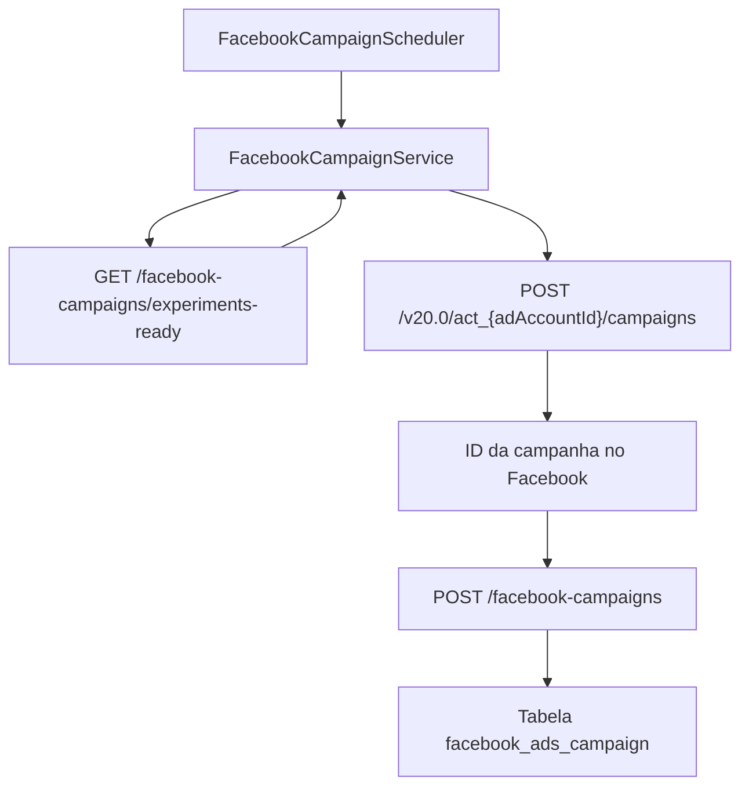

# Transformação de Experimentos em Campanhas do Facebook

Este documento descreve como o MarketingHub converte experimentos aprovados em
campanhas no Facebook Ads e os próximos passos para incluir entidades
relacionadas (conjuntos de anúncios, criativos e rastreamento).

A fila de trabalho usada aqui é a mesma exibida na tela "Experimentos para
Campanha" do frontend, que lista os experimentos aprovados e prontos para serem
transformados em campanhas.

## Visão geral do fluxo

## Etapas do processo atual

### 1. Agendamento e coleta de experimentos

O `FacebookCampaignScheduler` agenda periodicamente a execução de
`createCampaignsFromExperiments()`, delegando a transformação para o
[FacebookCampaignService](../../facebook-ads-worker/src/main/java/com/marketinghub/facebookadsworker/facebookcampaign/FacebookCampaignService.java).
Quando executado, o serviço faz um `GET` em
`/api/facebook-campaigns/experiments-ready`, aceitando respostas `404` como
"nenhum experimento disponível" e, em caso de sucesso, converte o corpo em uma
lista de `Experiment` antes de prosseguir.【F:facebook-ads-worker/src/main/java/com/marketinghub/facebookadsworker/facebookcampaign/FacebookCampaignScheduler.java†L7-L17】【F:facebook-ads-worker/src/main/java/com/marketinghub/facebookadsworker/facebookcampaign/FacebookCampaignService.java†L21-L55】

O endpoint `experiments-ready` é exposto pelo backend e retorna os experimentos
planejados para Facebook cuja audiência e criativos já foram aprovados, graças à
consulta `listReadyForCampaign()` no serviço de experimentos.【F:backend/ads-service/src/main/java/com/marketinghub/facebookads/web/FacebookAdsCampaignController.java†L22-L37】【F:backend/ads-service/src/main/java/com/marketinghub/experiment/service/ExperimentService.java†L138-L150】

### 2. Criação da campanha na Graph API

Para cada experimento coletado, o worker chama o
[FacebookAdsService](../../facebook-ads-worker/src/main/java/com/marketinghub/facebookadsworker/FacebookAdsService.java)
que executa `POST /v20.0/act_{adAccountId}/campaigns` com o nome do experimento
como `name` e o objetivo fixo `OUTCOME_TRAFFIC`, retornando o identificador
criado pela API do Facebook.【F:facebook-ads-worker/src/main/java/com/marketinghub/facebookadsworker/facebookcampaign/FacebookCampaignService.java†L57-L64】【F:facebook-ads-worker/src/main/java/com/marketinghub/facebookadsworker/FacebookAdsService.java†L19-L36】

### 3. Persistência no backend

Após obter o `id` gerado pela Graph API, o worker envia um
`CreateCampaignRequest` para o backend com os campos mínimos necessários para
registrar a campanha na tabela `facebook_ads_campaign`. A chamada utiliza o
mesmo nome do experimento e preenche `objective` e `budgetMode` com constantes
(`OUTCOME_TRAFFIC` e `CAMPAIGN`).【F:facebook-ads-worker/src/main/java/com/marketinghub/facebookadsworker/facebookcampaign/FacebookCampaignService.java†L57-L67】【F:backend/ads-service/src/main/java/com/marketinghub/facebookads/web/FacebookAdsCampaignController.java†L39-L57】

## Mapeamento de campos

| Fonte | Destino | Observações |
| --- | --- | --- |
| `Experiment.name` | `Graph API - name` | Nome da campanha no Facebook Ads (replicado do experimento).【F:facebook-ads-worker/src/main/java/com/marketinghub/facebookadsworker/facebookcampaign/FacebookCampaignService.java†L57-L62】 |
| `Experiment.name` | `CreateCampaignRequest.name` | Mantém rastreabilidade entre backend e Facebook.【F:facebook-ads-worker/src/main/java/com/marketinghub/facebookadsworker/facebookcampaign/FacebookCampaignService.java†L57-L67】 |
| `facebook.ad-account-id` (configuração) | `Graph API - URL` | Define o Ad Account usado no `POST /campaigns`.【F:facebook-ads-worker/src/main/java/com/marketinghub/facebookadsworker/facebookcampaign/FacebookCampaignService.java†L21-L33】 |
| `facebook.access-token` (configuração) | `Graph API - access_token` | Token enviado pelo `FacebookAdsService`.【F:facebook-ads-worker/src/main/java/com/marketinghub/facebookadsworker/FacebookAdsService.java†L19-L36】 |
| Resposta da Graph API (`id`) | `CreateCampaignRequest.id` | Persistido como identificador principal da campanha.【F:facebook-ads-worker/src/main/java/com/marketinghub/facebookadsworker/facebookcampaign/FacebookCampaignService.java†L57-L67】 |
| Constante `OUTCOME_TRAFFIC` | `Graph API - objective` e `CreateCampaignRequest.objective` | Objetivo padrão até que exista planejamento específico por experimento.【F:facebook-ads-worker/src/main/java/com/marketinghub/facebookadsworker/facebookcampaign/FacebookCampaignService.java†L57-L67】【F:facebook-ads-worker/src/main/java/com/marketinghub/facebookadsworker/FacebookAdsService.java†L25-L33】 |
| Constante `CAMPAIGN` | `CreateCampaignRequest.budgetMode` | Modo de orçamento usado atualmente pelo backend.【F:facebook-ads-worker/src/main/java/com/marketinghub/facebookadsworker/facebookcampaign/FacebookCampaignService.java†L57-L67】 |

## Informações de experimento ainda não utilizadas

O backend já expõe no resumo do experimento campos como hipótese, KPI alvo de
CPL e janela de veiculação (datas de início e fim), mas o worker ainda não os
consome, limitando-se ao nome e identificador numérico. Esses atributos serão
necessários para parametrizar orçamento, datas e segmentações em versões
posteriores.【F:backend/ads-service/src/main/java/com/marketinghub/facebookads/web/FacebookAdsCampaignController.java†L22-L57】

## Entidades relacionadas e próximos passos

Os experimentos concentram entidades auxiliares que precisarão ser mapeadas
para completar a configuração da campanha:

- `creative` (variantes de criativos gerados para o experimento).【F:docs/data-model.md†L120-L145】
- `ad_set` (configurações de orçamento, duração e segmentação).【F:docs/data-model.md†L146-L161】
- `landing_page` e `metric_snapshot` (rastreio de performance e destino de
  tráfego).【F:docs/data-model.md†L162-L195】

As pendências registradas para o Facebook Ads Worker já listam a necessidade de
mapear orçamento, segmentação, criativos e UTMs para futuras iterações.【F:docs/facebook-ads-worker/pendencias.md†L9-L40】 Com base nisso, recomenda-se o
seguinte plano incremental:

1. **Enriquecer o consumo do endpoint** `experiments-ready`, expandindo o record
   `Experiment` do worker para incluir datas, metas financeiras e hipóteses, e
   propagá-las ao payload da Graph API quando os campos estiverem
   disponíveis.【F:facebook-ads-worker/src/main/java/com/marketinghub/facebookadsworker/facebookcampaign/FacebookCampaignService.java†L34-L69】【F:backend/ads-service/src/main/java/com/marketinghub/facebookads/web/FacebookAdsCampaignController.java†L22-L57】
2. **Gerar conjuntos de anúncios** a partir de `ad_set` ligados ao experimento,
   respeitando interesses, públicos semelhantes e orçamento diário listado nas
   pendências do worker.【F:docs/data-model.md†L146-L161】【F:docs/facebook-ads-worker/pendencias.md†L17-L33】
3. **Associar criativos aprovados** (`creative` e `creative_variant`) e
   configurar parâmetros de rastreamento UTM conforme planejado, garantindo
   rastreabilidade ponta a ponta entre experimento, campanha e métricas de
   performance.【F:docs/data-model.md†L120-L145】【F:docs/facebook-ads-worker/pendencias.md†L25-L39】

Esses passos mantêm a coesão com o modelo de dados existente e orientam a
ampliação da transformação de experimentos em campanhas completas no Facebook
Ads.
