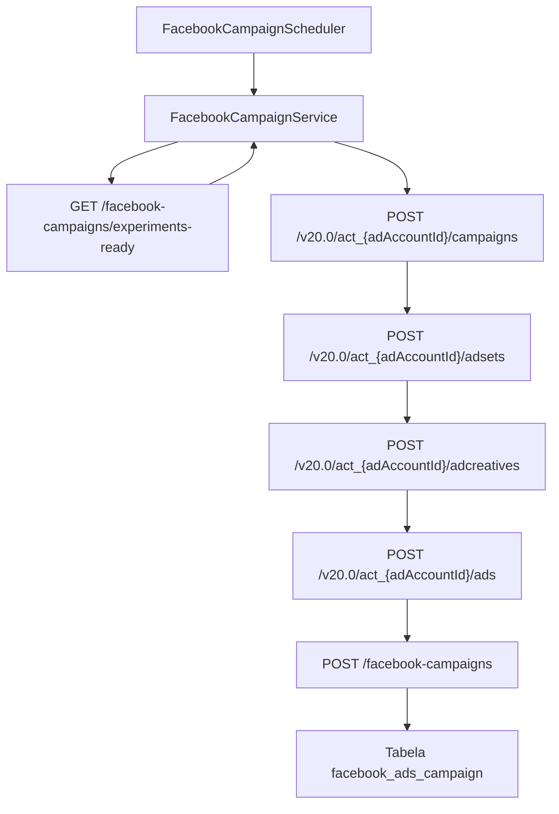

# Transformação de Experimentos em Campanhas do Facebook

Este documento descreve como o MarketingHub converte experimentos aprovados em
campanhas no Facebook Ads, criando automaticamente conjuntos de anúncios,
criativos e anúncios associados antes de registrar os dados no backend.

A fila de trabalho usada aqui é a mesma exibida na tela "Experimentos para
Campanha" do frontend, que lista os experimentos aprovados e prontos para serem
transformados em campanhas.

## Visão geral do fluxo

## Etapas do processo atual

### 1. Agendamento e coleta de experimentos

O `FacebookCampaignScheduler` agenda periodicamente a execução de
`createCampaignsFromExperiments()`, delegando a transformação para o
[FacebookCampaignService](../../facebook-ads-worker/src/main/java/com/marketinghub/facebookadsworker/facebookcampaign/FacebookCampaignService.java).
Quando executado, o serviço faz um `GET` em
`/api/facebook-campaigns/experiments-ready`, aceitando respostas `404` como
"nenhum experimento disponível" e, em caso de sucesso, converte o corpo em uma
lista de `Experiment` antes de prosseguir ([FacebookCampaignScheduler.java](../../facebook-ads-worker/src/main/java/com/marketinghub/facebookadsworker/facebookcampaign/FacebookCampaignScheduler.java#L7-L17), [FacebookCampaignService.java](../../facebook-ads-worker/src/main/java/com/marketinghub/facebookadsworker/facebookcampaign/FacebookCampaignService.java#L70-L99)).

O endpoint `experiments-ready` é exposto pelo backend e retorna os experimentos
planejados para Facebook cuja audiência e criativos já foram aprovados, graças à
consulta `listReadyForCampaign()` no serviço de experimentos ([FacebookAdsCampaignController.java](../../backend/ads-service/src/main/java/com/marketinghub/facebookads/web/FacebookAdsCampaignController.java#L22-L37), [ExperimentService.java](../../backend/ads-service/src/main/java/com/marketinghub/experiment/service/ExperimentService.java#L157-L160)).

### 2. Criação da hierarquia na Graph API

Para cada experimento, o worker utiliza o
[FacebookAdsService](../../facebook-ads-worker/src/main/java/com/marketinghub/facebookadsworker/FacebookAdsService.java) para
montar a hierarquia completa:

1. **Campanha**: `POST /campaigns` com objetivo `OUTCOME_TRAFFIC`, status
   `PAUSED` e `special_ad_categories = NONE`. O identificador retornado alimenta
   as etapas seguintes ([FacebookCampaignService.java](../../facebook-ads-worker/src/main/java/com/marketinghub/facebookadsworker/facebookcampaign/FacebookCampaignService.java#L101-L105)).
2. **Conjunto de anúncios**: `POST /adsets` com orçamento diário, billing event,
   objetivo de otimização e destino (`WEBSITE`) definidos por propriedades de
   configuração. A segmentação inicial utiliza apenas país (`facebook.ad-set.target-country`) até que o backend envie dados mais
   ricos. O `id` retornado é usado na criação do anúncio ([FacebookCampaignService.java](../../facebook-ads-worker/src/main/java/com/marketinghub/facebookadsworker/facebookcampaign/FacebookCampaignService.java#L102-L111)).
3. **Criativo**: `POST /adcreatives` baseado em um `object_story_spec` que inclui
   `page_id`, `instagram_actor_id` opcional, template de mensagem com o nome do
   experimento e call-to-action configurável. O `id` retornado alimenta o anúncio
   ([FacebookCampaignService.java](../../facebook-ads-worker/src/main/java/com/marketinghub/facebookadsworker/facebookcampaign/FacebookCampaignService.java#L112-L119)).
4. **Anúncio**: `POST /ads` referenciando o ad set e o criativo recém-criados, em
   status `PAUSED` para permitir revisão manual antes da ativação
   ([FacebookCampaignService.java](../../facebook-ads-worker/src/main/java/com/marketinghub/facebookadsworker/facebookcampaign/FacebookCampaignService.java#L120-L124)).

Todos os pontos de contato com a Graph API reutilizam o mesmo `access_token`
configurado para o worker.

### 3. Persistência no backend

Após concluir as chamadas à Graph API, o worker envia um
`CreateCampaignRequest` para o backend com os campos mínimos necessários para
registrar a campanha na tabela `facebook_ads_campaign`. A chamada utiliza o
mesmo nome do experimento e preenche `objective` e `budgetMode` com constantes
(`OUTCOME_TRAFFIC` e `CAMPAIGN`) ([FacebookCampaignService.java](../../facebook-ads-worker/src/main/java/com/marketinghub/facebookadsworker/facebookcampaign/FacebookCampaignService.java#L125-L132), [FacebookAdsCampaignController.java](../../backend/ads-service/src/main/java/com/marketinghub/facebookads/web/FacebookAdsCampaignController.java#L39-L57)).

## Mapeamento de campos

| Fonte | Destino | Observações |
| --- | --- | --- |
| `Experiment.name` | `Graph API - name` | Nome base para campanha, ad set, criativo e anúncio ([FacebookCampaignService.java](../../facebook-ads-worker/src/main/java/com/marketinghub/facebookadsworker/facebookcampaign/FacebookCampaignService.java#L101-L124)) |
| `Experiment.name` | `CreateCampaignRequest.name` | Mantém rastreabilidade entre backend e Facebook ([FacebookCampaignService.java](../../facebook-ads-worker/src/main/java/com/marketinghub/facebookadsworker/facebookcampaign/FacebookCampaignService.java#L125-L132)) |
| `facebook.ad-account-id` | `Graph API - URLs` | Define o Ad Account usado em todas as chamadas `POST` ([FacebookCampaignService.java](../../facebook-ads-worker/src/main/java/com/marketinghub/facebookadsworker/facebookcampaign/FacebookCampaignService.java#L38-L67)) |
| `facebook.access-token` | `Graph API - access_token` | Token reutilizado em campanha, ad set, criativo e anúncio ([FacebookAdsService.java](../../facebook-ads-worker/src/main/java/com/marketinghub/facebookadsworker/FacebookAdsService.java#L18-L127)) |
| `facebook.ad-set.*` | `Graph API - adsets` | Define orçamento, otimização e país padrão ([FacebookCampaignService.java](../../facebook-ads-worker/src/main/java/com/marketinghub/facebookadsworker/facebookcampaign/FacebookCampaignService.java#L102-L111)) |
| `facebook.page-id` | `Graph API - promoted_object` / `object_story_spec.page_id` | Necessário para ad sets e criativos ([FacebookCampaignService.java](../../facebook-ads-worker/src/main/java/com/marketinghub/facebookadsworker/facebookcampaign/FacebookCampaignService.java#L102-L119)) |
| `facebook.instagram-actor-id` | `Graph API - object_story_spec.instagram_actor_id` | Opcional, incluído apenas quando configurado ([FacebookCampaignService.java](../../facebook-ads-worker/src/main/java/com/marketinghub/facebookadsworker/facebookcampaign/FacebookCampaignService.java#L112-L118)) |
| `facebook.creative.message-template` | `Graph API - object_story_spec.link_data.message` | Template com suporte a `%s` para o nome do experimento ([FacebookCampaignService.java](../../facebook-ads-worker/src/main/java/com/marketinghub/facebookadsworker/facebookcampaign/FacebookCampaignService.java#L134-L141)) |
| `facebook.website-url` | `Graph API - link_data.link` e `call_to_action.value.link` | URL padrão de destino ([FacebookCampaignService.java](../../facebook-ads-worker/src/main/java/com/marketinghub/facebookadsworker/facebookcampaign/FacebookCampaignService.java#L112-L118)) |
| Resposta da Graph API (`id`) | `CreateCampaignRequest.id` | Persistido como identificador principal da campanha ([FacebookCampaignService.java](../../facebook-ads-worker/src/main/java/com/marketinghub/facebookadsworker/facebookcampaign/FacebookCampaignService.java#L125-L132)) |
| Constante `OUTCOME_TRAFFIC` | `Graph API - objective` e `CreateCampaignRequest.objective` | Objetivo padrão até existir planejamento específico |
| Constante `CAMPAIGN` | `CreateCampaignRequest.budgetMode` | Modo de orçamento usado atualmente pelo backend |

## Informações de experimento ainda não utilizadas

O backend já expõe no resumo do experimento campos como hipótese, KPI alvo de
CPL, janelas de veiculação e audiências detalhadas, mas o worker ainda não os
consome. Esses atributos serão necessários para parametrizar orçamento,
segmentações ricas e mensagens específicas em versões futuras ([FacebookAdsCampaignController.java](../../backend/ads-service/src/main/java/com/marketinghub/facebookads/web/FacebookAdsCampaignController.java#L22-L57), [ExperimentReadyForAdSetDto.java](../../backend/ads-service/src/main/java/com/marketinghub/facebookads/dto/ExperimentReadyForAdSetDto.java#L18-L23)).

## Entidades relacionadas e próximos passos

Os experimentos concentram entidades auxiliares que precisarão ser mapeadas
para completar a configuração avançada da campanha:

- `creative` (variantes de criativos gerados para o experimento). ([data-model.md](../data-model.md#creative))
- `ad_set` (configurações completas de orçamento, duração e segmentação). ([data-model.md](../data-model.md#ad_set))
- `landing_page` e `metric_snapshot` (rastreio de performance e destino de
  tráfego). ([data-model.md](../data-model.md#landing_page), [data-model.md](../data-model.md#metric_snapshot))

As pendências registradas para o Facebook Ads Worker agora se concentram em
alimentar essas entidades com dados reais, gerar UTMs e sincronizar métricas
([pendencias.md](./pendencias.md)).
