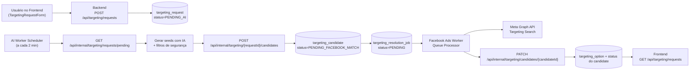

# Fluxo de dados e processos na criação de público usando targets

Este documento descreve, ponta a ponta, como a plataforma cria públicos de anúncios a partir de **targets** (interesses, comportamentos e cargos), cobrindo os papéis de Frontend, Backend, AI Worker e Facebook Ads Worker.

## 1) Visão geral do fluxo



## 2) Entrada no Frontend (abertura da solicitação)

1. O usuário informa a descrição do nicho/hipótese, idioma, país e tipo de público.
2. Antes de enviar, o frontend aplica validações:
   - texto obrigatório;
   - limite de 280 caracteres;
   - bloqueio de PII (e-mail/telefone);
   - bloqueio de termos proibidos.
3. Após validação, o frontend envia `POST /api/targeting/requests`.
4. O usuário recebe retorno imediato com status inicial e ETA do processamento.

### Payload de entrada (exemplo)

```json
{
  "descricao": "gestores de RH que usam ATS",
  "idioma": "pt_BR",
  "pais": "BR",
  "publico_tipo": "PROSPECT",
  "niche_id": 123,
  "hypothesis_id": "f7005f6f-1f88-4e7d-86e3-3fc2af3e93ba"
}
```

## 3) Backend: criação da requisição e estado inicial

Ao receber a requisição pública:

1. O backend normaliza dados (`descricao`, `locale`, `country`).
2. Resolve contexto opcional de nicho/hipótese.
3. Persiste `TargetingRequest` com:
   - `status = PENDING_AI`
   - `origin = CLIENT`
   - `audienceType` com default `PROSPECT`.
4. Disponibiliza esse request para coleta pelo endpoint interno de pendências.

## 4) AI Worker: geração de seeds/candidatos

O processo de IA roda em scheduler (`cron` de 2 em 2 minutos) e segue este pipeline:

1. Consulta pendências em `GET /api/internal/targeting/requests/pending`.
2. Para cada request, gera sugestões de targeting via cliente ChatGPT.
3. Aplica pós-processamento:
   - sanitização do seed;
   - deduplicação por tipo;
   - remoção de PII e termos proibidos;
   - limite por tipo (ex.: até 30);
   - normalização de variantes (`seed_variants`), locale e country.
4. Envia candidatos ao backend em `POST /api/internal/targeting/{requestId}/candidates`.

### Payload interno de candidatos (exemplo)

```json
{
  "candidates": [
    {
      "seed": "software de recrutamento",
      "texto_sugerido": "software de recrutamento",
      "seed_variants": ["software de recrutamento", "recruitment software"],
      "tipo": "INTEREST",
      "origem": "AI",
      "score": 0.86,
      "rationale": "Termo próximo ao contexto ATS",
      "idioma_hint": "pt_BR",
      "pais": "BR",
      "intent_tag": "consideration",
      "constraints": { "country": "BR" }
    }
  ]
}
```

## 5) Backend: persistência dos candidatos e criação de jobs

Quando recebe os candidatos internos:

1. O backend cria cada `TargetingCandidate` com:
   - `status = PENDING_FACEBOOK_MATCH`
   - `seed`, `seedVariants`, `tipo`, `score`, `localeHint`, `country`, etc.
2. Atualiza o `TargetingRequest` para `COMPLETED` (etapa de geração AI concluída).
3. Enfileira jobs de resolução (`targeting_resolution_job`) para cada candidato válido com `status = PENDING`.

> Importante: “COMPLETED” no request indica que a IA já respondeu; a validação Meta continua no ciclo de resolução dos candidatos/jobs.

## 6) Facebook Ads Worker: resolução contra Meta (ground truth)

Com jobs pendentes, o Facebook Ads Worker processa a fila:

1. Busca jobs pendentes de resolução.
2. Para cada candidate, tenta resolver `seed` e variantes na Meta (Targeting Search), considerando tipo (`interest`, `behavior`, `work_position`) e contexto de locale/country.
3. Produz um resultado:
   - **VALIDATED** com opções (`facebook_id`, nome, tamanho de audiência, etc.);
   - ou **NO_MATCH/FAILED** com motivo técnico.
4. Publica o resultado no backend via `PATCH /api/internal/targeting/candidates/{candidateId}`.

## 7) Backend: consolidação do resultado final

Ao receber o patch de resolução:

1. Atualiza status do `TargetingCandidate`.
2. Limpa opções anteriores e, quando `VALIDATED`, grava novas `TargetingOption`.
3. Mantém motivo de rejeição quando não houver match.

Assim, o backend se torna a fonte consolidada do que foi validado para uso em campanhas.

## 8) Consumo no Frontend

O frontend consulta `GET /api/targeting/requests` (com candidatos) e renderiza:

- status da requisição (`PENDING_AI`, `COMPLETED`, `FAILED`);
- status de cada candidato;
- opções Meta validadas;
- resumo recente de resolução (`/api/targeting/requests/recent`).

Também é possível reprocessar um candidato (`POST /api/targeting/candidates/{candidateId}/reprocess`) para tentar nova resolução com ajustes de seed/locale/país.

## 9) Entidades e estados principais

### Entidades
- **TargetingRequest**: solicitação original do usuário.
- **TargetingCandidate**: seed gerado para resolução.
- **TargetingResolutionJob**: item de fila para resolver candidato na Meta.
- **TargetingOption**: opção validada e persistida após match.

### Estados relevantes
- Request: `PENDING_AI` → `COMPLETED` (ou `FAILED` em erro).
- Candidate: `PENDING_FACEBOOK_MATCH` → `VALIDATED` / `NO_MATCH` / `FAILED`.
- Job de resolução: `PENDING` → `PROCESSING` → `SUCCEEDED` / `FAILED`.

## 10) Resultado de negócio

Esse desenho reduz erro de criação de público por texto livre, aumenta rastreabilidade da jornada e garante que o conjunto final usado nas campanhas seja baseado em opções efetivamente validadas na Meta.
