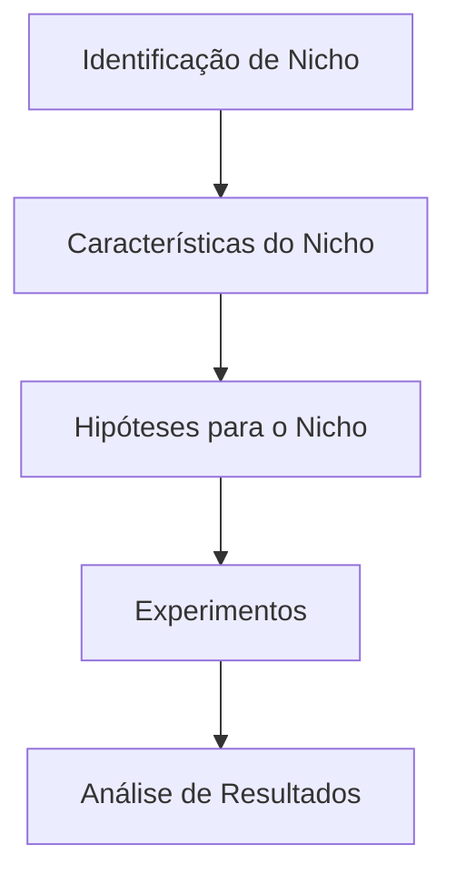
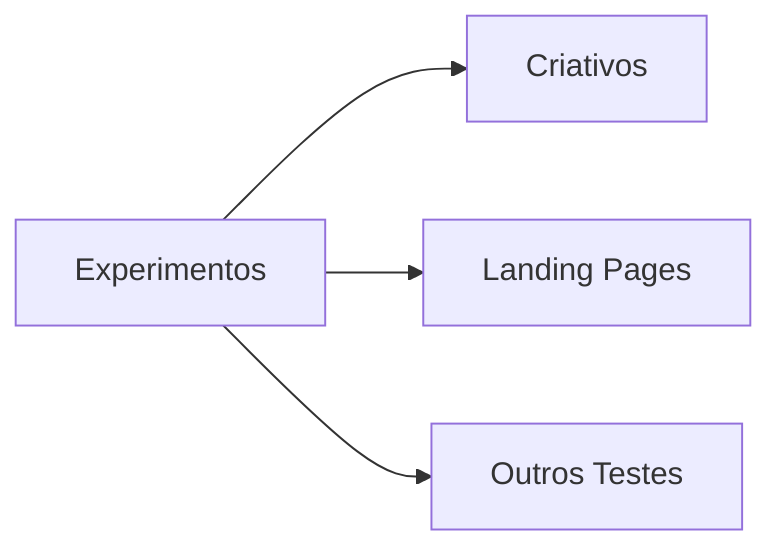

# Fluxo de Construção de Produto Digital

Este documento descreve um fluxo simples para guiar a criação e validação de um produto digital.

Para entender como essas etapas se refletem na aplicação, veja o [Diagrama de Navegação do Frontend](./frontend-navigation.md).

## Visão Geral do Fluxo

1. **Identificação de Nicho**: escolha de um segmento de mercado ou público-alvo.
2. **Características do Nicho**: levantamento de dores, necessidades e comportamentos do nicho escolhido.
3. **Hipóteses para o Nicho**: definição de suposições sobre como o produto pode resolver as dores do nicho.
4. **Experimentos**: criação de testes para validar as hipóteses (ex.: criativos, landing pages, ofertas).
5. **Análise de Resultados**: interpretação dos dados obtidos e decisão sobre próximos passos.

## Detalhamento dos Experimentos

Os experimentos devem ser desenhados para coletar dados claros sobre a validade das hipóteses. Eles podem incluir campanhas pagas com criativos diferentes, páginas de captura, testes A/B e outros mecanismos de validação.

## Próximos Passos

Após analisar os resultados, o time decide se:

- **Prossegue** para uma iteração do produto;
- **Ajusta** as hipóteses e executa novos experimentos; ou
- **Descarta** a ideia se os resultados não forem promissores.

Este fluxo é iterativo e pode ser repetido várias vezes até que haja confiança suficiente para investir no desenvolvimento completo do produto.
