# Frontend Navigation Diagram

This document provides an overview of the routes available in the Marketing Hub frontend. The diagram below summarizes the navigation structure starting from the application's home page.

For data entities associated with each screen, see [Mapping of Screens and Entities](./frontend-screens-entities.md).

```mermaid
flowchart TD
    root("/")
    root --> fb_accounts("/accounts/facebook")
    root --> ig_accounts("/accounts/instagram")
    ig_accounts --> ig_posts("/accounts/instagram/:id/posts")
    root --> media("/media")
    media --> media_new("/media/new")
    media --> media_detail("/media/:id")
    root --> courses("/courses")
    courses --> courses_new("/courses/new")
    courses --> courses_detail("/courses/:id")
    root --> app_ideas("/app-ideas")
    app_ideas --> app_idea_new("/app-ideas/new")
    root --> products("/products")
    products --> product_new("/products/new")
    root --> success_products("/success-products")
    success_products --> sp_new("/success-products/new")
    success_products --> sp_detail("/success-products/:id")
    root --> niches("/niches")
    niches --> niches_list("(list)")
    niches --> niche_new("/niches/new")
    niches --> niche_detail("/niches/:nicheId")
    niche_detail --> niche_edit("/niches/:nicheId/edit")
    niche_detail --> hyp_new("/niches/:nicheId/hypotheses/new")
    niche_detail --> hyp_detail("/niches/:nicheId/hypotheses/:hypothesisId")
    hyp_detail --> hyp_edit("/niches/:nicheId/hypotheses/:hypothesisId/edit")
    root --> experiments("/experiments")
    experiments --> exp_new("/experiments/new")
    experiments --> exp_detail("/experiments/:id")
    exp_detail --> exp_edit("/experiments/:id/edit")
    root --> hypotheses("/hypotheses")
    hypotheses --> hypotheses_board("/hypotheses/board")
    root --> ai_services("/ai-services")
    ai_services --> ai_new("/ai-services/new")
    ai_services --> ai_edit("/ai-services/:id/edit")
    root --> angles("/angles")
    root --> visual_proofs("/visual-proofs")
    root --> emotional_triggers("/emotional-triggers")
    root --> landing("/landing/:id")
    root --> analytics("/analytics")
    root --> funnels("/funnels")
    funnels --> funnel_new("/funnels/new")
    funnels --> funnel_edit("/funnels/:id/edit")
```

The `*` route not shown above renders a simple `Início` placeholder.
