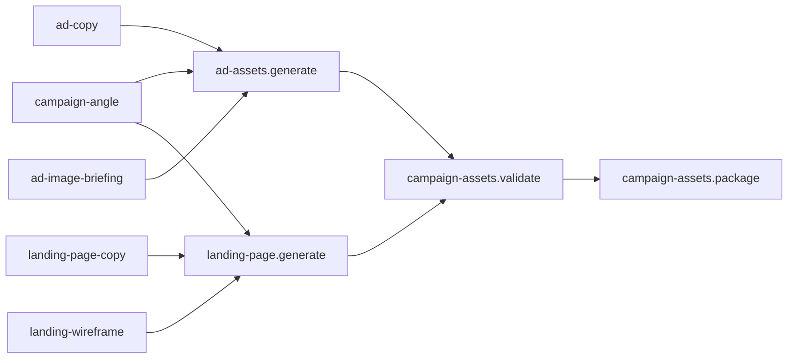

# Plano prático para sair do pipeline de experimento e gerar anúncios + landing page
## Material para implementação no Codex

Este documento parte do pipeline já existente no experimento #10 e propõe uma simplificação: em vez de continuar abrindo novas camadas intermediárias, o sistema deve passar a tratar os artefatos atuais como **briefings finais de uso** e criar só uma camada a mais: **renderização/publicação**. O objetivo é reduzir atrito operacional e transformar o que já existe em material publicável. A recomendação também segue boas práticas gerais de prompting: instruções claras, tarefas quebradas em partes menores e saídas estruturadas; e, do lado de mídia, manter **message match** entre anúncio e landing é importante para relevância e experiência pós-clique. fileciteturn18file0 citeturn224975search2turn224975search1

---

## 1. Decisão de arquitetura

### O que manter
Manter como fonte de verdade:
- `campaign-angle`
- `ad-copy`
- `ad-image-briefing`
- `landing-page-copy`
- `landing-wireframe`

Esses objetos já têm conteúdo suficiente para alimentar a geração final dos assets. No experimento #10, eles já saem com promessa, CTA, tone, placements, hierarchy visual e seções da landing. fileciteturn18file0

### O que remover da camada intermediária
Não criar novas camadas conceituais entre esses itens e os assets finais.

Evitar:
- novos “meta-briefings”
- novos resumos para campanha se os summaries já existem
- novos objetos transitórios que não virem asset ou componente renderizado

### O que adicionar
Adicionar só 4 jobs finais:
1. `ad-assets.generate`
2. `landing-page.generate`
3. `campaign-assets.validate`
4. `campaign-assets.package`

Esses jobs pegam o que já existe e geram material de uso.

---

## 2. Novo fluxo mínimo



### Interpretação
- `ad-assets.generate` produz anúncios prontos
- `landing-page.generate` produz a landing pronta
- `campaign-assets.validate` checa consistência
- `campaign-assets.package` organiza a saída para publicação e teste

---

## 3. Saída final esperada

### 3.1. Anúncios
O sistema deve gerar **assets finais**, não só briefings.

Saída esperada:
- imagens finais por placement
- texto final vinculado a cada imagem
- headline, description e CTA por peça
- nome técnico do asset
- metadados do experimento
- agrupamento por variação

Estrutura mínima:
- `AD-10-V1-feed`
- `AD-10-V1-stories`
- `AD-10-V2-feed`
- `AD-10-V3-feed`

### 3.2. Landing page
O sistema deve gerar a landing já renderizável, mobile-first.

Saída esperada:
- estrutura da página em JSON de componentes ou HTML renderizável
- ordem das seções
- CTA principal
- formulário configurado
- versão da landing
- bloco de compliance

Estrutura mínima:
- `LP-10-A`
- `LP-10-B` (opcional para teste de layout)

### 3.3. Pacote de experimento
O sistema também deve gerar um pacote final com:
- manifesto do experimento
- assets do anúncio
- landing
- validação
- instruções de publicação

---

## 4. Job 1 — `ad-assets.generate`

### Objetivo
Transformar `campaign-angle`, `ad-copy` e `ad-image-briefing` em peças finais do anúncio.

### Input
- `campaign-angle`
- `ad-copy`
- `ad-image-briefing`

### Output
```json
{
  "experimentMetadata": {
    "variant_id": "variant-10",
    "asset_role": "ad-assets",
    "stage": "AD",
    "primary_variable": "Dor vs Resultado",
    "control_or_treatment": "treatment"
  },
  "adAssets": [
    {
      "assetId": "AD-10-V1-feed",
      "label": "dor",
      "placement": "feed",
      "imagePrompt": "",
      "imageFileName": "",
      "headline": "",
      "description": "",
      "primaryText": "",
      "ctaText": "",
      "singleMindedPromise": "",
      "landingVariantTarget": "LP-10-A"
    }
  ]
}
```

### Regra de geração
Para cada variação de copy:
1. escolher o placement indicado
2. casar com a variante visual mais compatível
3. produzir o prompt final da imagem
4. salvar o texto final da peça
5. vincular à landing-alvo

### Regras obrigatórias
- 1 asset por combinação relevante de variação + placement
- o CTA precisa ser igual ao CTA principal da landing
- a promessa precisa bater com `landingMatchLine`
- o texto precisa sair em versão final, não em proposta ou brainstorm
- não gerar copy fora do envelope do produto
- a imagem deve ser pensada para Instagram/Meta

### O que o Codex deve implementar
- função que cruza `ad-copy.primaryTextVariants` com `ad-image-briefing.variants`
- escolha automática de combinações
- geração de `imagePrompt` final por asset
- serialização do asset final

---

## 5. Job 2 — `landing-page.generate`

### Objetivo
Transformar `campaign-angle`, `landing-page-copy` e `landing-wireframe` em uma landing pronta para renderização.

### Input
- `campaign-angle`
- `landing-page-copy`
- `landing-wireframe`

### Output
```json
{
  "experimentMetadata": {
    "variant_id": "variant-10",
    "asset_role": "landing-page",
    "stage": "LANDING",
    "primary_variable": "Dor vs Resultado",
    "control_or_treatment": "treatment"
  },
  "landingPage": {
    "landingId": "LP-10-A",
    "pageGoal": "gerar clique no CTA e preenchimento do briefing",
    "primaryPromise": "",
    "primaryCTA": "",
    "sections": [
      {
        "id": "hero",
        "component": "hero-with-form",
        "content": {},
        "uiNotes": ""
      }
    ],
    "form": {
      "title": "",
      "fields": [],
      "submitLabel": ""
    },
    "compliance": []
  }
}
```

### Regra de geração
1. usar a ordem do wireframe
2. preencher cada seção com a copy correspondente
3. aplicar CTA principal em posições estratégicas
4. gerar versão mobile-first
5. fixar formulário curto

### Regras obrigatórias
- hero e formulário acima da dobra quando possível
- promessa principal igual à do anúncio
- CTA principal igual ao do anúncio
- form com poucos campos
- prova e FAQ incluídos
- bloco de compliance no final
- nada de seção vazia

### O que o Codex deve implementar
- parser do `landing-page-copy.sections`
- mapper para componentes
- renderização em JSON de página
- opção de export para HTML/React, se necessário

---

## 6. Job 3 — `campaign-assets.validate`

### Objetivo
Fazer QA automático antes de publicar.

### Input
- `adAssets`
- `landingPage`
- `campaign-angle`

### Output
```json
{
  "validation": {
    "isApproved": true,
    "checks": [
      {
        "name": "message_match",
        "passed": true,
        "details": ""
      }
    ],
    "blockingIssues": [],
    "warnings": []
  }
}
```

### Checks obrigatórios
1. **message_match**
   - headline do anúncio e hero da landing falam a mesma coisa?
2. **cta_match**
   - CTA do anúncio e CTA da landing são equivalentes?
3. **promise_match**
   - single minded promise do ângulo aparece na landing?
4. **proof_match**
   - a prova prometida no anúncio aparece na landing?
5. **product_envelope**
   - nenhum asset promete consultoria/call/gestão humana?
6. **landing_not_empty**
   - a landing gerada tem seções e formulário?
7. **metadata_integrity**
   - `variant_id`, `stage`, `asset_role` e `primary_variable` estão preenchidos?

### O que o Codex deve implementar
- serviço de validação por regra
- lista de erros bloqueantes
- lista de warnings
- retorno simples para travar ou liberar publicação

---

## 7. Job 4 — `campaign-assets.package`

### Objetivo
Empacotar tudo para uso prático.

### Input
- `adAssets`
- `landingPage`
- `validation`

### Output
```json
{
  "package": {
    "experimentId": 10,
    "campaignName": "Agenda Cheia Sem Desconto (8 Semanas)",
    "ads": [],
    "landing": {},
    "validation": {},
    "publicationChecklist": []
  }
}
```

### Conteúdo do pacote
- lista de anúncios
- landing final
- validação
- checklist de publicação
- nome amigável da campanha
- instruções de onde cada asset será usado

### Checklist mínimo
- confirmar URL da landing
- confirmar CTA
- confirmar placement dos assets
- confirmar metadados de experimento
- confirmar texto legal/compliance

---

## 8. Simplificação de prompts

### Regra nova
Os prompts desses 4 jobs devem pedir **material final de uso**, não novas camadas intermediárias.

### Exemplo de linguagem correta
- “gere os anúncios finais”
- “gere a landing pronta”
- “valide a consistência”
- “monte o pacote de publicação”

### Exemplo de linguagem a evitar
- “gere um meta-briefing”
- “gere um resumo do resumo”
- “gere um objeto intermediário para uso futuro”

Isso segue a lógica de prompting claro e específico: o modelo responde melhor quando o output desejado é concreto e inequívoco. citeturn224975search2turn224975search3

---

## 9. Orientações específicas para o Codex

### 9.1. Não criar novas entidades se não virarem asset
Se a entidade não for:
- anúncio final
- landing final
- validação
- pacote final

ela provavelmente não precisa existir.

### 9.2. Preferir schema simples
Cada job deve ter:
- input claro
- output único
- metadados obrigatórios
- schema estável

### 9.3. Tratar `campaign-angle` como objeto mestre
O `campaign-angle` é a fonte oficial de:
- promessa
- dor principal
- CTA
- tom
- match com landing

### 9.4. Tratar `ad-copy` e `ad-image-briefing` como material já pronto para montagem
Não voltar a reinterpretar estrategicamente esses objetos.
Eles já devem ser consumidos como **briefing final do asset**.

### 9.5. Tratar `landing-page-copy` e `landing-wireframe` como base renderizável
O render da landing deve montar a página com esses insumos, não gerar nova estratégia.

---

## 10. Critério de pronto

Este fluxo estará pronto quando o sistema conseguir, a partir de um experimento:
1. gerar 3–4 anúncios finais
2. gerar 1 landing final
3. validar consistência
4. empacotar tudo para publicação

Sem criar novas camadas conceituais entre o briefing e o asset.

---

## 11. Tarefas sugeridas para enviar ao Codex

### Bloco 1 — Render de anúncios
Implementar o job `ad-assets.generate`:
- input: `campaign-angle`, `ad-copy`, `ad-image-briefing`
- output: `adAssets`
- gerar 1 asset por variação principal
- salvar texto final + prompt visual final + placement + metadados

### Bloco 2 — Render da landing
Implementar o job `landing-page.generate`:
- input: `campaign-angle`, `landing-page-copy`, `landing-wireframe`
- output: `landingPage`
- montar JSON renderizável da landing
- garantir hero + form + CTA + prova + FAQ + compliance

### Bloco 3 — QA
Implementar `campaign-assets.validate`:
- checks obrigatórios de promessa, CTA, prova, envelope e metadata

### Bloco 4 — Pacote final
Implementar `campaign-assets.package`:
- consolidar anúncio + landing + validação
- gerar pacote final de publicação

---

## 12. Resultado esperado após a implementação

Depois desta implementação, o pipeline deve deixar de ser:
- framework → resumo → briefing → briefing do briefing → asset

e passar a ser:
- framework → briefing final → asset final

Essa simplificação reduz camadas intermediárias, mantém consistência e acelera a ida do experimento para uso prático. fileciteturn18file0 citeturn224975search2turn224975search1turn224975search4
