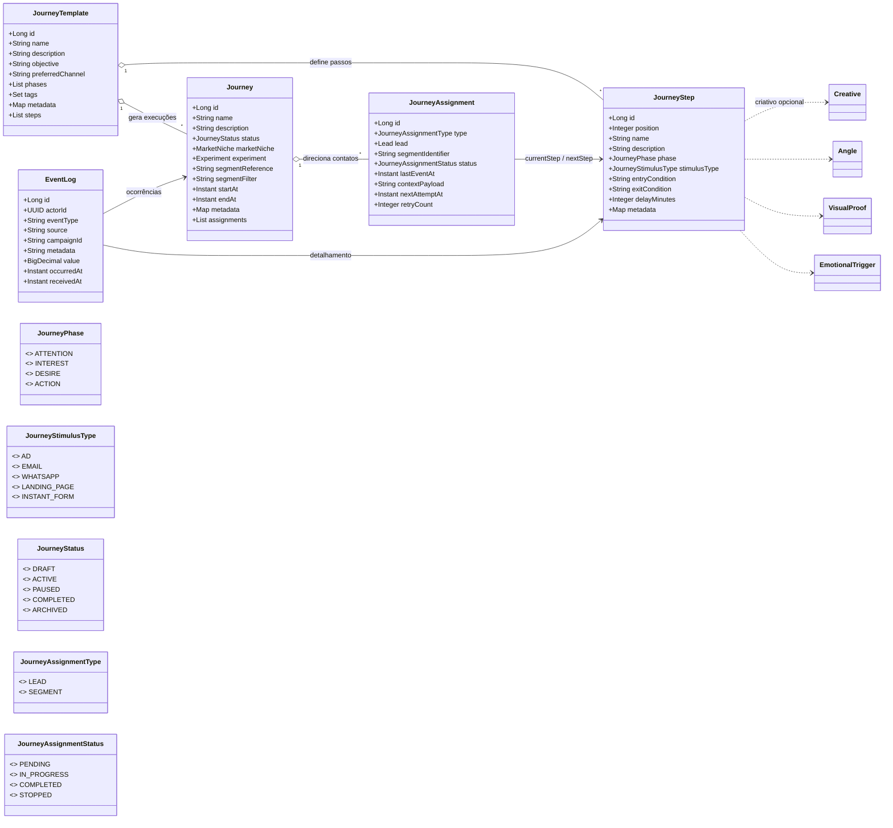

# Diagrama de Classes do Módulo de Jornadas

O módulo de jornadas modela desde os templates reutilizáveis até a execução operacional para segmentos específicos, mantendo um histórico de eventos multicanal.
Este documento resume as principais entidades JPA, enums auxiliares e serviços de aplicação que compõem esse fluxo.

## Visão geral do domínio

* `JourneyTemplate` descreve o blueprint AIDA (fases, tags e metadados) e mantém a lista ordenada de passos reutilizáveis.【F:backend/ads-service/src/main/java/com/marketinghub/journey/model/JourneyTemplate.java†L14-L71】
* `JourneyStep` representa um ponto de contato específico e pode referenciar criativos, ângulos e gatilhos emocionais para orquestrar o estímulo correto.【F:backend/ads-service/src/main/java/com/marketinghub/journey/model/JourneyStep.java†L16-L79】
* `Journey` materializa um template para um segmento concreto, vinculando nicho, experimento e metadados de segmentação, além de manter os assignments associados.【F:backend/ads-service/src/main/java/com/marketinghub/journey/model/Journey.java†L16-L78】
* `JourneyAssignment` liga leads ou segmentos a uma execução, controla o progresso (passos atual/próximo) e guarda o contexto operacional para reprocessamentos.【F:backend/ads-service/src/main/java/com/marketinghub/journey/model/JourneyAssignment.java†L14-L72】
* `EventLog` registra eventos multicanal relacionados a jornadas e passos, armazenando payload serializado e valores financeiros quando aplicável.【F:backend/ads-service/src/main/java/com/marketinghub/journey/model/EventLog.java†L16-L58】
* Os enums `JourneyPhase`, `JourneyStimulusType`, `JourneyStatus`, `JourneyAssignmentType` e `JourneyAssignmentStatus` padronizam estágios de funil, canais, situação da jornada e o tipo/estado das atribuições.【F:backend/ads-service/src/main/java/com/marketinghub/journey/model/JourneyPhase.java†L7-L50】【F:backend/ads-service/src/main/java/com/marketinghub/journey/model/JourneyStimulusType.java†L3-L12】【F:backend/ads-service/src/main/java/com/marketinghub/journey/model/JourneyStatus.java†L4-L12】【F:backend/ads-service/src/main/java/com/marketinghub/journey/model/JourneyAssignmentType.java†L4-L9】【F:backend/ads-service/src/main/java/com/marketinghub/journey/model/JourneyAssignmentStatus.java†L4-L11】

## Serviços de aplicação

* `JourneyTemplateService` centraliza o CRUD de templates, aplica fases padrão e normaliza tags/metadados recebidos do front-end.【F:backend/ads-service/src/main/java/com/marketinghub/journey/service/JourneyTemplateService.java†L17-L109】
* `JourneyStepService` gerencia passos de um template, garantindo ordenação consistente, resolução de entidades criativas e reposicionamento quando necessário.【F:backend/ads-service/src/main/java/com/marketinghub/journey/service/JourneyStepService.java†L26-L240】
* `JourneyService` orquestra o ciclo de vida das jornadas operacionais, resolvendo nichos/experimentos, métricas agregadas e filtros por status.【F:backend/ads-service/src/main/java/com/marketinghub/journey/service/JourneyService.java†L28-L175】
* `JourneyAssignmentService` vincula leads ou segmentos às jornadas, validando passos do template e preservando o estado de avanço de cada participação.【F:backend/ads-service/src/main/java/com/marketinghub/journey/service/JourneyAssignmentService.java†L20-L151】
* `EventLogService` persiste eventos canonizados, validando coerência entre jornada e passo e serializando metadados flexíveis em JSON.【F:backend/ads-service/src/main/java/com/marketinghub/journey/service/EventLogService.java†L20-L85】
