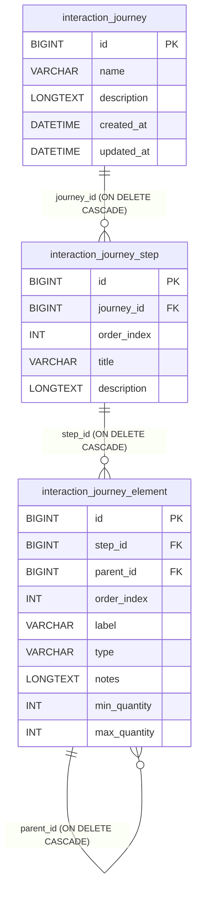

# Modelo de Dados — `interaction_journey`

## Visão geral

O objeto `interaction_journey` representa uma jornada interativa composta por passos (`interaction_journey_step`) e por elementos de interface/conteúdo (`interaction_journey_element`) organizados em árvore.

Esse modelo foi criado para detalhar fluxos operacionais (ex.: páginas, blocos e campos de cada etapa) com ordenação explícita e remoção em cascata entre os níveis.

---

## Entidades e atributos

### 1) `interaction_journey`

Tabela raiz da jornada interativa.

| Campo | Tipo | Nulo | Descrição |
| --- | --- | --- | --- |
| `id` | BIGINT (PK, AI) | Não | Identificador único da jornada. |
| `name` | VARCHAR(255) | Não | Nome da jornada. |
| `description` | LONGTEXT | Sim | Descrição funcional da jornada. |
| `created_at` | DATETIME | Sim (default) | Data/hora de criação (`CURRENT_TIMESTAMP`). |
| `updated_at` | DATETIME | Sim (default) | Data/hora da última atualização (`ON UPDATE CURRENT_TIMESTAMP`). |

---

### 2) `interaction_journey_step`

Tabela de passos pertencentes à jornada.

| Campo | Tipo | Nulo | Descrição |
| --- | --- | --- | --- |
| `id` | BIGINT (PK, AI) | Não | Identificador único do passo. |
| `journey_id` | BIGINT (FK) | Não | Referência obrigatória para `interaction_journey.id`. |
| `order_index` | INT | Não | Ordem de execução/exibição do passo na jornada. |
| `title` | VARCHAR(255) | Não | Título do passo. |
| `description` | LONGTEXT | Sim | Descrição detalhada do passo. |

---

### 3) `interaction_journey_element`

Tabela de elementos de cada passo, com suporte a hierarquia (pai/filho).

| Campo | Tipo | Nulo | Descrição |
| --- | --- | --- | --- |
| `id` | BIGINT (PK, AI) | Não | Identificador único do elemento. |
| `step_id` | BIGINT (FK) | Não | Referência obrigatória para `interaction_journey_step.id`. |
| `parent_id` | BIGINT (FK, self) | Sim | Referência opcional para `interaction_journey_element.id` (elemento pai). |
| `order_index` | INT | Não | Ordem do elemento dentro do nível atual. |
| `label` | VARCHAR(255) | Não | Nome/rótulo de exibição do elemento. |
| `type` | VARCHAR(100) | Sim | Tipo lógico do elemento (ex.: campo, bloco, opcional etc.). |
| `notes` | LONGTEXT | Sim | Observações e instruções operacionais. |
| `min_quantity` | INT | Sim | Quantidade mínima esperada (quando aplicável). |
| `max_quantity` | INT | Sim | Quantidade máxima permitida (quando aplicável). |

---

## Relacionamentos

### Relacionamento 1:N — Jornada → Passos

- **Origem:** `interaction_journey.id`
- **Destino:** `interaction_journey_step.journey_id`
- **FK:** `fk_interaction_step_journey`
- **Regra de deleção:** `ON DELETE CASCADE`

**Impacto:** ao excluir uma jornada, todos os seus passos são removidos automaticamente.

### Relacionamento 1:N — Passo → Elementos

- **Origem:** `interaction_journey_step.id`
- **Destino:** `interaction_journey_element.step_id`
- **FK:** `fk_interaction_element_step`
- **Regra de deleção:** `ON DELETE CASCADE`

**Impacto:** ao excluir um passo, todos os elementos associados são removidos.

### Relacionamento hierárquico 1:N — Elemento pai → Elementos filhos

- **Origem/Destino:** `interaction_journey_element.id` → `interaction_journey_element.parent_id`
- **FK:** `fk_interaction_element_parent`
- **Regra de deleção:** `ON DELETE CASCADE`

**Impacto:** ao excluir um elemento pai, sua subárvore de filhos também é removida.

---

## Índices

- `idx_interaction_step_journey` em `interaction_journey_step(journey_id)`.
- `idx_interaction_element_step` em `interaction_journey_element(step_id)`.
- `idx_interaction_element_parent` em `interaction_journey_element(parent_id)`.

Esses índices otimizam buscas por jornada, por passo e por hierarquia de elementos.

---

## Diagrama textual (ER simplificado)

```text
interaction_journey
  PK id
  name
  description
  created_at
  updated_at

interaction_journey_step
  PK id
  FK journey_id -> interaction_journey.id (ON DELETE CASCADE)
  order_index
  title
  description

interaction_journey_element
  PK id
  FK step_id -> interaction_journey_step.id (ON DELETE CASCADE)
  FK parent_id -> interaction_journey_element.id (ON DELETE CASCADE)
  order_index
  label
  type
  notes
  min_quantity
  max_quantity
```

---

## Diagrama visual (Mermaid)



> Caso o seu visualizador de Markdown não renderize Mermaid, use o diagrama textual acima como referência para o mesmo modelo.

---

## Regras de uso recomendadas

1. Tratar `order_index` como fonte da ordem de apresentação em passos e elementos.
2. Usar `parent_id = NULL` para elementos raiz do passo.
3. Reservar `min_quantity` e `max_quantity` para elementos que representem coleções (ex.: lista de perguntas/opções).
4. Validar no serviço de aplicação que `max_quantity >= min_quantity` quando ambos estiverem preenchidos.
