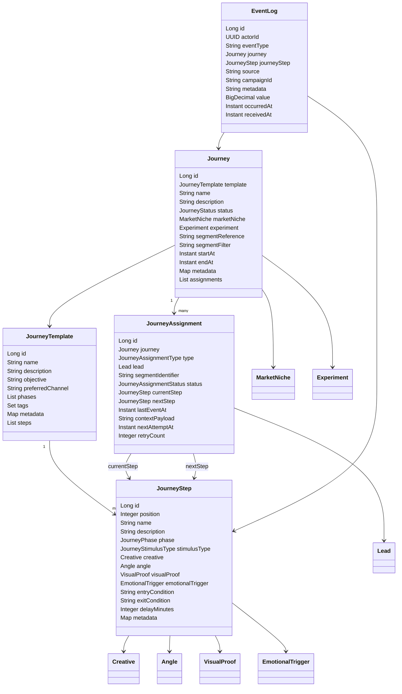

# Modelo de Classes do Módulo de Jornada

Esta visão consolida os principais agregados persistidos pelo módulo de jornadas do Marketing Hub, cobrindo o relacionamento entre templates, execuções operacionais, vínculos com o público e a telemetria de eventos multicanal. Use-a como referência para evoluções no domínio ou integrações que consumam a API de jornadas.

## Visão geral do modelo

## Descrição das entidades principais

### JourneyTemplate
- Representa o blueprint estratégico de uma jornada com nome, descrição, objetivo e canal preferencial.【F:backend/ads-service/src/main/java/com/marketinghub/journey/model/JourneyTemplate.java†L20-L35】
- Mantém fases ordenadas (AIDA por padrão), tags e metadados arbitrários para orientar a cadência de estímulos.【F:backend/ads-service/src/main/java/com/marketinghub/journey/model/JourneyTemplate.java†L36-L58】
- Agrupa os passos (`JourneyStep`) associados, preservando a ordenação para execução.【F:backend/ads-service/src/main/java/com/marketinghub/journey/model/JourneyTemplate.java†L60-L63】

### JourneyStep
- Detalha cada ponto de contato do template com posição, nome, descrição e fase correspondente no funil.【F:backend/ads-service/src/main/java/com/marketinghub/journey/model/JourneyStep.java†L22-L44】
- Define o tipo de estímulo (anúncio, e-mail, WhatsApp ou landing page) e referências opcionais a ativos criativos e etiquetas de copywriting.【F:backend/ads-service/src/main/java/com/marketinghub/journey/model/JourneyStep.java†L45-L63】【F:backend/ads-service/src/main/java/com/marketinghub/journey/model/JourneyStimulusType.java†L1-L11】
- Permite configurar condições de entrada/saída, atraso entre disparos e metadados específicos do passo.【F:backend/ads-service/src/main/java/com/marketinghub/journey/model/JourneyStep.java†L65-L79】

### Journey
- Materializa um template para um público concreto, com nome, descrição e status operacional (rascunho, ativo, pausado, concluído ou arquivado).【F:backend/ads-service/src/main/java/com/marketinghub/journey/model/Journey.java†L22-L40】【F:backend/ads-service/src/main/java/com/marketinghub/journey/model/JourneyStatus.java†L6-L11】
- Conecta-se a nichos de mercado e experimentos para contextualizar análises e segmentações externas (referência ou filtro).【F:backend/ads-service/src/main/java/com/marketinghub/journey/model/Journey.java†L41-L55】
- Controla janela de execução (`startAt`/`endAt`), metadados flexíveis e a coleção de atribuições geradas pelo motor.【F:backend/ads-service/src/main/java/com/marketinghub/journey/model/Journey.java†L57-L78】

### JourneyAssignment
- Liga leads ou segmentos a uma jornada específica, distinguindo o tipo de atribuição (`LEAD` ou `SEGMENT`).【F:backend/ads-service/src/main/java/com/marketinghub/journey/model/JourneyAssignment.java†L25-L38】【F:backend/ads-service/src/main/java/com/marketinghub/journey/model/JourneyAssignmentType.java†L6-L8】
- Registra o status operacional (pendente, em andamento, concluído ou interrompido) e o passo atual/próximo associado ao vínculo.【F:backend/ads-service/src/main/java/com/marketinghub/journey/model/JourneyAssignment.java†L40-L50】【F:backend/ads-service/src/main/java/com/marketinghub/journey/model/JourneyAssignmentStatus.java†L6-L10】
- Armazena telemetria de execução como último evento, contexto serializado, agendamento da próxima tentativa e contagem de retentativas.【F:backend/ads-service/src/main/java/com/marketinghub/journey/model/JourneyAssignment.java†L52-L64】

### EventLog
- Guarda eventos multicanal com ator, tipo do evento e relacionamentos opcionais com jornada e passo responsáveis.【F:backend/ads-service/src/main/java/com/marketinghub/journey/model/EventLog.java†L22-L45】
- Persiste metadados livres, valor monetário associado e timestamps de ocorrência/recebimento para auditoria completa.【F:backend/ads-service/src/main/java/com/marketinghub/journey/model/EventLog.java†L47-L58】

## Enumerações relevantes
- `JourneyPhase` codifica as quatro etapas do framework AIDA (Atenção, Interesse, Desejo, Ação) com suporte a parsing flexível para integrações.【F:backend/ads-service/src/main/java/com/marketinghub/journey/model/JourneyPhase.java†L6-L44】
- `JourneyStatus` define o ciclo de vida de uma jornada operacional.【F:backend/ads-service/src/main/java/com/marketinghub/journey/model/JourneyStatus.java†L3-L11】
- `JourneyAssignmentType` diferencia vínculos individuais de segmentos agregados.【F:backend/ads-service/src/main/java/com/marketinghub/journey/model/JourneyAssignmentType.java†L3-L8】
- `JourneyAssignmentStatus` acompanha a evolução de cada vínculo dentro do motor de execução.【F:backend/ads-service/src/main/java/com/marketinghub/journey/model/JourneyAssignmentStatus.java†L3-L10】
- `JourneyStimulusType` enumera os canais operados pelos handlers de estímulo.【F:backend/ads-service/src/main/java/com/marketinghub/journey/model/JourneyStimulusType.java†L3-L11】
- `JourneyEventType` agrega os eventos canônicos emitidos durante a orquestração da jornada.【F:backend/ads-service/src/main/java/com/marketinghub/journey/model/JourneyEventType.java†L3-L22】

## Dependências cruzadas
- Jornadas referenciam nichos e experimentos para reutilizar segmentações e hipóteses existentes no ecossistema do Marketing Hub.【F:backend/ads-service/src/main/java/com/marketinghub/journey/model/Journey.java†L41-L55】
- Passos de jornada podem apontar para criativos e etiquetas de copywriting gerados pelo módulo de criativos, mantendo a consistência narrativa ao longo da jornada.【F:backend/ads-service/src/main/java/com/marketinghub/journey/model/JourneyStep.java†L49-L63】
- Atribuições atuam como elo com leads gerenciados no núcleo CRM (`Lead`), permitindo personalização e tracking unificado de respostas.【F:backend/ads-service/src/main/java/com/marketinghub/journey/model/JourneyAssignment.java†L33-L66】
